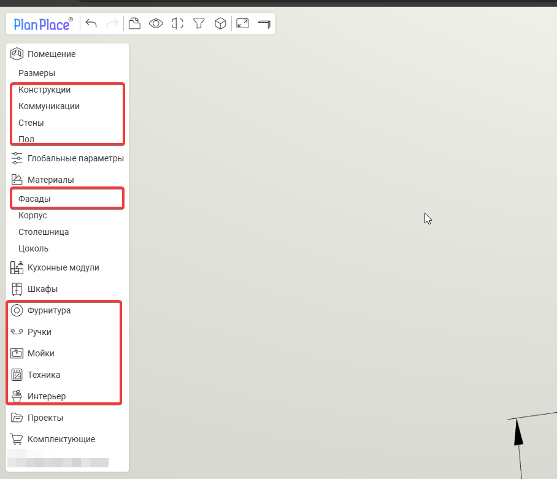
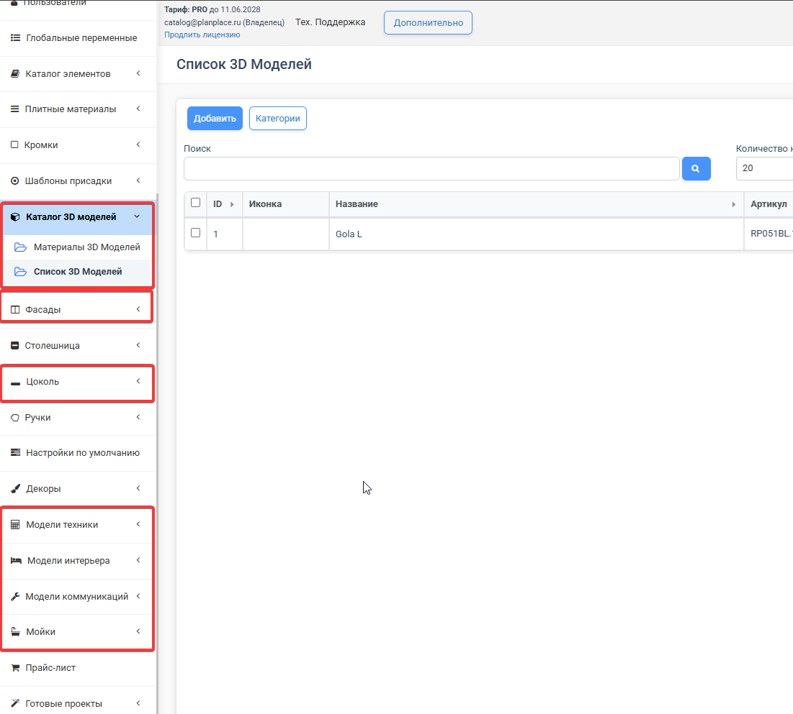

3D-модели в PlanPlace — это всё, что не делается из плиты: техника, мойки, ножки, ручки, профили, декор, сложная фурнитура, фрезеровки фасадов. Важно понимать, что в системе **два разных типа 3D-моделей** с принципиально разными требованиями. От того, к какому типу относится модель, зависит, насколько строго её нужно готовить и как назначаются материалы.

## Два типа 3D-моделей: свободные и встроенные

- **Свободные (произвольные) модели** живут в разделе **«Список 3D-моделей»** и добавляются в проект через элемент конфигуратора «Модель» (техника, опоры, ножки, навесы, подъёмники, профили). Они **доступны напрямую из конфигуратора модулей**: масштаб, повороты, смещения и материалы настраиваются **визуально внутри PlanPlace**, в графическом интерфейсе. Требования к ним мягкие, ключи в названии мешей **необязательны** — система не обрабатывает такие модели «жёстко». Материалы для них настраиваются в разделе «Материалы 3D-моделей».
- **Встроенные модели** подключаются из специальных системных меню — **модели интерьера, мойки, ручки, коммуникации, фрезеровки фасадов**. Загрузка по ним идёт в отдельный пункт меню, а система обрабатывает их **по ключам в названии мешей** (`v(3)_m(...)_t(...)`). Они **недоступны напрямую** из конфигуратора, и к ним предъявляются **жёсткие требования** к формату, масштабу, ориентации, UV-развёртке и именованию — отклонение от них приведёт к неработоспособности модели.

| | Свободные (произвольные) | Встроенные |
|---|---|---|
| Где находятся | Список 3D-моделей | Меню фрезеровок, ручек, коммуникаций, конструкций, интерьера |
| Доступ из конфигуратора | Да, через элемент «Модель» | Нет, только из своего системного меню |
| Обработка по ключам | Необязательно (только автоподстановка материалов) | Обязательно, система читает ключи напрямую |
| Материалы | Назначаются визуально в PlanPlace | Задаются ключами заранее в модели |
| Масштаб/повороты | Настраиваются в PlanPlace | Должны быть выверены заранее (1:1, центр в 0) |
| Сложность подготовки | Низкая | Высокая |

> **Эта статья — про свободные модели** и общие принципы подготовки. Строгие требования к встроенным моделям вынесены в отдельные статьи: [«Встроенные 3D-модели: общие требования»](/Tilda-PlanPlace/3d-modeli-vstroennye/) и [«3D-модели фасадов (фрезеровки)»](/Tilda-PlanPlace/3d-modeli-fasadov/).

> **Рекомендация при расширении состава моделей.** На текущий момент почти всё из «встроенных» типов (модели интерьера, мойки, коммуникации, конструкции) можно реализовать через **свободные 3D-модели и [Каталог элементов](/Tilda-PlanPlace/katalog-elementov/)** и точно так же вывести на сцену. Исключение — **ручки и фасады**: их пока можно делать только встроенными. Поэтому если нужно существенно расширить состав таких моделей, **не обновляйте списки встроенных типов**, а заведите отдельную папку в Каталоге элементов и стройте их на базе свободных 3D-моделей. В версии 2.0 уже перенесённые встроенные типы становятся доступны из конфигуратора модулей, а не только на сцене.

## Где применяются свободные модели

- **Бытовая техника** — духовые шкафы, плиты, холодильники, вытяжки. Отдельные объекты, не привязанные к фасадам; для техники задают **тип перетаскивания** (на верхний или нижний модуль) и **прилипание к поверхностям**.
- **Фурнитура и опоры** — навесы, подъёмники, ножки, опоры, профили. Часто состоят из нескольких мешей (например, пластиковый корпус и металлическая ножка).
- **Декоративные элементы** — балясины, цоколи сложной формы и прочая столярка, которой нужно подобрать цвет.

## Поддерживаемые форматы

PlanPlace принимает: **.fbx, .dae, .gltf, .glb, .3ds, .obj**. Чаще всего встречается **FBX**. Blender используется как основной инструмент подготовки, потому что поддерживает открытые форматы и удобен. Модели с готовых стоков часто бывают **неоптимизированными** (тяжёлыми) — это нужно учитывать.

## Главное требование: простота модели

> **Самое важное правило.** Используйте **максимально простые модели с минимумом полигонов**. Модели с сотнями тысяч полигонов сильно замедляют планировщик — у пользователя это выглядит как «тормоза». Для сравнения: хорошая модель ручки весит около 22 КБ.

Что делать:

- удаляйте ненужные внутренние детали, которые не видны;
- следите за количеством мешей (частей) — их избыток перегружает сцену;
- оптимизируйте модель перед загрузкой.

## Масштаб и ориентация

Для свободных моделей масштаб и ориентацию можно поправить **прямо в PlanPlace** при загрузке:

- **масштаб** — в миллиметрах (обязательно для встроенных типов, может быть другой для импорта в меню «Список 3D-моделей»). Модель может прийти не в том масштабе — например, экспорт из БАЗИС в .3ds приходит в метрах вместо миллиметров и «лежит на боку», это исправляется переключателями масштаба по осям;
- **повороты** — модель нужно развернуть по оси X на 90°, чтобы она сразу встала правильно. Для встроенных типов это обязательное требование; для произвольных 3D-моделей (профили, петли, навесы, направляющие) настройку вращения, масштаба и позиционирования можно изменить уже в PlanPlace после импорта.

Для произвольных моделей масштаб, повороты и смещения настраиваются **один раз** внутри 3D-модели — тогда не придётся ловить положение в каждом модуле, где она используется.

> **Для ручек и встроенных типов (фасады, мойки, техника, модели интерьера):** после импорта **масштаб менять нельзя** — модель должна быть подготовлена в правильном размере заранее (см. [требования к встроенным моделям](/Tilda-PlanPlace/3d-modeli-vstroennye/)). В целом, если вы не планируете использовать стандартные 3D-модели PlanPlace для интерьера и техники — загружайте их через меню «Список 3D-моделей» и сразу создавайте элементы с ними в отдельной папке Каталога элементов.

## Меши и материалы

Модель может состоять из нескольких **мешей (Mesh)** — отдельных частей со своими материалами. Меш — это просто набор точек в пространстве, объединённых в один объект. Например, мойка: одна часть из нержавейки, другая — каменная; в навесах будет металлическая часть и пластиковая заглушка.

Для каждого меша назначается материал или варианты материалов на выбор с параметрами:

- цвет;
- шероховатость;
- металличность;
- прозрачность;
- файл текстуры и тип повтора (обычный, зеркальный, нормаль, шероховатость).

У свободных (произвольных) моделей материалы назначаются и переключаются **визуально в интерфейсе** — прямой обработки по ключам нет, материалы мешей присваиваются один раз в момент импорта.

> **Ключи здесь необязательны.** Если в названии меша и в названии материала указать одинаковый **уникальный ключ** (например, `пластик`, `gen`), система при загрузке автоматически подставит материал на нужный меш. Это просто **ускоряет стартовую загрузку** (удобно, когда заливаешь сотни моделей) — потом материал всё равно можно поменять вручную. У [встроенных моделей](/Tilda-PlanPlace/3d-modeli-vstroennye/) ключи, наоборот, обязательны.

## UV-развёртка

**UV-развёртка** — это двумерная «выкройка» текстуры, по которой картинка натягивается на трёхмерную модель. Без корректной развёртки текстура ляжет криво. Многие простые модели используют развёртку куба — это облегчает работу системы.

Две галочки управляют поведением текстур при изменении размеров:

- **«Обрабатывать модели»** — адаптировать саму геометрию;
- **«Обрабатывать UV-развёртку»** — адаптировать натяжение текстуры (иногда развёртку, наоборот, нужно оставить как есть).

> Для технолога-конструктора в **99% случаев обе галочки просто включены** — этого достаточно для простой фурнитуры и техники. Тонкая настройка нужна только для сложной визуализации, и тогда стоит привлечь 3D-моделлера.

## Текстурные оси

Для каждого меша можно выбрать **текстурную ось** (XY, ZY и т. д.) — по какой плоскости брать ширину модели для текстуры. Это нужно, чтобы на разных гранях (фронт, бок) текстура не выглядела сжатой или растянутой. Для простой корпусной мебели с равномерными текстурами в это лезть обычно не нужно.

## Адаптация и растягивание

Это два разных способа менять размер модели:

- **Адаптация** — растягивание с **сохранением расстояний между группами точек**. От центральной линии раздвигаются блоки точек, не деформируясь (например, навес «разъезжается» в стороны, сами детали не меняются). Подходит для фурнитуры и профилей.
- **Растягивание** — пропорциональное изменение всех точек меша. Может **деформировать** модель («блямба»), поэтому подходит не всегда.

У свободных моделей это переключается **кликами по осям прямо в интерфейсе**. У фасадов та же механика, но настраивается заранее ключами в самой модели.

## Параметрические и жёсткие модели

- **Параметрическая модель** подстраивается под размеры (например, профиль, который тянется по длине).
- **Модель с жёсткими габаритами** не меняет размер (например, духовой шкаф). Для таких задают **минимальные и максимальные размеры**: если габариты модуля выходят за рамки, модель просто не показывается (планировщик оставляет пустое место).
- Для моделей, которые при разных размерах должны выглядеть по-разному (сушилки, подъёмники Aventos, столы с рельефным рисунком), создают **несколько вариантов модели**, каждый со своим диапазоном размеров.

## Параметры 3D-модели в конфигураторе

У 3D-модели как элемента есть: тип, название, идентификатор, видимость, активность, [позиция прайс-листа](/Tilda-PlanPlace/prays-listy/), способ расчёта (штуки, метры, погонные, кубы), координаты, оси поворота, [условия отображения](/Tilda-PlanPlace/usloviya-otobrazheniya-i-sobytiya/), комментарии и события. Отдельно есть галочки «отображать в спецификации» и «отображать в конструкции» — например, духовку видно на сцене, но в спецификацию её можно не выводить. Для техники дополнительно задают тип перетаскивания (на верхний или нижний модуль) и прилипание к поверхностям.

## Смена цвета и текстуры на сцене

Для встроенных типов цвет и текстуру меняют, привязывая к мешам через ключи [категории декоров и плитных материалов](/Tilda-PlanPlace/dekory-i-tekstury/). Для произвольных 3D-моделей создают **«Материал 3D-моделей»** (в том числе на основе декоров), который задаёт доступные варианты смены материала, и привязывают этот «Материал 3D-моделей» к конкретному мешу импортированной модели. Тогда переключение становится доступным через меню модуля на сцене или от других операций (например, синхронизируется с фасадом).

Мешу можно привязать один из вариантов:

- **категория декоров** — переключение в пределах [категории декоров](/Tilda-PlanPlace/dekory-i-tekstury/) (например, низ модели чёрный/белый);
- **одиночный декор** — фиксированный декор без переключения;
- **плитный материал** — берётся только текстура материала (без толщины);
- **цвет фасада** — модель подхватывает цвет выбранного на модуле фасада (например, пластиковый цоколь сложной формы);
- **[группа материалов](/Tilda-PlanPlace/gruppy-plitnyh-materialov/)** — переключается и из правого меню модуля, и из левого меню сцены.

> При смене только текстуры **артикул не меняется**. Если нужны разные артикулы (как у ручек Gola — белая, чёрная, серебро), заводят **отдельные 3D-модели** под каждый вариант.

## Подготовка в Blender

Сложные модели готовят в **Blender**. Для ускорения применяют **скрипты на Python** (вкладка Scripting), которые автоматически масштабируют и разворачивают модель в нужную плоскость — удобно при переносе из БАЗИС через .3ds. Сгенерировать такой скрипт помогает в том числе искусственный интеллект. Для по-настоящему сложных моделей с аккуратной UV-развёрткой стоит привлекать 3D-моделлера.

## Пункт меню со списком 3D-моделей и материалов

Чтобы пользователь мог добавлять 3D-модели и переключать их материалы прямо на сцене, соответствующие разделы выводятся в **меню планировщика**. Меню делится на три части — **левое**, **верхнее** и **правое** — и настраивается в личном кабинете: пункты можно добавлять, удалять и переупорядочивать, а при необходимости создавать произвольные пункты с вызовом кастомных функций через JSON. Подробнее — в статье [«Настройка меню планировщика»](/Tilda-PlanPlace/nastroyka-menyu-planirovschika/).

Где в меню «живут» 3D-модели и материалы в меню Сцены для продавцов и дизайнеров:

- **Конструкции / Коммуникации** — подключают встроенные 3D-модели окон, дверей, труб и других элементов.
- **Техника, Интерьер, Мойки, Ручки** — отдельные разделы-каталоги, из которых пользователь выбирает модель и ставит её на сцену. Внутри они структурированы по категориям и порядку отображения, заданным при настройке модели.
- **Материалы** — раздел для выбора и переключения [групп материалов](/Tilda-PlanPlace/gruppy-plitnyh-materialov/) для стен, пола, фасадов, витрин, цоколя **и 3D-моделей**. Здесь же задаются материалы и переключатели по умолчанию для быстрой смены текстур.
- **Фурнитура** — отдельный пункт меню для замены моделей петель, направляющих и опор с привязкой к [каталогу элементов](/Tilda-PlanPlace/katalog-elementov/) и настройкам по умолчанию.

Сами 3D-модели как объекты хранятся в соответствующих разделах Личного кабинета, например **каталоге 3D-моделей** (откуда элемент-«3D-модель» ссылается на конкретный файл), **Ручки**, **Мойки**, **Модели интерьера**, **Коммуникации**, а их материалы — в разделах [декоров и плитных материалов](/Tilda-PlanPlace/dekory-i-tekstury/) и "Материалах 3D моделей". Меню сцены же — это «витрина», которая выводит эти каталоги пользователю на сцене. Правая панель сцены при этом показывает настройки конкретного выбранного объекта (размеры, материалы, комплектующие), а левая — глобальные разделы меню.

## Коротко

В PlanPlace два типа 3D-моделей. **Свободные** (каталог 3D-моделей, элемент «Модель» в конфигураторе) готовить просто: материалы, масштаб и адаптацию настраивают визуально внутри PlanPlace, ключи необязательны. **Встроенные** (фрезеровки фасадов, ручки, коммуникации, конструкции, интерьер) система обрабатывает по ключам напрямую — у них строгие требования, описанные в статьях [«Встроенные 3D-модели: общие требования»](/Tilda-PlanPlace/3d-modeli-vstroennye/) и [«3D-модели фасадов (фрезеровки)»](/Tilda-PlanPlace/3d-modeli-fasadov/). Общее для обоих типов — простота (мало полигонов), иначе сцена тормозит.
