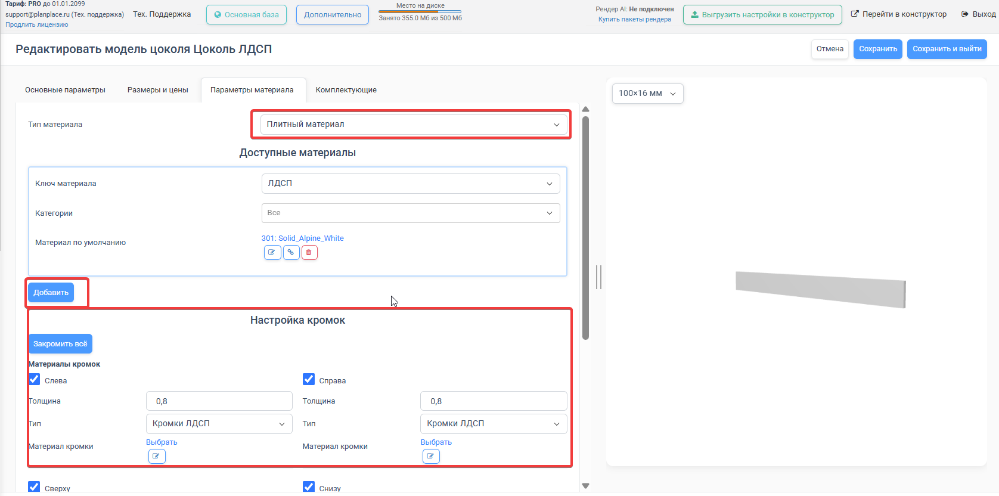
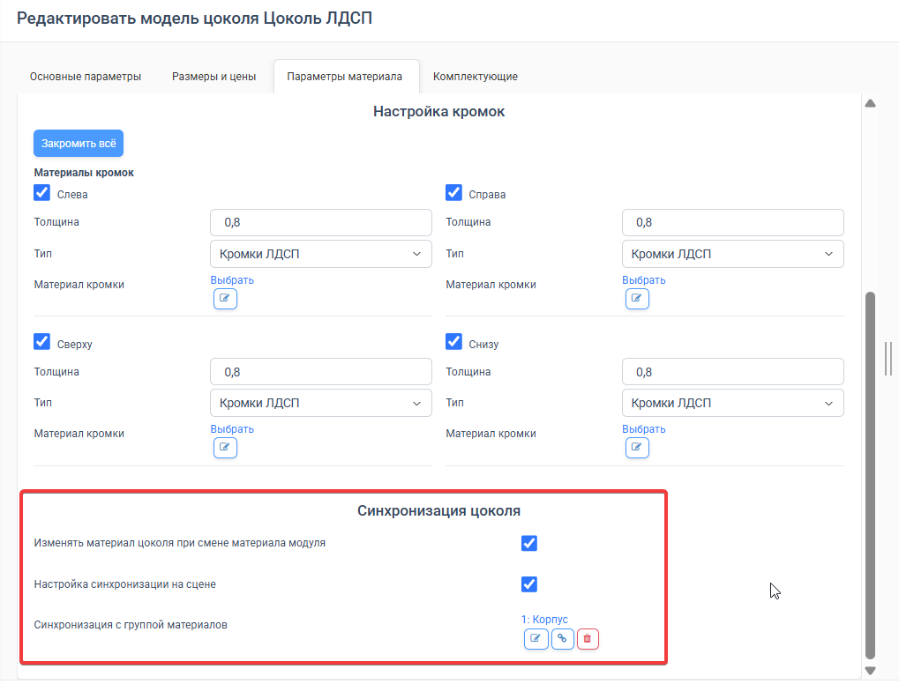
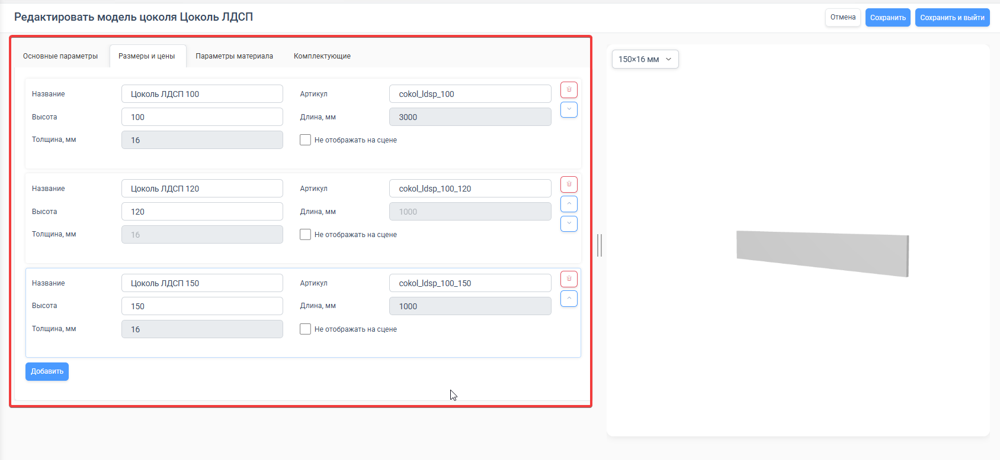
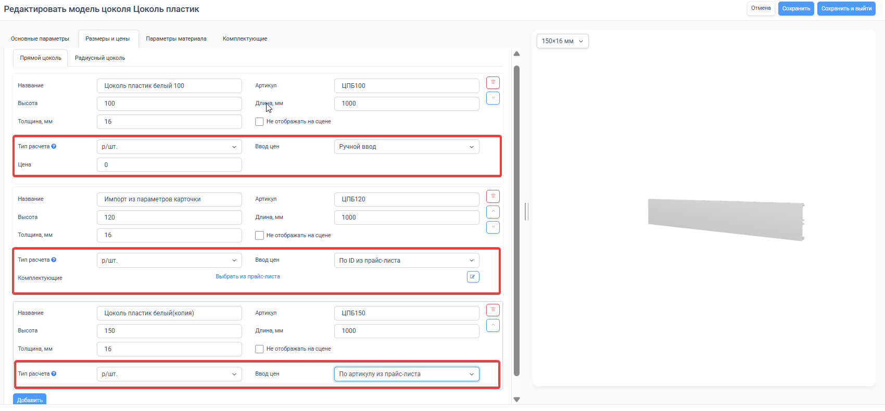
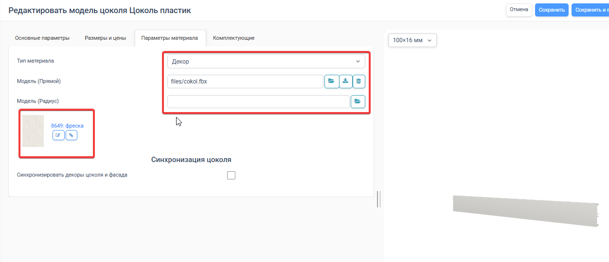

Цоколь — это нижняя планка, которая закрывает пространство под напольной мебелью. В PlanPlace цоколь настраивается отдельной карточкой: в ней задают материал, доступные высоты, цену, синхронизацию и, при необходимости, 3D-модель профиля.

В базовой базе PlanPlace уже настроены примеры всех трёх вариантов материала, описанных ниже. Их можно открыть и использовать как образцы для своих карточек.

## Какой тип материала выбрать

На вкладке **«Параметры материала»** доступны три типа:

| Тип материала | Для чего подходит | Откуда берётся цена | Нужна ли 3D-модель |
|---|---|---|---|
| **Плитный материал** | Цоколь из ЛДСП, МДФ или другой плиты | Из выбранного плитного материала | Нет |
| **Декор** | Пластиковый, МДФ- или другой профиль определённого цвета | Из размерной строки карточки цоколя | Желательна, но не обязательна |
| **Свои параметры** | Профиль с собственным материалом, который не нужно выбирать из каталога декоров | Из размерной строки карточки цоколя | Желательна, но не обязательна |

Для системы тип **«Плитный материал»** считается плитным цоколем. Типы **«Декор»** и **«Свои параметры»** считаются неплитными, или профильными, цоколями. Поэтому настройка профиля из МДФ может технически обрабатываться так же, как ПВХ-цоколь.

## Плитный цоколь

Плитный вариант удобно использовать, когда цоколь нужно изготовить из тех же плитных материалов, которые уже заведены в PlanPlace. Его стоимость рассчитывается по правилам выбранного [плитного материала](/Tilda-PlanPlace/plitnye-materialy/): отдельную цену в карточке цоколя вводить не нужно.

### 1. Выберите материал и кромки

1. Откройте вкладку **«Параметры материала»**.
2. В поле **«Тип материала»** выберите **«Плитный материал»**.
3. Нажмите **«Добавить»** и укажите ключ плитного материала, допустимые категории и материал по умолчанию.
4. Настройте кромки. Можно нажать **«Закромить всё»** или отдельно выбрать левую, правую, верхнюю и нижнюю стороны. Для каждой стороны задаются толщина, тип и материал кромки.

*Для плитного цоколя выбираются доступные плитные материалы и настраивается кромкование каждой стороны.*

### 2. Настройте синхронизацию

В блоке **«Синхронизация цоколя»** можно включить изменение материала цоколя при смене материала модуля и привязать цоколь к нужной [группе плитных материалов](/Tilda-PlanPlace/gruppy-plitnyh-materialov/).

Параметр **«Настройка синхронизации на сцене»** определяет, сможет ли пользователь сцены отказаться от связи и выбрать другой материал:

- включите его, если дизайнеру разрешено выбирать материал цоколя независимо;
- выключите, если связь должна сохраняться и её нельзя разрывать на сцене.

*Пример включённой синхронизации плитного цоколя с группой материалов корпуса.*

### 3. Добавьте размеры

На вкладке **«Размеры и цены»** создайте отдельную строку для каждой доступной высоты. У строки должны быть понятные название и артикул.

Для плитного цоколя:

- **высота** задаётся в строке цоколя;
- **длина** и **толщина** наследуются от выбранного плитного материала, поэтому поля недоступны для ручного ввода;
- поля расчёта и цены не отображаются — стоимость определяется плитным материалом.

*В примере заведены цоколи высотой 100, 120 и 150 мм. Длина и толщина подставятся из выбранной плиты.*

## Профильный цоколь: ПВХ, пластик и другие материалы

Если стоимость цоколя не должна определяться плитным материалом, используйте тип **«Декор»** или **«Свои параметры»**. В этом случае размеры и цены задаются в самой карточке цоколя.

### Настройка цены

На вкладке **«Размеры и цены»** укажите для каждого варианта название, артикул, высоту, длину и толщину. Затем выберите **тип расчёта** и способ ввода цены:

- **Ручной ввод** — цена указывается прямо в строке. Этот способ удобен, если у вас до десяти цоколей и цены не приходится часто обновлять;
- **По ID из прайс-листа** — строка точно связывается с выбранной [позицией прайс-листа](/Tilda-PlanPlace/prays-listy/);
- **По артикулу из прайс-листа** — система находит позицию по указанному артикулу. Артикул в карточке цоколя и прайс-листе должен полностью совпадать.

Для большого ассортимента удобнее хранить цены в прайс-листе: так их можно обновлять централизованно, не открывая каждую карточку цоколя.

*Цена профильного цоколя может вводиться вручную, браться из точно выбранной позиции прайс-листа или находиться по артикулу.*

### Декор и 3D-модель

Для пластикового цоколя каждого цвета выберите конкретный **декор**. Синхронизацию с фасадом или корпусом в таком сценарии включать не нужно: выбранный цвет должен оставаться свойством самой карточки цоколя.

Для неплитного цоколя можно загрузить отдельные модели прямого и радиусного профиля. Файл готовится по [правилам встроенных 3D-моделей](/Tilda-PlanPlace/3d-modeli-vstroennye/).

3D-модель не обязательна. Если файл не загружен, PlanPlace покажет цоколь как прямоугольный «брусок» с заданными длиной, высотой и толщиной. Такой вариант можно оставить, если дизайнеру достаточно видеть габариты и положение цоколя, а форма профиля для визуализации не важна.

*Для профильного цоколя выбран конкретный декор и загружена 3D-модель прямого участка. Синхронизация с фасадом выключена.*

## Три рекомендуемых схемы настройки

### МДФ или ЛДСП в цвет фасада

Если цоколь должен всегда повторять цвет фасада:

1. Используйте тип материала **«Декор»**.
2. Включите **«Синхронизировать декоры цоколя и фасада»**.
3. Не включайте **«Настройка синхронизации на сцене»**, чтобы дизайнер не мог случайно разорвать связь.

Если требуется выбирать цвет цоколя независимо от фасада, используйте один из двух вариантов:

- заведите плитные материалы МДФ со всеми декорами фасадов и настраивайте цоколь как **«Плитный материал»**;
- создайте отдельные карточки цоколя для нужных декоров, разрешите отказ от синхронизации на сцене и задайте цену в каждой карточке. Тогда применятся выбранный декор и цена конкретного варианта.

### Пластиковый цоколь

Для каждого доступного цвета выберите конкретный декор и не включайте синхронизацию. Цена задаётся в размерной строке вручную либо берётся из прайс-листа. Если важна реальная форма профиля, добавьте встроенную 3D-модель.

### Цоколь из плиты

Для плитного цоколя можно выбрать любой из двух вариантов поведения:

- включить синхронизацию с группой материалов, чтобы цоколь менялся вместе с материалом модуля;
- разрешить настройку синхронизации на сцене, чтобы дизайнер мог отказаться от связи и выбрать любой материал из доступных в карточке.

В обоих случаях стоимость рассчитывается по выбранному плитному материалу.

## Системные переменные цоколя

При выборе цоколя PlanPlace автоматически обновляет встроенные глобальные переменные:

- **«Толщина цоколя»**, ключ `__cokol_thickness` — содержит текущую толщину в миллиметрах;
- **«Тип цоколя»**, ключ `__cokol_type` — содержит тип выбранного цоколя: плитный (`tile`) или неплитный (`pvc`).

Используйте эти переменные в формулах, условиях отображения и позиционировании элементов модуля, если конструкция зависит от толщины или типа цоколя. Вручную записывать в них значения не нужно: они меняются автоматически при выборе другого цоколя.

Высота выбранной размерной строки также передаётся во встроенную переменную **«Высота цоколя»** (`__cokol_height`) и используется при позиционировании модуля.

## Комплектующие

На вкладке **«Комплектующие»** можно привязать боковые элементы, межплитные соединения и верхние или нижние комплектующие. Для комплектующих также доступны ручная цена, привязка по ID и подбор по артикулу из прайс-листа.

## Объединение соседних цоколей

Когда напольные модули стоят рядом, их цоколи могут объединяться в одну линию. Поведением управляет настройка **«Объединение цоколей»** в [настройках конструктора](/Tilda-PlanPlace/nastroyki-konstruktora/).

Для объединения должны совпадать карточка, высота, тип, материал и толщина цоколя. Цоколи также должны находиться в одной плоскости и примыкать друг к другу. Радиусные цоколи не объединяются.

## Цоколь в спецификации

Цоколь попадает в [спецификацию](/Tilda-PlanPlace/specifikaciya-i-otpravka-na-raschet/) отдельной позицией:

- плитный цоколь рассчитывается по правилам выбранного плитного материала;
- профильный цоколь рассчитывается по размерной строке карточки;
- цоколи разных типов, материалов, высот или артикулов не объединяются в одну строку;
- длинная объединённая линия может разбиваться на сегменты с учётом длины заготовки.

Перед публикацией карточки проверьте на тестовом проекте материал, цвет, высоту, толщину, рассчитанную цену и комплектующие.

## Коротко

Для цоколя из ЛДСП, МДФ или другой плиты выбирайте тип **«Плитный материал»**: длина, толщина и цена будут получены из выбранной плиты. Для ПВХ и других профилей используйте **«Декор»** или **«Свои параметры»**, настройте собственную цену и при необходимости загрузите встроенную 3D-модель. Без модели цоколь отображается прямоугольным бруском. Цвет пластикового профиля закрепляйте конкретным декором без синхронизации, а цоколь в цвет фасада синхронизируйте с фасадом и запрещайте разрыв связи на сцене. Для расчётов внутри модулей используйте автоматические переменные `__cokol_thickness`, `__cokol_type` и `__cokol_height`.
