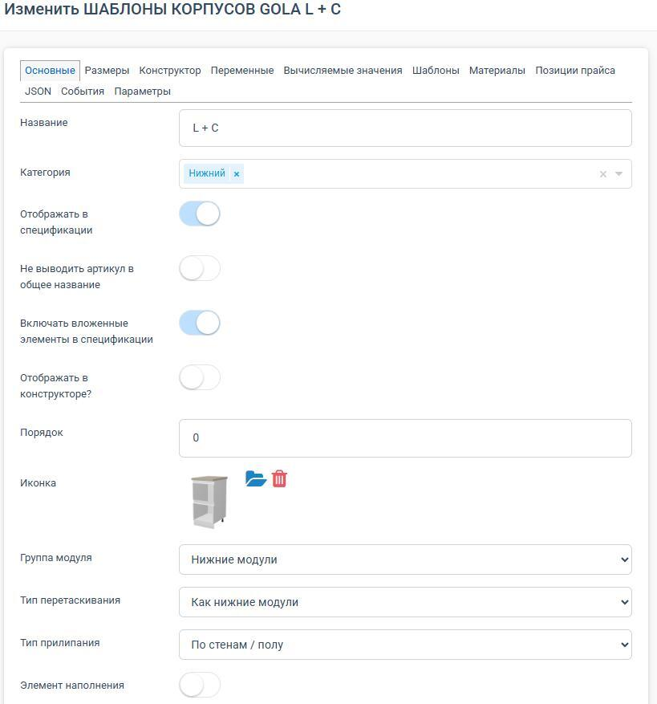
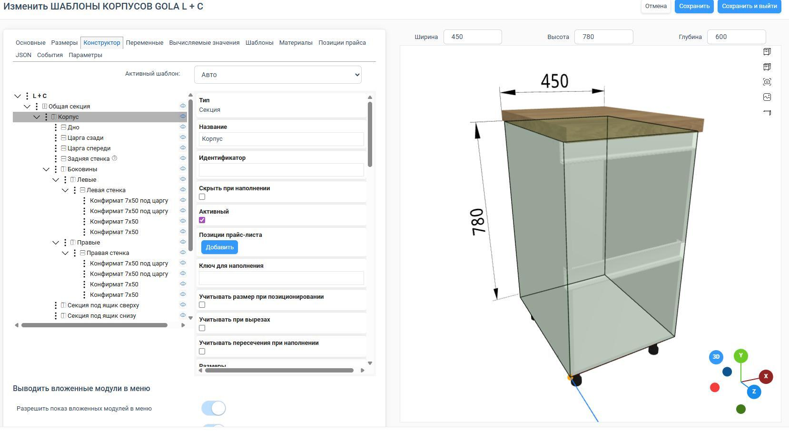
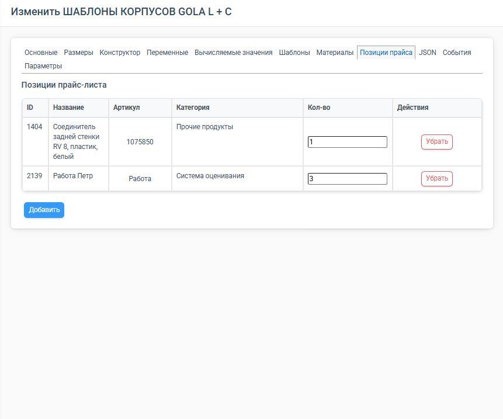

В PlanPlace любой объект каталога настраивается через **конфигуратор элемента**. Раньше
такие объекты часто называли **модулями**, сейчас корректнее говорить **элементы**.
Конфигуратор нужен, чтобы задать элементу его общие свойства, размеры, конструкцию,
материалы, расчёт и дополнительную логику.

### Как читать конфигуратор правильно

Вкладки конфигуратора разделяют настройку элемента по смыслу:

- **Основные** — что это за элемент и где он используется.
- **Размеры** — какие у него габариты и ограничения.
- **Конструктор** — из каких частей он собран.
- **Переменные** — что в нём можно менять.
- **Вычисляемые значения** — какие служебные расчёты используются.
- **Шаблоны** — как он перестраивается в разных диапазонах размеров.
- **Материалы** — из чего он сделан и как выглядит.
- **Позиции прайс-листа** — что именно пойдёт в стоимость и спецификацию.
- **JSON / События / Параметры** — как добавить сложную кастомную логику.

## 1. Основные

Стартовая вкладка и «паспорт» элемента. Здесь задают название, категории, участие в
спецификации, отображение в конструкторе, порядок, иконку, группу элемента, тип
перетаскивания и прилипания, признак элемента наполнения, настройки пересечений и тип
каталога.

Вкладка определяет, **где элемент будет виден**, **как он будет вести себя на сцене** и
**как его смогут использовать менеджеры и клиенты**. Связана с каталогом, сценой,
спецификацией и массовыми заменами по группам элементов.

## 2. Размеры

Здесь задаются габариты элемента и правила их изменения: ширина, высота, глубина;
минимальные и максимальные ограничения; можно ли менять размеры пользователю; типовые
размеры; формулы в размерах.

Вкладка отвечает за то, **в каких пределах элемент существует** и **как он меняется на
сцене**. Связана с «Конструктором», «Переменными», «Шаблонами», расчётом цены и
спецификацией.

## 3. Конструктор

Главное рабочее поле, где элемент собирается из частей: секции, детали, фасады, 3D-модели,
столешницы, цоколи, отверстия, пазы и другие элементы. Внутри можно задавать размеры и
позиции, точки отсчёта, повороты, формулы, условия показа и комментарии.

Секция — это вспомогательное пространство внутри элемента. Всё, что лежит в секции,
подчиняется размерам секции, а не сразу размерам всего элемента.

**Введённые формулы НЕ видны и не доступны пользователю сцены (продавец/дизайнер/клиент).**
Задача формул — помочь администратору настроить работу видимого элемента так, чтобы
пользователь только переключал значения разрешённых переменных, а конструкция
автоматически подстраивалась под изменения.

## 4. Вычисляемые значения

Служебная вкладка для значений, которые не вводятся вручную, а вычисляются на основе других
параметров и переменных. Используется, когда нужно получить промежуточный расчёт,
переиспользовать одно вычисление в нескольких формулах или упростить сложную логику
элемента.

## 5. Переменные

Переменные — это управляемые параметры элемента: служебные размеры, отступы,
включение/выключение опций, значения, которые пользователь может менять на сцене. Вкладка
отделяет «жёстко собранный элемент» от «гибко настраиваемого».

## 6. Шаблоны

Шаблоны — это альтернативные варианты конструкции одного и того же элемента, которые
включаются по условиям, чаще всего по диапазонам размеров. Внутри каждого шаблона строится
**независимое** дерево «Конструктора», поэтому шаблоны нужно настраивать особенно аккуратно.

Если элемент всегда устроен одинаково — шаблоны могут не понадобиться. Если конструкция
меняется от размеров или существенно меняются комплектующие — без шаблонов уже тяжело.

## 7. Материалы

Здесь задают, из чего состоит элемент: материал корпуса, задней стенки, фасадов, возможные
группы материалов, материал по умолчанию, фиксацию материала, направление текстуры, кромки
по сторонам. Вкладка отвечает за внешний вид, толщины и геометрию деталей, а также расчёт
стоимости и спецификацию.

## 8. Позиции прайса

Здесь связывают элемент с товарными и расчётными позициями: комплектующими, фурнитурой,
услугами и другими позициями, которые должны попасть в стоимость и спецификацию. Без неё
элемент может красиво выглядеть, но считать стоимость неполно.

## 9. Вкладка JSON

Техническая вкладка для тонкой кастомизации — для нестандартной логики и сложных кастомных
решений. Новому пользователю сюда обычно заходить не нужно.

## Главное для нового пользователя

На старте достаточно запомнить опорные вкладки:

1. **Основные** — чтобы элемент появился там, где нужно.
2. **Размеры** — чтобы он менялся правильно.
3. **Конструктор** — чтобы он был собран правильно.
4. **Материалы** — чтобы он считался и выглядел правильно.
5. **Переменные** — для гибкости.

Остальные вкладки нужны, когда база становится сложнее: **Шаблоны** — для автоматического
перестроения, **Позиции прайс-листа** — для точного расчёта, **JSON / События** — для
кастомных сценариев.

Конфигуратор PlanPlace — это не набор разрозненных вкладок, а одна цепочка настройки
элемента от описания и размеров до конструкции, материалов и расчёта.
