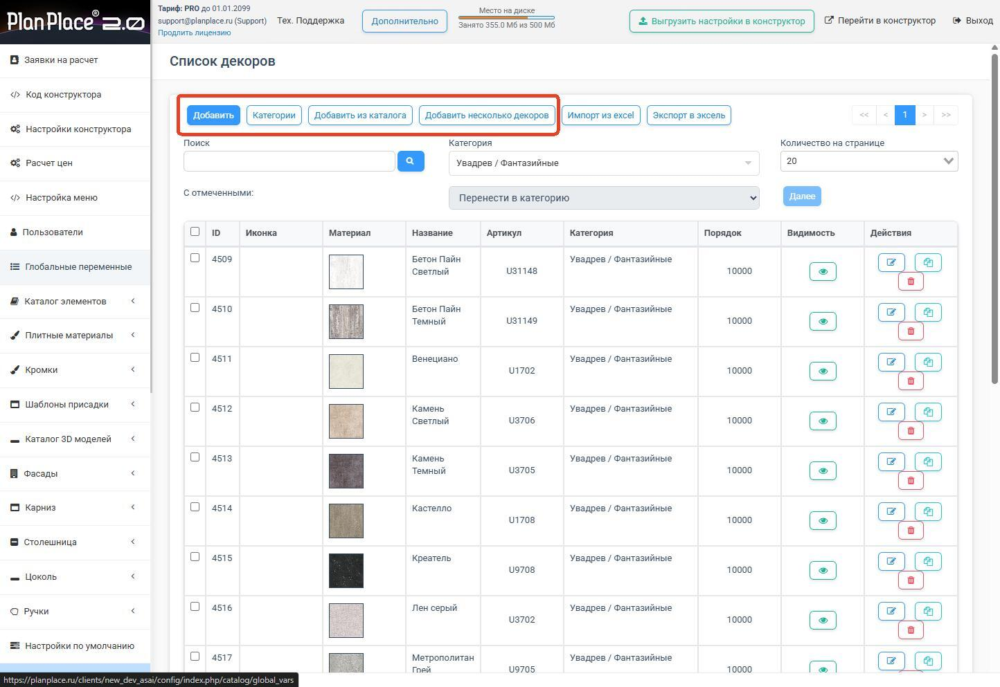

import Carousel from '../../components/Carousel.astro';
import img1 from '../../assets/decors_2/01.jpg';
import img2 from '../../assets/decors_2/02.jpg';
import img3 from '../../assets/decors_2/03.jpg';
import img5 from '../../assets/decors_2/05.jpg';
import img6 from '../../assets/decors_2/06.png';
import img7 from '../../assets/decors_2/07.png';
import img8 from '../../assets/decors_2/08.png';
import img9 from '../../assets/decors_2/09.jpg';
import img10 from '../../assets/decors_2/10.jpg';
import img11 from '../../assets/decors_2/11.png';
import img12 from '../../assets/decors_2/12.jpg';
import img13 from '../../assets/decors_2/13.jpg';
import img14 from '../../assets/decors_2/14.jpg';
import img15 from '../../assets/decors_2/15.jpg';

## Для чего нужны «Декоры»

Декоры в PlanPlace версии 2.0 представляют собой справочник текстурных изображений и их
параметров отображения, определяющих внешний вид материалов в трёхмерной визуализации.

### Где они применяются и на что влияют

- **Визуализация проекта** — декоры задают отображаемые текстуры на деталях и фасадах.
- **Плитные материалы** — системные материалы могут быть созданы на основе декоров с
  автоматическим подтягиванием базовых данных.
- **Ограничения выбора декоров фасадов** — связки в конфигурации разделяют варианты
  покрытий для разных типов поверхностей.
- **Кромки** — автоматическая генерация с последующей привязкой к декорам и материалам.
- **Текстуры стен и пола помещения.**

### Преимущества централизованного управления

- единый источник данных для всех текстур;
- быстрая первичная настройка через импорт пакетом;
- минимизация ошибок и дублирования;
- упрощённое сопровождение каталога.

## Создание категории декоров

В блоке «Декоры» выберите «Категории декоров» и нажмите «Добавить». Задайте наименование
категории и при необходимости добавьте подкатегории. Существующие категории можно
редактировать, скрывать или удалять.

<Carousel images={[{src: img1, alt: "Создание категории декоров"}, {src: img2, alt: "Создание категории декоров"}, {src: img3, alt: "Создание категории декоров"}]} />

## Загрузка декоров

После создания категории перейдите в список декоров. Доступны варианты загрузки:

- Добавить (поштучно).
- Добавить из каталога.
- Добавить несколько декоров (одним архивом).
- Импорт из Excel.

## Настройки текстуры

<Carousel images={[{src: img5, alt: "Настройки текстуры"}, {src: img6, alt: "Настройки текстуры"}, {src: img7, alt: "Настройки текстуры"}, {src: img8, alt: "Настройки текстуры"}, {src: img9, alt: "Настройки текстуры"}]} />

### Основные параметры

Укажите название, артикул и категорию декора.

### Параметры отображения

Используя HEX- или RGBA-коды, добавьте цвет. Для глянцевого вида уменьшайте шероховатость;
для металлического эффекта увеличивайте параметр «metal». Диапазон регулировки: от 0 до 1.

### Загрузка текстур

Загрузите файл текстуры, карты нормалей и шероховатости. Настройте глянцевость, поворот и
тип заполнения. Регулируйте реальные ширину и высоту для приближения к действительным
габаритам.

### Технические требования

- размер файла не превышает 1 МБ;
- ширина и высота кратны 2 (128, 256, 512, 1024 пикселя);
- рекомендуются бесшовные текстуры;
- для однотонных покрытий используйте Color Keeper вместо изображений.

## Добавление текстур одним архивом

Нажмите соответствующую кнопку в списке декоров. Выберите категорию и архивный файл,
установите свойства материалов. Важно: все файлы в одном архиве должны иметь одинаковые
параметры фактуры.

**Полезные ссылки для подготовки изображений:**

- Изменение размеров: [https://www.iloveimg.com/ru/resize-image](https://www.iloveimg.com/ru/resize-image)
- Сжатие размера: [https://www.iloveimg.com/ru/compress-image](https://www.iloveimg.com/ru/compress-image)

<Carousel images={[{src: img10, alt: "Добавление текстур одним архивом"}, {src: img11, alt: "Добавление текстур одним архивом"}]} />

## Редактирование данных

Используйте фильтр категорий для выбора нужных текстур. Доступные операции:

- Перенести в категорию.
- Скопировать в категорию.
- Изменить параметры.
- Удалить.

Для массового редактирования используйте функции «Экспорт» и «Импорт», позволяющие
работать с данными в формате xlsx.

<Carousel images={[{src: img12, alt: "Редактирование данных"}, {src: img13, alt: "Редактирование данных"}]} />

<Carousel images={[{src: img14, alt: "Редактирование данных"}, {src: img15, alt: "Редактирование данных"}]} />

### Важные замечания

- Скрытие декора, используемого в плитном материале, скроет его на сцене.
- Отключение видимости категории скроет все подкатегории и материалы в ней.
- Рекомендуется не удалять декоры, если они используются в других элементах.

По умолчанию на странице отображается 20 материалов; количество можно увеличить через
соответствующий фильтр.
