Декоры — это «внешность» материалов в PlanPlace. Проще говоря, это картинки-текстуры, которые система натягивает на поверхности, чтобы мебель выглядела реалистично: дерево, мрамор, однотонный цвет, бетон. В этой статье разберём, что такое декоры, как их добавлять (по одному и массово) и как настроить, чтобы поверхности выглядели правдоподобно.

## Что такое декор и за что он отвечает

Декор — это **только визуальная составляющая**. Он отвечает за то, как выглядит поверхность, но **не управляет ценой**. Цену задают [плитные материалы](/Tilda-PlanPlace/plitnye-materialy/), [кромки](/Tilda-PlanPlace/kromochnye-lenty/) и [фасады](/Tilda-PlanPlace/nastroyka-cen-na-fasady/), которые ссылаются на декоры.

Где декоры участвуют напрямую:

- в визуализации **фасадов** (особенно рамок и пластей МДФ);
- в отображении **стен** и **пола** на сцене.

Где декоры участвуют косвенно — через другие сущности: в плитных материалах, кромках и столешницах. То есть сам декор — это «обои», а плита или кромка — это «изделие, оклеенное этими обоями».

> **Немного истории.** Раньше вся информация о материалах хранилась в декорах. Сейчас архитектуру переработали: декоры выделены в отдельный раздел и выполняют роль чистых текстур. Это даёт больше гибкости.

## Структура раздела

Декоры организованы в виде таблицы, где можно добавлять, редактировать, скрывать и удалять записи. Категории декоров поддерживают **иерархию из нескольких уровней** (например, «Дерево → Дуб → Дуб Сонома»).

В таблице декоров есть поля:

- **Название**;
- **Артикул** — важен для ценообразования фасадов (см. предупреждение ниже);
- **Категория**;
- **Видимость** в конструкторе;
- **Порядок** отображения;
- **Иконка** (используется редко).

> **Осторожно с артикулом.** Артикул декора участвует в [ценообразовании фасадов](/Tilda-PlanPlace/nastroyka-cen-na-fasady/). Если изменить артикул, может разорваться связь с прайс-листом и цена «слетит». Меняйте артикулы декоров обдуманно.

## Как добавить декоры

### Шаг 1. Создайте категории

Откройте раздел **«Декоры» → «Категории декоров»**, нажмите **«Добавить»** и введите название. Категории можно вкладывать друг в друга на несколько уровней — например, «Дерево → Дуб → Дуб Сонома». Их также можно редактировать, скрывать и удалять.

<Carousel>

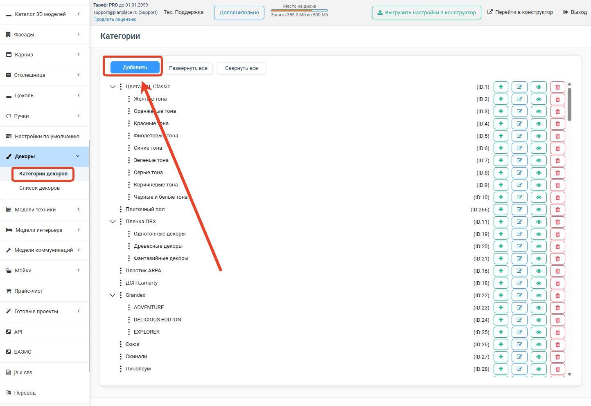

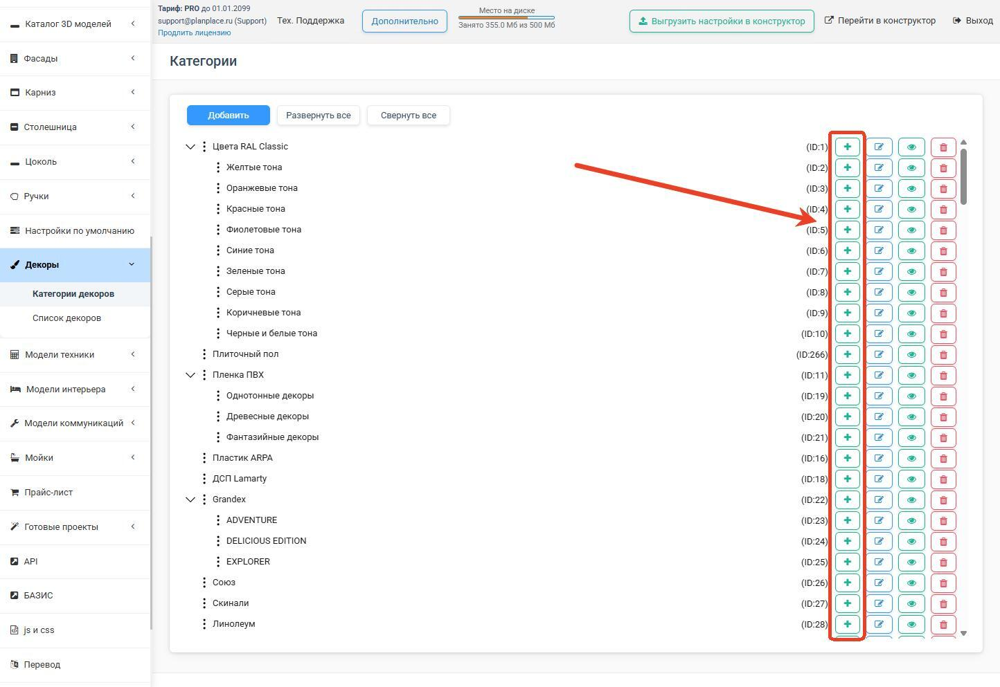

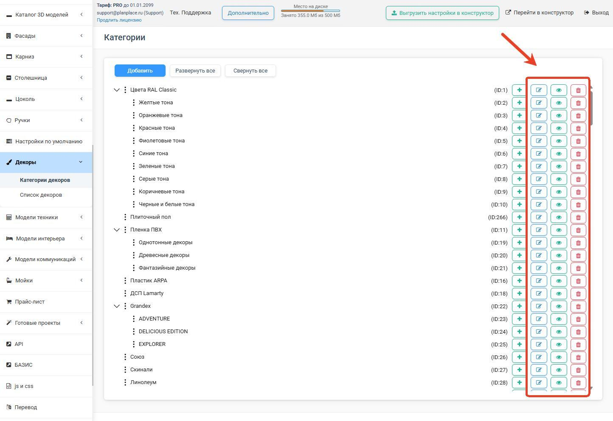

</Carousel>

> **Совет.** Создайте нужные категории заранее — тогда при массовой загрузке декоры разложатся по местам автоматически.

### Шаг 2. Загрузите декоры

В списке декоров есть четыре способа добавления:

- **«Добавить»** — по одному, для небольшого количества. Загружаете изображение текстуры, заполняете название, артикул и категорию.
- **«Добавить из каталога»** — взять готовую папку с подкатегориями из системного каталога PlanPlace. Быстрый способ наполнить базу типовыми текстурами.
- **«Добавить несколько декоров»** — массово, **ZIP-архивом** (для больших наборов).
- **«Импорт из Excel»** — из заранее подготовленного файла.

#### Массовая загрузка ZIP-архивом

1. Нажмите кнопку добавления нескольких декоров и ознакомьтесь с требованиями к архиву.
2. Выберите **категорию**, куда добавятся декоры.
3. Выберите **файл архива** (ZIP с файлами текстур).
4. Задайте **общие параметры отображения** сразу для всех текстур: шероховатость, металличность, прозрачность, способ повтора (растяжение или зеркалирование).
5. Нажмите **«Добавить»**.

Система **распознаёт названия файлов** и раскладывает декоры по категориям. Важно: все текстуры в одном архиве должны иметь **одинаковые параметры отображения** (накладываются на все сразу).

<Carousel>

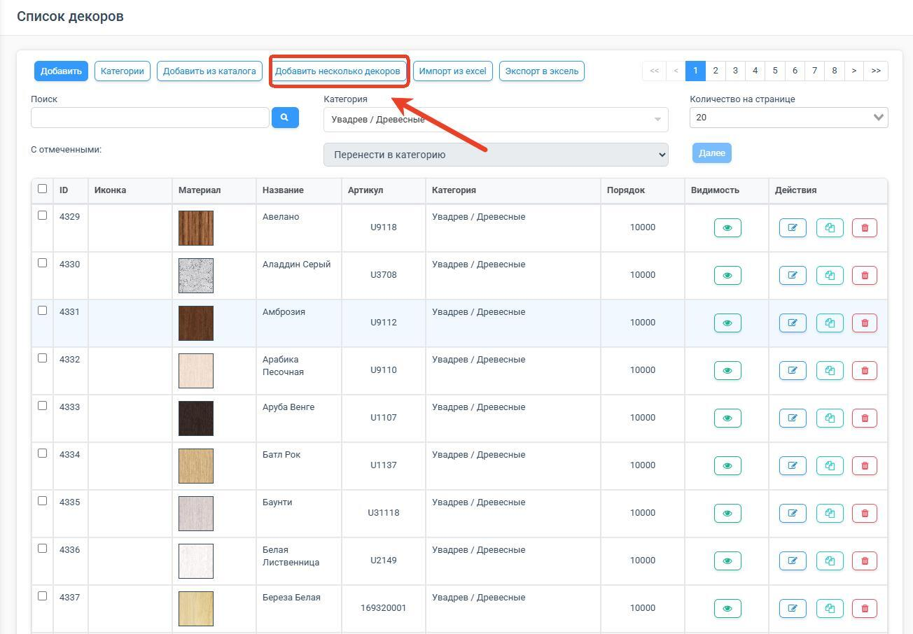

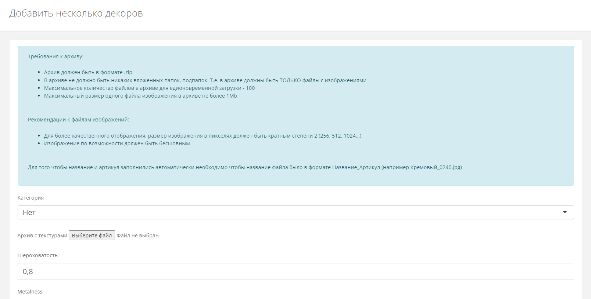

</Carousel>

## Технические требования к текстурам

**Форматы.** Используйте **JPEG** и **PNG**. Формат BMP слишком тяжёлый, WebP (WP) поддерживается частично. Для анимированных эффектов в будущем планируется поддержка GIF.

**Разрешение.** Все текстуры в наборе должны иметь **одинаковое разрешение**, иначе они будут отображаться неровно. Размер текстуры в пикселях задаётся изображением, а в настройках отображения указывается реальный размер в **миллиметрах** (по умолчанию 1 пиксель ≈ 1 мм, но это можно скорректировать вручную).

**Бесшовность.** Для повторяющихся рисунков (дерево, мрамор, ткань) критично использовать **бесшовные текстуры**. Тогда при растягивании на большую поверхность (например, на высокий шкаф) не будет видно стыков и швов.

**Оптимизация.** Конструктор работает в браузере, в том числе на слабых устройствах. Тяжёлые текстуры замедляют систему. Перед загрузкой оптимизируйте вес файлов — например, массовыми инструментами вроде Microsoft PowerToys, [iLoveIMG (изменение размера)](https://www.iloveimg.com/ru/resize-image) или [iLoveIMG (сжатие)](https://www.iloveimg.com/ru/compress-image).

**Конкретные ограничения файла:**

- размер файла — **до 1 МБ**;
- стороны изображения — **степень двойки**, начиная с 64 пикселей (64, 128, 256, 512, 1024 и т. д.);
- для однотонных цветов лучше использовать не картинку, а **«Хранитель цвета» (Color Keeper)** — это снижает нагрузку на систему.

## Настройка отображения: как сделать поверхность реалистичной

Параметры задаются в карточке декора на двух вкладках.

**Вкладка «Основные».** Введите **название**, при необходимости **артикул** и выберите **категорию**.

**Вкладка «Параметры отображения».** Здесь настраивается внешний вид:

- **Цвет** — задаётся кодом HEX или RGBA через иконку выбора цвета.
- **Шероховатость (Roughness)** — насколько поверхность матовая или глянцевая. `0` — зеркальный глянец с яркими бликами, `1` — полностью матовая поверхность. Для глянцевого пластика — ближе к 0, для матового ЛДСП — ближе к 1.
- **Металличность (Metalness)** — насколько поверхность похожа на металл. `0` — неметалл, `1` — выраженный металлический блеск. Используется для алюминия, нержавейки, фурнитуры.
- **Прозрачность (Opacity)** — `0` полностью прозрачный, `1` полностью непрозрачный. Нужна для стекла и пластиков.

**Файл текстуры.** Нажмите на квадрат **«Файл текстуры»** и выберите изображение. Здесь же добавляются карты нормалей и шероховатости (см. ниже), задаются поворот и тип заполнения, а также реальные **ширина и высота** в миллиметрах — чтобы рисунок был в натуральном масштабе. Результат сразу виден в окне предпросмотра справа. После настройки нажмите **«Добавить»**.

> **Зачем нужен «Поворот текстуры».** Эта настройка добавлена только для того, чтобы **исправить картинку, которая пришла от поставщика не в том положении**. Использовать её как рабочий инструмент не стоит: поворот применится везде, где задействован декор. Правильный порядок — **до импорта** привести все картинки к единому «правильному» с точки зрения технолога положению: у горизонтальных деталей корпусов **ширина детали должна совпадать с направлением ширины текстуры** в окне предпросмотра. Точечный разворот текстуры на конкретной детали делается признаком «Повернуть» в [конфигураторе](/Tilda-PlanPlace/detali/).

<Carousel>

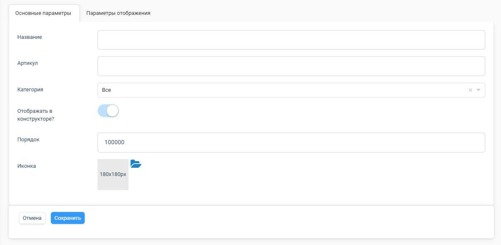

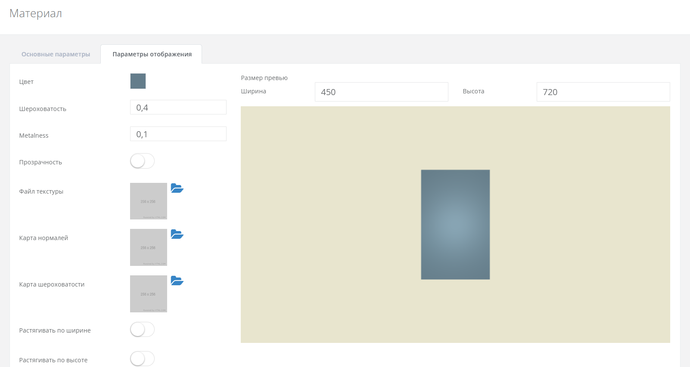

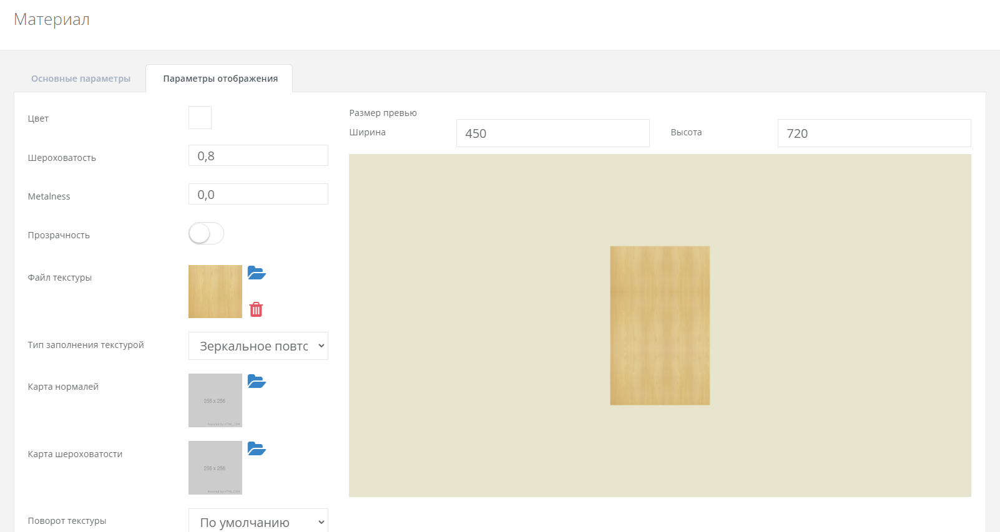

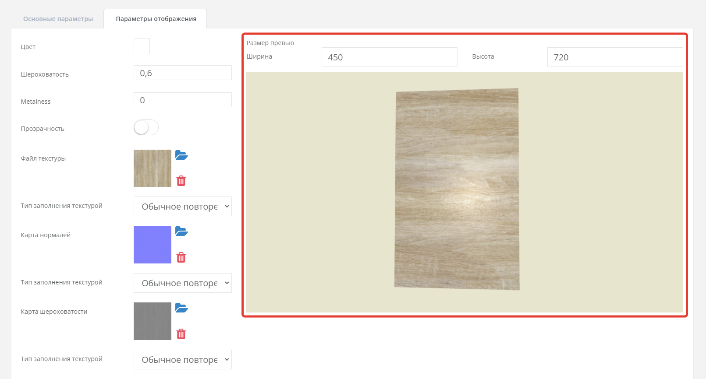

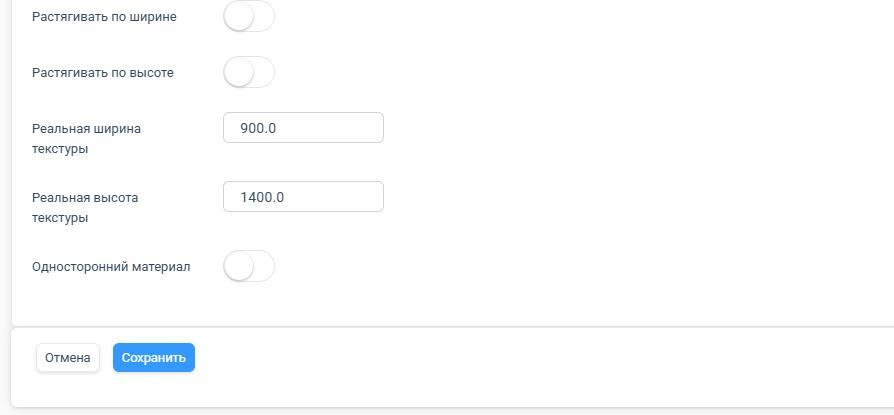

</Carousel>

## Карты для сложных эффектов

Помимо основной картинки, к декору можно добавить дополнительные «карты» — отдельные изображения, которые усложняют отображение поверхности:

- **Карта нормалей (Normal Map)** — создаёт эффект рельефа (фактуры дерева, тиснения) без изменения геометрии. Это изображение, по которому система понимает, где «выпуклости» и «впадины», и рисует на плоской поверхности правдоподобные блики и тени.
- **Карта шероховатости (Roughness Map)** — задаёт разную матовость на разных участках. Например, имитирует лак, нанесённый только на рисунок.
- **Карта прозрачности (Opacity Map)** — задаёт, какие участки прозрачные, а какие нет. Используется для решёток, рельефного стекла.

Все карты загружаются как отдельные изображения и накладываются поверх основной текстуры.

## Массовые операции, импорт и экспорт

Когда декоров много, удобнее редактировать их пачками. Отфильтруйте список по категории, отметьте нужные текстуры (по одной или все на странице) и выберите действие:

- **«Перенести в категорию»**;
- **«Копировать в категорию»**;
- **«Изменить параметры»**;
- **«Удалить»**.

Затем нажмите **«Далее»**.

<Carousel>

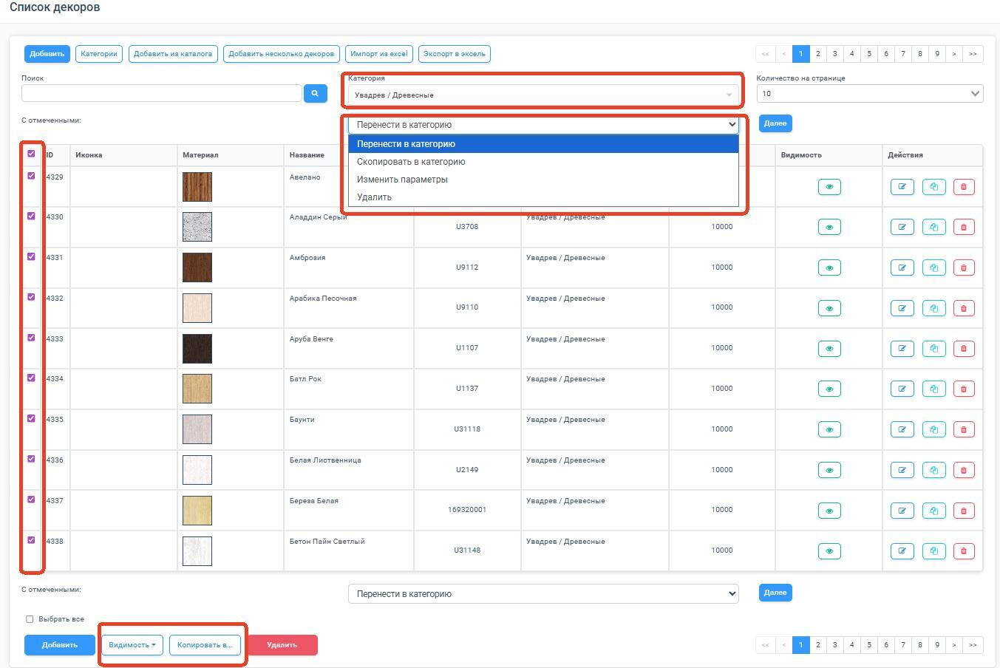

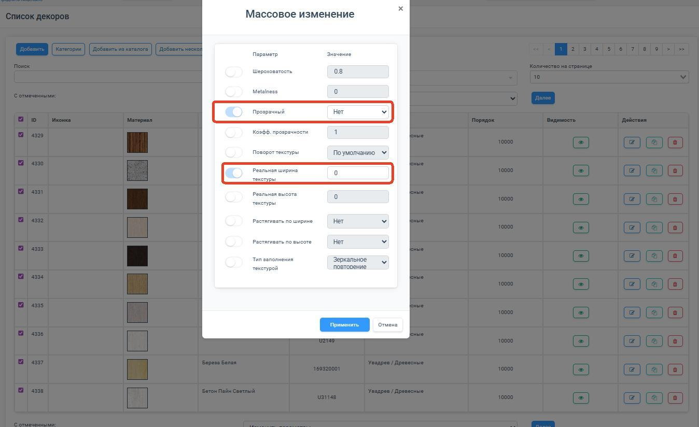

</Carousel>

**Через экспорт/импорт Excel.** Нажмите **«Экспорт»**, скачайте текущие настройки в `.xlsx`, поменяйте названия, артикулы, видимость или категории и загрузите обратно через **«Импорт»**. Так удобно массово управлять видимостью и интеграцией с внешними системами.

В ячейках файла можно использовать формулы Excel. При импорте декоров PlanPlace получает **сохранённый результат формулы**, а не вычисляет выражение самостоятельно. Поэтому перед загрузкой:

1. Откройте файл в Excel или LibreOffice.
2. Дождитесь пересчёта формул.
3. Сохраните файл в формате `.xlsx`.
4. Импортируйте его в PlanPlace и проверьте несколько изменённых строк.

Если у формулы нет сохранённого результата, вместо ожидаемого значения может быть загружен `0`. Для критичных колонок безопаснее после расчёта заменить формулы готовыми значениями.

> **Область действия.** Исправление из продуктового коммита относится непосредственно к обычному импорту декоров из Excel. В текущей версии похожая обработка сохранённых результатов есть также в некоторых импортерах материалов, кромок и цоколей, но **не во всех Excel-импортах PlanPlace**. Например, загрузчики параметров модулей и столешниц используют отдельную обработку. Не рассчитывайте на поддержку формул в другом разделе без тестового импорта; универсальный вариант — вставить рассчитанные значения.

<Carousel>

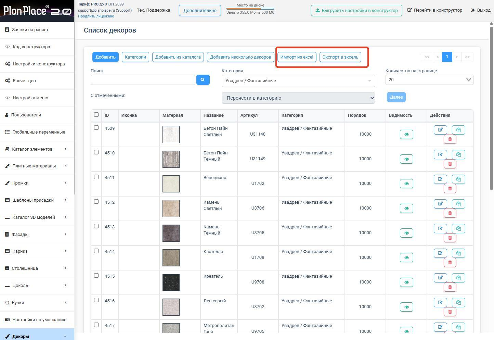

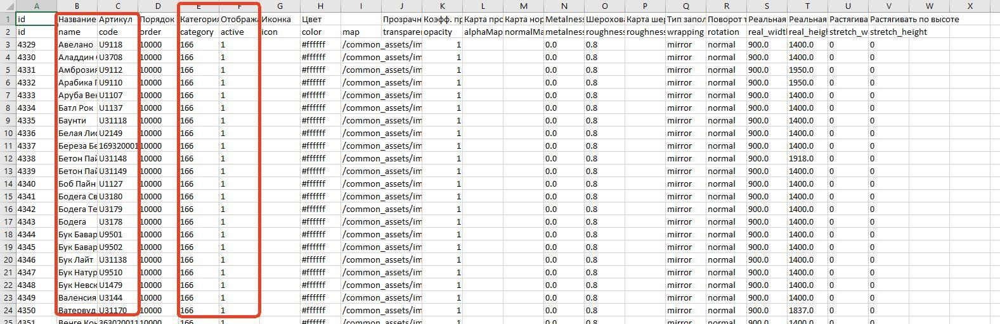

</Carousel>

> **Важно при выделении.** Кнопка «выбрать все» отмечает только декоры **на текущей странице** (по умолчанию показывается 20 штук — число регулируется фильтром).

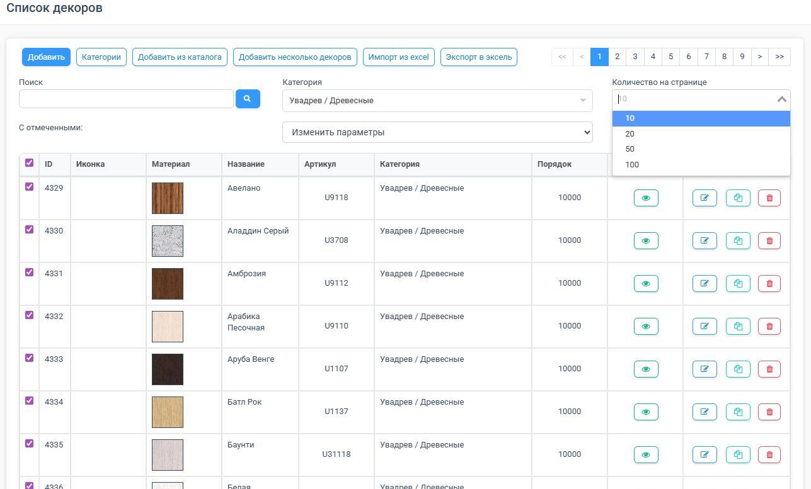

## Удаление: что важно знать

Удалять отдельные декоры не критично: если декор отсутствует, связанные элементы подсветятся **красным цветом**, и вы легко найдёте, что заменить. Тем не менее не удаляйте декоры, которые активно используются в фасадах и плитах, без необходимости. Учтите: если **скрыть** декор, который используется в плитных материалах, у пользователей он отобразится ошибкой (красная полупрозрачная заливка), а скрытие целой категории прячет все её подкатегории и материалы.

## Коротко

Декор — это текстура (картинка), отвечающая за внешний вид, но не за цену. Добавляйте декоры по одному, из системного каталога или массово ZIP-архивом; используйте JPEG/PNG, бесшовные и оптимизированные; настраивайте шероховатость, металличность и прозрачность, а для реализма добавляйте карты нормалей. Дальше декоры используются в [плитных материалах](/Tilda-PlanPlace/plitnye-materialy/), [кромках](/Tilda-PlanPlace/kromochnye-lenty/) и фасадах.

