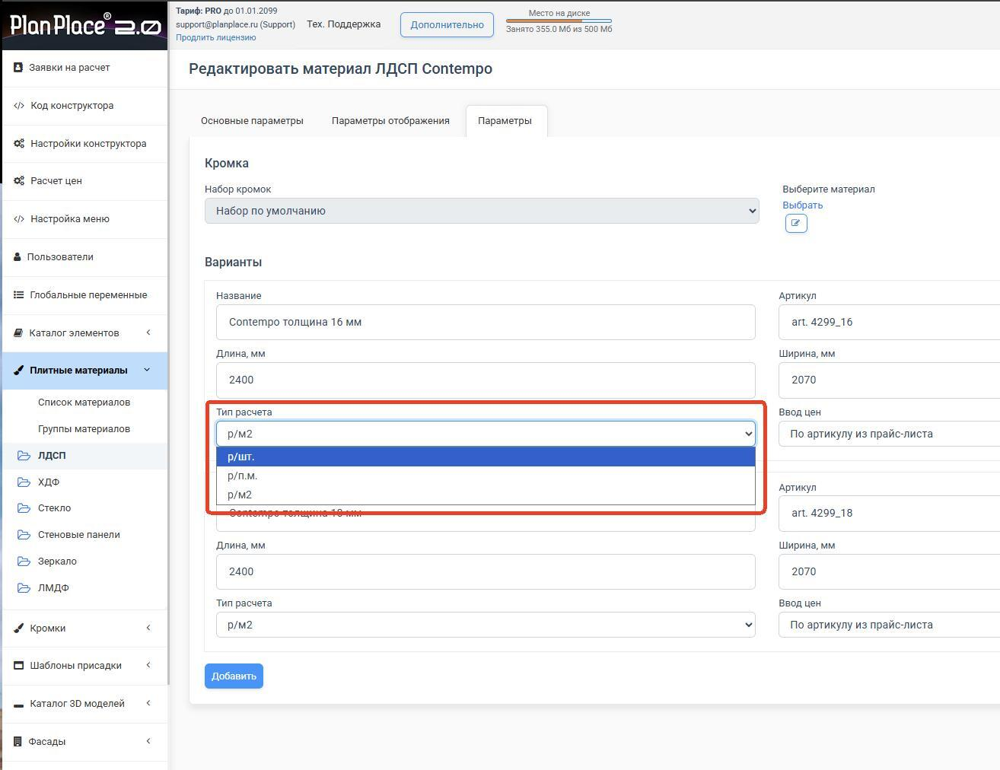
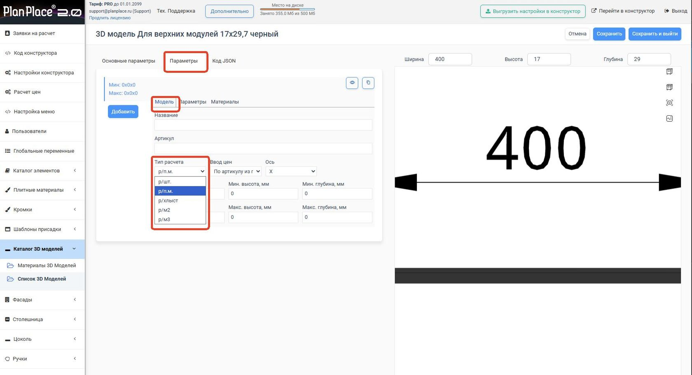

PlanPlace умеет считать стоимость материалов по-разному, потому что в реальной жизни поставщики продают товары неодинаково. Листы ЛДСП — целыми листами или за квадратный метр, кромку и профиль — за погонный метр, трубы и бруски — хлыстами, массив — за кубометр. Выбирая правильный тип расчёта для каждого материала, вы получаете смету, близкую к реальной себестоимости, без ручных пересчётов. В этой статье разберём все шесть способов с примерами.

## Шесть способов в двух словах

| Единица | Что считаем | Где применяем |
|---|---|---|
| **шт.** | Листы/плиты с округлением вверх | ЛДСП, МДФ, столешницы — когда считаете листами и не используете остатки |
| **п.м.** | Длину без округления | Кромка, профиль, светодиодная лента, трубы |
| **хлыст** | Целые палки с округлением вверх | Металлопрокат, алюминиевый профиль, плинтус |
| **хлыст (п.м.)** | Долю хлыста без округления | Когда поставщик режет в размер, но цена как за целый хлыст |
| **м²** | Площадь деталей из одного материала | Стекло, зеркала, фасады, ЛДСП, МДФ, столешницы |
| **м³** | Объём детали | Массив, пиломатериал, бетонные основания |

Тип расчёта выбирается **для каждого материала в конкретной толщине** (а для 3D-моделей, профилей и металлопроката — в их настройках).

<Carousel>

</Carousel>

## По штукам — «р/шт.»

**Суть.** Программа считает, сколько целых плит уйдёт на заказ: складывает площадь деталей → делит на формат листа → округляет вверх.

**Пример.** Лист 1000×1000 мм (1 м²) за 1000 ₽. Нужно 3 полки 500×500 мм (по 0,25 м²). Общая площадь 0,75 м², делим на 1 м² = 0,75 листа, есть остаток → округляем до 1 листа. Итог: 1 × 1000 = **1000 ₽**. Добавите четвёртую полку — уложитесь в лист; пятая — уже второй лист.

**Когда использовать.** Для плит и столешниц, которые вы считаете листами, а также для штучных изделий (конфирматы, шурупы, столы, стулья).

> **ВАЖНО.** PlanPlace не делает раскрой и не знает ваш КИМ (коэффициент использования материала). При расчёте **по штукам** запас в первую очередь даёт округление вверх до целого листа. При этом встроенный [коэффициент отхода](/Tilda-PlanPlace/plitnye-materialy/) для штук **тоже применяется** — он дополнительно увеличивает площадь деталей перед делением на формат листа. Если хотите заложить КИМ только округлением, держите коэффициент отхода равным 0.

## По погонным метрам — «р/п.м.»

**Суть.** Складываем длину всех погонажных деталей (в метрах) и умножаем на цену за метр. Без округления.

**Пример.** 3 отрезка кромки по 2 м при цене 500 ₽/м: 3 × 2 = 6 п.м., 6 × 500 = **3000 ₽**. Платите ровно за полученную длину.

**Когда использовать.** Кромка, профили, трубы (в 3D-моделях), цоколь, светодиодная лента — всё, что продаётся на отрез и не требует учёта целыми хлыстами.

## Хлыстами — «р/хлыст»

**Суть.** Материал отпускается только целыми хлыстами (например, по 6 м). Программа складывает длину всех отрезков и считает, сколько хлыстов нужно купить. Округление всегда вверх.

**Пример.** Профиль хлыстами по 6 м за 1000 ₽/шт. Нужны куски 3 м и два по 2 м: 3 + 2 + 2 = 7 м. Одного хлыста (6 м) мало → берём 2 хлыста (12 м). Итог: 2 × 1000 = **2000 ₽**, даже если 5 м уйдут в отход.

**Когда использовать.** Металлопрокат, алюминиевые системы (через 3D-модели) — когда резка в размер невозможна или остатки нельзя переиспользовать.

## Хлыстами по погонным метрам — «р/хлыст (п.м.)»

**Суть.** Цена привязана к стоимости целого хлыста, но округления нет — считается доля.

**Пример.** Хлыст 6 м стоит 600 ₽ (100 ₽/м). Нужно 3 м: 3 / 6 = 0,5 хлыста, 0,5 × 600 = **300 ₽**.

**Когда использовать.** Когда поставщик режет в размер, но прайс ведётся от стоимости целого хлыста. Точный расчёт без «накрутки» за отход.

## По площади — «р/м²»

**Суть.** Площадь каждой детали (длина × ширина), суммируем и умножаем на цену за м².

**Пример.** Четыре боковины ЛДСП 2×1 м, цена 1000 ₽/м²: площадь одной 2 м², четырёх — 8 м², 8 × 1000 = **8000 ₽**.

**Когда использовать.** Стекло, зеркала, ЛДСП, столешницы, фанера — всё плоское, где цена задаётся за материал в конкретной толщине.

> Оптимизация раскроя не выполняется, зато для расчёта по площади работает встроенный **[коэффициент отхода, %](/Tilda-PlanPlace/plitnye-materialy/)** — он увеличивает расход материала в спецификации на заданный процент. Это основной способ заложить КИМ. Коэффициент отхода действует для типов **шт., п.м., м² и р/хлыст (п.м.)**, но **не действует для м³** (там запас закладывают в цену). Главное — не задвоить отход (не закладывать его и в коэффициент, и в цену/наценку).

## По объёму — «р/м³»

**Суть.** Объём детали (длина × ширина × толщина), суммируем и умножаем на цену за м³.

**Пример.** Брус 0,1 × 0,1 × 2 м (0,02 м³) при 20 000 ₽/м³: 0,02 × 20 000 = **400 ₽**.

**Когда использовать.** Массив дерева, клееный брус, бетонные основания, искусственный камень (если цена за куб).

## Как учесть отход (коэффициент отхода)

У каждого варианта [плитного материала](/Tilda-PlanPlace/plitnye-materialy/) есть поле **«Коэффициент отхода, в %»**. Он добавляет в расчёт запас на отходы, дополнительные работы и непредвиденные потери:

- влияет **не на стоимость, а на количество** — в спецификации расход увеличивается на заданный процент (+%);
- работает для типов **шт., п.м., м² и р/хлыст (п.м.)**;
- для **р/шт.** применяется **поверх** округления до целого листа: сначала площадь деталей увеличивается на процент отхода, затем результат округляется вверх до целых листов;
- **не работает для м³** — для массива и пиломатериала запас закладывайте в цену за куб.

Это встроенный и самый удобный способ заложить КИМ. Используйте его **вместо** ручных приёмов (надбавка в цене, уменьшение листа), чтобы не учесть отход дважды.

## Сквозной пример: от детали до цены в спецификации

Покажем, как тип расчёта, коэффициент отхода, [цена](/Tilda-PlanPlace/prays-listy/), [наценки](/Tilda-PlanPlace/pravila-rascheta-cen-nacenki/) и округление складываются в итоговую сумму.

**Условия (из настроек материала и раздела «Расчёт цен»):**

- материал — ЛДСП, тип расчёта **м²**, цена **1000 ₽/м²**;
- коэффициент отхода — **10 %**;
- в проекте — 3 полки 500×500 мм (по 0,25 м²);
- общая наценка — **2**, точечная наценка на ЛДСП — **1,3** (переключатель «Не умножать на общую» выключен);
- округление — **«В большую до 10»**.

**Расчёт по шагам:**

1. **Количество.** Площадь деталей: 0,25 + 0,25 + 0,25 = **0,75 м²**.
2. **Отход.** +10 %: 0,75 × 1,1 = **0,825 м²** (так коэффициент отхода влияет на количество, а не на цену).
3. **Себестоимость.** 0,825 × 1000 = **825 ₽**.
4. **Наценка.** Итоговый множитель = общая × точечная = 2 × 1,3 = **2,6**. Значит 825 × 2,6 = **2145 ₽**.
5. **Округление «В большую до 10».** 2145 → **2150 ₽**.

В спецификацию по этим полкам попадёт **2150 ₽**. Поменяете число полок, цену материала или наценку — пересчёт произойдёт автоматически по этой же цепочке.

## Как выбрать метод

Выбирайте метод под логику вашего поставщика или продаж:

- столешницы покупаете листами под проект, остатки не переиспользуете → **шт.**;
- кромку берёте в погонаже → **п.м.**;
- цоколи идут хлыстами → **хлыст**;
- ЛДСП типовая, активно используете деловые остатки, понимаете средний отход → **м²**.

Так смета будет максимально близка к реальной себестоимости, а отход не станет сюрпризом при закупке.

## Коротко

В PlanPlace шесть типов расчёта: штуки, погонные метры, хлысты, хлысты-по-метрам, квадратные и кубические метры. Каждый задаётся для конкретного материала и толщины. Помните, что система не оптимизирует раскрой, поэтому отход (КИМ) закладывайте через коэффициент отхода (он работает для всех типов, кроме м³) либо в цену/наценку. Дальше цены добавляются через [прайс-листы](/Tilda-PlanPlace/prays-listy/), а множители — через [правила расчёта цен](/Tilda-PlanPlace/pravila-rascheta-cen-nacenki/).

