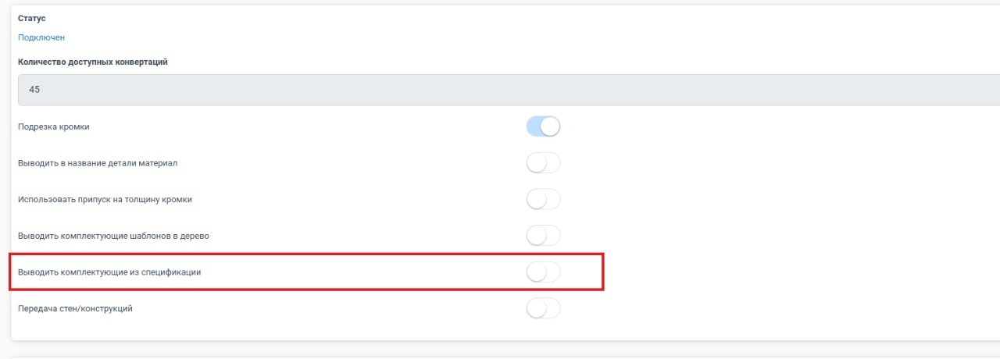
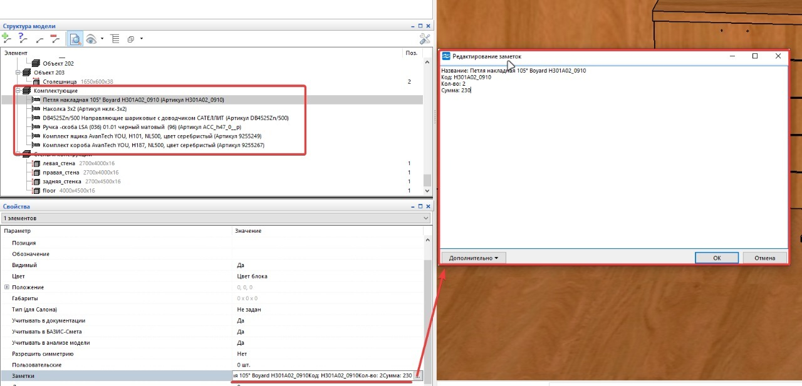
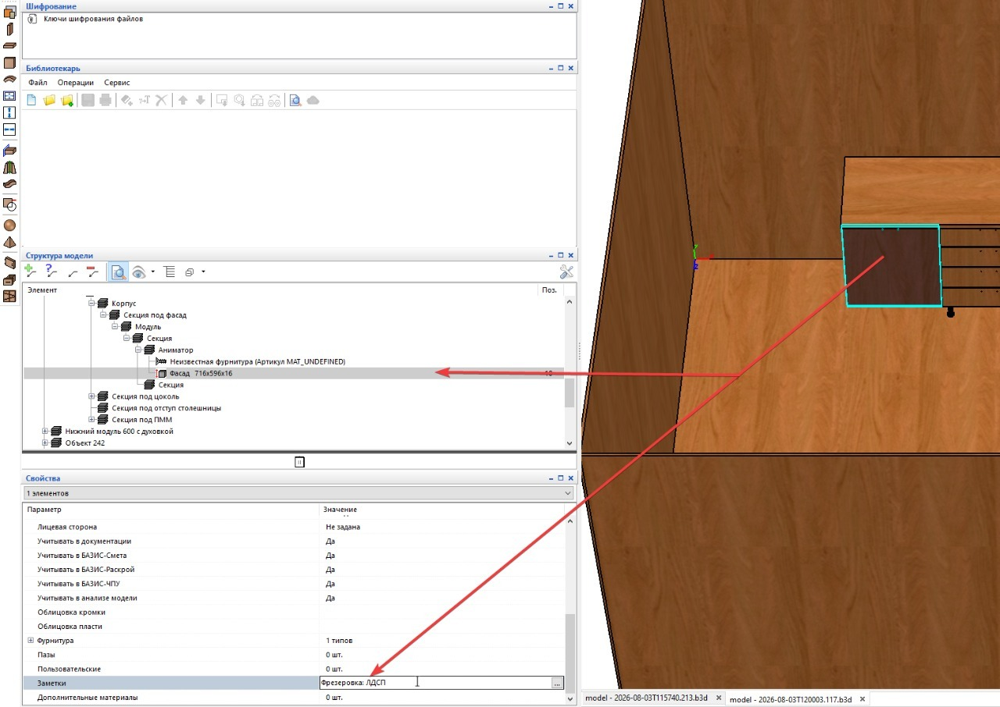

Главная ценность PlanPlace для производителя — то, что собранный проект можно передать прямо в станочные программы для распила и присадки. Не нужно перечерчивать мебель вручную. В этой статье разберём, в какие программы экспортируется проект и как устроены настройки модуля БАЗИС.

## Куда можно экспортировать

Полноценная интеграция реализована с тремя производственными программами:

- **БАЗИС-Мебельщик** — российская система проектирования и подготовки производства мебели;
- **АСАИ.Раскрой** (на момент записи обучения — ASAI.Cut) — раскрой;
- **АСАИ.Нестинг** (на момент записи — ASAI.Nest) — нестинг (раскрой с оптимизацией раскладки).

Кроме того, проект можно выгрузить в популярные **3D-форматы** (SketchUp, 3D Max, Blender) для дальнейшей визуализации.

Для интеграции PlanPlace передаёт спецификации с размерами, материалами и [присадками](/Tilda-PlanPlace/prisadki/). Раскройные программы принимают, в частности, **CSV** — это та же таблица с разделителями-запятыми.

## Модуль БАЗИС: подключение и баланс конвертаций

Раздел **«БАЗИС»** в левом меню личного кабинета появляется (активируется), когда подключён модуль интеграции с Базисом. Он же добавляет на сцену кнопку **«Экспорт в Базис»** для скачивания проекта.

В разделе вы видите:

- **Статус** — подключён модуль или нет (на скриншоте — «Подключён»).
- **Количество доступных конвертаций** — сколько файлов ещё можно сконвертировать. Каждый экспортируемый в Базис файл **списывает одну конвертацию с предоплаченного баланса**. Например, у клиента было оплачено 1000 конвертаций, часть из них уже израсходована. Следите за остатком, чтобы экспорт не прервался в нужный момент.

## Настройки экспорта в БАЗИС (переключатели)

Ниже статуса расположены переключатели, которые подгоняют выгрузку под ваш техпроцесс. После изменения нажмите **«Сохранить»**.

**Подрезка кромки.** Включает на всех деталях подрезку кромки по умолчанию — то есть габарит детали уменьшается на размер кромки, чтобы после оклейки получился нужный итоговый размер. Здесь регулируется именно **подрезка**, а не прифуговка: прифуговка настраивается точечно уже в самом Базисе. По умолчанию переключатель включён, потому что подрезку используют практически все (за редким исключением).

**Выводить в название детали материал.** Определяет, что попадёт в название детали при выгрузке: общее название декора **или** конкретная плита с конкретной толщиной. Переключатель добавили по запросу клиента: при передаче общего артикула в Базисе нельзя было различить толщину и привязать деталь к своей базе материалов. Поэтому, если вы ведёте базу с несколькими толщинами одного декора и их нужно разделять, включите этот вывод.

**Использовать припуск на толщину кромки.** Ещё один параметр, влияющий на габариты деталей: добавляет припуск на толщину кромки. В Базисе есть соответствующий параметр (по смыслу — «припуск на толщину»), и эта настройка передаёт ту же логику.

**Выводить комплектующие шаблонов в дерево.** Добавляет в дерево каждого мебельного модуля комплектующие, указанные в его шаблоне и в выбранном варианте шаблона. Например, если в шаблоне модуля заданы две петли и четыре опоры, после экспорта эти позиции появятся внутри соответствующего модуля в указанном количестве. Настройка сохраняет связь комплектующих с конкретным модулем и не собирает их в общую группу проекта.

**Выводить комплектующие из спецификации.** Формирует в корне дерева БАЗИС-Мебельщика отдельную общую группу **«Комплектующие»**. В неё собираются итоговые позиции спецификации со всего проекта: одинаковые позиции объединяются, а их количество и стоимость суммируются. Передаются в том числе прайс-позиции без собственной 3D-модели, которые добавлены ко всему мебельному модулю и не привязаны к отдельной детали конструкции.

*Красной рамкой отмечена настройка «Выводить комплектующие из спецификации». На скриншоте она выключена: серый переключатель находится слева. Перед экспортом переведите его вправо — активный переключатель подсвечивается голубым.*

В поле **«Заметки»** для каждой позиции из общей группы передаются:

- название;
- артикул (код);
- общее количество;
- общая сумма.

*После экспорта комплектующие собраны в отдельной группе. В «Заметках» выбранной позиции показаны её название, код, количество и сумма.*

> **Проверьте дубли после экспорта.** Одна и та же позиция может попасть в БАЗИС-Мебельщик как отдельный объект проекта и как комплектующая из общей спецификации. Сравните артикулы и количество в группе «Комплектующие» со спецификацией PlanPlace. Проверку можно выполнить вручную или своим скриптом.

**Передача стен/конструкций.** Определяет, нужно ли добавлять в файл стены и конструкции, которые использовались при построении проекта в PlanPlace. Если переключатель включён, они передаются в БАЗИС-Мебельщик вместе с мебелью. Если выключен, в файл попадают мебельные объекты без геометрии помещения. Включайте настройку, когда технологу нужны размеры и положение окружающих конструкций; после импорта проверьте, что они не мешают обработке мебельных деталей.

### Фрезеровка фасадов в «Заметках»

Для фасадов PlanPlace передаёт в поле **«Заметки»** название фрезеровки. Эти данные можно использовать в БАЗИС-Мебельщике при подготовке производственной документации и запуске процессов, связанных с конкретной фрезеровкой.

*Пример переданного названия фрезеровки в «Заметках» выбранного фасада.*

## Что важно знать про присадки и сверление

От корректности [присадок](/Tilda-PlanPlace/prisadki/) напрямую зависит результат экспорта:

- **направление сверления** должно быть правильным, иначе станок не выполнит отверстие;
- для сложных составных присадок используйте сборку целиком **без отображения спецификации отдельных присадок** — иначе в Базисе и АСАИ.Нестинг возможны ошибки.

## Пазы и вырезы

[Пазы и вырезы](/Tilda-PlanPlace/pazy-i-vyrezy/) передаются в производство по-разному. Пазы поддерживаются давно и считаются более проверенным вариантом. Передача вырезов появилась позже через формат CFRN, поэтому результат нужно проверять на конкретном проекте после открытия файла в БАЗИС-Мебельщике.

## Кто может экспортировать

Экспорт в производство доступен владельцу, администратору и [менеджеру](/Tilda-PlanPlace/obzor-sistemy-i-roli/). Для менеджеров экспорт может быть закрыт до авторизации — это настраивается, чтобы файлы для производства не уходили раньше времени.

## Практический порядок

1. Соберите и проверьте проект на [сцене](/Tilda-PlanPlace/interfeys-sceny/), особенно [присадки](/Tilda-PlanPlace/prisadki/) в 2D-режиме.
2. В разделе **«БАЗИС»** выставьте переключатели (подрезка кромки, припуск, материал в названии, комплектующие шаблонов, комплектующие из спецификации, стены/конструкции) под ваш техпроцесс и нажмите **«Сохранить»**.
3. Нажмите кнопку экспорта (**Экспорт в Базис**, либо вывод в АСАИ.Раскрой / АСАИ.Нестинг).
4. Откройте файл в БАЗИС-Мебельщике и проверьте детали, материалы, отверстия, стены и конструкции.
5. Откройте группу **«Комплектующие»**. Сверьте артикулы, общее количество и сумму со спецификацией PlanPlace, затем исключите возможные дубли.
6. Для фасадов откройте **«Заметки»** и убедитесь, что название фрезеровки передано правильно.

## Коротко

PlanPlace интегрирован с тремя производственными программами — **БАЗИС-Мебельщик, АСАИ.Раскрой** (ранее ASAI.Cut) и **АСАИ.Нестинг** (ранее ASAI.Nest), — а также выгружает 3D-форматы. Модуль БАЗИС подключается отдельно, расходует предоплаченные конвертации и добавляет кнопку «Экспорт в Базис». Его переключатели управляют подрезкой кромки, выводом материала в название детали, припуском на толщину кромки, передачей комплектующих, стен и конструкций. После экспорта обязательно проверьте группу «Комплектующие», данные в «Заметках» и возможные дубли.
