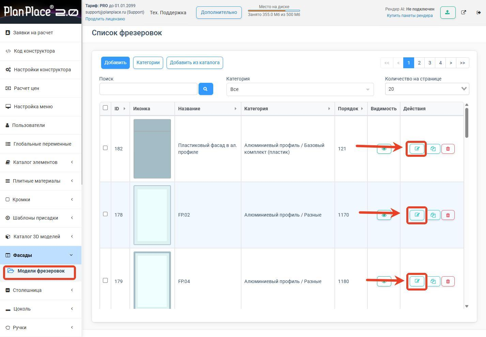
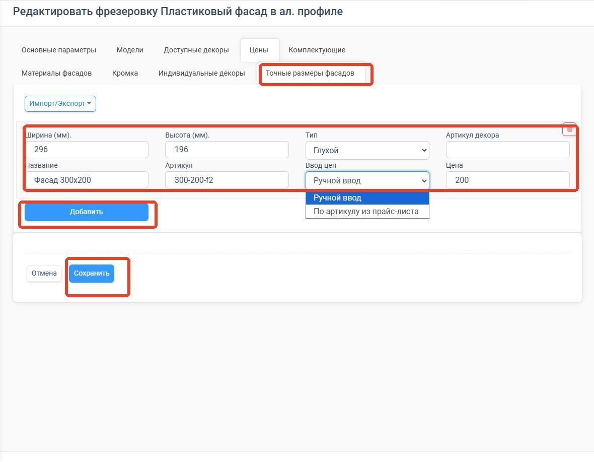

import Carousel from '../../components/Carousel.astro';
import img2 from '../../assets/fasady/02.jpg';
import img3 from '../../assets/fasady/03.jpg';

Мебельный фасад — это лицевая, видимая часть мебели: дверцы шкафов, кухонных модулей, ящиков
и декоративные панели. Фасады формируют визуальный образ гарнитура и часто составляют до
60–70% от итоговой стоимости изделия, занимая при этом лишь ~25% площади материалов.

## Почему в одном материале разные фрезеровки имеют разную цену

1. **Сложность обработки.** Простая плоская заготовка фрезеруется за минуты, а рельефный
   рисунок с филёнками или 3D-профилем требует больше времени станка с ЧПУ, частой смены
   инструмента и точной настройки.
2. **Расход материала и отходы.** Глубокая или фигурная фрезеровка увеличивает площадь
   обработки и объём снимаемой стружки.
3. **Последующая отделка.** Сложный рельеф труднее шлифовать, а при облицовке плёнкой ПВХ
   требуются более эластичные и дорогие плёнки.
4. **Технологические ограничения.** Некоторые виды фрезеровки повышают риск брака при
   вакуумном прессовании, что закладывается в цену как производственный риск.

## Настройка цен на фасады

Цены редактируются внутри конкретных фрезеровок:

1. Перейдите в раздел **«Фасады» → «Модели фрезеровок»**.
2. В списке найдите нужную модель.
3. Нажмите на иконку редактирования (карандаш) в колонке «Действия».

## Варианты настройки цен

Система поддерживает **три основных способа** ценообразования, которые можно комбинировать.

<Carousel images={[{src: img2, alt: "Варианты настройки цен"}, {src: img3, alt: "Варианты настройки цен"}]} />

### Способ 1. Цена по категории материала (за м²)

**Назначение:** единая цена для всей категории материалов.

1. В редакторе фрезеровки перейдите на вкладку **«Цены»**.
2. Выберите тип расчёта **«М2»** (цена за квадратный метр).
3. В таблице укажите цены для каждой категории материалов:
   - **Глухой** — цена для глухих фасадов.
   - **Витрина** — цена для остеклённых фасадов.
   - Другие типы в зависимости от доступных моделей.

Категории настраиваются индивидуально для каждой фрезеровки на вкладке **«Доступные
декоры»**, так как не к каждой фрезеровке применимы любые декоры.

**Преимущества:** быстрая настройка, удобно для стандартных категорий.
**Особенности:** цена применяется ко всем декорам категории.

### Способ 2. Индивидуальные декоры

**Назначение:** специальная цена для конкретного декора, даже если уже задана цена за
категорию. Нужно, когда внутри категории есть особые декоры дороже среднего.

1. В редакторе фрезеровки перейдите на вкладку **«Индивидуальные декоры»**.
2. В поле **«Артикул декора»** укажите артикул нужного декора (его можно найти в разделе
   «Декоры» → «Список декоров»).
3. Укажите цены для всех моделей фрезеровки (Глухой, р/м²; Витрина, р/м²).
4. Нажмите **«Добавить»**, затем **«Сохранить»**.

**Преимущества:** точечная настройка для премиальных или акционных декоров.
**Особенности:** применяется только к указанному артикулу.

### Способ 3. Цена по точным размерам фасада

**Назначение:** фиксированная цена для фасадов конкретных размеров. Подходит для модульных
кухонь, где все размеры заранее известны.

1. В редакторе фрезеровки перейдите на вкладку **«Точные размеры фасадов»**.
2. Заполните поля:
   - **Ширина (мм)** и **Высота (мм)**.
   - **Тип** — Глухой / Витрина / Решётка.
   - **Артикул декора** — опционально. Если не указан, цена применяется ко всем декорам
     модели с совпадающим размером.
   - **Название** и **Артикул** позиции.
   - **Ввод цен** — ручной ввод или по артикулу из прайс-листа.
   - **Цена**.
3. Нажмите **«Добавить»**, затем **«Сохранить»**.

**Важно: учёт припуска фасадов.** При указании точных размеров необходимо учитывать
припуск, установленный по умолчанию:

- Стандартный припуск: **4 мм** (по 2 мм с каждой стороны); меняется в глобальных переменных
  или конкретном дверном модуле.
- Размер указывается с учётом припуска.

**Пример:** для фасада на проём 300×200 мм нужно указать **296×196 мм** (300−4 и 200−4).

**Преимущества:** максимальная точность ценообразования.
**Особенности:** требует точного знания размеров и учёта припуска (для повторяющихся рядов
удобно использовать импорт/экспорт через Excel).

## Рекомендации по комбинированию

- **Вариант A (простой):** только цена по категории материала (м²) — для стандартного
  ассортимента.
- **Вариант B (средний):** цена по категории + индивидуальные декоры.
- **Вариант C (продвинутый):** цена по точным размерам с указанием конкретных декоров.

### Важные замечания

1. **Не рекомендуется использовать все три способа одновременно** — это усложняет
   диагностику, если один и тот же декор задействован сразу в трёх способах.
2. **Приоритет цен** (система применяет в этом порядке):
   - Точные размеры.
   - Индивидуальные декоры (наивысший приоритет среди декоров).
   - Категория материала (базовый уровень).

После настройки проверяйте итоговые расчёты на тестовых проектах: создайте проект с
фасадами, проверьте отображение цен в спецификации, сформируйте PDF и при необходимости
скорректируйте цены.
