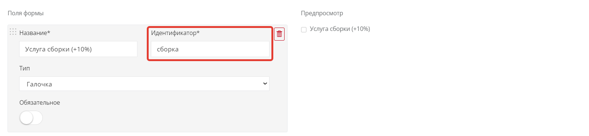
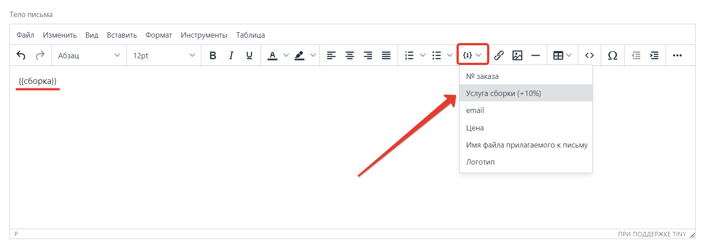
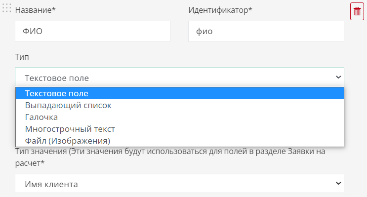
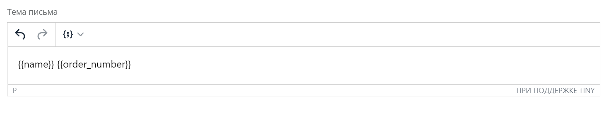

Когда клиент отправляет проект на расчёт, происходят три вещи: он заполняет **форму заявки**, вам приходит **письмо дизайнеру** (на ваши почты), а клиенту уходит **письмо клиенту**. Все три элемента можно настроить под себя. В этой статье разберём, как это сделать правильно и в правильном порядке.

> **Главное правило порядка.** Сначала настройте **форму заявки** (какие поля заполняет клиент), и только потом — шаблоны писем. Потому что в письмах используются значения из полей формы. Если сделать наоборот, нужных тегов в письмах просто не будет.

## Форма заявки на расчёт

Стандартная форма содержит четыре поля: **Имя**, **Email**, **Телефон** (обязательные) и **Комментарии** (необязательное).

Чтобы изменить набор полей, включите переключатель **«Использовать свою форму заказа»**. После этого вы сами задаёте, какие поля увидит клиент.

<Carousel>

</Carousel>

**Обязательные условия своей формы:**

- поле **email** должно присутствовать всегда;
- галочка согласия на обработку персональных данных добавляется автоматически.

### Параметры каждого поля

- **Идентификатор** — автоматически создаётся тег, который вы потом вставите в письма (например, для города или адреса доставки).
- **Тип поля** — определяет, как клиент вводит данные:
  - *однострочное текстовое поле* — для имени, email, телефона, города;
  - *выпадающий список* — клиент выбирает одно значение из списка (например, город);
  - *галочка* — подтверждение услуги (например, «нужен замер»);
  - *многострочный текст* — для комментариев, адреса;
  - *поле для файлов* — прикрепление изображений к заявке. Можно несколько файлов, общий размер — не более 5 МБ.
- **Обязательное** — если включено, клиент не сможет отправить заявку, пока не заполнит это поле.
- **Тип значения** — указывает системе, как поле попадёт в таблицу [«Заявки на расчёт»](/Tilda-PlanPlace/zayavki-na-raschet/). Создаёте поле под имя — выбирайте «Имя клиента», под почту — «email».

<Carousel>

</Carousel>

### Проверка обязательных полей

Система проверяет корректность заполнения:

- текстовое и многострочное поле — должен быть хотя бы один символ;
- email — должен быть корректным адресом;
- телефон — только цифры, пробелы, скобки и дефисы, минимум 5 цифр;
- выпадающий список — должно быть выбрано значение, отличное от стоящего по умолчанию;
- галочка — должна быть включена.

### Порядок и предпросмотр

Поля можно менять местами простым перетаскиванием за специальный значок. Блок **«Предпросмотр»** сразу показывает, как форма выглядит для клиента на текущем этапе настройки.

<Carousel>

</Carousel>

## Письмо дизайнеру (вам)

Это письмо приходит на адреса, указанные в [Email для заявок](/Tilda-PlanPlace/kod-konstruktora-i-osnovnye-parametry/). По умолчанию оно содержит стандартную информацию о заказе. Чтобы изменить его, включите параметр **«Использовать свой шаблон»**.

**Как вставлять данные клиента в письмо.** На панели инструментов есть кнопка добавления тегов. Выбираете значение из списка — и в текст вставляется тег в двойных фигурных скобках. Например, выбрав «№ заказа», вы получите тег `{{order_number}}` — на его месте подставится реальный номер заказа.

Теги можно:

- **совмещать между собой** в любой последовательности;
- **дополнять своим текстом** — писать обычные фразы вокруг тегов.

<Carousel>

</Carousel>

В блоке **«Тело письма»** доступен расширенный список тегов. Также можно настроить, **какие файлы вложить в письмо** (например, файл проекта и PDF-спецификацию).

<Carousel>

</Carousel>

## Письмо клиенту

По умолчанию клиент получает стандартное письмо-подтверждение. Чтобы изменить его, включите **«Использовать свой шаблон»** на вкладке «Письмо клиенту». Принцип тот же: в теме и теле письма комбинируете теги, свой текст, картинки и ссылки, а в конце выбираете, какие файлы приложить.

<Carousel>

</Carousel>

## Частые вопросы и подсказки

> **Не вижу свои поля в списке тегов.** Убедитесь, что переключатель **«Использовать свою форму заказа»** включён. Без него собственные поля не появятся в выпадающем списке тегов писем.

> **Сделали свою форму — обязательно сделайте и письма.** Если вы используете свою форму заявки, нужно создать собственные шаблоны писем и для дизайнера, и для клиента. Иначе данные из новых полей не попадут в письма.

## Коротко

Настройка идёт в три шага и в строгом порядке: **форма заявки → письмо дизайнеру → письмо клиенту**. Сначала вы решаете, что заполняет клиент, затем — что и в каком виде приходит вам и ему. Сами заявки потом собираются в разделе [«Заявки на расчёт»](/Tilda-PlanPlace/zayavki-na-raschet/).

