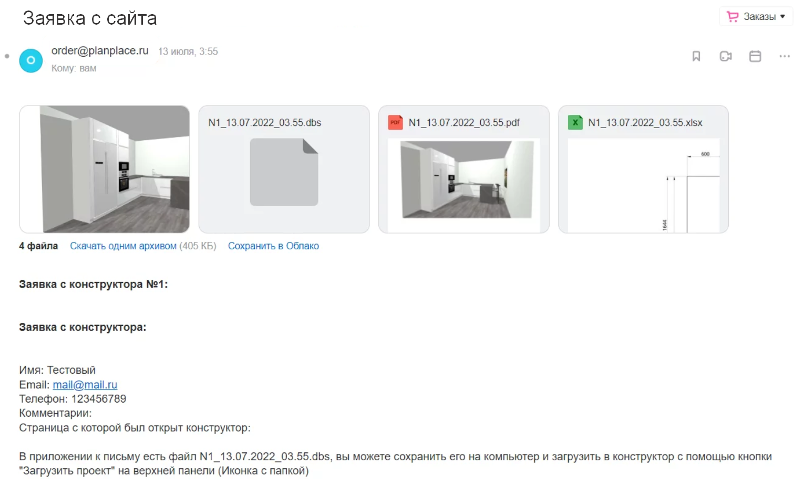
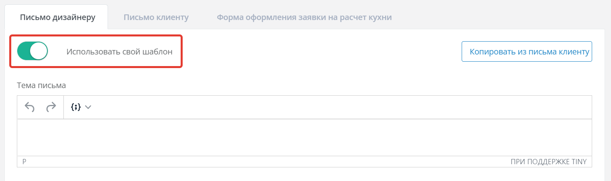
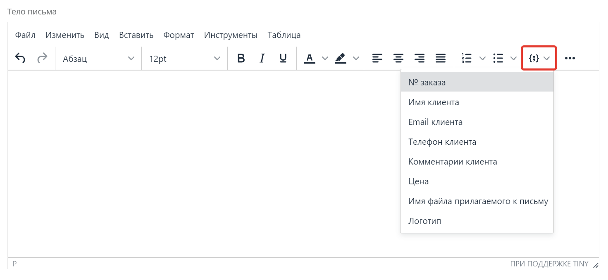
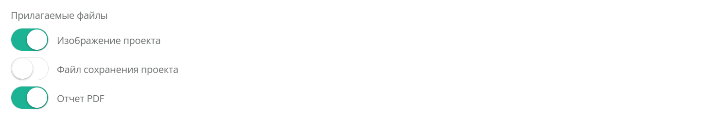
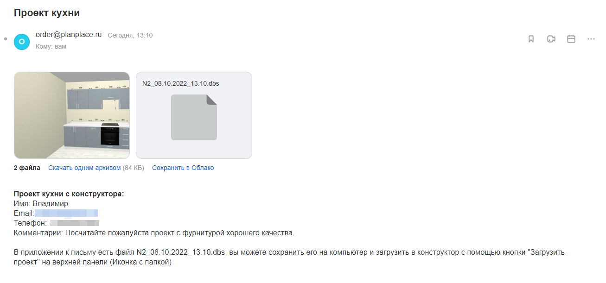
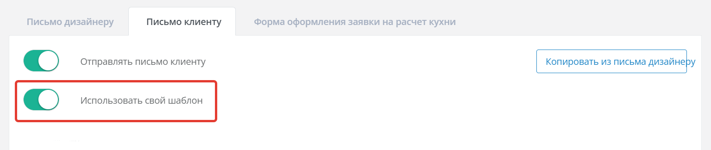
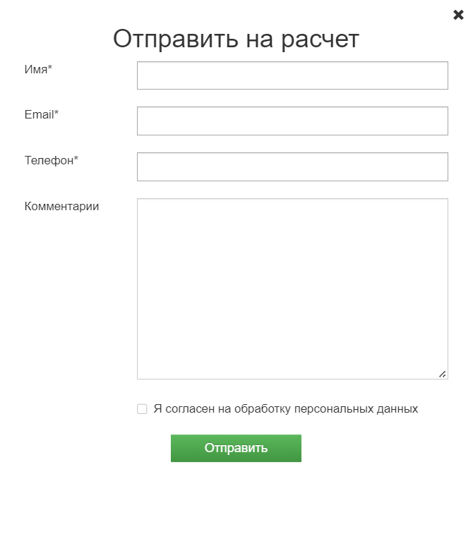
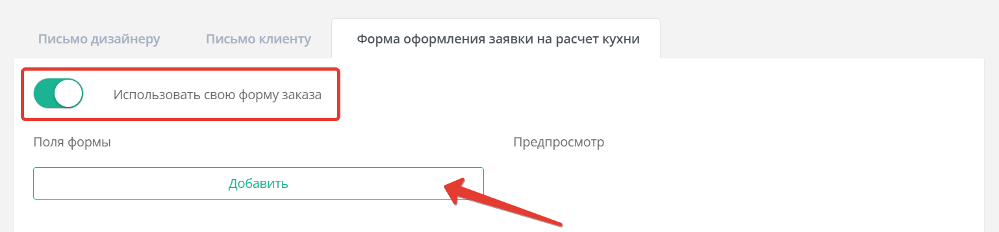

import Carousel from '../../components/Carousel.astro';
import img3 from '../../assets/forma_i_pisma/03.png';
import img4 from '../../assets/forma_i_pisma/04.png';
import img5 from '../../assets/forma_i_pisma/05.png';
import img15 from '../../assets/forma_i_pisma/15.png';
import img16 from '../../assets/forma_i_pisma/16.png';
import img17 from '../../assets/forma_i_pisma/17.png';
import img18 from '../../assets/forma_i_pisma/18.png';
import img19 from '../../assets/forma_i_pisma/19.png';
import img20 from '../../assets/forma_i_pisma/20.png';
import img21 from '../../assets/forma_i_pisma/21.png';
import img23 from '../../assets/forma_i_pisma/23.png';
import img24 from '../../assets/forma_i_pisma/24.png';

## Письмо дизайнеру

Этот раздел позволяет настроить шаблон письма, отправляемого на адреса дизайнеров,
указанные в настройках аккаунта. По умолчанию система отправляет информацию в стандартном
формате.

Чтобы настроить письмо, включите опцию **«Использовать свой шаблон»**. Значения из заявки
клиента подставляются с помощью кнопок на панели инструментов — они генерируют теги в
двойных фигурных скобках. Например, `{{order_number}}` выводит присвоенный номер заказа.

В разделе «Тело письма» доступен расширенный набор тегов, которые можно комбинировать с
произвольным текстом. Также можно настроить, какие файлы-вложения включать в письмо.

**Важно:** сначала настройте поля формы на вкладке «Форма заявки», и только потом
создавайте собственные шаблоны писем.

<Carousel images={[{src: img3, alt: "Письмо дизайнеру"}, {src: img4, alt: "Письмо дизайнеру"}, {src: img5, alt: "Письмо дизайнеру"}]} />

## Письмо клиенту

По умолчанию клиент получает письмо со стандартной информацией. Чтобы изменить его,
включите опцию собственного шаблона на вкладке «Письмо клиенту».

Шаблон создаётся так же, как и шаблон для дизайнера: комбинируйте выбранные теги с
произвольным текстом в теме и теле письма. Интерфейс поддерживает добавление текста,
тегов, изображений, ссылок и других элементов. Настройте вложения по необходимости.

## Форма оформления заявки на расчёт

Стандартная форма содержит три обязательных поля (Имя, Email, Телефон) и одно
необязательное (Комментарий).

При использовании собственной формы поле email становится обязательным. Включите опцию
**«Использовать свою форму заказа»**, чтобы настроить поля.

**Доступные типы полей:**

- однострочное текстовое поле;
- выпадающий список;
- чекбокс;
- многострочное текстовое поле;
- вложение файла (только изображения; максимум 5 МБ суммарно).

Каждое пользовательское поле автоматически генерирует уникальный тег-идентификатор для
использования в шаблонах писем. Отметьте поля как обязательные, если клиент должен
заполнить их до отправки. Предпросмотрите форму в соответствующем разделе перед
включением собственной формы.

После добавления всех полей убедитесь, что созданы шаблоны писем и для дизайнера, и для
клиента.

<Carousel images={[{src: img15, alt: "Форма оформления заявки на расчет"}, {src: img16, alt: "Форма оформления заявки на расчет"}]} />

<Carousel images={[{src: img17, alt: "Форма оформления заявки на расчет"}, {src: img18, alt: "Форма оформления заявки на расчет"}, {src: img19, alt: "Форма оформления заявки на расчет"}, {src: img20, alt: "Форма оформления заявки на расчет"}, {src: img21, alt: "Форма оформления заявки на расчет"}]} />

<Carousel images={[{src: img23, alt: "Форма оформления заявки на расчет"}, {src: img24, alt: "Форма оформления заявки на расчет"}]} />

