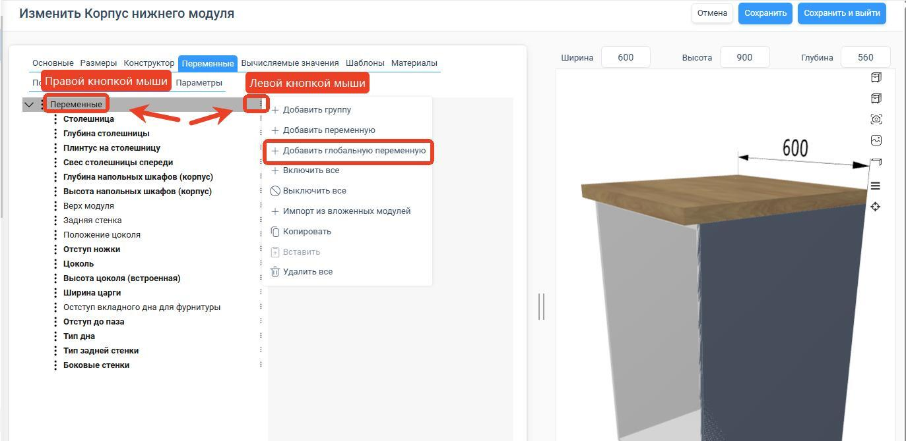
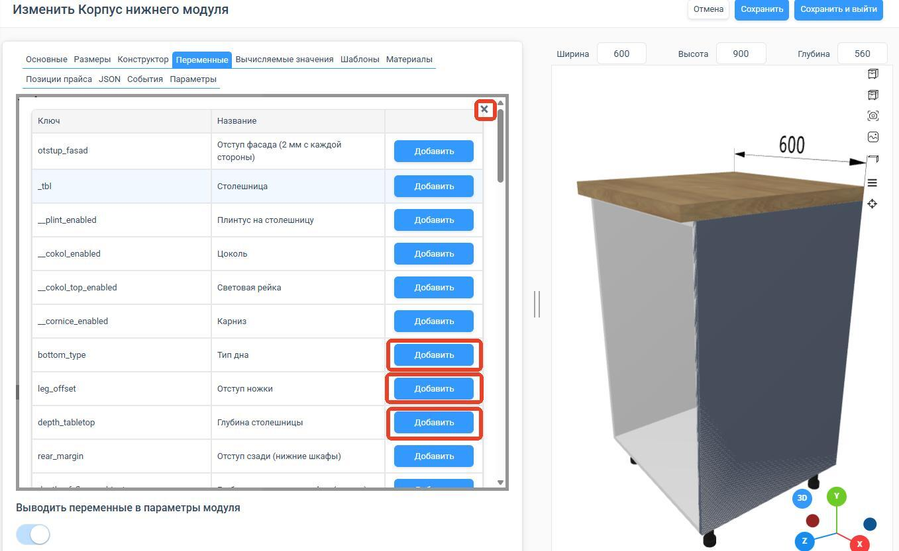
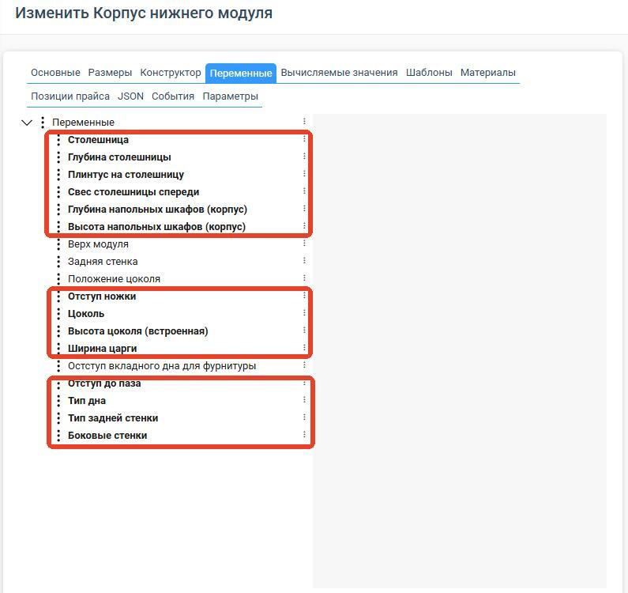
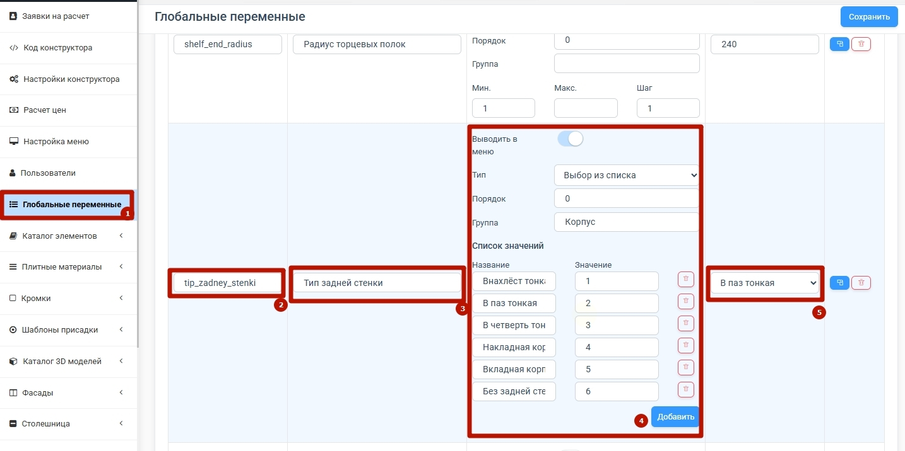
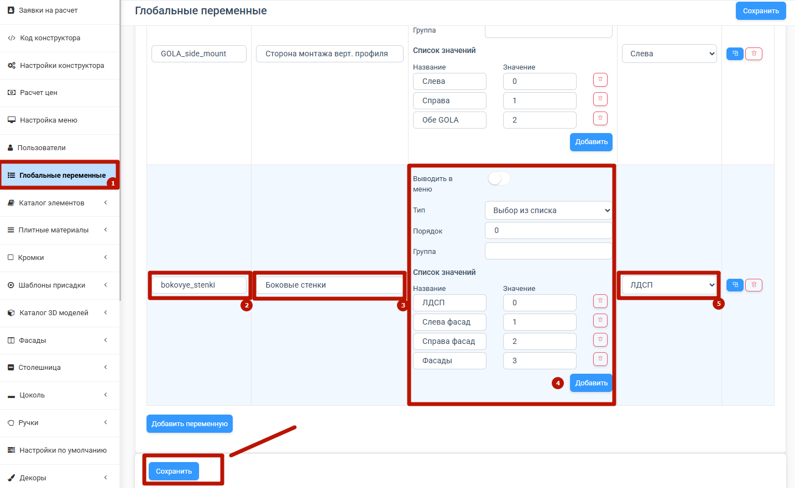

Глобальные переменные — один из самых мощных инструментов PlanPlace. Они позволяют управлять поведением сразу всех модулей из одного места, без программирования. Изменили одно значение — и обновились все элементы, которые его используют. В этой статье разберём, что это такое и как с ними работать.

## Что такое переменная простыми словами

Переменная — это «настройка», которую задаёт технолог. Она не является встроенным свойством материала или фасада, а создаётся вручную, чтобы управлять конструкцией.

Пример: вы создаёте переменную «Высота парящих баз» со значением 100 мм. Все модули, которые её используют, встанут на высоту 100 мм. Захотели поднять все парящие базы до 120 мм — поменяли одно число, и вся база обновилась автоматически. Без переменной пришлось бы открывать каждый модуль вручную.

## Глобальные и локальные переменные

- **Глобальная переменная** живёт в разделе «Глобальные переменные» и действует **на весь каталог**. Меняете значение — меняется везде.
- **Локальная переменная** существует **только внутри одного модуля**. Нужна, когда настройка касается лишь конкретного изделия. Локальные переменные настраиваются в [конфигураторе элемента](/Tilda-PlanPlace/peremennye-modulya/).

## Типы переменных

Переменные бывают трёх типов:

1. **Переключатель (Да/Нет)** — логическое значение. Например, «Есть задняя стенка»: да или нет.
2. **Число** — числовой параметр, можно ограничить диапазон. Например, «Высота парящих баз»: минимум 0, максимум 200 мм. Часто задают и шаг изменения.
3. **Выбор из списка** — набор готовых вариантов, и у каждого есть **числовой идентификатор**. Например, «Тип задней стенки»: вариант 0, 1, 2, 3. В формулах используется именно числовое значение варианта — это очень важная деталь (см. [«Математические вычисления»](/Tilda-PlanPlace/matematicheskie-vychisleniya/)).

## Ключ и название — в чём разница

У каждой переменной есть две «надписи», и их нельзя путать:

- **Ключ** — уникальный технический идентификатор. Он используется в коде модулей. **Ключ нельзя менять после создания** — иначе сломается логика во всех модулях, где переменная задействована.
- **Название** — человекочитаемая подпись. Его можно менять в любой момент без последствий.

> **Запомните.** Ключ — навсегда, название — как угодно. Если нужно «переименовать» переменную для понятности, меняйте название, а ключ оставляйте.

## Видимость для пользователя

Переменную можно показать или скрыть для пользователя на сцене. Например, технолог видит и меняет «Тип задней стенки», а дизайнеру эту опцию показывать не нужно — он её не увидит. Так вы даёте дизайнеру ровно те настройки, которые ему положены, и прячете служебные.

## Где применяются переменные

Через переменные удобно управлять:

- размерами и отступами;
- видимостью секций и деталей;
- наличием опций (есть/нет цоколь, задняя стенка, парящая база);
- глубиной профиля, типом задней стенки и т. п.;
- доступностью настроек в интерфейсе дизайнера.

## Главное правило безопасности

> **Не удаляйте существующие переменные.** Удаление переменной может привести к потере настроек и ошибкам в базе — ведь на неё могут ссылаться формулы и условия в десятках модулей. Если переменная больше не нужна, лучше скройте её или перестаньте использовать, но не удаляйте.

## Переопределение переменных

Значения переменных можно переопределять для вложенных модулей и элементов — настройки распространяются каскадно, сверху вниз. Это позволяет, например, задать всем вложенным ящикам одно поведение из родительского модуля. Подробнее эта механика разобрана в статье [«Переменные модуля»](/Tilda-PlanPlace/peremennye-modulya/).

<Carousel>

</Carousel>

<Carousel>

</Carousel>

<Carousel>

</Carousel>

## Коротко

Глобальная переменная — это управляемая настройка, которая централизованно меняет поведение всех модулей. Бывает трёх типов: переключатель, число и список (у списка есть числовые значения для формул). Ключ переменной менять нельзя, название — можно. Переменные можно скрывать от дизайнера и нельзя бездумно удалять. Это главный инструмент гибкости каталога без программирования.

