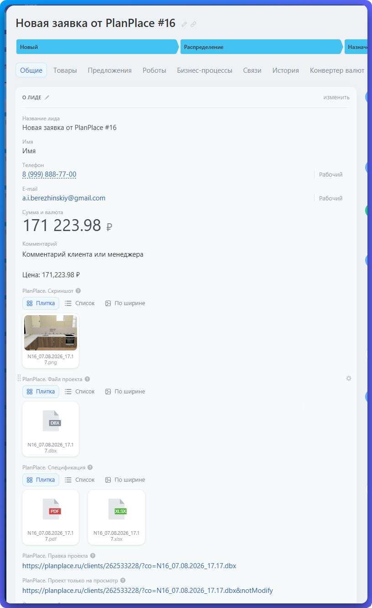
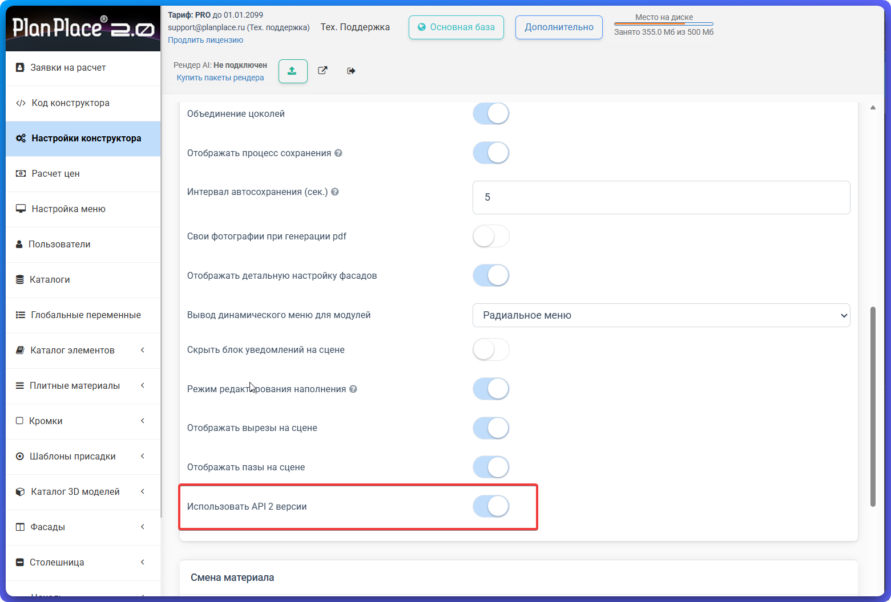
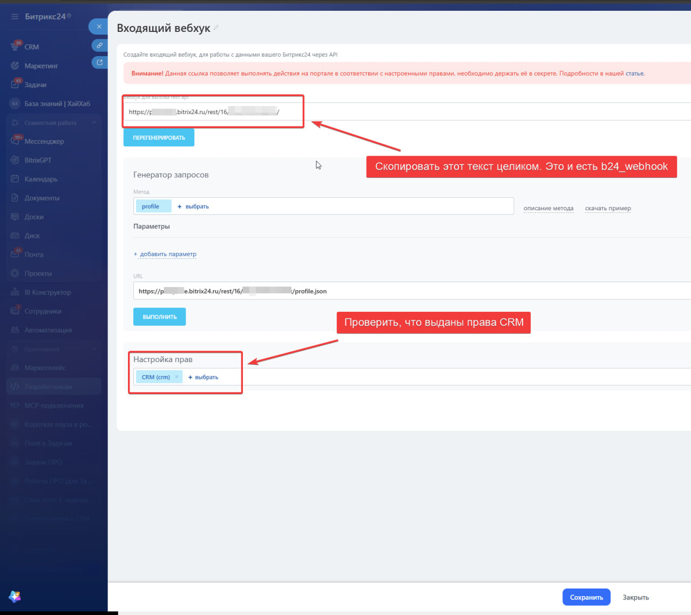
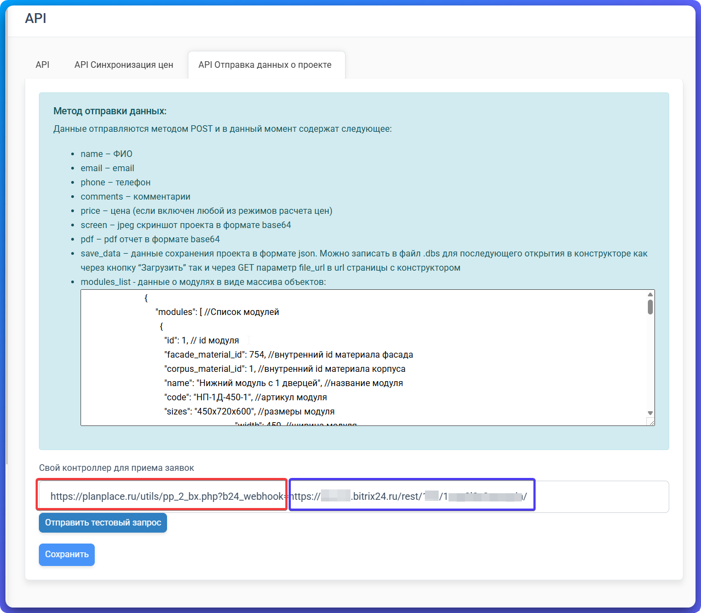

Интеграция автоматически создаёт в Битрикс24 новый лид, когда клиент отправляет заявку из PlanPlace. В лид попадают контакты клиента, стоимость, комментарий, изображение проекта, файлы спецификации, файл проекта и ссылки для его открытия.

> **Важно.** Каждая отправка заявки создаёт **новый лид**. Если проект исправили и отправили ещё раз, интеграция не обновит прежний лид, а создаст следующий.

## Как работает передача

Данные идут только в одном направлении: **из PlanPlace в Битрикс24**. Битрикс24 не изменяет заявку или проект в PlanPlace.

| Что отправляет PlanPlace | Формат | Куда попадает в Битрикс24 | Направление |
|---|---|---|---|
| Номер заявки | число | название лида: «Новая заявка от PlanPlace #16» | PlanPlace → Битрикс24 |
| Имя клиента | текст | поле «Имя» | PlanPlace → Битрикс24 |
| Телефон | текст | поле «Телефон» | PlanPlace → Битрикс24 |
| Электронная почта | текст | поле «E-mail» | PlanPlace → Битрикс24 |
| Комментарий | текст | поле «Комментарий» | PlanPlace → Битрикс24 |
| Стоимость проекта | число, рубли | поле «Сумма и валюта»; исходная запись цены также добавляется в комментарий | PlanPlace → Битрикс24 |
| Скриншот проекта | файл PNG | «PlanPlace. Скриншот» | PlanPlace → Битрикс24 |
| Файл проекта | файл DBX | «PlanPlace. Файл проекта» | PlanPlace → Битрикс24 |
| Спецификация | файлы PDF и XLSX | «PlanPlace. Спецификация» | PlanPlace → Битрикс24 |
| Ссылка на редактирование проекта | ссылка | «PlanPlace. Правка проекта» | PlanPlace → Битрикс24 |
| Ссылка на просмотр проекта | ссылка | «PlanPlace. Проект только на просмотр» | создаётся обработчиком на основе ссылки PlanPlace и записывается в Битрикс24 |
| Состав модулей, если он передан | структурированный список | добавляется в комментарий лида | PlanPlace → Битрикс24 |

Для ссылки только на просмотр обработчик автоматически добавляет к адресу проекта параметр `notModify`. Пользователю не нужно составлять эту ссылку вручную.

Служебные данные, например имя файла проекта и отметка о принятии условий формы, могут участвовать в отправке, но отдельные поля в карточке лида для них не создаются.



## Какие поля использует Битрикс24

Обычные поля уже есть в Битрикс24, поэтому интеграция только заполняет их.

| Поле Битрикс24 | Что записывается |
|---|---|
| Название лида | «Новая заявка от PlanPlace» и номер заявки |
| Имя | имя клиента |
| Телефон | телефон клиента |
| E-mail | электронная почта клиента |
| Комментарий | комментарий, исходная запись цены и состав модулей |
| Сумма и валюта | стоимость проекта в рублях |

При отправке первой заявки интеграция проверит специальные поля PlanPlace. Если какого-то поля нет, она попробует создать его автоматически.

| Название поля | Код поля | Тип | Заполнение |
|---|---|---|---|
| PlanPlace. Скриншот | `UF_CRM_PP_SCREEN` | файл | множественное |
| PlanPlace. Файл проекта | `UF_CRM_PP_JSON` | файл | множественное |
| PlanPlace. Спецификация | `UF_CRM_PP_PDF` | файл | множественное; сюда попадают PDF и XLSX |
| PlanPlace. Правка проекта | `UF_CRM_PP_PROJECTEDIT` | ссылка | одиночное |
| PlanPlace. Проект только на просмотр | `UF_CRM_PP_PROJECTVIEW` | ссылка | одиночное |

Если Битрикс24 не разрешит создать одно из специальных полей, интеграция всё равно постарается создать лид с обычными данными. Файл или ссылка, для которых нет доступного поля, в такой лид не попадут.

## Что подготовить

Перед настройкой проверьте два условия:

- в Битрикс24 включён режим CRM с лидами;
- у вас есть доступ к разделу создания входящих вебхуков.

Возможность использовать вебхуки зависит от тарифа и подписки Битрикс24. Если нужного раздела нет, уточните условия своего тарифа у Битрикс24.

## Шаг 1. Включите API v2 в PlanPlace

1. Откройте личный кабинет PlanPlace.
2. Перейдите в **Настройки конструктора**.
3. Включите переключатель **Использовать API 2 версии**.
4. Сохраните настройки.



## Шаг 2. Создайте входящий вебхук в Битрикс24

Вебхук — это персональная защищённая ссылка, по которой PlanPlace получает право создать лид в вашем Битрикс24.

1. В Битрикс24 откройте раздел **Разработчикам**.
2. Выберите создание **входящего вебхука**.
3. В настройке прав добавьте **CRM (crm)**.
4. Нажмите **Сохранить**.
5. Скопируйте целиком адрес из поля **Вебхук для вызова REST API**. Он имеет вид `https://ваш-портал.bitrix24.ru/rest/16/секретный-код/`.

Подробный путь и пояснения есть в официальной статье Битрикс24: [«Разработчикам: как создать вебхуки и приложения для Битрикс24»](https://helpdesk.bitrix24.ru/open/20886106/).



> **Не публикуйте адрес вебхука.** В нём находится секретный код доступа к вашему Битрикс24. Если адрес случайно попал посторонним, перегенерируйте вебхук и замените адрес в PlanPlace.

## Шаг 3. Укажите адрес обработчика в PlanPlace

1. В личном кабинете PlanPlace откройте раздел **API**.
2. Перейдите на вкладку **API Отправка данных о проекте**.
3. В поле **Свой контроллер для приёма заявок** вставьте одну строку без пробелов:

```text
https://planplace.ru/utils/pp_2_bx.php?b24_webhook=ВАШ_ВЕБХУК_БИТРИКС24
```

Например:

```text
https://planplace.ru/utils/pp_2_bx.php?b24_webhook=https://company.bitrix24.ru/rest/16/secret-code/
```

Красной рамкой на скриншоте отмечена постоянная часть адреса PlanPlace, синей — полный адрес вебхука, который вы скопировали из Битрикс24. Между ними не нужны пробел, запятая или дополнительные символы.

4. Нажмите **Сохранить**.



## Шаг 4. Отправьте первую заявку

Для первой проверки отправьте обычную заявку с тестовым проектом из конструктора. Первая отправка особенно важна: в этот момент интеграция проверяет и при необходимости создаёт специальные поля PlanPlace в Битрикс24.

После отправки откройте раздел лидов в Битрикс24 и проверьте:

- появился новый лид с номером заявки;
- записались имя, телефон, e-mail, комментарий и сумма;
- приложены PNG, DBX, PDF и XLSX;
- ссылки на редактирование и просмотр проекта открываются.

## Какие права нужны

**Во время отправки первой заявки** владелец вебхука должен быть администратором CRM. Это нужно, чтобы интеграция могла создать отсутствующие специальные поля.

**После успешной первой заявки** права можно уменьшить до работы с лидами: пользователю, которому принадлежит вебхук, должно быть разрешено создавать лиды и обращаться к полям CRM. Право **CRM (crm)** в настройках самого вебхука оставьте включённым.

Если после уменьшения прав лиды создаются, но файлы или ссылки перестали появляться, верните владельцу вебхука доступ к полям и настройкам CRM.

## Если заявка не появилась

Проверьте по порядку:

1. включён ли переключатель **Использовать API 2 версии**;
2. сохранён ли адрес обработчика в разделе API PlanPlace;
3. нет ли пробела или запятой между постоянной частью адреса и вебхуком;
4. скопирован ли вебхук полностью, включая завершающий `/`;
5. есть ли у вебхука право **CRM (crm)**;
6. разрешено ли владельцу вебхука создавать лиды;
7. включён ли в Битрикс24 режим CRM с лидами.

Если вебхук был перегенерирован в Битрикс24, старый адрес перестаёт работать. В этом случае скопируйте новый адрес и заново сохраните полную строку в PlanPlace.
