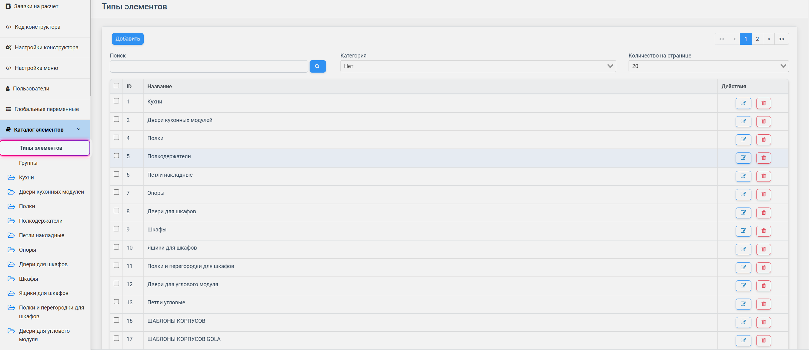
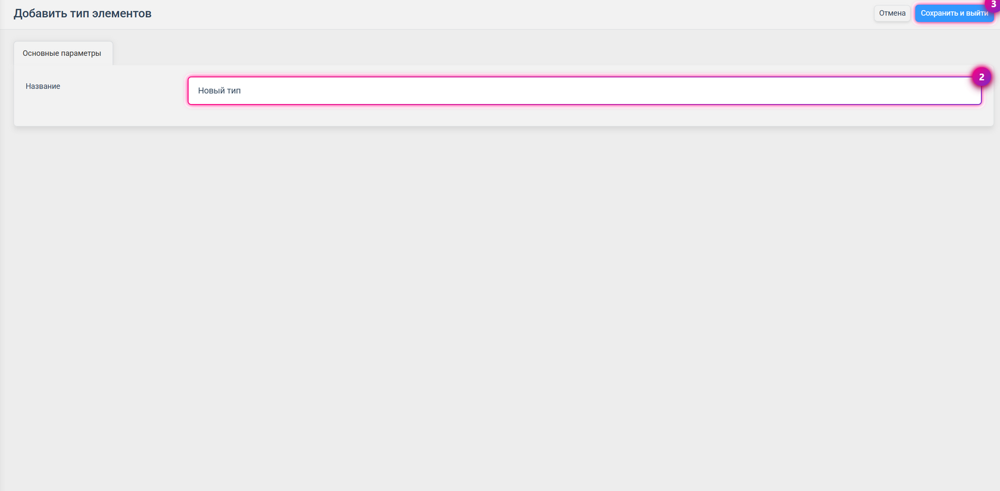

Каталог элементов — это центральный раздел конфигуратора, его фундамент. Здесь хранятся и организуются все элементы, из которых собирается мебель: от готовых шкафов до отдельных петель и полок. Правильно выстроенный каталог — половина успеха, поэтому продумайте его структуру заранее. В этой статье разберём, как он устроен.

## Что такое «элемент»

Элемент в PlanPlace — это любой компонент каталога. Им может быть:

- **готовое изделие** — шкаф, тумба, кухонный модуль;
- **составной фрагмент** — ящик, фасад;
- **мелкий компонент** — петля, опора, полкодержатель, сушка.

Элементы работают по принципу «матрёшки»: модуль содержит корпуса, корпус — детали, деталь — присадки. Один и тот же элемент (например, петлю) можно переиспользовать во множестве модулей.

> **Важно.** Элементы хранятся внутри платформы и не скачиваются отдельными файлами. Перемещение элементов между папками ограничено, поэтому **сразу классифицируйте компоненты правильно** — переложить потом будет сложнее.

## Два подраздела: «Типы элементов» и «Группы»

Раздел «Каталог элементов» состоит из двух частей с разным назначением.

**Типы элементов** — папки, в которых лежат взаимозаменяемые элементы одного вида.

**Группы** — объединения для массового управления параметрами модулей прямо на сцене.

Разберём каждую часть подробнее.

## Типы элементов

Главный принцип: **все элементы, которые могут заменять друг друга на сцене, должны лежать в одном типе.**

Пример: если у вас есть сушки для посуды от разных производителей и вы хотите, чтобы дизайнер мог менять одну на другую внутри модуля, создайте тип «Сушки» и положите их все туда. То же — с ножками, ящиками, петлями.

Внутри типа можно создавать **подкатегории и папки** для удобной навигации: например, внутри «Сушек» — отдельно для верхних и для нижних модулей, или по производителям.

### Как создать тип

1. Перейдите в подраздел **«Типы элементов»** и нажмите **«Добавить»**.
2. Заполните поле **«Название»** — понятное и описательное.
3. Нажмите **«Сохранить и выйти»** в правом верхнем углу.

После этого в левом меню появится новый раздел с названием типа. По клику на него открывается список всех взаимозаменяемых элементов.

<Carousel>

</Carousel>

### Как создать категории внутри типа

Категории помогают навигации, когда вариантов много. Создать их можно двумя способами:

- **Способ 1.** Нажать иконку **синей папки** рядом с названием типа.
- **Способ 2.** В списке элементов нажать кнопку **«Категории»** вверху интерфейса.

<Carousel>

</Carousel>

> **Категории — по необходимости.** Если у элемента всего один вариант (например, одна полка из ЛДСП), категорию можно не создавать — просто добавьте элемент в список и настройте напрямую.

## Группы элементов

Группы нужны для **быстрого массового изменения параметров** у целого ряда модулей прямо на сцене.

Классический пример — разная цветовая палитра. Допустим, у антресолей доступно только два цвета корпуса, а у остальных модулей — больше. Для этого создаётся отдельная группа, которая затем назначается нужным модулям.

По умолчанию в системе уже есть три группы: **«Нижние модули»**, **«Верхние модули»** и **«Антресоли»**. В настройках каждого модуля указывается, к какой группе он относится. Можно добавлять и свои группы.

### Как это работает на сцене

Если нескольким модулям присвоена группа «Антресоли», на сцене появляется возможность менять параметры **только для них**:

- **Сменить цвет.** Выберите цвет корпуса и нажмите **«Применить к антресолям»** — конструктор сам найдёт все модули этой группы и перекрасит именно их.
- **Сменить фасады.** В разделе фасадов выберите нужную фрезеровку (например, рифлёные фасады) и нажмите **«Выбрать для антресолей»** — рисунок применится ко всем модулям группы.

Модули реагируют на групповые изменения только если группа назначена им в настройках при создании.

<Carousel>

</Carousel>

## Рекомендации по организации каталога

- **Планируйте структуру заранее.** До создания элементов продумайте, какие типы понадобятся и что с чем взаимозаменяется. Хорошая структура экономит массу времени потом.
- **Используйте понятные названия.** Избегайте сокращений, понятных только вам. С каталогом будут работать и другие.
- **Не плодите лишние типы.** Каждый тип должен объединять действительно взаимозаменяемые элементы. Слишком много типов усложняют навигацию.
- **Не смешивайте разную фурнитуру в одной папке.** Накладные и угловые петли, например, держите отдельно.
- **Не удаляйте используемые типы.** Если тип задействован в проектах или модулях, его удаление сломает их. Лучше скройте отображение, чем удаляйте.
- **Аккуратно удаляйте модули.** Удаление модуля с ящиками оставит пустоты в конструкциях, где он использовался.

## Связь с конфигуратором

Каждый элемент каталога настраивается в [конфигураторе элемента](/Tilda-PlanPlace/osnovy-konfiguratora/). А переменными, которые управляют поведением элементов сразу по всему каталогу, занимается раздел [«Глобальные переменные»](/Tilda-PlanPlace/globalnye-peremennye/).

## Коротко

Каталог элементов — основа всей базы. «Типы элементов» объединяют взаимозаменяемые компоненты, «Группы» позволяют массово менять параметры модулей на сцене. Продумайте структуру заранее, давайте понятные названия и не удаляйте то, что используется. Дальше каждый элемент настраивается в конфигураторе.

