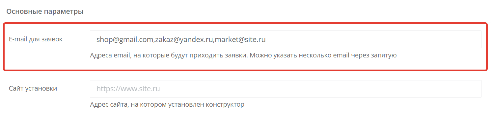
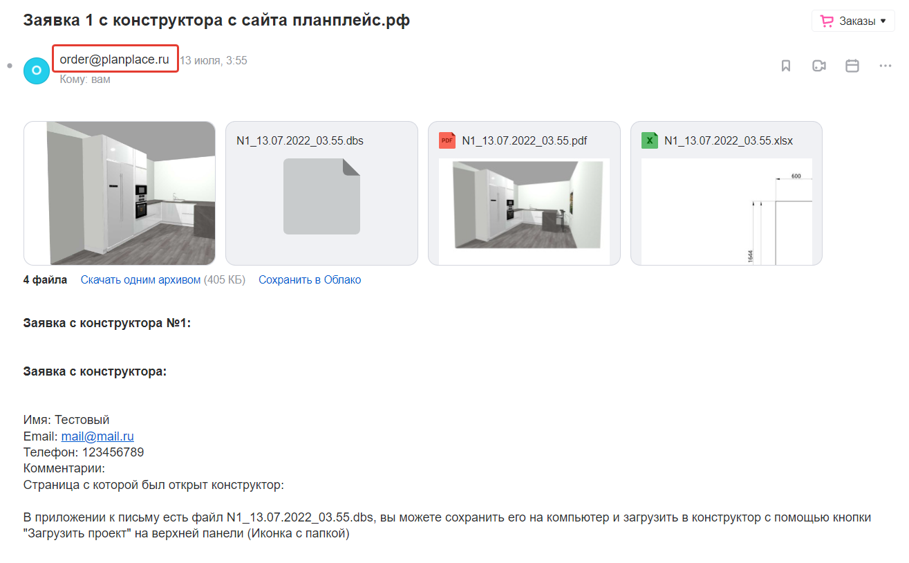
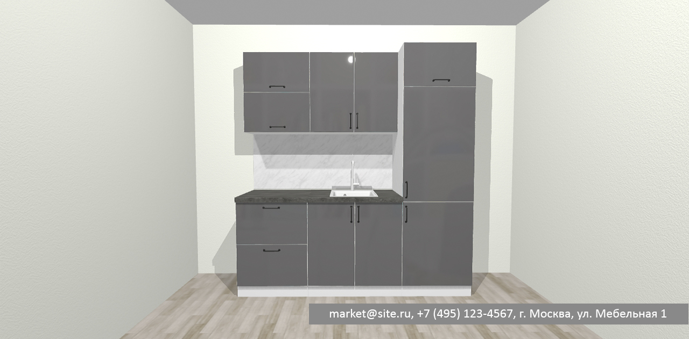
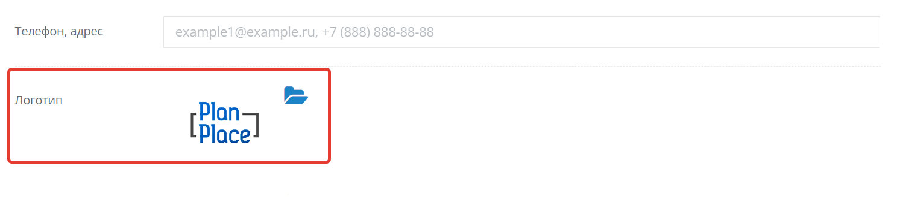
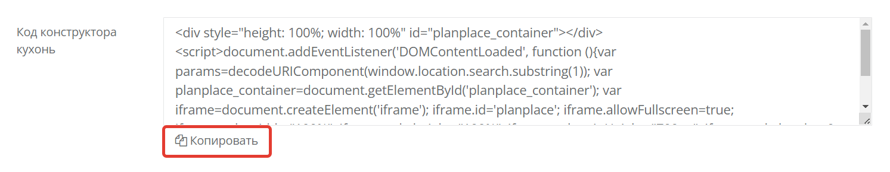
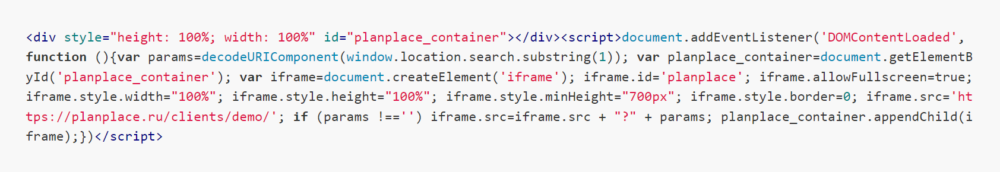
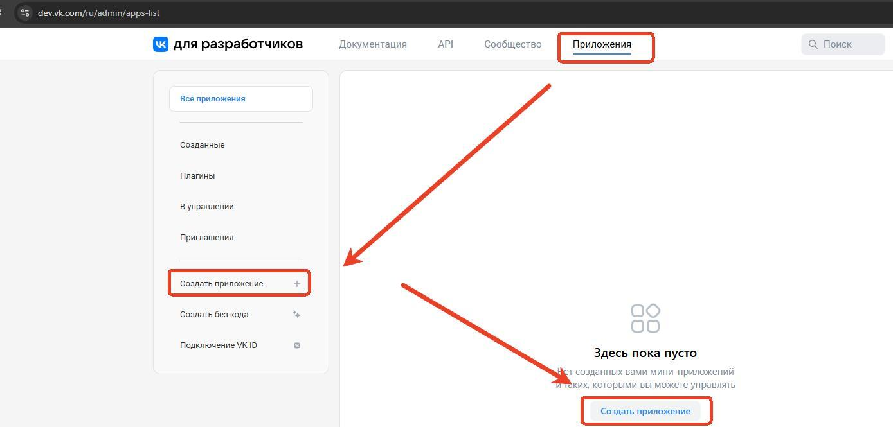
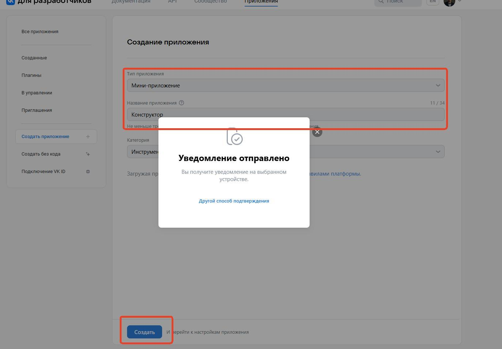
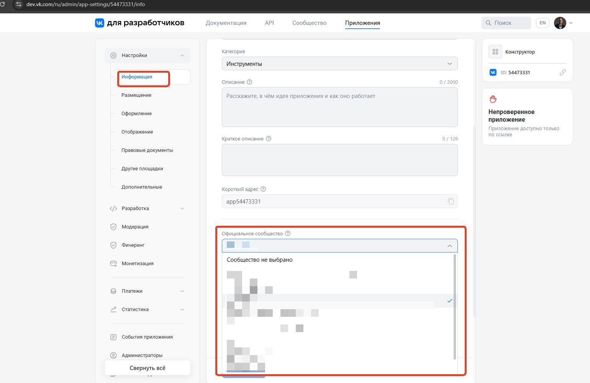
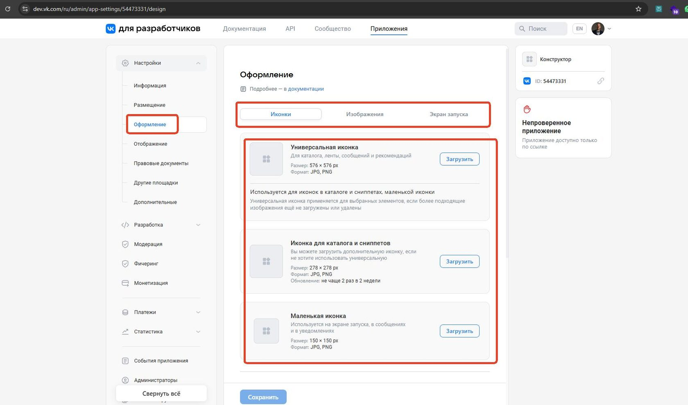

В этом разделе кабинета настраивается «лицо» вашего конструктора: куда приходят заявки, какой логотип и контакты видит клиент, и как встроить планировщик на ваш сайт или в группу ВКонтакте. Это первое, что стоит заполнить после регистрации.

## E-mail для заявок

Впишите в поле адрес электронной почты, на который будут приходить заявки из конструктора. Можно указать несколько адресов через запятую — тогда заявка придёт всем сразу.

> **Важно.** Заявки приходят с адреса order@planplace.ru. Если их нет во «Входящих», проверьте папку «Спам» и добавьте этот адрес в надёжные отправители.

<Carousel>

</Carousel>

## Сайт установки

Здесь укажите доменное имя вашего сайта (поле необязательное). Если вы пока не собираетесь встраивать конструктор на сайт, для работы используйте ссылку, которая открывается по кнопке **«Перейти в конструктор»**.

## Телефон и адрес

Данные из этого поля отображаются **внизу каждого листа PDF-спецификации** и на скриншотах проектов. Сюда можно вписать не только телефон и адрес, но и любую полезную информацию: сайт, название бренда, режим работы.

<Carousel>

</Carousel>

## Логотип

Логотип показывается клиенту на сцене и в PDF-спецификациях. Для загрузки понадобится изображение в формате JPEG или PNG:

- размер — не более 300×300 пикселей;
- вес — не более 100 КБ.

В зависимости от тарифа и подключённых опций можно загрузить один или два логотипа.

> **Подсказка.** Если логотип не влезает в требования, быстро уменьшите его размер на сервисе iloveimg.com/ru/resize-image, а вес — на iloveimg.com/ru/compress-image.

<Carousel>

</Carousel>

## Код конструктора: встраивание на сайт

Чтобы конструктор появился прямо на странице вашего сайта, скопируйте готовый **HTML-код** из этого блока и вставьте его в нужное место сайта. Технически это «окно» (iFrame), внутри которого открывается планировщик.

Несколько практических моментов:

- По умолчанию ширина и высота конструктора заданы как 100%, но действуют **в пределах вашего блока**, куда вставлен код. Чтобы изменить размеры конструктора на сайте, меняйте размеры самого блока.
- Минимальная высота конструктора — **700 пикселей**. Меньше делать не стоит, иначе интерфейс будет неудобным.
- Код можно вставить практически на любой сайт, включая конструкторы сайтов вроде Tilda.

<Carousel>

</Carousel>

## Встраивание приложения в сообщество ВКонтакте

Конструктор можно встроить в группу ВКонтакте как мини-приложение. Эта возможность доступна на тарифе **ПРОФЕССИОНАЛЬНЫЙ** с подключённой опцией или на тарифах **БИЗНЕС**. Встраивать приложения может только администратор сообщества — заранее проверьте, что у вас достаточно прав.

**Шаги 1–2. Создайте приложение.**

1. В личном кабинете в блоке «Код конструктора» скопируйте ссылку **«Адрес iframe для ВКонтакте»**.
2. Авторизуйтесь во ВКонтакте, зайдите на сервис разработчиков dev.vk.com, откройте вкладку **«Приложения»** и нажмите **«Создать приложение»**.

<Carousel>

</Carousel>

**Шаги 3–4. Получите и впишите ID приложения.**

3. Дайте приложению название, выберите категорию, при желании добавьте описание, сохраните и пройдите верификацию.
4. После создания у приложения появится собственный **ID** (он виден в карточке приложения и в адресе страницы). Скопируйте его и вставьте в личном кабинете PlanPlace.

**Шаг 5. Настройте мини-приложение** во вкладках:

- **«Информация»** — в поле «Официальное сообщество» выберите нужную группу;
- **«Размещение»** — включите приложение для пользователей и в блоке «Десктопная версия сайта» вставьте скопированный адрес iframe, затем сохраните;
- **«Оформление»** — загрузите иконки приложения (как минимум универсальную, иконку для каталога и маленькую);
- **«Отображение»** — задайте размер iframe 1000×700 px и сохраните.

<Carousel>

</Carousel>

**Шаг 6. Проверьте результат.** Откройте сообщество и убедитесь, что карточка приложения появилась на странице группы.

## Навигатор файлов

В конструкторе есть навигатор файлов для загрузки текстур, моделей и других ресурсов. Здесь действует строгое правило именования: **в названиях файлов допустимы только английские буквы, цифры и нижнее подчёркивание**. Русские буквы, пробелы и спецсимволы приведут к ошибкам загрузки.

## Что дальше

После основных параметров переходите к [настройкам конструктора](/Tilda-PlanPlace/nastroyki-konstruktora/) — там задаётся поведение всей системы: PDF, размеры модулей, оси, пересечения и отображение каталога. Настройку почтовых уведомлений и формы заявки смотрите в статье [«Форма заявки и шаблоны писем»](/Tilda-PlanPlace/forma-zayavki-i-shablony-pisem/).

