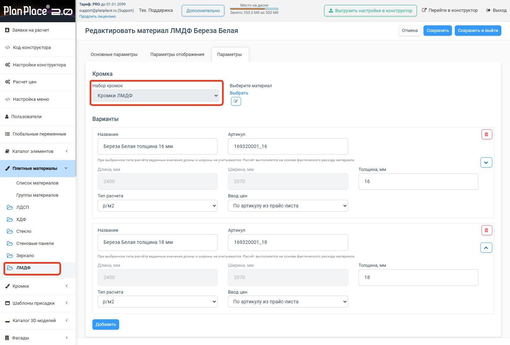
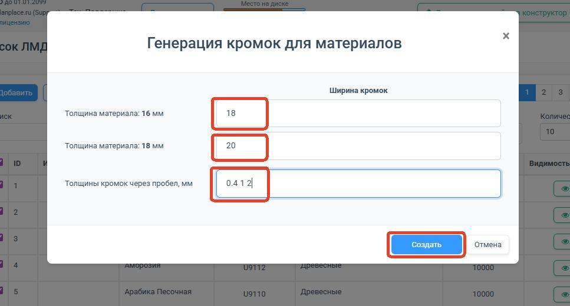

import Carousel from '../../components/Carousel.astro';
import img1 from '../../assets/kromochnye-lenty/01.jpg';
import img2 from '../../assets/kromochnye-lenty/02.jpg';
import img7 from '../../assets/kromochnye-lenty/07.jpg';
import img8 from '../../assets/kromochnye-lenty/08.jpg';
import img9 from '../../assets/kromochnye-lenty/09.jpg';
import img10 from '../../assets/kromochnye-lenty/10.jpg';
import img11 from '../../assets/kromochnye-lenty/11.jpg';

Кромка — это лента, которой заклеивают (облицовывают) торцы плиты, чтобы они выглядели аккуратно и не разрушались. В PlanPlace кромки — это полноценный материал со своей ценой, который привязывается к плитам и учитывается в расчёте стоимости. В этой статье разберём, как их настраивать.

## Зачем нужны кромки и как они считаются

Когда плиту распиливают, её торцы остаются «голыми». Чтобы мебель выглядела законченной, торцы оклеивают кромочной лентой. В системе кромка:

- отвечает за **внешний вид торцов** на 3D-модели;
- **участвует в расчёте цены** изделия;
- считается по **погонным метрам** (то есть по суммарной длине оклеенных торцов).

<Carousel images={[{src: img1, alt: "Создание нового набор кромок"}, {src: img2, alt: "Создание нового набор кромок"}]} />

<Carousel images={[{src: img7, alt: "Автоматическое создание кромок на основе плитных материалов"}, {src: img8, alt: "Автоматическое создание кромок на основе плитных материалов"}, {src: img9, alt: "Автоматическое создание кромок на основе плитных материалов"}]} />

<Carousel images={[{src: img10, alt: "Автоматическое создание кромок на основе плитных материалов"}, {src: img11, alt: "Автоматическое создание кромок на основе плитных материалов"}]} />

## Параметры кромки

У кромки те же базовые поля, что и у плиты:

- **Название**;
- **Артикул**;
- **Категория**;
- **Видимость** в конструкторе;
- **Толщина** (например, 0,4 мм, 1 мм, 2 мм — для разных задач и торцов);
- **Цена** и способ её расчёта;
- параметры **отображения** (цвет, текстура).

## Привязка кромок к плитам — главный принцип

Самое важное правило: **каждый плитный материал привязывается к своему набору кромок**. Это значит, что когда технолог настраивает деталь из конкретного ЛДСП, ему предлагаются только подходящие к этому ЛДСП кромки — обычно совпадающие по цвету/декору.

> **Рекомендация.** Для каждого плитного материала создавайте отдельную папку (набор) кромок. Так вы не запутаетесь и точно не подберёте к белому ЛДСП кромку «под дуб». Кромки, не поддерживаемые материалом, в интерфейсе просто не отображаются.

Привязка настраивается со стороны [плитного материала](/Tilda-PlanPlace/plitnye-materialy/) (поле «привязка к кромке») и может массово редактироваться через [Excel](/Tilda-PlanPlace/massovoe-redaktirovanie-plit/).

## Автоматическая генерация кромок

При [импорте плит из декоров](/Tilda-PlanPlace/plitnye-materialy/) система может **автоматически создавать кромки по толщине материала**. Это экономит время: вам не придётся вручную связывать каждую плиту с каждой кромкой.

## Толщины кромок

Разные торцы оклеивают кромкой разной толщины: видимые «лицевые» торцы — толстой (1–2 мм), скрытые — тонкой (0,4 мм). В системе можно добавлять новые толщины кромок и удалять ненужные стандартными средствами. Если нужной толщины нет в списке, её обычно можно ввести вручную в настройках детали.

## Ценообразование

Цена кромки задаётся так же, как у плит, тремя способами (см. [«Доступные типы расчётов»](/Tilda-PlanPlace/dostupnye-tipy-raschetov/)):

1. ручной ввод;
2. цена за категорию;
3. привязка к артикулу из [прайс-листа](/Tilda-PlanPlace/prays-listy/).

Поскольку кромка считается по погонным метрам, итоговая стоимость зависит от того, сколько торцов и какой длины облицовано в конкретном изделии. Где именно деталь кромится, задаётся в конфигураторе на уровне [детали](/Tilda-PlanPlace/detali/) — там для каждой грани можно указать кромку, а кнопка «Закромить всё» применяет кромки сразу ко всем подходящим деталям модуля.

## Импорт и экспорт

Кромки выгружаются и загружаются в **XLSX** так же, как [плиты](/Tilda-PlanPlace/massovoe-redaktirovanie-plit/): те же колонки и те же коды (тип расчёта `m` — р/п.м., ввод цен `c` — по артикулу из прайс-листа). Ключ списка кромок — `butts`.

**Реальный пример.** Одна кромка «Acapulco» (артикул `F685_ST10`) выгружается набором вариантов «толщина × ширина»:

| Название варианта | Артикул варианта | Толщина | Ширина | Длина | Тип расчёта |
|---|---|---|---|---|---|
| Acapulco 0.4×19 мм | F685_ST10_0.4x19 | 0,4 | 19 | 5000 | m (п.м.) |
| Acapulco 0.8×23 мм | F685_ST10_0.8x23 | 0,8 | 23 | 5000 | m (п.м.) |
| Acapulco 1×19 мм | F685_ST10_1x19 | 1 | 19 | 5000 | m (п.м.) |

Так под один декор кромки заводятся сразу все ходовые сочетания толщины (0,4 / 0,8 / 1 / 2 мм) и ширины (19 / 23 / 28 мм), а в [детали](/Tilda-PlanPlace/detali/) вы выбираете нужный вариант на конкретную грань.

## Коротко

Кромка — это лента для облицовки торцов, материал со своей толщиной, ценой (за погонный метр) и привязкой к конкретным плитам. Для каждой плиты держите свой набор кромок, используйте автогенерацию при импорте из декоров и привязывайте цены к прайс-листу для удобного обновления. Назначение кромок на грани деталей выполняется уже в [конфигураторе](/Tilda-PlanPlace/detali/).

