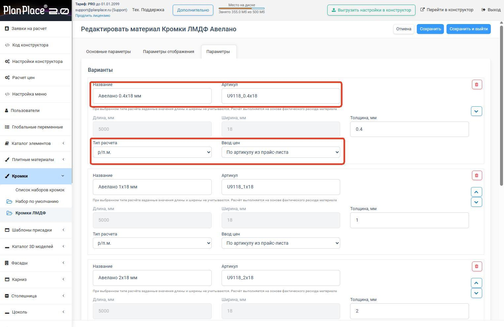
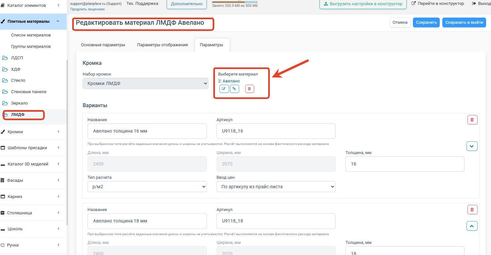
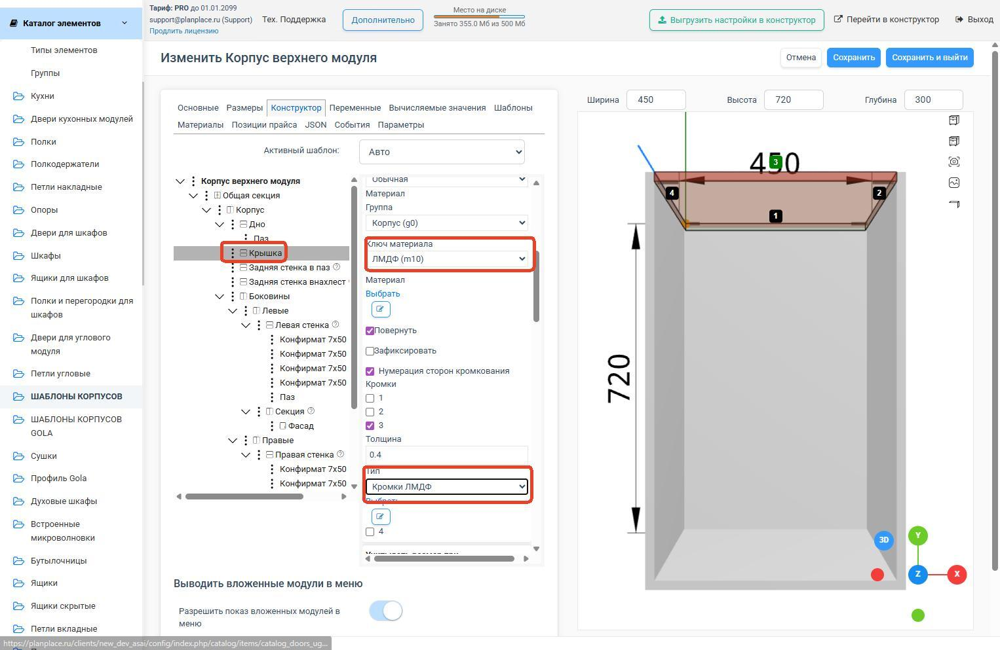

Кромка — это лента, которой заклеивают (облицовывают) торцы плиты, чтобы они выглядели аккуратно и не разрушались. В PlanPlace кромки — это полноценный материал со своей ценой, который привязывается к плитам и учитывается в расчёте стоимости. В этой статье разберём, как их настраивать.

## Зачем нужны кромки и как они считаются

Когда плиту распиливают, её торцы остаются «голыми». Чтобы мебель выглядела законченной, торцы оклеивают кромочной лентой. В системе кромка:

- отвечает за **внешний вид торцов** на 3D-модели;
- **участвует в расчёте цены** изделия;
- считается по **погонным метрам** (то есть по суммарной длине оклеенных торцов).

## Как создать набор кромок

Кромки удобно хранить наборами (папками) — как правило, один набор на тип материала. Порядок такой:

1. Откройте раздел **«Список кромок»** и нажмите создание нового набора.
2. В поле **«Название»** задайте понятное имя по типу материала — например, «Кромки ЛДСП», «Кромки ЛМДФ», «Кромки HDF».
3. Нажмите **«Сохранить и выйти»** — набор появится в общем списке.

<Carousel>

</Carousel>

Готовый набор остаётся привязать к плитам (см. ниже раздел «Привязка кромок к плитам»): в карточке плитного материала выберите этот набор в поле привязки к кромке и убедитесь, что материал не помечен как «без кромки». Если нужно, чтобы дизайнер сам выбирал кромку на сцене, включите опцию **«Выбирать кромку в меню»**.

## Параметры кромки

У кромки те же базовые поля, что и у плиты:

- **Название**;
- **Артикул**;
- **Категория**;
- **Видимость** в конструкторе;
- **Толщина** (например, 0,4 мм, 1 мм, 2 мм — для разных задач и торцов);
- **Цена** и способ её расчёта;
- параметры **отображения** (цвет, текстура).

## Привязка кромок к плитам — главный принцип

Самое важное правило: **каждый плитный материал привязывается к своему набору кромок**. Это значит, что когда технолог настраивает деталь из конкретного ЛДСП, ему предлагаются только подходящие к этому ЛДСП кромки — обычно совпадающие по цвету/декору.

> **Рекомендация.** Для каждого плитного материала создавайте отдельную папку (набор) кромок. Так вы не запутаетесь и точно не подберёте к белому ЛДСП кромку «под дуб». Кромки, не поддерживаемые материалом, в интерфейсе просто не отображаются.

Привязка настраивается со стороны [плитного материала](/Tilda-PlanPlace/plitnye-materialy/) (поле «привязка к кромке») и может массово редактироваться через [Excel](/Tilda-PlanPlace/massovoe-redaktirovanie-plit/).

### Что меняет дизайнер на сцене

Если в настройке плитного материала включить **«Выбирать кромку в меню»**, дизайнер сможет на сцене менять кромку у детали. Важно понимать границы этой свободы:

- меняется **только внешний вид** кромки (цвет/декор), **толщина не меняется** — её закладывает технолог в модели. Сделано намеренно: на переднем торце может быть кромка 1 мм, а на остальных 0,4 мм, и дизайнеру не нужно это рушить;
- грани, где кромка **не предусмотрена** моделью, остаются без кромки — новая там не появляется;
- дизайнеру предлагаются **только кромки из набора этого материала**. Например, если деталь сделана из ЛМДФ, к ней не подставятся кромки от ЛДСП — у каждого материала свой набор.

> **Группы материалов.** Когда деталь использует [группу материалов](/Tilda-PlanPlace/plitnye-materialy/) (например, «Корпус» = ЛДСП + ЛМДФ), при переключении материала автоматически подставляются кромки именно того материала, который выбрали.

## Автоматическое создание кромок из плит

Чтобы не заводить кромки вручную, система может **сгенерировать их сразу из плитных материалов** по их толщине. Это самый быстрый способ — не придётся связывать каждую плиту с каждой кромкой.

**Что нужно подготовить:**

- плитные материалы уже созданы, и у них **заданы толщины**;
- каждому материалу **назначен набор кромок** (материал не помечен «без кромки»);
- вы решили, как организуете наборы (обычно — отдельный набор на тип материала).

**Шаги:**

1. В списке плитных материалов **выделите** нужные плиты — одну, несколько, всю категорию или весь список. Активные фильтры ограничивают выбор.
2. В массовых действиях запустите **«Генерацию кромок»**. Система покажет все толщины, найденные у выбранных плит.
3. Для каждой толщины заполните два поля:
   - **Ширина кромки** — обычно на 1–2 мм больше толщины плиты (например, для плиты 16 мм — ширина 18 мм);
   - **Толщины кромок** — перечислите через пробел (например, `0.4 1` или `0.4 1 2`; точка и запятая равнозначны).
4. Нажмите **«Создать»**.

> **Как работает «Выбрать все».** Если в фильтре выбрана категория, команда охватывает материалы из этой категории и всех её вложенных подкатегорий. Сначала проверьте название выбранной категории и активные фильтры, а затем запускайте генерацию: иначе можно создать кромки для большего числа плит, чем планировалось.

<Carousel>

</Carousel>

Остальное система заполнит сама:

- **Наименование** — на основе названия исходной плиты;
- **Артикул** — из артикула материала или декора с добавлением ширины и толщины;
- **Декор** — копируется из плиты;
- **Тип расчёта цены** — «рубль за погонный метр»;
- **Привязку** к исходному плитному материалу.

<Carousel>

</Carousel>

> **Если кромки уже есть.** Для плиты без кромок система создаст и привяжет новые. Если кромки уже заведены — обновит только кромки этого материала, не трогая остальной набор.

> **Не удаляйте кромки и наборы, которые используются в проектах** — это может сломать существующие проекты. Ненужные типы лучше скрывать, а не удалять.

## Толщины кромок

Разные торцы оклеивают кромкой разной толщины: видимые «лицевые» торцы — толстой (1–2 мм), скрытые — тонкой (0,4 мм). В системе можно добавлять новые толщины кромок и удалять ненужные стандартными средствами. Если нужной толщины нет в списке, её обычно можно ввести вручную в настройках детали.

> **Автоподбор вариантов.** Как и у [плитных материалов](/Tilda-PlanPlace/plitnye-materialy/), у набора кромок есть переключатель **«Автоподбор вариантов»** — тогда в [спецификации](/Tilda-PlanPlace/specifikaciya-i-otpravka-na-raschet/) система сама подбирает подходящий вариант кромки. Параметр поддерживается в импорте/экспорте XLS.

## Ценообразование

Цена кромки задаётся так же, как у плит, тремя способами (см. [«Доступные типы расчётов»](/Tilda-PlanPlace/dostupnye-tipy-raschetov/)):

1. ручной ввод;
2. цена за категорию;
3. привязка к артикулу из [прайс-листа](/Tilda-PlanPlace/prays-listy/).

Поскольку кромка считается по погонным метрам, итоговая стоимость зависит от того, сколько торцов и какой длины облицовано в конкретном изделии. Где именно деталь кромится, задаётся в конфигураторе на уровне [детали](/Tilda-PlanPlace/detali/) — там для каждой грани можно указать кромку, а кнопка «Закромить всё» применяет кромки сразу ко всем подходящим деталям модуля.

## Импорт и экспорт

Кромки выгружаются и загружаются в **XLSX** так же, как [плиты](/Tilda-PlanPlace/massovoe-redaktirovanie-plit/): те же колонки и те же коды (тип расчёта `m` — р/п.м., ввод цен `c` — по артикулу из прайс-листа). Ключ списка кромок — `butts`.

Строк в таблице кромок обычно **больше**, чем плит: у каждой толщины листа может быть несколько толщин кромки (например, кромка 0,4 мм идёт к ЛДСП 16, 18 и 25 мм, 0,8 мм — к тем же, и т. д.). Сколько толщин кромки вы завели, во столько раз и длиннее список.

> **Приём.** Чтобы массово назначить одну и ту же кромку многим материалам (например, на производстве везде белая), выгрузите список, проставьте в колонке привязки один и тот же идентификатор кромки для нужных строк и загрузите обратно — удобно делать формулами Excel (ВПР/`VLOOKUP`).

**Реальный пример.** Одна кромка «Acapulco» (артикул `F685_ST10`) выгружается набором вариантов «толщина × ширина»:

| Название варианта | Артикул варианта | Толщина | Ширина | Длина | Тип расчёта |
|---|---|---|---|---|---|
| Acapulco 0.4×19 мм | F685_ST10_0.4x19 | 0,4 | 19 | 5000 | m (п.м.) |
| Acapulco 0.8×23 мм | F685_ST10_0.8x23 | 0,8 | 23 | 5000 | m (п.м.) |
| Acapulco 1×19 мм | F685_ST10_1x19 | 1 | 19 | 5000 | m (п.м.) |

Так под один декор кромки заводятся сразу все ходовые сочетания толщины (0,4 / 0,8 / 1 / 2 мм) и ширины (19 / 23 / 28 мм), а в [детали](/Tilda-PlanPlace/detali/) вы выбираете нужный вариант на конкретную грань.

## Коротко

Кромка — это лента для облицовки торцов, материал со своей толщиной, ценой (за погонный метр) и привязкой к конкретным плитам. Для каждой плиты держите свой набор кромок, используйте автогенерацию при импорте из декоров и привязывайте цены к прайс-листу для удобного обновления. Назначение кромок на грани деталей выполняется уже в [конфигураторе](/Tilda-PlanPlace/detali/).

