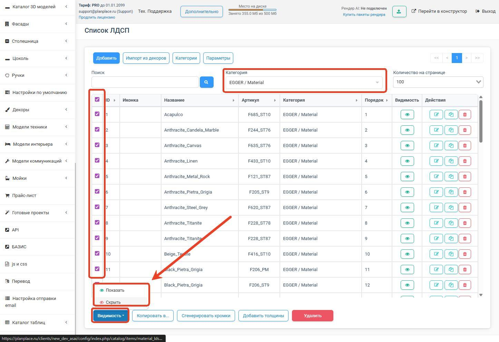
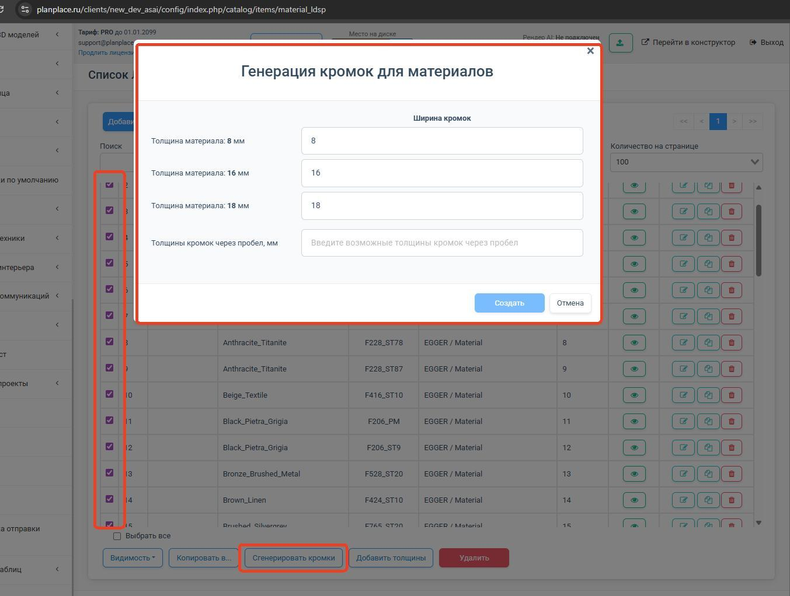
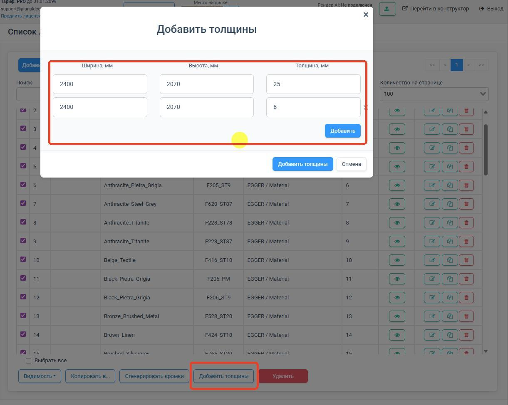
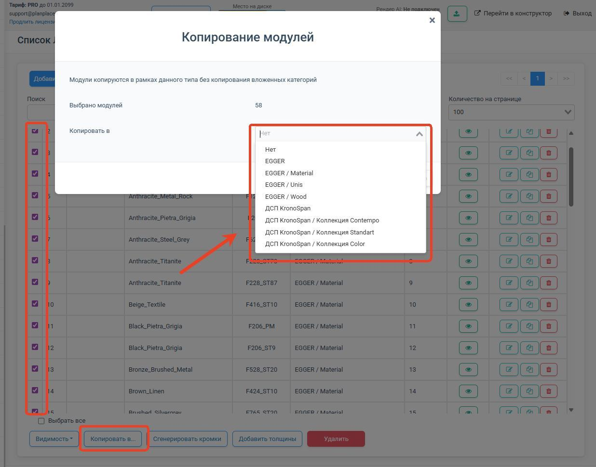
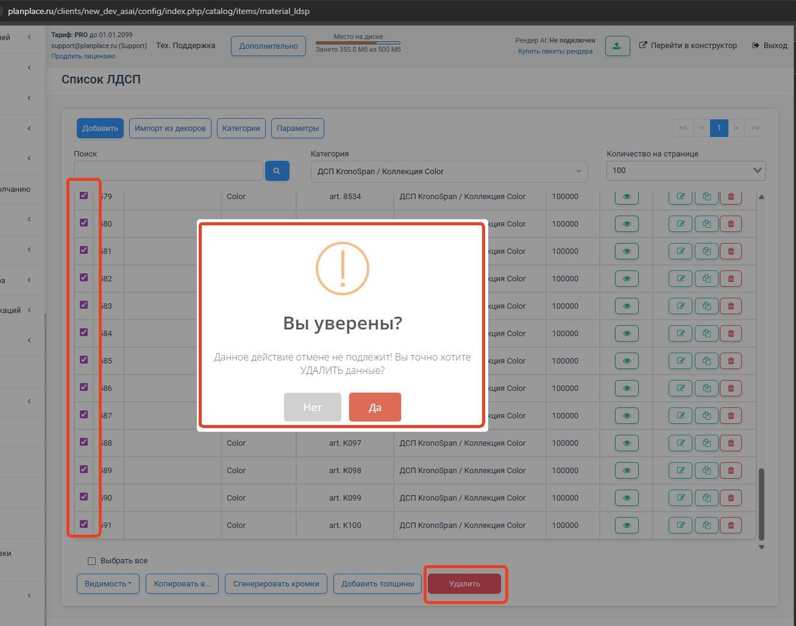
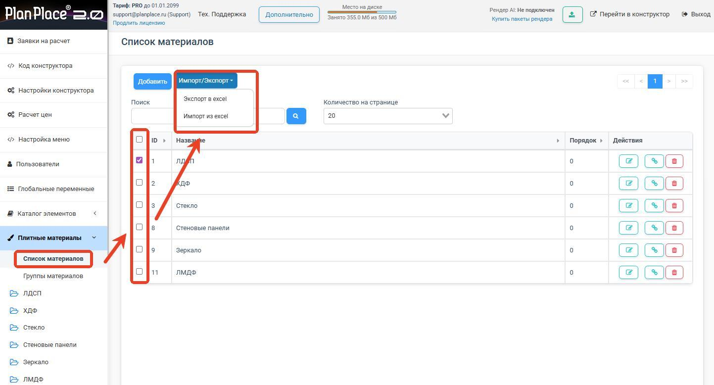

Когда плитных материалов в базе десятки или сотни, редактировать их по одному — долго. PlanPlace позволяет выгрузить все плиты в Excel, поменять что нужно сразу для многих позиций и загрузить обратно. В этой статье разберём массовое редактирование и отдельно — массовый ввод цен.

## Зачем нужно массовое редактирование

Через выгрузку в Excel удобно за один проход:

- переименовать материалы;
- переназначить категории;
- проставить или поменять артикулы;
- изменить привязку к кромкам;
- задать размеры листов;
- ввести цены и способ их расчёта;
- удалить устаревшие варианты толщин.

Это в десятки раз быстрее, чем открывать каждый материал отдельно.

## Массовые операции в интерфейсе

Часть операций делается прямо в списке плит, без Excel. Откройте **«Плитные материалы»**, отметьте галочками нужные материалы и выберите действие на панели:

- **«Генерация кромок»** — создаёт кромки для выделенных плит по заданной ширине и толщинам (см. [«Кромочные ленты»](/Tilda-PlanPlace/kromochnye-lenty/));
- **«Добавление толщины»** — добавляет новую толщину (например, 25 мм) сразу всем выделенным материалам;
- **«Копировать в…»** — копирует выбранные материалы в указанную категорию;
- **«Скрыть / Показать»** — управляет видимостью на сцене (можно скрыть целую категорию или отдельный цвет, не удаляя);
- **«Удалить»** — удаляет выделенные плиты.

<Carousel>

</Carousel>

> **Не удаляйте родительские папки материалов** (например, «ЛДСП») — это разорвёт привязки в модулях и сломает инструменты дизайнера. Если удаление неизбежно, сначала перепривяжите группы материалов, материалы модулей и материалы по умолчанию.

## Как работает экспорт и импорт

1. **Экспорт.** Откройте **«Плитные материалы»**, отметьте нужные материалы и нажмите **«Импорт-Экспорт» → «Экспорт»** — скачается файл **XLSX**.
2. **Редактирование.** Откройте файл в Excel (или другом редакторе таблиц) и внесите изменения.
3. **Импорт.** Вернитесь в **«Импорт-Экспорт» → «Импорт»**, загрузите изменённый файл и дождитесь завершения (не закрывайте браузер). После этого нажмите **«Выгрузить настройки в конструктор»**.

> **Не трогайте колонку ИД (id).** Это внутренний идентификатор материала, по которому система понимает, какую запись обновлять. Если его изменить или удалить, система может не найти нужный материал.

## Реальный формат файла выгрузки

В выгрузке плит **две строки заголовков**: первая — понятные названия колонок, вторая — их системные имена (с ними работают программисты и импорт). Менять вторую строку не нужно.

Основные колонки:

- **Ключ** (`key`) — системный ключ материала (например, `m10`). Заполняется только в первой строке материала; у строк-вариантов остаётся пустым.
- **ИД** (`id`) — идентификатор; одинаковый у всех вариантов одного материала.
- **Видимость** (`active`), **Порядок** (`order`), **Категория** (`category`).
- **Название** (`name`) и **Артикул** (`code`) — заполняются в первой строке материала.
- **Кромка ID материала** / **Кромка набор** (`butt.id` / `butt.key`) — привязанный набор кромок (например, `b2`).
- **Название варианта** (`variant.name`) и **Артикул варианта** (`variant.code`) — для каждой толщины свои (например, «Чистый белый толщина 16 мм», `white-01_16`).
- **Коэфф. отхода материала % варианта** (`variant.factor_mat`) — [коэффициент отхода](/Tilda-PlanPlace/plitnye-materialy/).
- **Длина / Ширина / Толщина, мм** (`variant.width` / `variant.height` / `variant.thickness`).
- **Цена** (`variant.price`) и **Цена по ID из прайс-листа** (`variant.price_acc_id`).
- **Ввод цен** (`variant.price_mode`) — как задаётся цена.
- **Тип расчёта** (`variant.price_type`) — как считается количество.
- **Режим отображения** (`params.mat_mode`) и далее — параметры внешнего вида (цвет, текстура, шероховатость и т. д.).

### Коды, которые встречаются в файле

Эти короткие коды важно знать, чтобы файл читался правильно:

- **Ввод цен:** `m` — ручной ввод; `a` — по ID из прайс-листа; `c` — по артикулу из прайс-листа.
- **Тип расчёта:** `p` — р/шт.; `m` — р/п.м.; `hl` — р/хлыст; `hlm` — р/хлыст (п.м.); `m2` — р/м²; `m3` — р/м³.
- **Режим отображения:** `0` — свои параметры; `1` — декор.

### Пример: один материал в двух толщинах

Материал «Чистый белый» (артикул `white-01`, набор кромок `b2`) выгружается двумя строками-вариантами:

| Ключ | ИД | Название | Артикул | Название варианта | Артикул варианта | Длина | Ширина | Толщина | Ввод цен | Тип расчёта |
|---|---|---|---|---|---|---|---|---|---|---|
| m10 | 1 | Чистый белый | white-01 | Чистый белый толщина 16 мм | white-01_16 | 2400 | 2070 | 16 | c | … |
| *(пусто)* | 1 | | | Чистый белый толщина 18 мм | white-01_18 | 2400 | 2070 | 18 | c | … |

Видно, что у второй строки **Ключ, Название и Артикул пустые** — это та же запись (тот же ИД 1), просто другой вариант толщины. Чтобы убрать толщину 18 мм, удалите её строку; 16 мм останется.

## Как удалить лишние толщины

Если какой-то вариант плиты вышел из оборота (например, перестали возить ЛДСП в 10 мм), просто **удалите соответствующую строку** в таблице Excel перед загрузкой. Остальные варианты этого материала останутся без изменений. Это аккуратный способ чистить базу, не задевая нужное.

## Массовый ввод цен на плитные материалы

Цены — то, что меняется чаще всего, поэтому для них массовый ввод особенно полезен.

В таблице нужно настроить два независимых параметра:

- **«Ввод цен»** (`variant.price_mode`) определяет, **откуда брать цену**: `m` — из колонки «Цена», `a` — по ID позиции прайс-листа, `c` — по артикулу варианта;
- **«Тип расчёта»** (`variant.price_type`) определяет, **как считать количество**: например, `p` — целыми листами, `m2` — по площади.

Не путайте эти колонки: значение `m2` относится к **типу расчёта**, а значение `m` — к **способу ввода цены**. Подробнее о формулах — в статье [«Доступные типы расчётов»](/Tilda-PlanPlace/dostupnye-tipy-raschetov/).

Вы можете:

- проставить **ручные цены** сразу для многих материалов;
- задать **цену за категорию** — одно значение на целую группу плит;
- указать **привязку к артикулу из прайс-листа** — тогда цена будет подтягиваться из [прайс-листа](/Tilda-PlanPlace/prays-listy/) автоматически.

> **Рекомендация.** Если ассортимент большой и цены меняются регулярно, не вводите их вручную в карточках плит. Привяжите плиты к прайс-листу по артикулу и обновляйте цены централизованно в прайс-листе (а лучше — автоматически через интеграцию). Один раз настроили связь — дальше цены обновляются сами.

Ниже — три подробных сценария. Их можно применять отдельно или комбинировать для разных категорий, толщин и поставщиков.

### Сценарий 1. Единая цена для категории ЛДСП 16 мм

**Для кого:** у вас сотни декоров одной толщины, они продаются по одинаковой цене за квадратный метр, а менять цену хочется в одном месте. Принцип похож на «одна цена на группу»: все варианты плит ссылаются на одну строку [прайс-листа](/Tilda-PlanPlace/prays-listy/).

#### Шаг 1. Создайте общую позицию в прайс-листе

1. Откройте **«Прайс-лист» → «Добавить»**.
2. Заполните позицию, например:
   - **Категория:** `ЛДСП`;
   - **Артикул:** `LDSP_16_BASE` — уникальный внутри прайс-листа;
   - **Название:** `ЛДСП 16 мм — базовая цена`;
   - **Цена:** `4500` — в этом сценарии это цена за 1 м².
3. Сохраните позицию и нажмите **«Выгрузить настройки в конструктор»**.
4. Запишите её **ID** из первого столбца прайс-листа. Например, на скриншоте позиции категории ЛДСП имеют ID `2142`, `2143` и `2144`; в вашей базе номера будут другими.

#### Шаг 2. Экспортируйте нужные плиты

1. Откройте **«Плитные материалы»** и нужную группу, например **«ЛДСП»**.
2. Отфильтруйте категорию или отметьте только те материалы, которым нужно назначить общую цену.
3. Нажмите **«Импорт-Экспорт» → «Экспорт»** и сохраните полученный файл XLSX.
4. Сделайте копию исходного файла до редактирования. Не меняйте строки заголовков и системные колонки **«Ключ»** (`key`) и **«ИД»** (`id`).

#### Шаг 3. Настройте строки толщиной 16 мм в Excel

1. В колонке **«Толщина»** (`variant.thickness`) отфильтруйте значение `16`.
2. Если в файле несколько категорий или поставщиков, оставьте только нужные строки. Не назначайте общую цену всем материалам файла без проверки фильтра.
3. Для выделенных строк заполните:

| Колонка | Системное имя | Значение |
|---|---|---|
| **Ввод цен** | `variant.price_mode` | `a` — цена по ID прайс-листа |
| **Цена по ID из прайс-листа** | `variant.price_acc_id` | ID созданной позиции, например `2142` |
| **Тип расчёта** | `variant.price_type` | `m2` — расчёт за м² |

Колонка **«Цена»** (`variant.price`) при режиме `a` не используется: стоимость берётся из указанной позиции прайс-листа.

#### Шаг 4. Импортируйте и проверьте

1. Сохраните файл в формате XLSX.
2. В PlanPlace нажмите **«Импорт-Экспорт» → «Импорт»** и выберите отредактированный файл.
3. Не закрывайте и не обновляйте страницу до сообщения об успешной загрузке.
4. Нажмите **«Выгрузить настройки в конструктор»**.
5. В конструкторе добавьте тестовый модуль и проверьте стоимость материала.
6. Измените цену общей позиции в прайс-листе и повторите проверку: цена должна обновиться у всех привязанных плит 16 мм.

**Результат:** все выбранные декоры рассчитываются по единой цене за м². Для следующего обновления достаточно изменить одну позицию прайс-листа.

### Сценарий 2. Ручная цена за целый лист

**Для кого:** у вас небольшой ассортимент — примерно 10–50 декоров, нет внешней учётной системы, а поставщик продаёт материал целыми листами.

#### Шаг 1. Подготовьте данные

1. Проверьте, что у каждого материала созданы нужные варианты толщины.
2. Проверьте **длину и ширину листа**: они участвуют в расчёте количества целых листов.
3. Сделайте резервную копию базы, затем экспортируйте нужные плиты в XLSX.

#### Шаг 2. Заполните цены

Для каждой строки, которую нужно считать листами, задайте:

| Колонка | Системное имя | Значение |
|---|---|---|
| **Ввод цен** | `variant.price_mode` | `m` — ручной ввод |
| **Тип расчёта** | `variant.price_type` | `p` — расчёт целыми листами |
| **Цена** | `variant.price` | цена одного целого листа, например `5200` |

Цена по ID прайс-листа при режиме `m` не используется. Для разных строк можно выбирать разные способы: например, массовые декоры считать по `m2`, а редкие — по `p`.

#### Шаг 3. Импортируйте и проверьте

1. Сохраните XLSX и импортируйте его через **«Импорт-Экспорт» → «Импорт»**.
2. После завершения нажмите **«Выгрузить настройки в конструктор»**.
3. Создайте тестовый проект и проверьте округление. При типе `p` PlanPlace складывает площадь деталей, делит её на площадь листа и округляет результат вверх до целого количества листов. PlanPlace не выполняет оптимизацию раскроя, поэтому отдельно проверьте [коэффициент отхода](/Tilda-PlanPlace/plitnye-materialy/), чтобы не заложить запас дважды.

**Результат:** цена хранится непосредственно у каждого варианта плиты, а стоимость заказа рассчитывается целыми листами.

### Сценарий 3. Цены из 1С, БАЗИС или другой учётной системы

**Для кого:** у вас большой ассортимент — сотни или тысячи SKU, а названия, артикулы и цены должны совпадать с внешней учётной системой.

#### Этап 1. Подготовьте артикулы вариантов плит

1. Определите единый источник артикулов — например, 1С или БАЗИС.
2. Экспортируйте плитные материалы в XLSX.
3. Для каждого варианта толщины проверьте:
   - **«Артикул варианта»** (`variant.code`) — точный артикул этой плиты и толщины во внешней системе;
   - **«Название варианта»** (`variant.name`) — понятное производственное название;
   - **«Тип расчёта»** (`variant.price_type`) — `m2`, `p` или другой подходящий код;
   - **«Ввод цен»** (`variant.price_mode`) — `c`, то есть поиск цены по артикулу.
4. Удалите случайные пробелы в начале и конце артикула. Следите, чтобы Excel не преобразовал длинные цифровые артикулы в экспоненциальную запись и не удалил ведущие нули.

> Для связи с прайс-листом важен именно **артикул варианта** (`variant.code`), потому что разные толщины одного декора могут иметь разные SKU и цены.

#### Этап 2. Подготовьте прайс-лист

1. Экспортируйте текущий [прайс-лист](/Tilda-PlanPlace/prays-listy/) в XLSX или CSV, чтобы сохранить существующие ID.
2. Для новых позиций перенесите:
   - `variant.code` → **«Артикул»**;
   - `variant.name` → **«Название»**;
   - актуальную стоимость из учётной системы → **«Цена»**;
   - удобную группу → **«Категория»**.
3. У новых строк оставьте колонку **ID пустой** — PlanPlace присвоит идентификаторы при импорте. У существующих строк ID не меняйте.
4. Проверьте уникальность артикулов и импортируйте прайс-лист обратно.
5. Дождитесь сообщения об успешной загрузке, затем сохраните изменения и выгрузите настройки в конструктор.

#### Этап 3. Импортируйте настройки плит и проверьте связь

1. Импортируйте подготовленный файл плитных материалов, где у вариантов задан режим `c`.
2. Нажмите **«Выгрузить настройки в конструктор»**.
3. Проверьте несколько позиций разных поставщиков и толщин. Артикул варианта плиты должен **полностью совпадать** с артикулом строки прайс-листа.
4. Измените тестовую цену в прайс-листе и убедитесь, что стоимость материала пересчиталась без редактирования карточки плиты.
5. После ручной проверки подключайте централизованное обновление прайс-листа через [API](/Tilda-PlanPlace/sinhronizaciya-po-api/), если оно используется в вашем процессе.

**Результат:** структура плит остаётся в каталоге PlanPlace, а актуальные цены ведутся в одном прайс-листе и могут поступать из 1С, БАЗИС или другой системы.

### Что проверить, если импорт дал неожиданный результат

- На месте ли `key` и `id` материалов; не изменены ли две строки заголовков.
- Заполнен ли нужный режим: `m`, `a` или `c` — латинскими буквами.
- Не перепутаны ли **«Ввод цен»** и **«Тип расчёта»**.
- Совпадает ли `variant.code` с артикулом прайс-листа символ в символ.
- Нет ли пробелов, скрытых символов, изменённых ведущих нулей или экспоненциальной записи.
- Сохранён ли файл именно в поддерживаемом формате XLSX.
- Завершилась ли загрузка и нажата ли кнопка **«Выгрузить настройки в конструктор»**.

## Важная привычка: резервная копия

> **Перед массовым импортом всегда делайте [резервную копию базы](/Tilda-PlanPlace/lichnyy-kabinet/).** Массовая загрузка затрагивает много записей сразу, и если в файле окажется ошибка, копия позволит мгновенно откатиться.

## Частые ошибки

- **Сломанные артикулы.** Лишние пробелы или изменённый регистр в артикуле разрывают связь с прайс-листом. Проверяйте артикулы внимательно.
- **Перепутанные категории.** Опечатка в названии категории создаст новую категорию вместо переноса в существующую.
- **Неверный способ расчёта.** Убедитесь, что для каждой строки указан корректный способ расчёта цены, иначе материал может считаться не так, как вы ожидаете.

## Коротко

Массовое редактирование — это цикл «экспорт в Excel → правки → импорт обратно». Для единой цены категории используйте режим `a`, ID общей позиции прайс-листа и тип `m2`; для ручной цены листа — режим `m`, тип `p` и цену целого листа; для интеграции с 1С или БАЗИС — режим `c` и точное совпадение `variant.code` с артикулом прайс-листа. Не меняйте `key` и `id`, делайте резервную копию и проверяйте результат на тестовом проекте.

