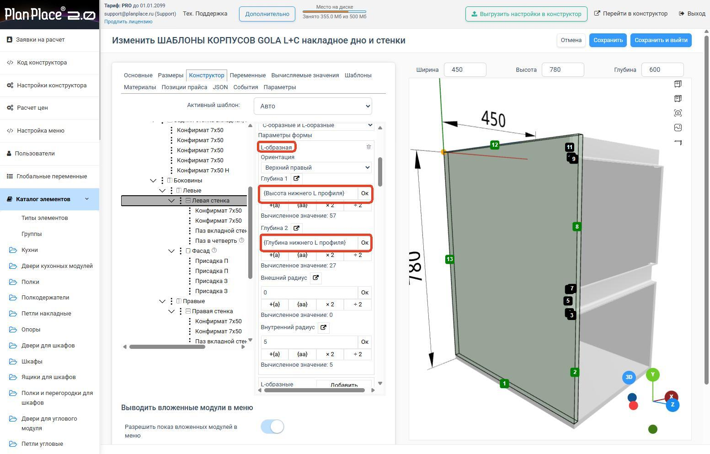
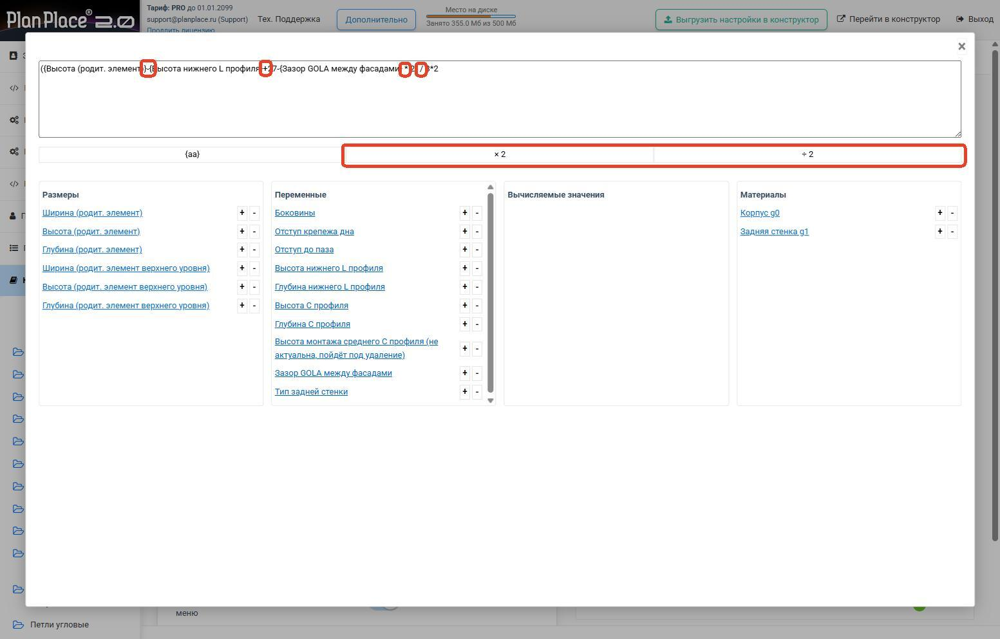

В формулах PlanPlace можно использовать не только простую арифметику, но и полноценные математические функции. Они работают везде, где есть расчёты: в [размерах](/Tilda-PlanPlace/parametry-formuly-pozicionirovanie/), позиционировании, поворотах, [вычисляемых значениях](/Tilda-PlanPlace/vychislyaemye-znacheniya/), параметрах форм деталей и [вырезах](/Tilda-PlanPlace/pazy-i-vyrezy/). Это справочник по синтаксису и функциям с примерами.

## Что можно подставлять в формулы

В одной формуле можно комбинировать:

- **параметры размеров** — свои и родительских элементов;
- **переменные** — модуля и глобальные;
- **вычисляемые значения**;
- **материалы** — точнее, их толщину;
- обычные операторы и **скобки**.

Ссылки на параметры записываются в **фигурных скобках**, например `{Ширина (родит. элемент)}`.

## Базовые операторы

- сложение: `+`
- вычитание: `-`
- умножение: `*`
- деление: `/`
- скобки `( )` — задают порядок вычислений.

## Доступные функции

**Геометрия**

- `ГИПОТЕНУЗА(a, b)` — длина гипотенузы по двум катетам.

**Базовые вычисления**

- `КОРЕНЬ(x)` — квадратный корень;
- `СТЕПЕНЬ(a, b)` — a в степени b;
- `МОДУЛЬ(x)` — модуль (абсолютное значение).

**Тригонометрия**

- `СИНУС(угол)`, `КОСИНУС(угол)`, `ТАНГЕНС(угол)`, `КОТАНГЕНС(угол)`;
- `АРКСИНУС(x)`, `АРККОСИНУС(x)`, `АРКТАНГЕНС(x)`.

> **Углы — в градусах.** Тригонометрические функции принимают и возвращают угол в **градусах** (не в радианах). То есть `СИНУС(90)` даст 1.

**Тригонометрия и гипотенуза с округлением результата**

Для удобства у гипотенузы и тригонометрических функций есть варианты, которые сразу округляют результат: суффикс `_ОКР_М` — вниз (в меньшую сторону), `_ОКР_Б` — вверх (в большую). Например: `ГИПОТЕНУЗА_ОКР_М(a, b)`, `ГИПОТЕНУЗА_ОКР_Б(a, b)`, `СИНУС_ОКР_М(угол)`, `КОСИНУС_ОКР_Б(угол)`, `ТАНГЕНС_ОКР_М(угол)`, `КОТАНГЕНС_ОКР_Б(угол)`, а также для арк-функций (`АРКСИНУС_ОКР_М` и т. д.). Удобно, когда результат сразу нужен целым числом миллиметров.

**Округление**

- `ОКРУГЛВНИЗ(x)` — вниз;
- `ОКРУГЛВВЕРХ(x)` — вверх;
- `ОКРУГЛ(x)` — до ближайшего целого.

**Работа с несколькими значениями**

- `МИНИМУМ(...)`, `МАКСИМУМ(...)`, `СРЕДНЕЕ(...)`, `СУММА(...)`.

<Carousel>

</Carousel>

## Как подставляются разные данные

**1. Размеры.** Это размеры текущего или родительского элемента: `{Ширина (родит. элемент)}`, `{Высота (родит. элемент)}`, `{Глубина (родит. элемент)}`. Используются для расчёта деталей, смещений, центровки.

**2. Переменные.** Можно использовать обычные переменные модуля: `{Боковины}`, `{Отступ до паза}` и т. п.

Если переменная — **список значений**, у каждого варианта есть числовая пара. Именно она участвует в расчёте. Например, у переменной «Боковины» варианты: ЛДСП → 0, Слева фасад → 10, Справа фасад → 200, Фасады → 3. В формуле пишете `{Боковины}`, а система подставит число выбранного варианта (например, 200).

**3. Вычисляемые значения.** Если часть логики уже вынесена в [вычисляемое значение](/Tilda-PlanPlace/vychislyaemye-znacheniya/), на него можно ссылаться в формуле.

**4. Материалы.** Запись `{Корпус}` — это ссылка на **толщину выбранной группы материалов** «Корпус». Группа задаётся на вкладке [«Материалы»](/Tilda-PlanPlace/osnovy-konfiguratora/). Например, `{Ширина (родит. элемент)} - {Корпус} * 2` означает «ширина родителя минус две толщины корпуса».

## Два режима ввода

- **Сокращённая форма** — строка рядом с параметром; под ней сразу виден **результат вычисления** для текущих размеров.
- **Расширенная форма** — открывается кнопкой над строкой; показывает всё выражение и столбцы с размерами, переменными, вычисляемыми значениями, материалами. Удобна для длинных формул.

Добавлять элементы в формулу удобно кнопками **«+»** и **«−»** напротив названия. Знак потом можно поменять вручную.

> **Внимание.** Кнопки «+»/«−» дописывают значение в конец формулы, а **одиночный клик по названию заменяет всю строку целиком** — старое выражение сотрётся.

Переключатель `{aa} / a:a` меняет режим отображения: «понятные названия» или «внутренние имена переменных» (последнее нужно программисту при доработке модуля).

<Carousel>

</Carousel>

## Готовые примеры

1. **Внутренний размер детали:** `{Ширина (родит. элемент)} - {Корпус} * 2` — для полок, дна, крышек, перегородок.
2. **Деление пространства на части:** `({Ширина (родит. элемент)} - {Корпус} * 2) / 3` — равные секции.
3. **Учёт переменной из списка:** `{Ширина (родит. элемент)} - {Корпус} / 3 * 2 * 2 - 2 - {Боковины}`.
4. **Ограничение размера снизу:** `МАКСИМУМ(400, {Глубина (родит. элемент)} - 50)` — размер не меньше 400.
5. **Округление по шагу (сетка присадки):** `ОКРУГЛВВЕРХ(({Ширина (родит. элемент)} - {Корпус} * 2) / 32) * 32`.
6. **Центровка:** `{Ширина (родит. элемент)} / 2`.
7. **Диагональ/скошенная деталь:** `ГИПОТЕНУЗА({Ширина (родит. элемент)}, {Высота (родит. элемент)})`.
8. **Поворот по расчёту:** `АРКТАНГЕНС({Высота (родит. элемент)} / {Ширина (родит. элемент)})` — для наклонных элементов.

## Где это особенно полезно

Математические функции выручают при настройке шкафов и пеналов, кухонных модулей, тумб и комодов, ящиков, угловых и нестандартных корпусов, деталей со скошенной формой и модулей, размеры которых зависят от выбранных материалов и комплектации.

## Важно про безопасность

> **Формулы не видны и не доступны пользователю сцены.** Они нужны администратору, чтобы настроить умное поведение элемента. Пользователь только переключает разрешённые переменные, а конструкция подстраивается сама. Вводить свои формулы пользователю нельзя.

## Коротко

PlanPlace поддерживает арифметику, скобки и набор функций (корень, степень, тригонометрия, округление, минимум/максимум, гипотенуза). В формулах используются ссылки в фигурных скобках на размеры, переменные, вычисляемые значения и толщины материалов. Сокращённый редактор сразу показывает результат, расширенный удобен для длинных выражений. Списочные переменные подставляются своими числовыми значениями.

