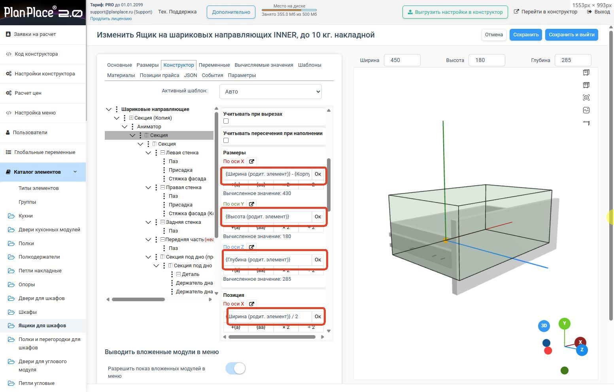
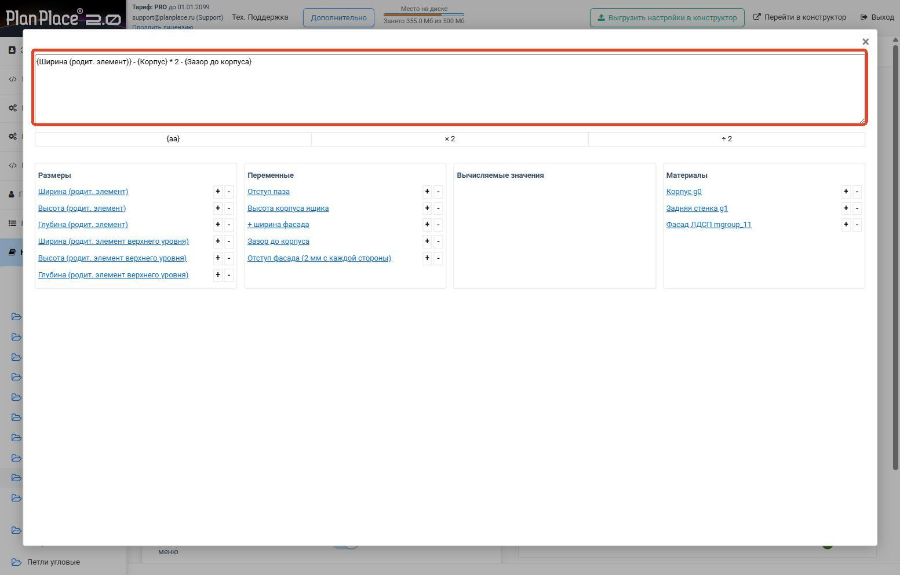
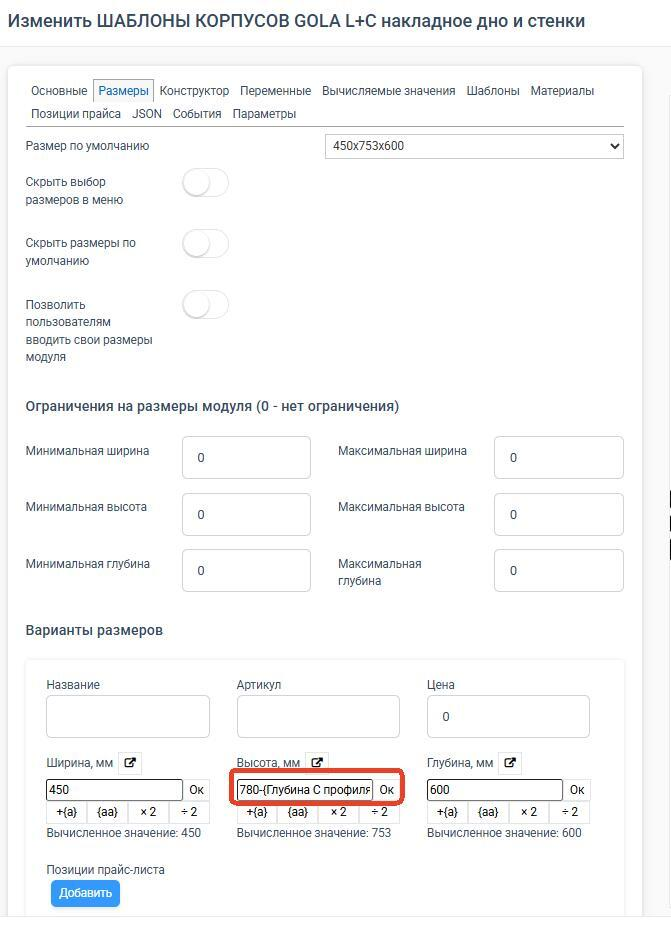

## Доступные функции

В PlanPlace поддерживаются следующие математические функции.

**Базовые действия**

- Сложение (`+`)
- Вычитание (`-`)
- Умножение (`*`)
- Деление (`/`)
- Скобки

**Геометрия**

- `ГИПОТЕНУЗА(a, b)`

**Базовые вычисления**

- `КОРЕНЬ(x)`
- `СТЕПЕНЬ(a, b)`
- `МОДУЛЬ(x)`

**Тригонометрия**

- `СИНУС(угол)`, `КОСИНУС(угол)`, `ТАНГЕНС(угол)`
- `АРКСИНУС(x)`, `АРККОСИНУС(x)`, `АРКТАНГЕНС(x)`

**Округление**

- `ОКРУГЛВНИЗ(x)`, `ОКРУГЛВВЕРХ(x)`, `ОКРУГЛ(x)`

**Работа с несколькими значениями**

- `МИНИМУМ(...)`, `МАКСИМУМ(...)`, `СРЕДНЕЕ(...)`, `СУММА(...)`

## Как записать формулу

Формулы используют ссылки в фигурных скобках. Примеры:

- `{Ширина (родит. элемент)} / 2`
- `{Ширина (родит. элемент)} - {Корпус} * 2`
- `МАКСИМУМ(400, {Глубина (родит. элемент)} - 50)`

В формулы можно подставлять:

1. Параметры размеров секций.
2. Переменные модуля.
3. Вычисляемые значения.
4. Материалы (толщина групп).

## Где можно вводить формулы

- В вычисляемых значениях.
- В размерах и позиционировании.
- В поворотах элементов.
- В параметрах форм элементов конструктора.

Ввод доступен в двух режимах: сокращённой форме (строка с результатом) и расширенной форме
(полный редактор с отдельными столбцами).

## Примеры

1. Внутренний размер детали: `{Ширина (родит. элемент)} - {Корпус} * 2`
2. Деление пространства: `({Ширина (родит. элемент)} - {Корпус} * 2) / 3`
3. Центровка: `{Ширина (родит. элемент)} / 2`
4. Диагональ: `ГИПОТЕНУЗА({Ширина (родит. элемент)}, {Высота (родит. элемент)})`
5. Округление по шагу: `ОКРУГЛВВЕРХ(({Ширина (родит. элемент)} - {Корпус} * 2) / 32) * 32`
