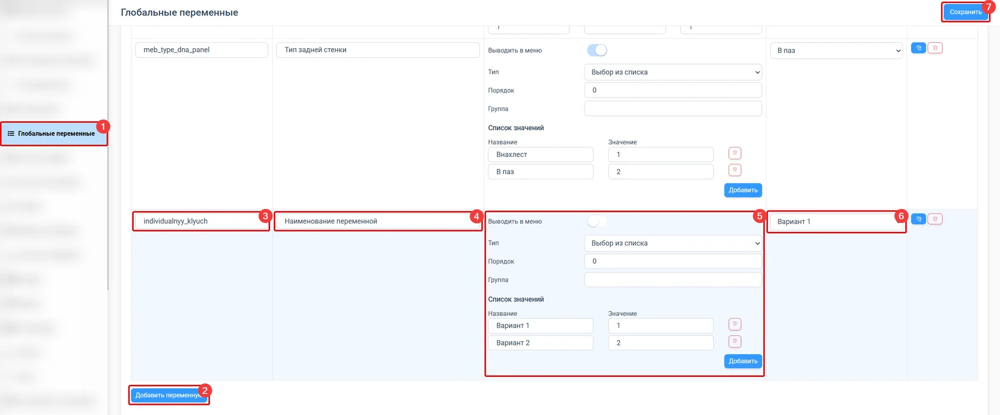

import Carousel from '../../components/Carousel.astro';
import img2 from '../../assets/menuap-globalnye_peremennye/02.jpg';
import img3 from '../../assets/menuap-globalnye_peremennye/03.jpg';
import img4 from '../../assets/menuap-globalnye_peremennye/04.jpg';
import img5 from '../../assets/menuap-globalnye_peremennye/05.jpg';
import img7 from '../../assets/menuap-globalnye_peremennye/07.png';

## Что такое глобальные переменные

Глобальные переменные — это инструмент системы PlanPlace для централизованного управления
параметрами проекта, которые можно массово применять и изменять в расчётах или шаблонах
модулей.

**Ключевые преимущества:**

- **Централизованное управление** — изменения в одном месте автоматически применяются ко
  всем модулям.
- **Стандартизация** — обеспечивает единообразие параметров по каталогу.
- **Гибкость** — позволяет быстро адаптировать систему под специфические требования.

Эти переменные управляют параметрами, не заложенными изначально в систему: отступы,
зазоры, глубина профилей, типы конструктивных элементов и производственные допуски.

## Создание новой переменной

1. Откройте раздел «Глобальные переменные» в личном кабинете.
2. Нажмите кнопку «Добавить переменную».
3. Укажите уникальный ключ (только латинские буквы и цифры).
4. Задайте название переменной.
5. Настройте параметры:
   - **Выводить в меню** — отображение в главном меню конструктора.
   - **Тип данных** — число, выбор из списка или да/нет.
   - **Порядок** и **Группа** — организация в интерфейсе.
   - **Мин., Макс., Шаг** — диапазон для числовых типов.
6. Укажите значение по умолчанию.
7. Сохраните данные.

**Важное замечание:** удаление переменных или изменение их ключей может вызвать ошибки.
Рекомендуется переиспользовать существующие переменные вместо их удаления.

## Добавление переменной в элементы

Глобальные переменные добавляются в конфигураторе элементов через вкладку «Переменные».
Они выделяются жирным шрифтом в списке переменных и могут использоваться в условиях
видимости, вычисляемых значениях и математических вычислениях.

<Carousel images={[{src: img2, alt: "Добавление глобальной переменной в новый элемент"}, {src: img3, alt: "Добавление глобальной переменной в новый элемент"}, {src: img4, alt: "Добавление глобальной переменной в новый элемент"}]} />

<Carousel images={[{src: img5, alt: "Примеры использования глобальных переменных"}, {src: "/Tilda-PlanPlace/media/menuap-globalnye_peremennye/06.gif", alt: "Примеры использования глобальных переменных"}]} />

<Carousel images={[{src: img7, alt: "Примеры использования глобальных переменных"}, {src: "/Tilda-PlanPlace/media/menuap-globalnye_peremennye/08.gif", alt: "Примеры использования глобальных переменных"}]} />

## Примеры применения

**Пример 1 — Тип задней стенки:** создание переменной с вариантами (в паз, в четверть,
накладная, вкладная, без стенки) для централизованного управления типом задней стенки во
всех модулях корпусов.

**Пример 2 — Боковые стенки:** переменная с выбором материалов (ЛДСП, фасады слева/справа,
все фасады) используется в условиях видимости деталей модулей.
