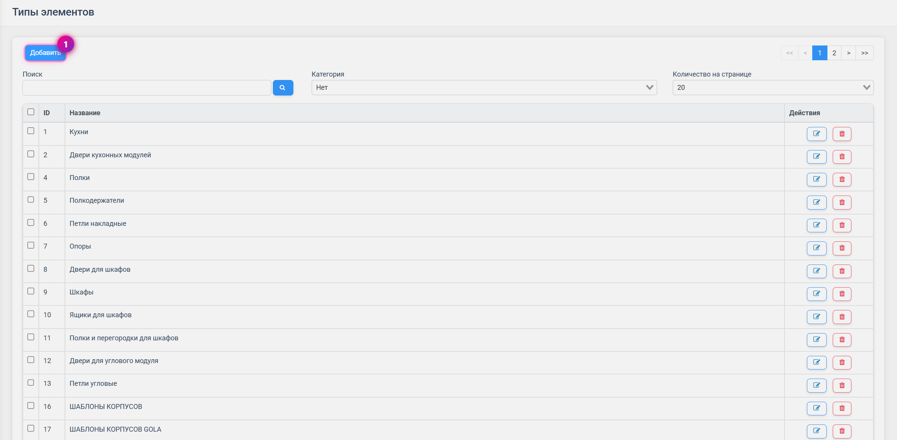
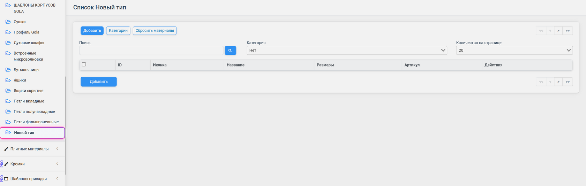
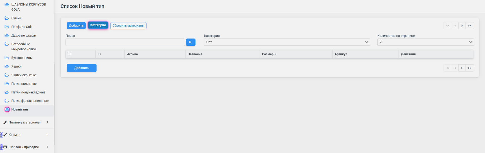
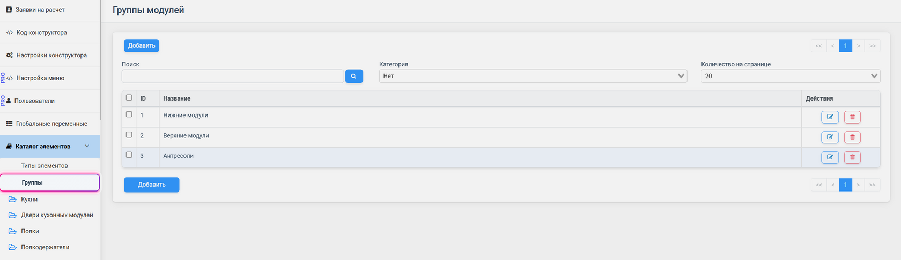
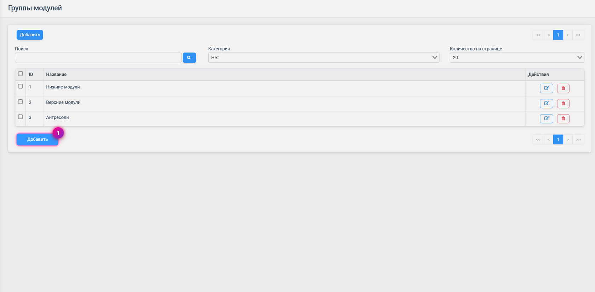
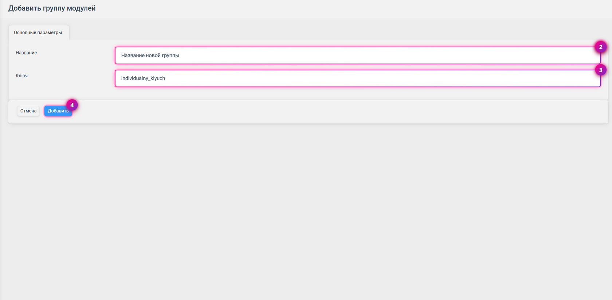

## Структура раздела «Каталог элементов»

Раздел «Каталог элементов» — это центральный раздел конфигуратора, в котором происходят
все основные настройки и сборка каталога мебельных элементов. Раздел включает два
основных подраздела:

- **Типы элементов** — подраздел для добавления новых типов. Каждый тип может
  представлять собой любой элемент: ящики, бутылочницы, сушки для посуды, мебельные
  опоры, петли, полки и другие комплектующие.
- **Группы** — подраздел для создания групп, позволяющих массово переназначать или
  переопределять параметры для определённых категорий модулей.

## Типы элементов и их функционал

Принцип создания типов элемента основан на том, что все элементы, которые могут
заменяться между собой, должны быть объединены в один тип. Например, сушки для посуды
от разных производителей объединяются в один тип «Сушки», чтобы иметь возможность
менять их на сцене конструктора.

Внутри каждого типа можно создавать подкатегории для более детальной организации и
распределять элементы по папкам для удобной навигации.

## Работа с типами элементов и категориями

Процесс создания нового типа состоит из следующих шагов:

1. Нажмите кнопку **«Добавить»** в разделе «Типы элементов».
2. Заполните поле **«Название»** понятным и описательным названием.
3. Нажмите кнопку **«Сохранить и выйти»**.

При создании нового типа в левом меню появляется новый раздел с его названием. После
настройки откроется список всех элементов, которые могут взаимно заменяться на сцене
конструктора.

В категорию типа элемента можно перейти, нажав на иконку синей папки или воспользовавшись
кнопкой **«Категории»** в верхней части интерфейса.

Создание категорий является опциональным. Если в каталоге присутствует только один
вариант элемента, можно добавить его в список без категории и настроить его параметры
напрямую.

## Группы и их применение

Группы в каталоге элементов предназначены для быстрого переназначения или переопределения
параметров у определённого ряда модулей. Это полезно, когда разные типы элементов имеют
различные наборы параметров или ограничений.

**Пример использования групп:** антресоли в каталоге могут отличаться по доступным цветам
корпуса от нижних и верхних модулей. Для антресолей доступны только два цвета (белый и
серый), в то время как для остальных модулей предусмотрено больше вариантов.

По умолчанию в системе существует 3 группы: «Нижние модули», «Верхние модули» и
«Антресоли». При необходимости можно добавить дополнительные группы.

Если нескольким модулям присвоена одна группа, на сцене конструктора появляется
возможность массово изменять параметры только для этих модулей. Например, можно выбрать
изменение цвета корпуса и применить его конкретно к антресолям, нажав кнопку **«Применить
к антресолям»**. Конструктор автоматически определит, какие модули относятся к этой
группе, и применит выбранный цвет.

## Рекомендации по работе с разделом

- **Планируйте структуру каталога на начальном этапе.** Продумайте логическую структуру:
  определите типы, их взаимодействие и какие элементы должны взаимозаменяться.
- **Используйте понятные и логичные названия для типов.** Избегайте сокращений и
  аббревиатур.
- **Не создавайте избыточное количество типов.** Каждый тип должен иметь чёткое
  назначение и объединять действительно взаимозаменяемые элементы.
- **Используйте подкатегории и папки для организации.** Если накапливается много
  элементов, структурируйте их.
- **Создавайте группы для элементов с уникальными параметрами.**
- **Присваивайте группы последовательно и обдуманно** при создании каждого модуля.
- **Регулярно проверяйте актуальность структуры каталога.**
- **Документируйте специфические настройки групп и типов.**
- **Не удаляйте типы элементов, если они используются в проектах.** Лучше скрыть
  отображение, чем удалять полностью.

## Заключение

Раздел «Каталог элементов» — фундаментальная основа работы конфигуратора. Благодаря
структуре с типами и группами он позволяет эффективно управлять большими каталогами,
обеспечивая быструю навигацию, удобное использование элементов на сцене и массовое
изменение параметров для целых категорий модулей.
