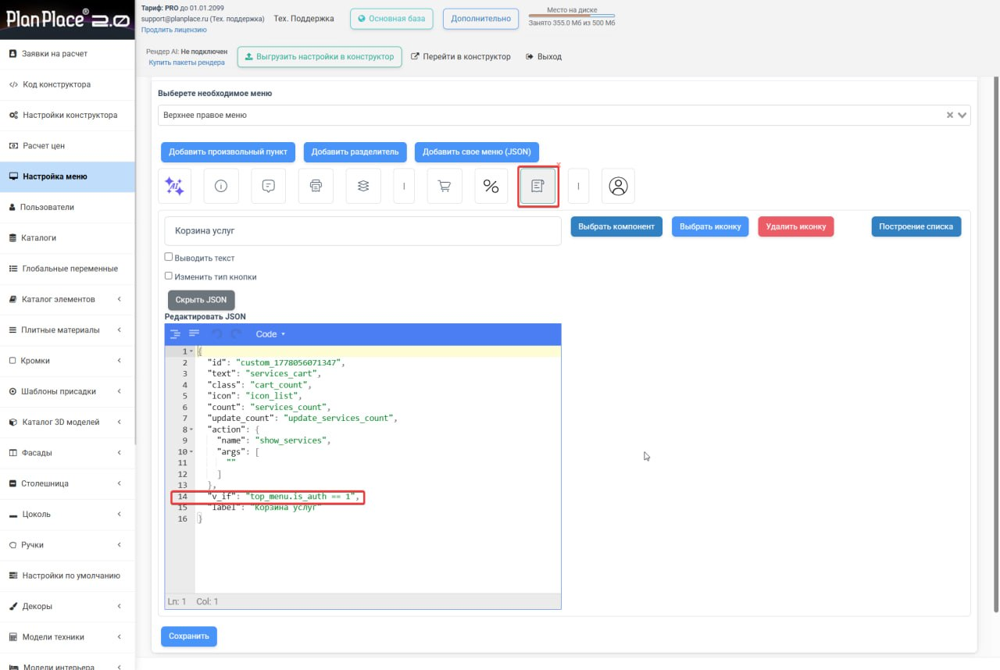

Меню планировщика — это то, чем пользуется дизайнер на [сцене](/Tilda-PlanPlace/interfeys-sceny/): разделы каталога, материалов, комплектующих, экспорта. Вы можете настроить состав и порядок этих разделов под свои задачи: убрать лишнее, добавить нужное, переименовать. В этой статье разберём, как это делается.

## Три части меню

Меню сцены делится на три области:

- **Левое меню** — основные разделы: конструкции, материалы, папки с модулями, комплектующие, проекты, экспорт.
- **Верхнее меню** — общие действия и режимы.
- **Правое меню** — настройки выбранного модуля.

Настройка меню выполняется в личном кабинете, в разделе **«Настройка меню»**: пункты можно **добавлять, удалять и переупорядочивать**.

## Как устроен редактор меню

Открыв раздел «Настройка меню», вы сначала **выбираете, какое из трёх меню редактируете** — левое, верхнее левое или верхнее правое. Каждое настраивается отдельно. Внизу страницы есть кнопка **«Сохранить»** — пока вы её не нажали, изменения не применятся; после сохранения не забудьте [выгрузить настройки в конструктор](/Tilda-PlanPlace/lichnyy-kabinet/).

### Левое меню — дерево пунктов

Левое меню редактируется как **дерево**: пункты можно перетаскивать мышью, менять порядок и вкладывать друг в друга (создавать папки с подпунктами). Каждый пункт левого меню — это либо **папка** (содержит другие пункты), либо **функциональный пункт** (открывает конкретный инструмент — например, выбор модулей или материалов).

> **Важное правило вложенности.** Внутрь **функционального пункта** (компонента) нельзя вкладывать другие пункты — система покажет ошибку «Создание дерева внутри компонента недоступно». Папки и компоненты — это разные вещи: папка группирует, компонент выполняет действие.

Добавлять пункты в левое меню можно тремя способами (кнопки над деревом):

- **«Добавить компонент»** — открывает список готовых компонентов системы (выбор модулей, материалов, конструкций, комплектующих, экспорт и т. д.). Это основной способ собрать меню из стандартных блоков.
- **«Добавить произвольный пункт»** — создаёт пустой пункт-папку, которому вы сами зададите название и иконку (удобно как заголовок-группа).
- **«Добавить свое меню (JSON)»** — вставить целиком готовую структуру меню в формате JSON (для разработчиков и переноса настроек).

### Настройка отдельного пункта

Кликнув по пункту, вы открываете его параметры справа:

- **Название** — то, что увидит дизайнер. Можно выбрать из готовых переводов (тогда подтянется ключ перевода `text`) или вписать своё. Если выбрать из списка существующих названий, текст автоматически переведётся на язык интерфейса.
- **Идентификатор (menu_id)** — технический ключ пункта. Допускает только латиницу, цифры и подчёркивание (пробелы и спецсимволы заменяются автоматически).
- **Иконка** — выбирается из набора SVG-иконок с поиском; иконку можно убрать.
- **Что показывает компонент** — у компонентов-пикеров (например, «выбор модулей» или «выбор материалов») настраивается, **какие категории** будут доступны в этом пункте. Категории выбираются деревом (можно отметить несколько). Так, например, в один пункт меню можно вывести только «Нижние модули», а в другой — «Верхние».
- **Вид списка (`list_view`)** и **глубина списка** — переключают отображение компонента в виде списка и задают, насколько глубоко раскрывать вложенные категории.
- **Редактировать JSON** — кнопка, открывающая редактор пункта целиком в формате JSON (режимы «дерево» и «код»). Нужна для тонкой настройки и нестандартных параметров.

### Верхние меню — список кнопок

Два верхних меню (левое и правое) устроены проще: это **список кнопок-действий**, а не дерево. Здесь можно:

- добавить **готовый компонент** кнопкой **«Добавить компонент»** (из доступных функций сцены);
- добавить **произвольный пункт** с собственным действием;
- через режим **«Построение списком»** собрать выпадающий список из нескольких действий;
- добавлять **разделители** (вертикальные и горизонтальные), чтобы визуально группировать кнопки;
- задавать пункту **действие** (`action`) — имя функции и её аргументы — это и есть «произвольный пункт с вызовом функции».

## Показывать пункт верхнего меню только авторизованным пользователям

Пункт верхнего меню можно скрыть от посетителей, которые открыли сцену без входа в систему. После авторизации этот же пункт появится автоматически. Например, так можно оставить корзину услуг, экспорт или служебное действие только пользователям с учётной записью.

Для этого в JSON нужного пункта добавьте условие:

```json
"v_if": "top_menu.is_auth == 1",
```

Значение `top_menu.is_auth` показывает, выполнен ли вход в систему. Условие `== 1` выполняется только для авторизованного пользователя.

### Как добавить условие

1. В личном кабинете откройте раздел **«Настройка меню»**.
2. Выберите **верхнее левое** или **верхнее правое меню**.
3. Выберите кнопку, видимость которой хотите ограничить.
4. Нажмите **«Редактировать JSON»** и переключите редактор в режим **Code** или **Text**.
5. Добавьте поле `v_if` на верхний уровень объекта выбранного пункта — рядом с `id`, `text`, `icon`, `action` и `label`.
6. Проверьте запятые: между соседними полями JSON должна стоять запятая, после последнего поля она не нужна.
7. Нажмите **«Сохранить»**, затем **«Выгрузить настройки в конструктор»**.

Пример фрагмента целиком:

```json
{
  "id": "custom_services_cart",
  "text": "services_cart",
  "icon": "icon_list",
  "action": {
    "name": "show_services",
    "args": [""]
  },
  "v_if": "top_menu.is_auth == 1",
  "label": "Корзина услуг"
}
```



*Поле `v_if` добавлено в JSON пункта «Корзина услуг» в режиме Code.*

| Условие | Кто увидит пункт |
| --- | --- |
| `"v_if": "top_menu.is_auth == 1"` | Только пользователи, которые вошли в систему |
| `"v_if": "top_menu.is_auth == 0"` | Только посетители без авторизации |

Если поле `v_if` отсутствует, пункт отображается независимо от авторизации. Условие можно добавить как к отдельной кнопке верхнего меню, так и к нужному пункту внутри выпадающего списка.

> **Важно.** `v_if` управляет только видимостью пункта на сцене. Это не механизм защиты данных и не замена проверке прав на сервере: действие, выгрузка или закрытые данные должны отдельно проверять авторизацию пользователя.

### Как проверить результат

После выгрузки настроек откройте сцену дважды:

1. без авторизации — пункт с условием `top_menu.is_auth == 1` должен быть скрыт;
2. после входа под учётной записью — пункт должен появиться.

Если пункт отображается неправильно, обновите страницу без кеша и убедитесь, что поле добавлено именно в объект нужной кнопки, JSON сохранился без синтаксических ошибок, а настройки были выгружены в конструктор.

### Удаление и порядок

- любой пункт удаляется кнопкой удаления (с подтверждением);
- порядок в левом меню меняется перетаскиванием в дереве, в верхних меню — перетаскиванием кнопок;
- всё это вступит в силу только после **«Сохранить»** и выгрузки настроек в конструктор.

## Основные разделы левого меню

**Конструкции** (окна, двери, коммуникации) — подключают [3D-модели](/Tilda-PlanPlace/3d-modeli/) соответствующих элементов окружения.

**Материалы** — выбор и переключение [групп материалов](/Tilda-PlanPlace/gruppy-plitnyh-materialov/) для стен, пола, фасадов, витрин, цоколей и 3D-моделей. Здесь же задаются материалы и переключатели по умолчанию для быстрой смены текстур.

В правом меню модуля группы материалов могут быть локальными — принадлежать вложенному узлу, а не корневому модулю. Такие группы выводятся отдельными блоками, даже если их ключ совпадает с ключом группы корпуса. При выборе материала система применяет его к владельцу локальной группы, поэтому изменения не затрагивают соседние вложенные элементы.

Для длинного списка групп доступны кнопки **«Свернуть все»** и **«Развернуть все»**. Они управляют блоками материалов и фасадов в правой панели и не меняют сами настройки проекта.

**Папки с модулями** — выводят на сцену готовые модули (комплекты элементов) из [«Каталога элементов»](/Tilda-PlanPlace/katalog-elementov/), структурированные по категориям и подкатегориям, с иконками и фильтрами. Это «витрина», из которой дизайнер берёт модули; какие папки показывать, настраивается здесь же, в настройках меню.

**Комплектующие** — список дополнительных позиций из [прайс-листа](/Tilda-PlanPlace/prays-listy/), которые можно добавить к проекту (с картинками и описаниями).

**Скидки** — настройка произвольных скидок. Важная деталь: скидки применяются к комплектующим, **но не к услугам**.

**Проекты** — быстрый доступ к [заранее собранным комплектациям](/Tilda-PlanPlace/gotovye-proekty/) мебели.

**Экспорт** — кнопки вывода проекта в [производственные программы](/Tilda-PlanPlace/eksport-v-proizvodstvo/) (БАЗИС-Мебельщик, АСАИ.Раскрой, АСАИ.Нестинг) и другие форматы.

**Рендеринг** — запуск [фотореалистичной визуализации](/Tilda-PlanPlace/rendering-vizualizaciya-ii/).

## Раздел быстрой замены фурнитуры

Отдельный раздел меню позволяет быстро менять модели фурнитуры — [петли, направляющие, опоры](/Tilda-PlanPlace/prisadki/) — с привязкой к [каталогу элементов](/Tilda-PlanPlace/katalog-elementov/) и настройкам по умолчанию. Это удобно, когда нужно разом поменять тип фурнитуры во всём проекте.

## Иконки

Для пунктов меню можно выбирать иконки из доступного набора. Загрузка собственных иконок пока выполняется через поддержку.

## Произвольные пункты меню (для разработчиков)

Кроме готовых компонентов, можно создавать **собственные пункты** с вызовом кастомных функций. Для верхних меню это пункт с **действием** (`action`: имя функции и аргументы). Для любого меню доступна вставка целиком через **«Добавить свое меню (JSON)»** и тонкая правка пункта через **«Редактировать JSON»**. Это инструмент для программистов — он позволяет добавить нестандартное действие или интеграцию.

## Чистота меню — забота о пользователе

> **Совет.** Регулярно убирайте из меню устаревшие и нерабочие кнопки. Чем чище и понятнее меню, тем быстрее дизайнер находит нужное и тем меньше ошибок. Оставляйте только те разделы, которые реально используются в вашей работе.

## Коротко

Меню планировщика состоит из трёх настраиваемых частей: левого (дерево пунктов с папками и компонентами) и двух верхних (списки кнопок-действий). В редакторе «Настройка меню» вы выбираете нужное меню, добавляете готовые компоненты, произвольные пункты или вставляете структуру через JSON, настраиваете название, иконку и доступные категории каждого пункта, а порядок меняете перетаскиванием. Внутрь компонента вкладывать пункты нельзя. После правок жмите «Сохранить» и выгружайте настройки в конструктор. Держите меню чистым — это удобнее пользователю.

