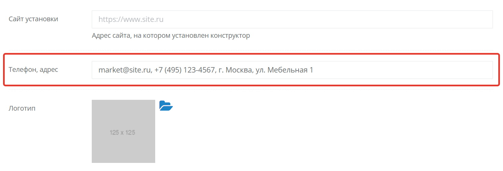
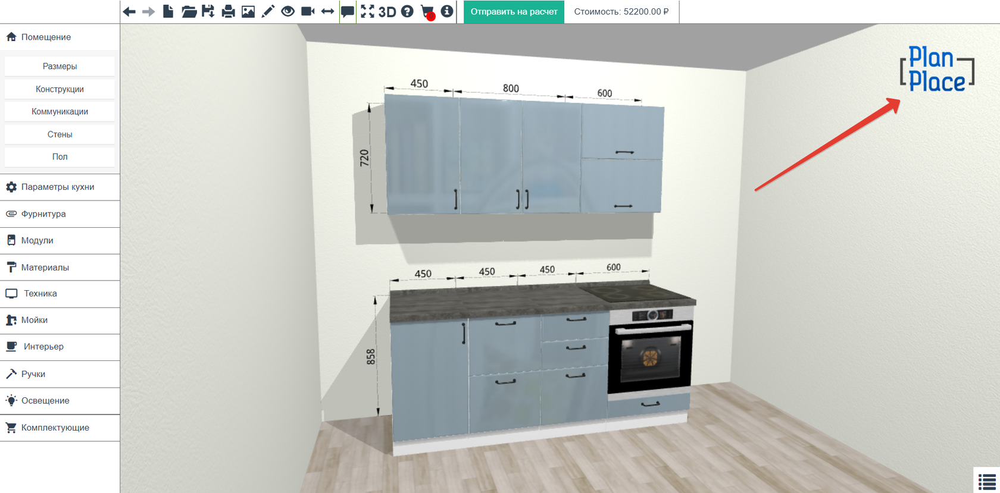
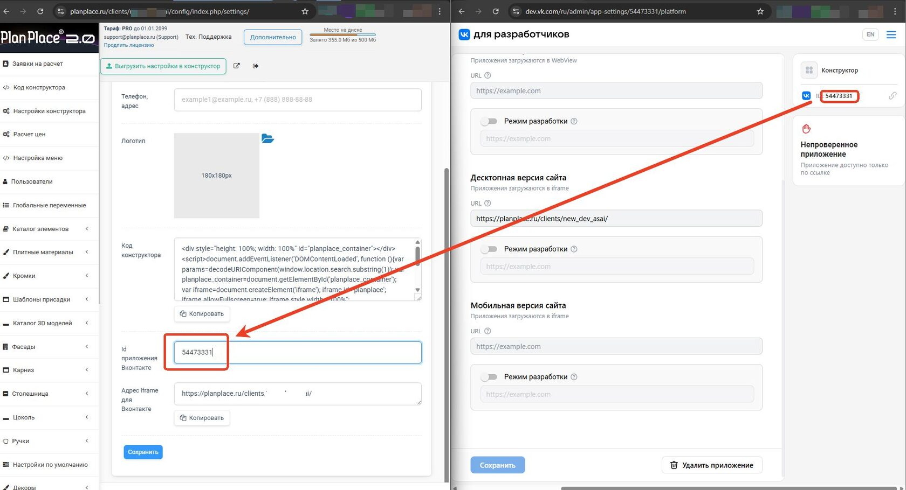
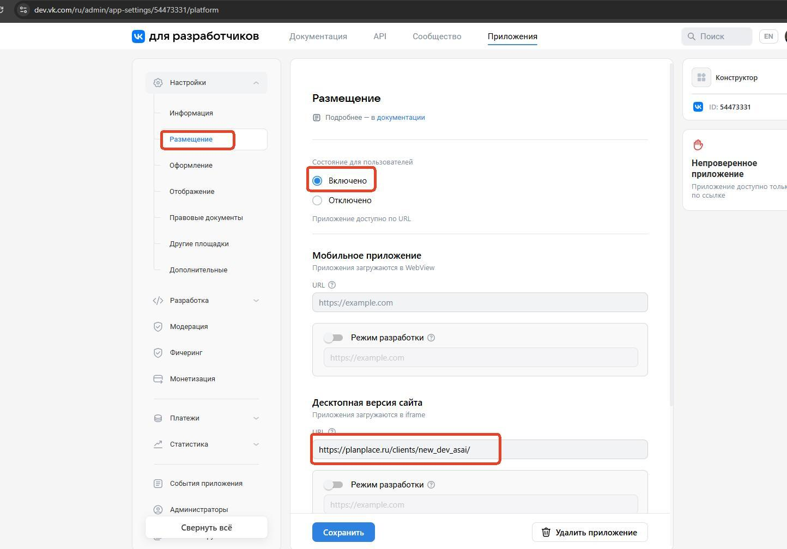
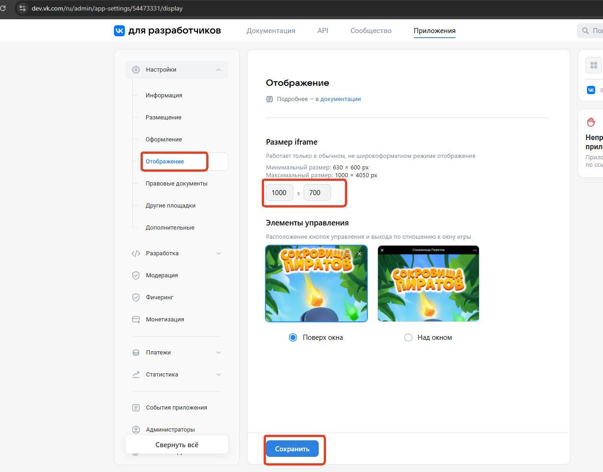
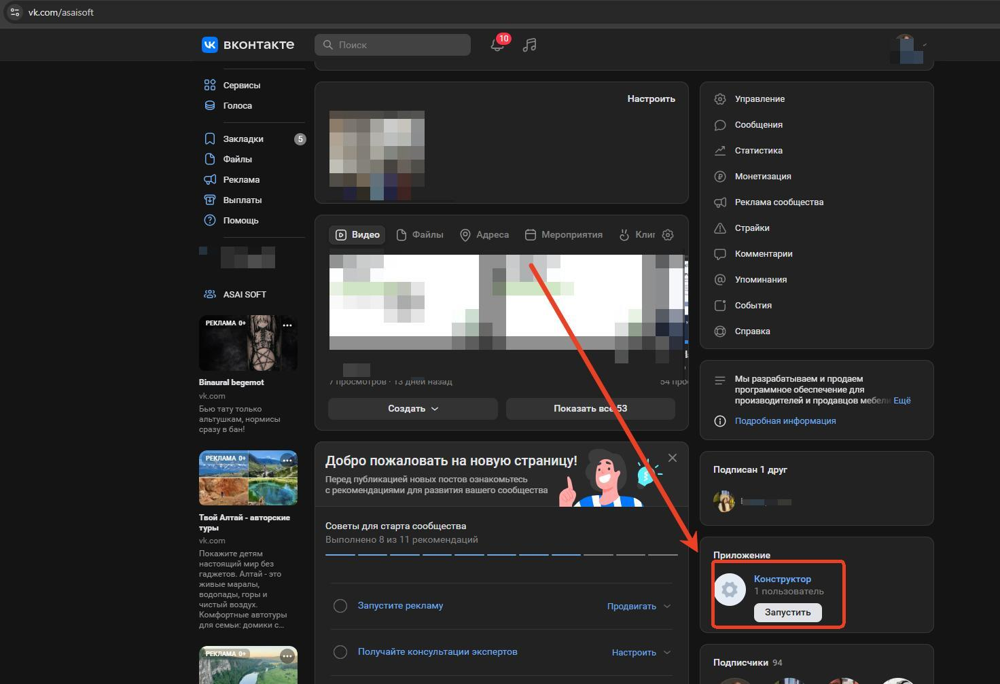

## E-mail для заявок

Введите адрес электронной почты для получения заявок с конструктора. Поддерживается
указание нескольких адресов через запятую.

**Важно:** заявки приходят с адреса order@planplace.ru. Проверьте папку «Спам», если
письма отсутствуют во «Входящих».

## Сайт установки

Укажите доменное имя вашего сайта (необязательно). Если конструктор не будет встроен на
сайт, используйте ссылку, открываемую кнопкой «Перейти в конструктор».

## Телефон, адрес

Данные из этого поля отображаются:

- в нижней части каждого листа спецификации;
- на скриншотах проектов.

Здесь можно указать любую информацию: сайт, название бренда и прочее.

## Логотип

**Требования к изображению:**

- Формат: jpeg или png.
- Размер: не более 300×300 px.
- Вес: не более 100 KB.

**Полезные инструменты:**

- Изменение размера: <https://www.iloveimg.com/ru/resize-image>
- Сжатие файла: <https://www.iloveimg.com/ru/compress-image>

## Код конструктора

Скопируйте HTML-код для встраивания конструктора на страницу сайта.

**Параметры по умолчанию:**

- Ширина и высота установлены на 100%.
- Значения действуют в рамках блока-контейнера.
- Минимальная высота: 700 px.

Для изменения габаритов регулируйте размеры блока с кодом.

## Встраивание в ВКонтакте

Встраивание доступно для тарифов «Профессиональный» (с опцией) и «Бизнес».

**Пошаговая инструкция:**

1. Скопируйте адрес iframe из личного кабинета конструктора.
2. Авторизуйтесь в ВК и перейдите на <https://dev.vk.com/>.
3. Откройте вкладку «Приложения» и создайте новое приложение.
4. Скопируйте ID приложения и вставьте в личный кабинет PlanPlace.
5. Привяжите приложение к сообществу во вкладке «Информация».
6. Вставьте адрес iframe во вкладке «Размещение».
7. Загрузите иконки во вкладке «Оформление».
8. Установите размер iframe 1000 × 700 px во вкладке «Отображение».
9. Проверьте результат на странице сообщества.

