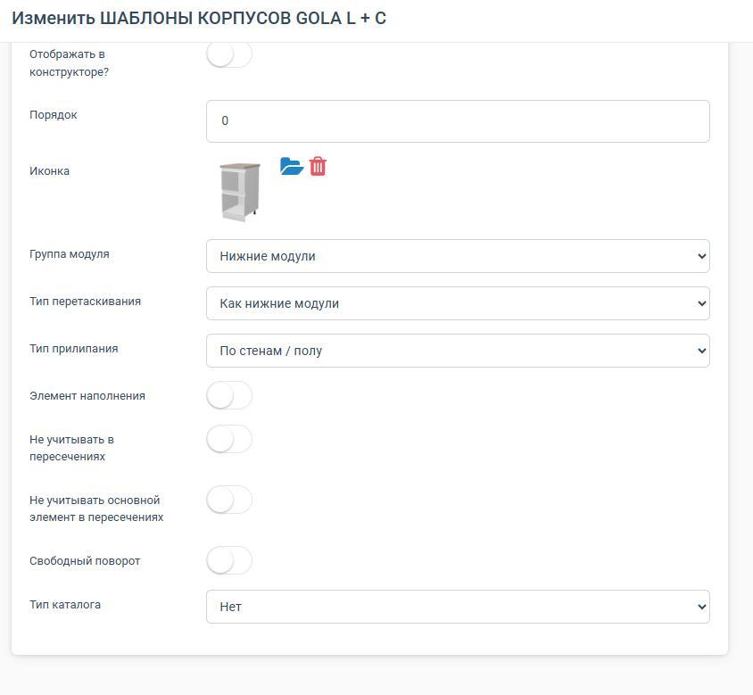
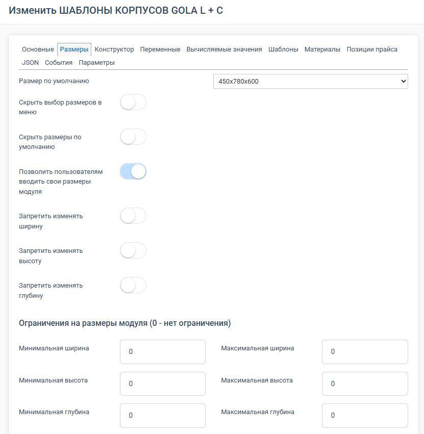
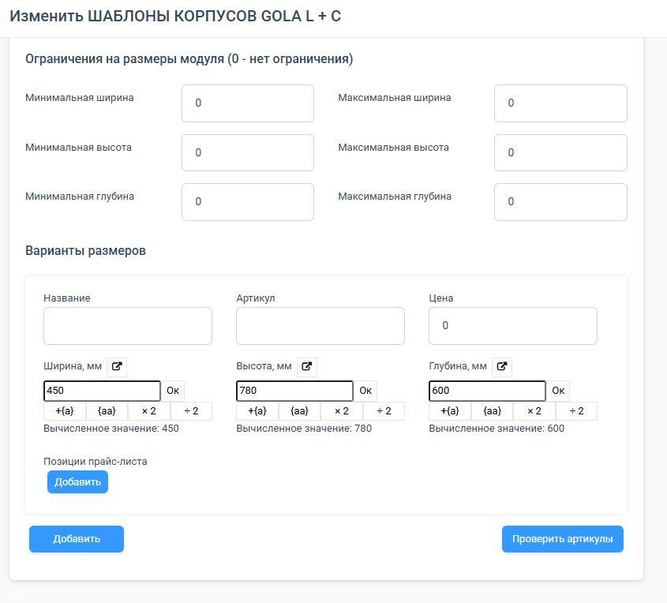
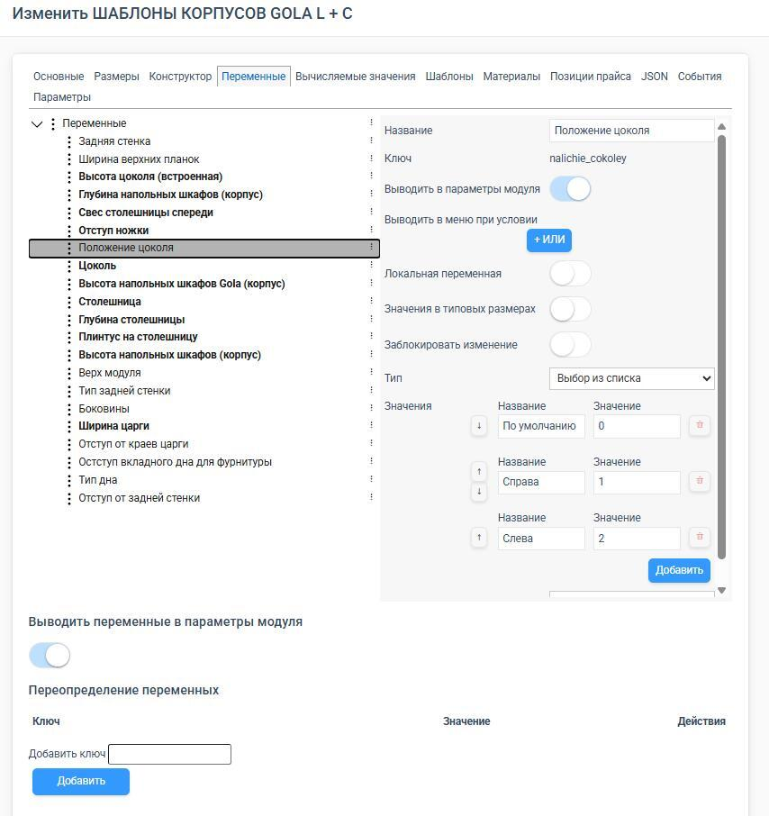
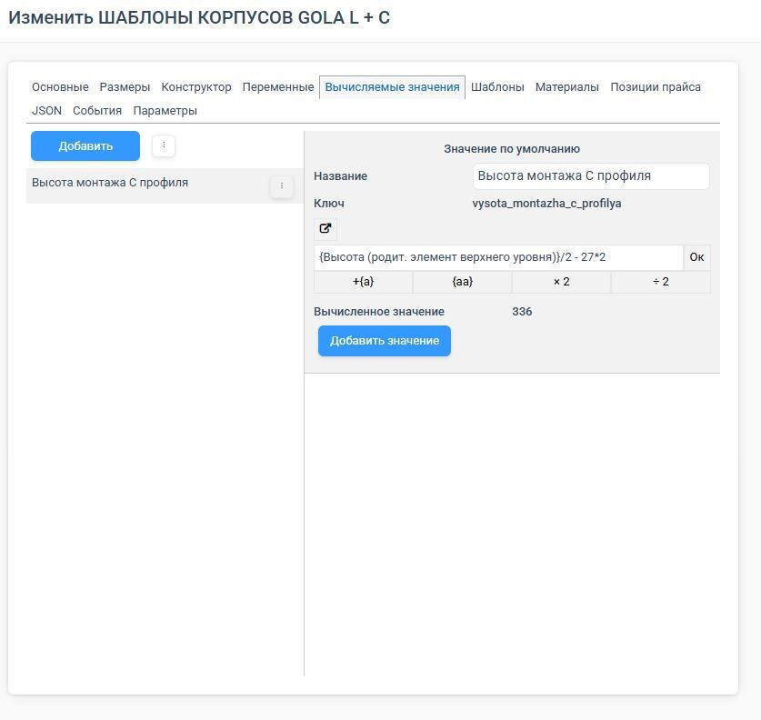
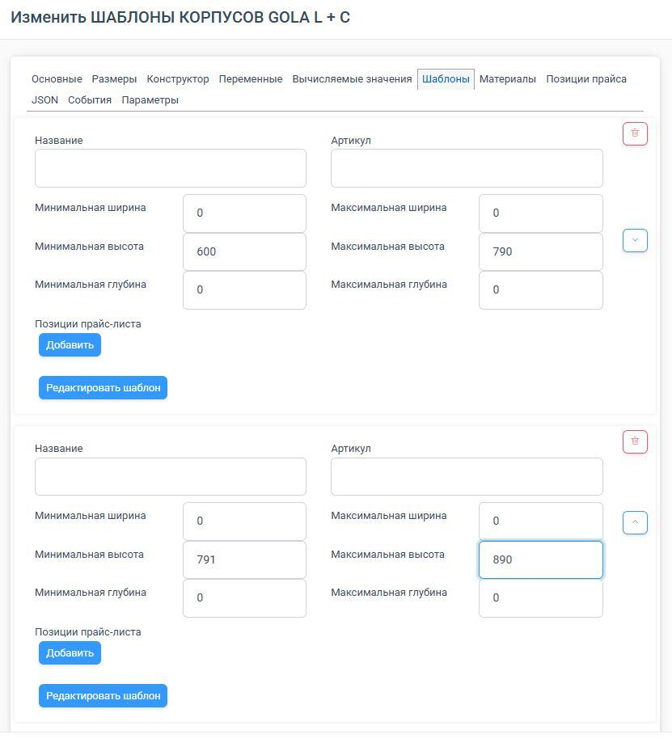
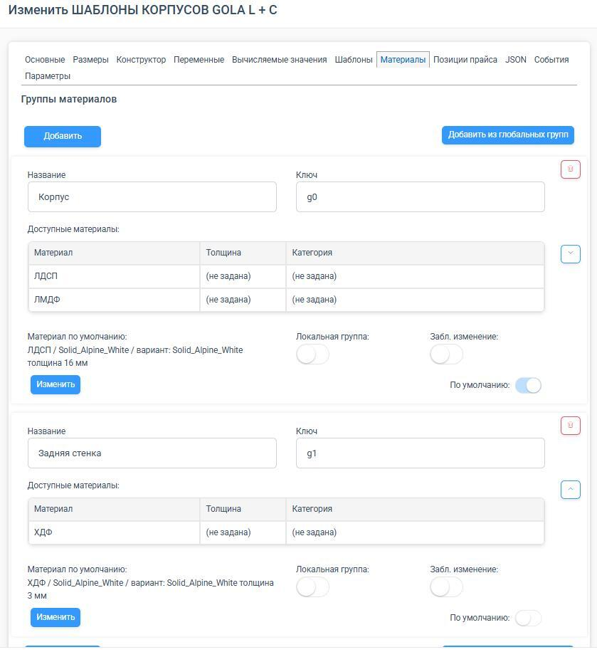
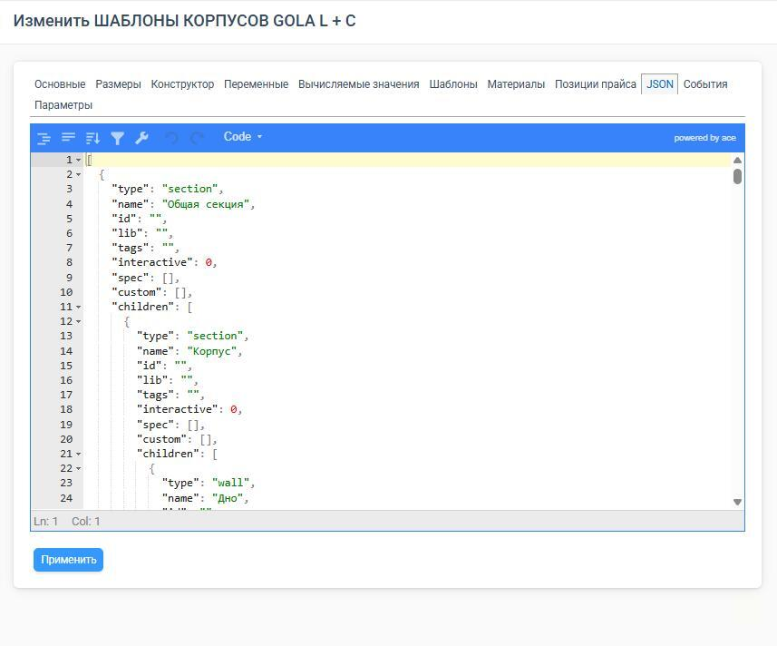

Конфигуратор элемента — это «мастерская», где каждый элемент каталога получает свои свойства, размеры, конструкцию, материалы и цену. Раньше такие объекты называли модулями, сейчас правильнее говорить «элементы». В этой статье дадим общую карту конфигуратора: какие у него вкладки, за что каждая отвечает и как они связаны. Это «оглавление» для всего раздела про конфигуратор.

## Интерфейс: две панели

Окно конфигуратора разделено на две части:

- **Левая панель** — вкладки с параметрами элемента.
- **Правая панель** — визуальный предпросмотр изделия в 3D.

В предпросмотре можно вращать изделие, менять его размеры, переключать режимы отображения:

- **контуры** (без цветов) и **прозрачные контуры** (чтобы видеть внутреннюю структуру);
- **сброс камеры** в исходное положение;
- переключение между **3D** и **2D-проекцией** для точной проверки выравнивания и зазоров;
- показ/скрытие **кромок**;
- переключение материалов для проверки, как конструкция подстраивается под разные толщины;
- автоматическое создание **иконки** из текущего вида.

## Вкладки конфигуратора и их смысл

Вкладки разделяют настройку по смыслу, чтобы не валить всё в кучу. Вот они по порядку.

**1. Основные** — «паспорт» элемента. Здесь задают название, категории, участие в спецификации, отображение в конструкторе, порядок, иконку, группу и тип модуля, тип перетаскивания и прилипания, признак элемента наполнения, поведение при пересечениях. Эта вкладка определяет, **где элемент виден** и **как ведёт себя на сцене**.

<Carousel>

</Carousel>

**2. Размеры** — габариты и правила их изменения: ширина, высота, глубина; минимальные и максимальные ограничения; можно ли менять размеры пользователю; типовые размеры; формулы. Подробнее — [«Параметры, формулы и позиционирование»](/Tilda-PlanPlace/parametry-formuly-pozicionirovanie/).

<Carousel>

</Carousel>

**3. Конструктор** — главное рабочее поле, где элемент собирается из частей: [секций](/Tilda-PlanPlace/sekcii-i-napolnyaemye-sekcii/), [деталей](/Tilda-PlanPlace/detali/), [фасадов](/Tilda-PlanPlace/fasady-i-ruchki/), [3D-моделей](/Tilda-PlanPlace/3d-modeli/), столешниц, цоколей, [присадок](/Tilda-PlanPlace/prisadki/), [пазов и вырезов](/Tilda-PlanPlace/pazy-i-vyrezy/). Здесь же задаются размеры, позиции, точки отсчёта, повороты, формулы и условия показа.

<Carousel>

</Carousel>

**4. Переменные** — управляемые параметры элемента: служебные размеры, отступы, включение/выключение опций. См. [«Переменные модуля»](/Tilda-PlanPlace/peremennye-modulya/).

**5. Вычисляемые значения** — служебные расчёты, которые вычисляются автоматически на основе других параметров. См. [«Вычисляемые значения»](/Tilda-PlanPlace/vychislyaemye-znacheniya/).

**6. Шаблоны** — альтернативные варианты конструкции для разных диапазонов размеров. См. [«Шаблоны модулей»](/Tilda-PlanPlace/shablony-moduley/).

**7. Материалы** — из чего элемент сделан: материалы корпуса, задней стенки, фасадов; группы материалов; материал по умолчанию; фиксация; направление текстуры; кромки по сторонам. Эта вкладка отвечает сразу за внешний вид, толщины деталей и расчёт стоимости.

**8. Позиции прайса** — дополнительные позиции (комплектующие, фурнитура, услуги), которые должны попасть в стоимость и спецификацию именно этого элемента. См. [«Прайс-листы»](/Tilda-PlanPlace/prays-listy/).

**9. JSON / События / Параметры** — техническая вкладка для сложной кастомной логики через скрипты. Большинству пользователей сюда заходить не нужно. См. [«Условия отображения и события»](/Tilda-PlanPlace/usloviya-otobrazheniya-i-sobytiya/).

## Как вкладки связаны между собой

Конфигуратор — это не набор разрозненных вкладок, а **одна цепочка**: от описания и размеров — к конструкции, материалам и расчёту.

- **Размеры** задают рамки, на которые ориентируются все детали в **Конструкторе**.
- **Переменные** и **Вычисляемые значения** подставляются в формулы внутри **Конструктора** и в типовые размеры.
- **Материалы** дают деталям толщину, которая участвует в формулах, и определяют расчёт.
- **Шаблоны** подгружают разные деревья конструкции в зависимости от размеров.
- **Позиции прайса** добавляют к стоимости то, что не считается из материалов автоматически.

## Главное правило про формулы

> **Формулы не видны пользователю сцены.** Дизайнер, продавец и клиент не видят и не могут вводить формулы. Задача формул — чтобы администратор один раз настроил умное поведение, а пользователь только переключал разрешённые переменные, и конструкция подстраивалась сама.

## С чего начать новичку

Не пытайтесь освоить все вкладки сразу. На старте достаточно пяти опорных:

1. **Основные** — чтобы элемент появился, где нужно.
2. **Размеры** — чтобы он менялся правильно.
3. **Конструктор** — чтобы он был собран правильно.
4. **Материалы** — чтобы он выглядел и считался правильно.
5. **Переменные** — для гибкости.

Остальные вкладки (Шаблоны, Позиции прайса, JSON/События) подключаются, когда база становится сложнее.

## Коротко

Конфигуратор элемента собирает изделие из частей и задаёт ему размеры, материалы и цену. Вкладки идут логической цепочкой: Основные → Размеры → Конструктор → Переменные/Вычисляемые → Материалы → Шаблоны → Позиции прайса → JSON. Начните с пяти базовых вкладок, а дальше двигайтесь по статьям этого раздела.
