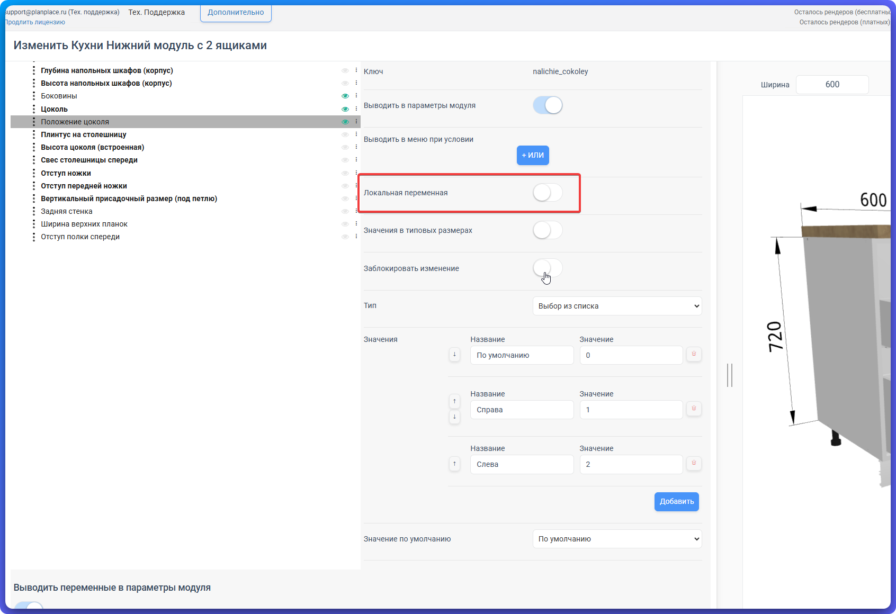

Помимо [глобальных переменных](/Tilda-PlanPlace/globalnye-peremennye/), у каждого модуля есть свои, локальные переменные — на вкладке «Переменные» в конфигураторе. Это мощный инструмент гибкой настройки без программирования. В этой статье разберём, как создавать переменные модуля, выводить их пользователю и каскадно переопределять для вложенных элементов.

## Локальные переменные: те же типы

Переменные модуля бывают тех же трёх типов, что и глобальные:

- **Число** — с минимальным, максимальным значением и шагом;
- **Список** — выбор из готовых вариантов, у каждого есть текстовое название и числовое (системное) значение;
- **Да/Нет** — логический переключатель.

Разница в области действия: локальная переменная работает **только внутри своего модуля**, а глобальная — по всему каталогу.

## Что переменные умеют

Через переменные модуля управляют:

- видимостью секций и деталей;
- размерами и отступами;
- положением элементов;
- включением/выключением опций (например, «есть цоколь» / «нет цоколя»).

## Вывод переменной на сцену

У каждой переменной есть настройка, **показывать ли её пользователю на сцене**. Если показать — дизайнер увидит переключатель в параметрах модуля и сможет менять значение. Если скрыть — переменная остаётся служебной, для внутренней логики.

Так вы решаете, что отдать «на откуп» дизайнеру (например, выбор стороны открывания двери), а что спрятать (служебные отступы и расчётные параметры).

## Условное отображение переменных

Переменную можно показывать **только при выполнении условия**. Классический пример: переключатель «Цоколь» включён — показываем дополнительные параметры цоколя (его высоту); выключен — прячем их. Это убирает лишние опции из интерфейса и не путает пользователя.

## Связь с типовыми размерами

Значения переменных можно связать с **типовыми размерами**. Тогда при выборе размера модуля автоматически подставятся нужные значения переменных. Удобно для серийных изделий с фиксированными типоразмерами.

## Переопределение для вложенных модулей

Это ключевая возможность. Модули вложены друг в друга (модуль → корпус → ящик), и переменные можно **переопределять каскадно, сверху вниз**.

Пример: у вас есть модуль с несколькими ящиками. Вместо того чтобы настраивать каждый ящик отдельно, вы задаёте значение переменной на уровне родительского модуля, и оно распространяется на все вложенные ящики. Поменяли родителя — изменились все «дети».

Также можно **импортировать переменные из вложенных модулей** наверх — чтобы управлять ими централизованно из одного места.

## Переключатель «Локальная переменная»

В настройках каждой переменной есть переключатель **«Локальная переменная»**. Он определяет, как переменная поведёт себя, когда модуль окажется **внутри составного изделия** — то есть будет вложен в другой модуль или комплект.

- **Выключен** (по умолчанию) — переменная общая на всё изделие. В параметрах самого вложенного модуля она не показывается: управлять ею можно только с уровня всего изделия, в группе «Параметры (вложенные)». Заданное там значение применяется сразу ко всем вложенным модулям, у которых есть переменная с таким же ключом.
- **Включён** — переменная становится индивидуальной. Она появляется в параметрах самого вложенного модуля, и каждый экземпляр хранит собственное значение, независимое от соседей.

Пока модуль используется сам по себе и ни во что не вложен, переключатель ни на что не влияет — переменная в любом случае видна в его параметрах.

### Пример: модуль с двумя ящиками

Возьмём нижний кухонный модуль, внутри которого два вложенных ящика. У каждого ящика есть переменная-список «Тип направляющих» (обычные / с доводчиком).

- Если флаг «Локальная переменная» **не проставлен**, дизайнер увидит один общий пункт «Тип направляющих» в параметрах всего модуля. Выбор применится сразу к обоим ящикам — сделать их разными не получится.
- Если в каждом ящике флаг **проставлен**, пункт «Тип направляющих» появится в параметрах каждого ящика отдельно. Дизайнер сможет поставить верхний ящик на обычные направляющие, а нижний — на направляющие с доводчиком.

Правило простое: общие для всего изделия настройки оставляйте без флага и управляйте ими сверху, а настройки, которые должны отличаться от экземпляра к экземпляру, помечайте как локальные.

### Изменение переменной на сцене

В левом меню дизайнер выбирает значение для проекта или группы модулей. В правом меню — для конкретного выбранного изделия. Если переменная должна отличаться у отдельного вложенного элемента, включите для неё **«Локальная переменная»**: тогда она появится в параметрах этого элемента и не будет перезаписана общим выбором родителя.

При проверке составного модуля измените параметр сначала слева, затем справа у одного вложенного элемента. Убедитесь, что общие элементы меняются вместе, а локальный хранит собственное значение после перестроения модуля.

## Копирование и блокировка

- **Копирование и вставка групп переменных** между модулями — экономит время при создании похожих изделий. Важно учитывать порядок вычислений и зависимости, чтобы ничего не сломалось.
- **Блокировка изменения переменных** — защищает от случайных правок.
- **Скрытие переменных из интерфейса** — упрощает работу дизайнера, оставляя только нужное.

## Группировка переменных

Когда переменных много, их удобно объединять в **группы** для наглядности. Искать конкретную переменную в длинном списке помогает обычный браузерный поиск `Ctrl+F`.

## Практический пример

Переключатель «Парящая база»:

1. Создаёте переменную типа «Да/Нет» с названием «Парящая база».
2. Создаёте числовую переменную «Высота базы» с диапазоном 0–200 мм.
3. Настраиваете условное отображение: «Высоту базы» показывать, только если «Парящая база» = Да.
4. В формулах позиционирования опор используете «Высоту базы».
5. Выводите оба переключателя дизайнеру.

Теперь дизайнер включает парящую базу, задаёт её высоту — и модуль сам приподнимается.

## Коротко

Переменные модуля — это локальные управляемые настройки тех же трёх типов (число, список, да/нет). Их можно выводить дизайнеру или прятать, показывать по условию, связывать с типовыми размерами и каскадно переопределять для вложенных элементов. Переключатель «Локальная переменная» решает, будет ли переменная у вложенного модуля общей на всё изделие или индивидуальной для каждого экземпляра. Это основной способ сделать модуль гибким без единой строчки кода.

