Плитные материалы — это листовые материалы, из которых делается корпус мебели: ЛДСП, ХДФ, ЛМДФ, стекло, зеркало, стеновые панели, шпон. В отличие от [декоров](/Tilda-PlanPlace/dekory-i-tekstury/) (это просто картинки), плитный материал — это «настоящая плита» с физическими размерами, толщиной, кромками и ценой. В этой статье разберём, как они устроены и как их настраивать.

## Чем плита отличается от декора

Простая аналогия: декор — это плёнка/рисунок, а плитный материал — это **сама плита**, на которую этот рисунок нанесён. У плиты есть то, чего нет у декора:

- **толщина** (16 мм, 18 мм, 8 мм и т. д.);
- **физические размеры листа**;
- **набор кромок**, которыми можно облицевать торцы;
- **цена** и способ её расчёта.

В системе плита представлена как параллелепипед (брусок) с натянутой текстурой декора.

## Толщина — технологический параметр

Толщина плиты **фиксируется и не меняется пользователем на сцене** — это технологический параметр, от которого зависит вся конструкция. Один и тот же декор может существовать в нескольких толщинах — например, ЛДСП «Белый» в 16 мм для корпуса и в 8 мм для задней стенки. В системе это будут разные варианты одного материала.

## Связь с кромками

Каждый плитный материал привязан к **набору кромок**, которыми облицовываются его торцы. Рекомендуется для каждого плитного материала задавать отдельный набор кромок — так удобнее управлять и не запутаться. Кромки, которые материал не поддерживает, в интерфейсе просто не покажутся. Подробно — в статье [«Кромочные ленты»](/Tilda-PlanPlace/kromochnye-lenty/).

## Параметры отображения

У плиты те же параметры внешнего вида, что и у декора: текстура, реальные размеры в миллиметрах, шероховатость, металличность, прозрачность. Для стекла и зеркала, например, настраивается прозрачность и высокий глянец. Все эти параметры задаются на вкладке **«Параметры отображения»** в карточке материала.

### Односторонние материалы

Некоторые плиты в реальности **разные с двух сторон**. Типичный пример — **МДФ**: лицевая сторона может иметь любой декор, текстуру, покраску или плёнку, а изнанка почти всегда одна и та же — чаще всего просто **белая** («сигнальный белый»). Чтобы не заводить отдельный материал под каждую комбинацию «лицо + изнанка», включите переключатель **«Односторонний материал»**.

Как это работает:

1. На вкладке **«Параметры отображения»** включите переключатель **«Односторонний материал»**.
2. Ниже появится строка выбора материала **фиксированной (обратной) стороны** — по умолчанию это белый декор (на скриншоте — **«909: Сигнальный белый»**).
3. При необходимости поменяйте фиксированную сторону: **карандаш** — отредактировать её параметры, **иконка-ссылка** — открыть этот декор в отдельном окне.
4. Основные параметры отображения (текстура, цвет, покраска, плёнка) при этом остаются за **лицевой** стороной — её вы настраиваете как обычно, выбирая разные декоры.

Так одна лицевая настройка сочетается с общей белой изнанкой: на сцене и в визуализации плита выглядит корректно с обеих сторон, а в каталоге не плодятся лишние материалы.

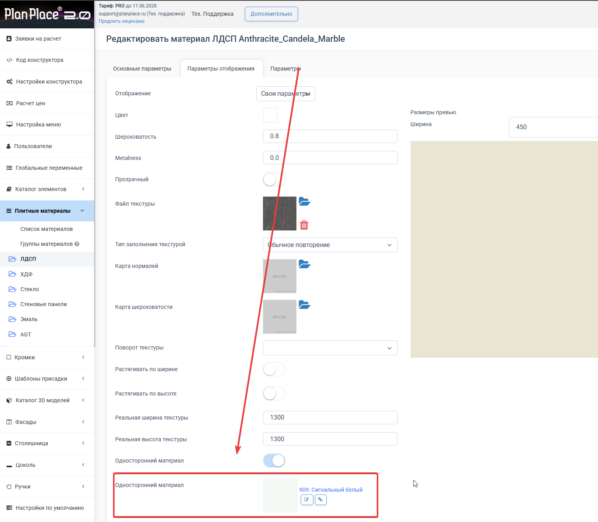

## Ценообразование плитных материалов

Цену плиты можно задать тремя способами (общая логика расчётов описана в статье [«Доступные типы расчётов»](/Tilda-PlanPlace/dostupnye-tipy-raschetov/)):

1. **Ручной ввод цены** — вы просто пишете цену материала. Подходит небольшим производствам с ограниченным ассортиментом.
2. **Цена за категорию материала** — единая цена на целую группу (например, на весь ЛДСП одного поставщика). Удобно, когда десятки декоров стоят одинаково.
3. **Привязка по артикулу из прайс-листа** — цена берётся из [прайс-листа](/Tilda-PlanPlace/prays-listy/) по артикулу. **Рекомендуется для средних и крупных производств**: обновили цену в прайс-листе — она автоматически применилась ко всем связанным материалам. Это же открывает путь к автоматическому обновлению цен через интеграцию с 1С и CRM.

Массовый ввод и редактирование цен на плиты подробно описаны в статье [«Массовое редактирование плит»](/Tilda-PlanPlace/massovoe-redaktirovanie-plit/).

## Как добавить плитный материал

### Шаг 1. Создайте вид материала

1. Откройте **«Плитные материалы» → «Список материалов»** в левом меню и нажмите **«Добавить»**.
2. Заполните основные поля:
   - **Название** — тип материала, например «ЛМДФ»;
   - **Набор кромок** — например «Кромки ЛМДФ» (см. [«Кромочные ленты»](/Tilda-PlanPlace/kromochnye-lenty/));
   - **Выбор кромки в меню** — включите, если дизайнер сможет менять кромку на сцене.
3. Нажмите **«Сохранить и выйти»** — новый вид появится в таблице и в левом меню.

<Carousel>

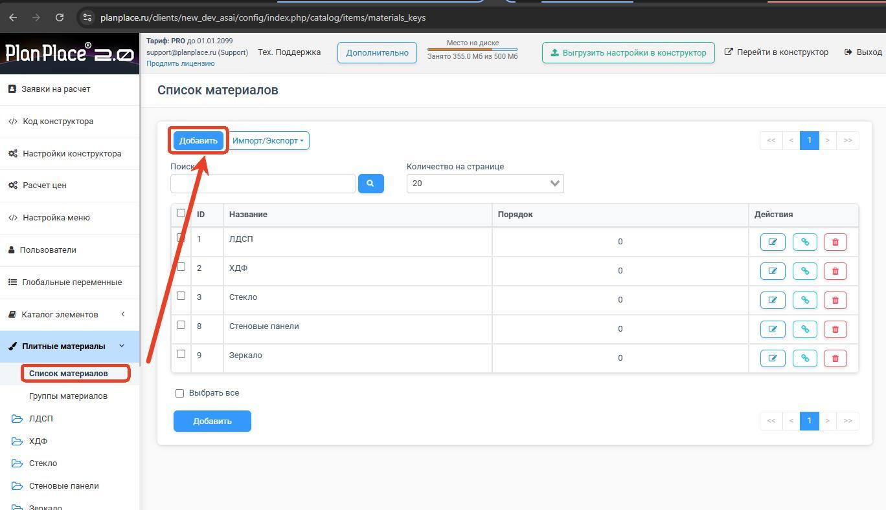

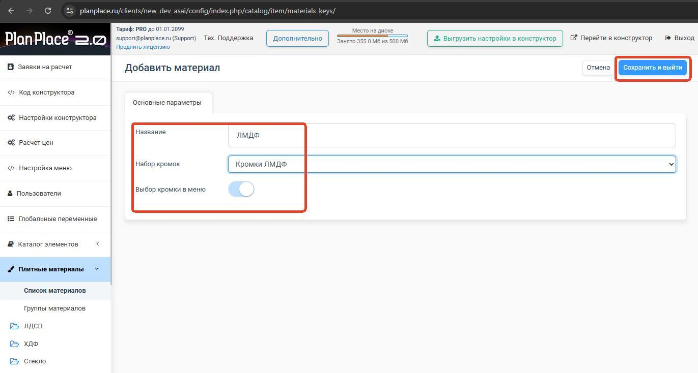

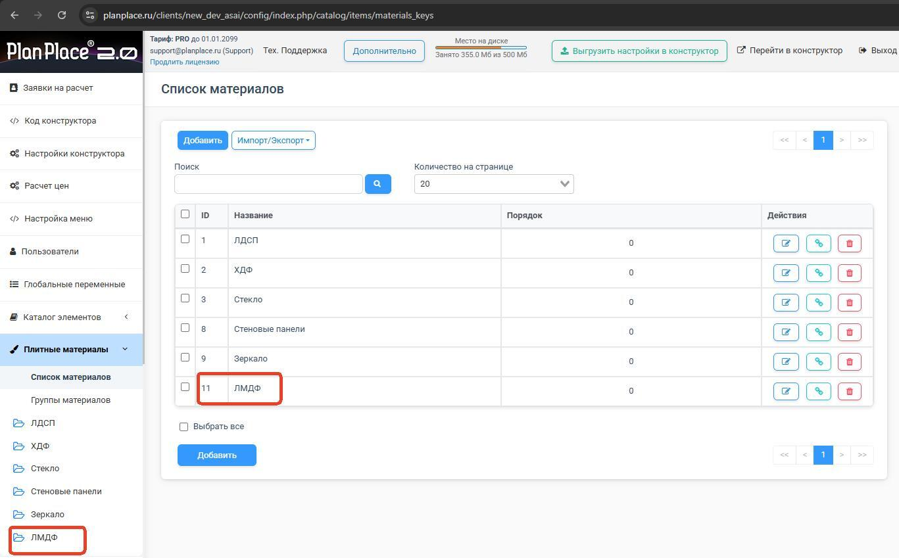

</Carousel>

### Шаг 2. Добавьте категории

1. Откройте созданный вид (например, «ЛМДФ») в левом меню и нажмите **«Категории»**.
2. Нажмите **«Добавить»**, задайте **Название** (например, «Однотонные»), при необходимости укажите **Родительскую категорию** (или «Нет» для верхнего уровня) и **Описание**.
3. Нажмите **«Добавить»**.

<Carousel>

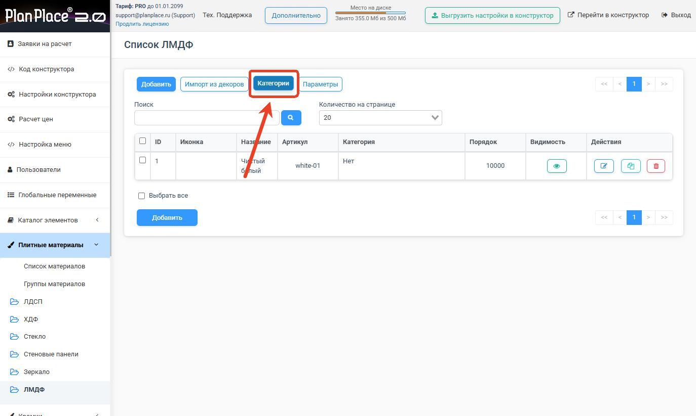

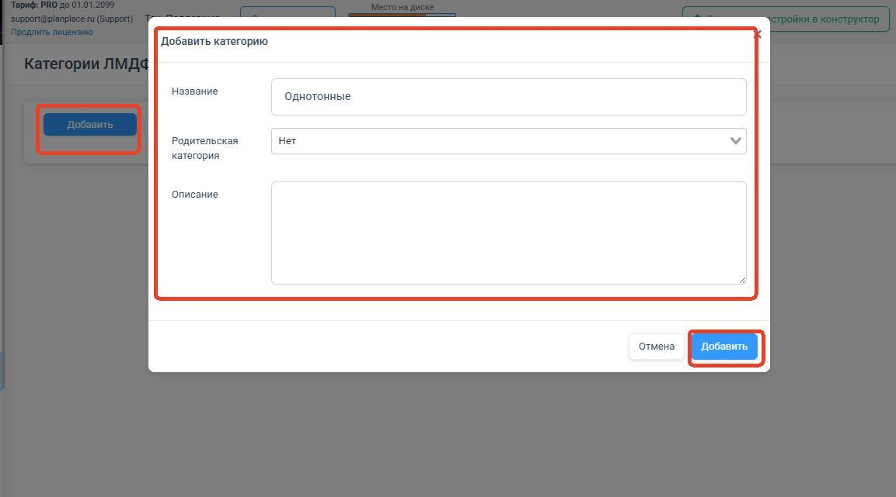

</Carousel>

## Варианты исполнения и параметры листа

Один материал (декор) может выпускаться в нескольких толщинах и форматах листа — в системе это **варианты исполнения**.

> **Автоподбор вариантов.** В настройках вида плитного материала есть переключатель **«Автоподбор вариантов»**: с ним система сама выбирает подходящий вариант (толщину/формат) в [спецификации](/Tilda-PlanPlace/specifikaciya-i-otpravka-na-raschet/), а не только вариант по умолчанию. Параметр поддерживается и в [импорте/экспорте XLS](/Tilda-PlanPlace/massovoe-redaktirovanie-plit/).

### Поштучное добавление варианта

1. Откройте нужный вид материала в левом меню и нажмите **«Добавить»**.
2. На вкладке **«Основные»** заполните: **Название** (например, «Чистый белый»), **Артикул** (например, «white-01»), **Категории**, переключатель **«Отображать в конструкторе?»**, **Порядок** (например, «10000») и при желании **Иконку**.
3. На вкладке **«Параметры отображения»** выберите готовый декор из каталога **или** включите **«Свои параметры»** (цвет, шероховатость, металличность, прозрачность, файлы текстур и реальные размеры).
4. На вкладке **«Параметры»** укажите **Набор кромок** и заполните блок **«Варианты»**.

<Carousel>

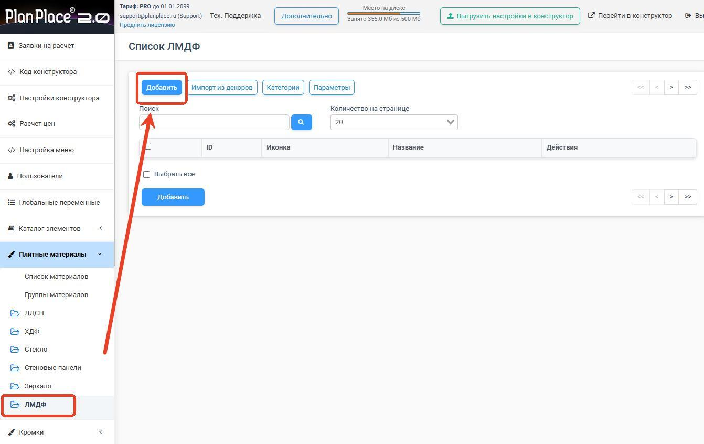

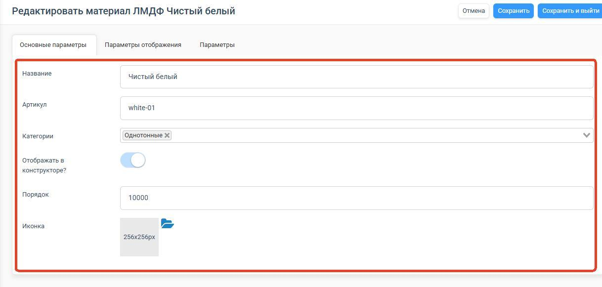

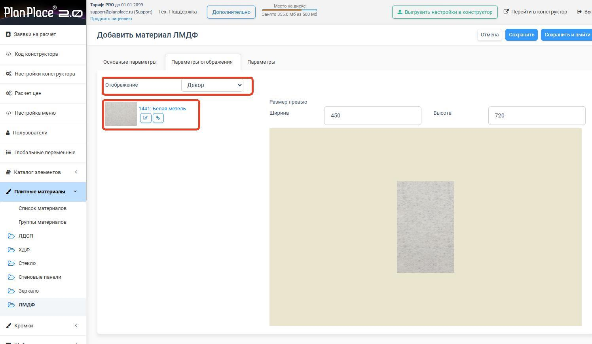

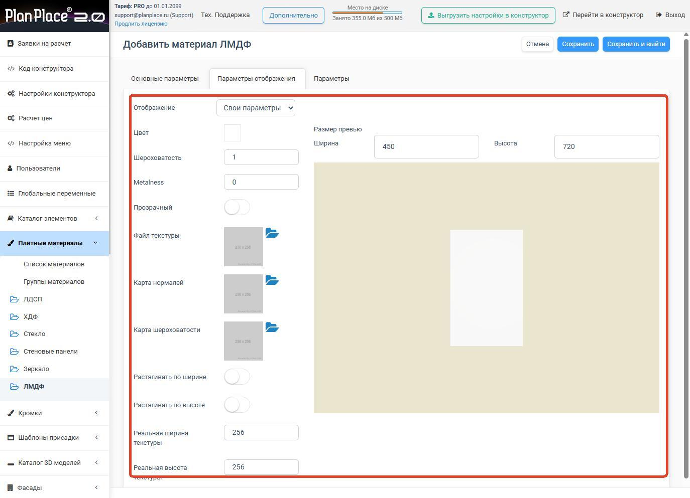

</Carousel>

В блоке **«Варианты»** каждая толщина/формат добавляется кнопкой **«Добавить»**. Для каждого варианта указываются:

- **Название** (например, «Чистый белый толщина 16 мм»);
- **Артикул** (например, «Чистый белый_16»);
- **Длина, ширина, толщина листа, мм**;
- **Тип расчёта** (по штукам, погонным или квадратным метрам — см. [«Доступные типы расчётов»](/Tilda-PlanPlace/dostupnye-tipy-raschetov/));
- **Ввод цен** (ручной, поиск по артикулу из прайс-листа или привязка к позиции);
- **Коэффициент отхода, в %** (см. ниже).

После заполнения нажмите **«Сохранить и выйти»** — готовый вариант появится в списке.

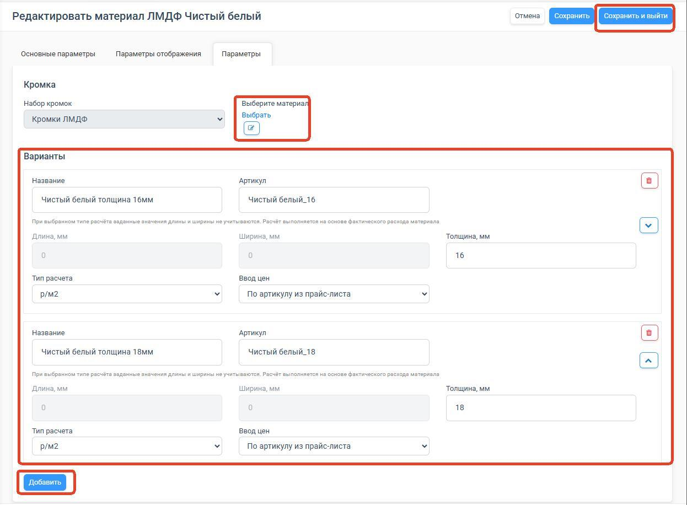

## Коэффициент отхода материала

Раскрой в PlanPlace не выполняется, поэтому система не знает реальный процент отхода на вашем производстве. Чтобы смета учитывала запас на отходы, дополнительные работы и непредвиденные потери, у каждого варианта плиты есть поле **«Коэффициент отхода, в %»**.

Как он работает:

- влияет **не на стоимость, а на итоговое количество материала** — в [спецификации](/Tilda-PlanPlace/specifikaciya-i-otpravka-na-raschet/) рассчитанный расход увеличивается на заданный процент (+%);
- применяется к типам расчёта **шт., п.м., м² и р/хлыст (п.м.)**;
- для расчёта **по штукам (р/шт.)** действует **поверх** округления: сначала площадь деталей увеличивается на процент отхода, затем результат округляется вверх до целого листа;
- **не действует для м³** — для массива и пиломатериала запас закладывайте в цену за кубометр.

Например, при коэффициенте 10 % и расчётном расходе 8 м² в спецификацию попадёт 8,8 м². Это удобный встроенный способ заложить КИМ (коэффициент использования материала), не трогая цену.

> **Не задвойте отход.** Если запас уже заложен в цену листа или в наценку, не добавляйте ещё и коэффициент отхода — иначе отход учтётся дважды.

## Импорт из декоров — быстрый старт

Чтобы не создавать плиты вручную одну за другой, их можно **импортировать из декоров**. Система создаёт структуру с подпапками и переносит названия с артикулами прямо из декоров — это сильно экономит время при первичном наполнении базы.

1. Откройте нужный вид материала в левом меню и нажмите **«Импорт из декоров»**.
2. В поле **«Категория»** выберите исходную категорию декоров (например, «Увадрев / Древесные») — её структура, включая вложенные категории, перенесётся в плитные материалы.
3. Добавьте **варианты листа**: для каждого укажите **Длину, Ширину и Толщину, мм** (например, `2400 × 2070 × 16 мм` и `2400 × 2070 × 18 мм`). Новый формат добавляется отдельной строкой.
4. Поля **«Название»** и **«Артикул»** оставьте **пустыми** — система подтянет их из декоров. (Для автоматического поиска цены артикул должен точно совпадать с прайс-листом.)
5. Нажмите **«Применить»**.

<Carousel>

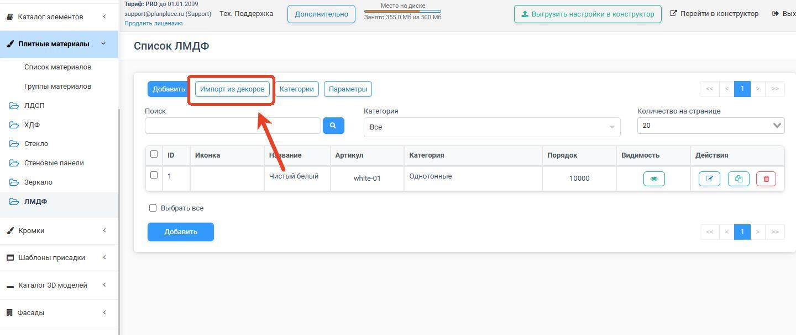

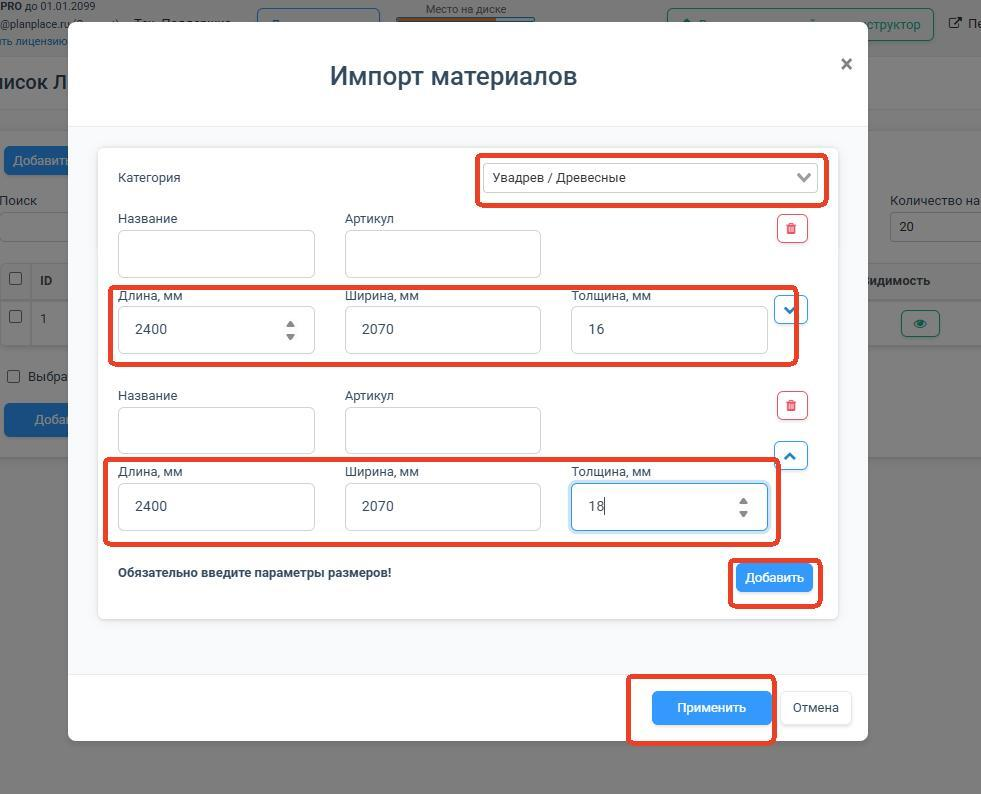

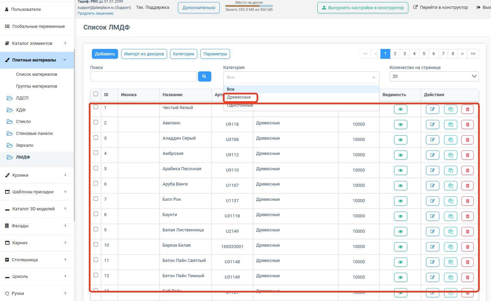

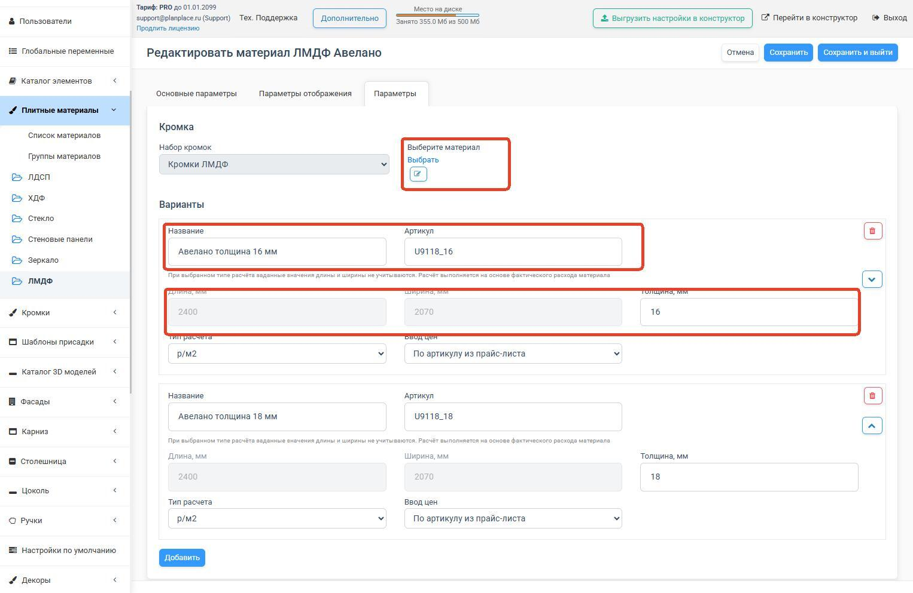

</Carousel>

> **Про кромки при импорте.** Массовый импорт не привязывает конкретные кромки автоматически — их может ещё не быть. Либо создайте кромки отдельно и привяжите через Excel-экспорт/импорт, либо включите автогенерацию кромок при работе с тем же декором (см. [«Кромочные ленты»](/Tilda-PlanPlace/kromochnye-lenty/)).

## Импорт и экспорт в Excel

Плитные материалы выгружаются и загружаются в формате **XLSX**. В таблице есть колонки: ID, видимость, порядок, категория, название, артикул, привязка к кромке, размеры, цена, способ расчёта цены и коэффициент отхода. Через Excel удобно массово менять категории, артикулы, привязки кромок и цены, а затем загружать данные обратно. Удалить лишнюю толщину материала можно, удалив соответствующую строку в таблице — остальные варианты останутся нетронутыми.

## Группы материалов

Чтобы дизайнер на сцене мог переключать материал детали, плиты объединяют в **группы материалов**. Например, группа «Корпус» может включать ЛДСП и ЛМДФ, а группа «Витрина» — ХДФ, стекло и зеркало. Это отдельная важная тема — ей посвящена статья [«Группы плитных материалов»](/Tilda-PlanPlace/gruppy-plitnyh-materialov/).

## Удаление: будьте аккуратны

Удаление отдельной плиты не критично — пропавший материал подсветится красным, и его легко заменить. А вот удаление **групп материалов** опасно: оно может сделать модули неработоспособными. Перед любым удалением групп делайте [резервную копию](/Tilda-PlanPlace/lichnyy-kabinet/).

## Коротко

Плитный материал — это реальная плита с толщиной, кромками и ценой, в основе которой лежит декор-текстура. Настраивается толщина, набор кромок, внешний вид, один из трёх способов расчёта цены и коэффициент отхода для учёта КИМ. Для быстрого старта импортируйте плиты из декоров, для удобства дизайнера — объединяйте их в группы.

## Видео

<Video src="https://vkvideo.ru/video_ext.php?oid=-226790378&id=456239070&hd=2" />
