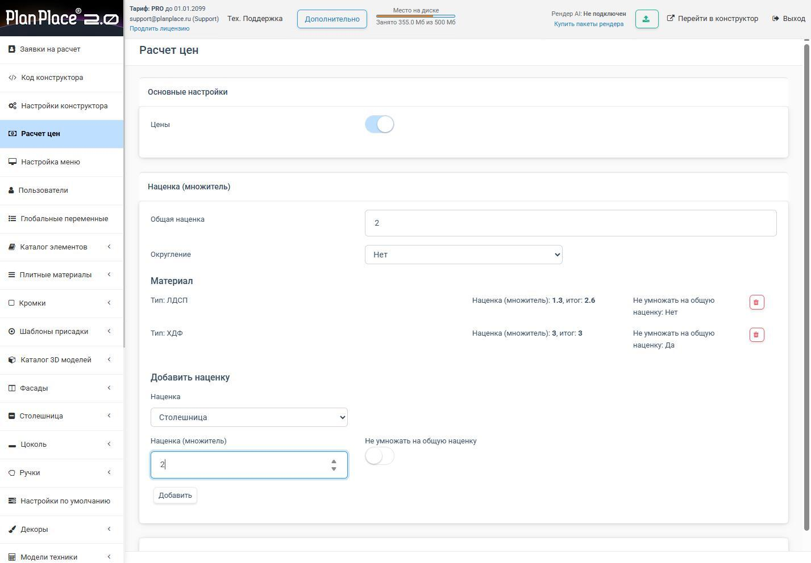
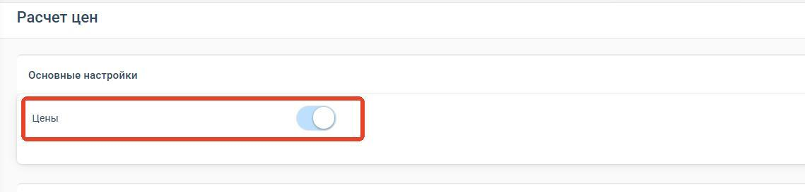
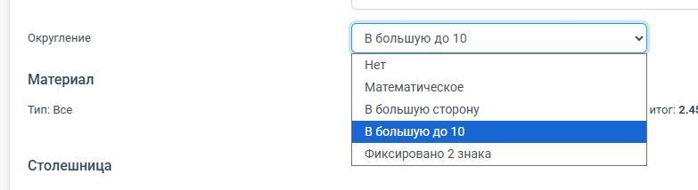
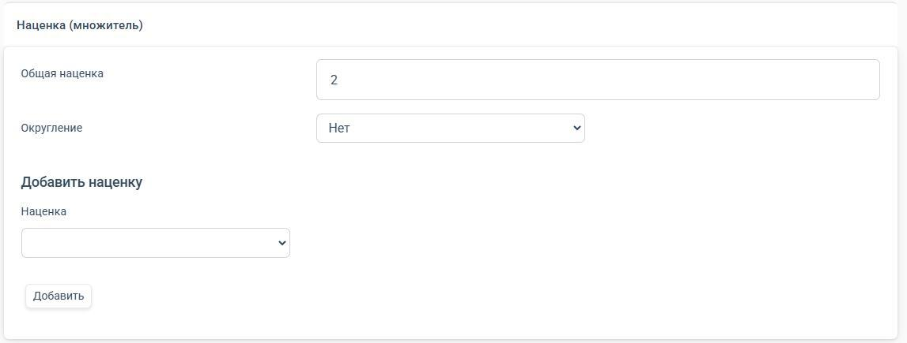
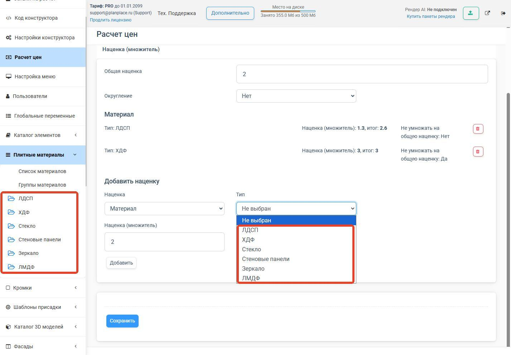
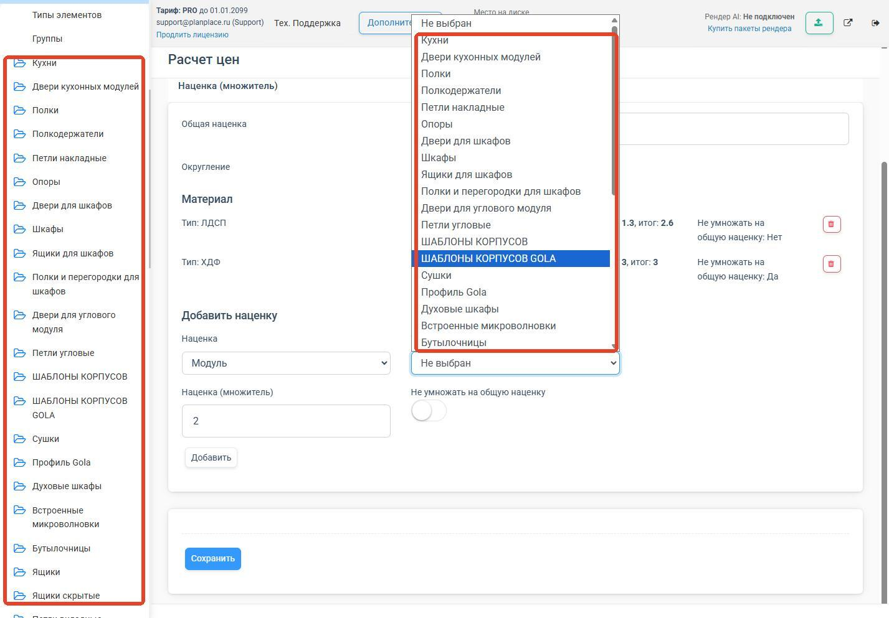
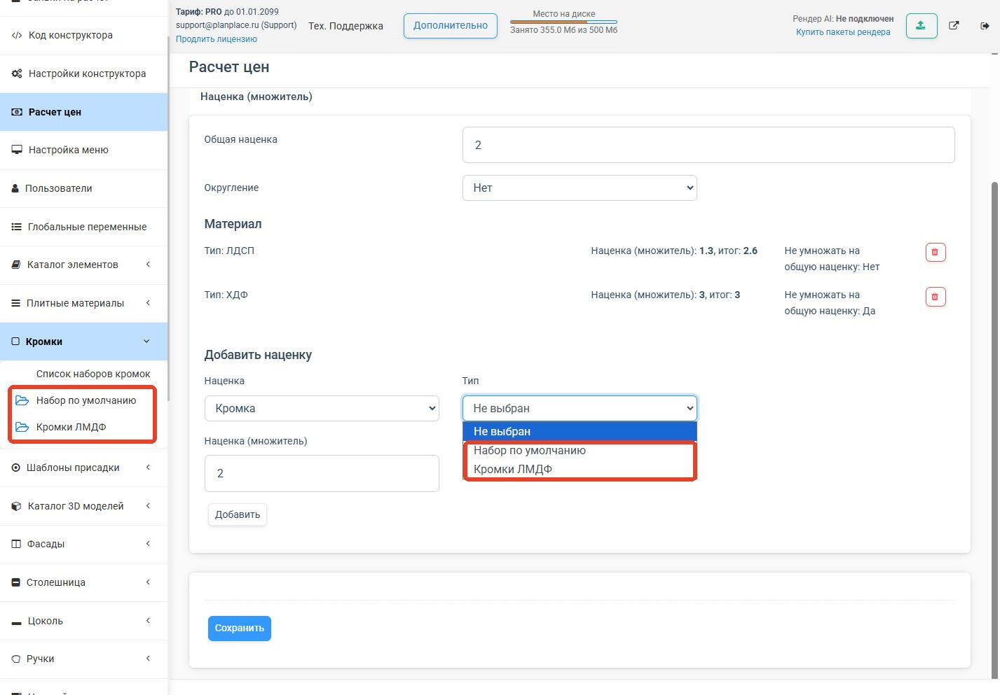
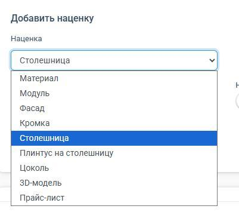

Базовые цены в PlanPlace — это, как правило, ваша себестоимость материалов и комплектующих. Чтобы получить цену продажи, к ним применяются **наценки** (множители). Всё это настраивается в разделе **«Расчёт цен»**. В этой статье разберём раздел по порядку, с точными шагами и примерами.

**Где находится:** Личный кабинет → меню слева → **«Расчёт цен»**.
**Кому доступно:** владельцам учётной записи и администраторам.

Раздел визуально разделён на два блока: **«Основные настройки»** и **«Цены»**.

## Глобальный переключатель «Цены»

Это главный выключатель **всех** цен в системе.

- **Включено:** дизайнеры и клиенты видят стоимость напротив модулей, материалов и в итоговой спецификации.
- **Выключено:** стоимость полностью скрыта из конструктора и из PDF. Удобно, когда клиенту нужен только визуальный проект или предзаказ без коммерции.

> **После изменения переключателя** нажмите **«Сохранить»** и **«Выгрузить настройки в планировщик»**, а дизайнеру/продавцу/клиенту нужно перезагрузить страницу, чтобы увидеть изменения.

<Carousel>

</Carousel>

## Общая наценка (множитель)

Общая наценка применяется **ко всем позициям** сразу. Это поле для ввода глобального коэффициента; поддерживаются дробные значения.

- множитель **2** → все цены умножаются на 2;
- множитель **1,5** → в полтора раза;
- множитель **1** → без изменений.

> **Наценка меньше единицы = скидка.** Множитель может быть меньше 1 (но не отрицательным) — это способ сделать акцию или распродажу на весь каталог или отдельные элементы. Отдельным пунктом «Акция» это не подсветится, но уже будет учтено в цене.

## Округление

Выпадающий список «Округление» определяет, как округляются итоговые суммы. Округление выполняется **на каждом этапе расчёта каждого изделия, а затем суммы складываются**. Доступны варианты:

- **Нет** — округление отключено (по умолчанию для новых кабинетов). Всё считается с максимальной точностью, но выводится до 2 знаков после запятой по математическому округлению.
- **Математическое** — до двух знаков после запятой по правилам математики (1,126 → 1,13; 1,124 → 1,12).
- **В большую сторону** — до двух знаков всегда вверх (1,126 → 1,13; 1,124 → 1,13).
- **В большую до 10** — округляет до десятков вверх. Например, цена после наценки 1612 ₽ → в спецификации 1620 ₽.
- **Фиксировано 2 знака** — как математическое, но всегда два знака; целое число получит «.00» (1,1 → 1,10; 1,126 → 1,13).

## Точечные (детальные) наценки

Ниже блока общих настроек перечислены индивидуальные наценки на отдельные категории. По каждой видно:

- **Тип** (например, «Тип: ЛДСП» или «Тип: ХДФ»);
- **Наценка (множитель)** — индивидуальный коэффициент (например, 1,3);
- **Итог** — результирующий множитель (например, 2,6, если общая наценка 2, а точечная 1,3);
- переключатель **«Не умножать на общую наценку: Нет/Да»**.

> **Источник списков.** Список материалов для наценки в точности соответствует разделу [«Плитные материалы»](/Tilda-PlanPlace/plitnye-materialy/), кромок — [«Наборам кромок»](/Tilda-PlanPlace/kromochnye-lenty/), модулей — [«Каталогу элементов»](/Tilda-PlanPlace/katalog-elementov/). Поэтому **сначала заведите нужные материалы и элементы**, и только потом настраивайте на них наценки.

<Carousel>

</Carousel>

## Как добавить точечную наценку: алгоритм

Создание правила наценки состоит из трёх шагов.

**Шаг 1. Выберите категорию.** В блоке добавления наценки выберите тип элемента. Доступны: **Материал, Модуль, Фасад, Кромка, Столешница, Плинтус на столешницу, Цоколь, 3D-модель, Прайс-лист.**

**Шаг 2. Выберите конкретный элемент (если предусмотрено).** После выбора категории открывается второй список:

- **Материал** → тип плитного материала (ЛДСП, ХДФ, Стекло, Стеновые панели, Зеркало, ЛМДФ). Источник — раздел [«Плитные материалы»](/Tilda-PlanPlace/plitnye-materialy/).
- **Модуль** → папка из каталога (Кухни, Двери, Полки и т. д.). Источник — [«Каталог элементов»](/Tilda-PlanPlace/katalog-elementov/).
- **Кромка** → набор кромок (например, «Набор по умолчанию», «Кромки ЛМДФ»). Источник — [«Кромки»](/Tilda-PlanPlace/kromochnye-lenty/).
- **Столешница, Цоколь, 3D-модель** → выбор сразу на все элементы соответствующего раздела.
- **Прайс-лист** → можно указать ID конкретной категории прайс-листа или оставить пустым (тогда наценка применится ко всему прайс-листу).

**Шаг 3. Задайте коэффициент.**

- **Наценка (множитель)** — числовой коэффициент (например, 2).
- **Не умножать на общую наценку:**
  - **Выключено (по умолчанию):** точечная наценка перемножается с общей. Формула: **Общая × Точечная** (например, 2 × 1,3 = 2,6).
  - **Включено:** применяется **только** точечная наценка, общая игнорируется. Формула: **Точечная**.

## Примеры настройки

**Пример 1. Наценка на ЛДСП.** Категория «Материал» → тип «ЛДСП» → множитель 1,3 → «Не умножать на общую» = Нет. При общей наценке 2 итоговый множитель для ЛДСП = **2,6**.

**Пример 2. Наценка на ХДФ без учёта общей.** Категория «Материал» → тип «ХДФ» → множитель 3 → «Не умножать на общую» = Да. Итоговый множитель строго **3**, независимо от общей наценки.

**Пример 3. Наценка на папку модулей.** Категория «Модуль» → папка, например «Петли» → множитель. Наценка применится ко всем модулям этой папки, **но только если их цены заданы НАПРЯМУЮ** — в [«Размерах»](/Tilda-PlanPlace/parametry-formuly-pozicionirovanie/), [«Шаблонах»](/Tilda-PlanPlace/shablony-moduley/) или [«Позициях прайс-листа»](/Tilda-PlanPlace/prays-listy/). Если цена рассчитывается от материалов, наценка к ней не применится. Это удобно для наценки на фурнитуру (обычно это связка 3D-модели и [шаблона присадки](/Tilda-PlanPlace/prisadki/)).

**Пример 4. Наценка на кромку.** Категория «Кромка» → набор, например «Набор по умолчанию» → множитель.

**Пример 5. Наценка на прайс-лист.** Категория «Прайс-лист» → ID категории (например, «Петли») → множитель. Наценка применится к петлям, добавленным через корзину [«Комплектующие»](/Tilda-PlanPlace/nastroyka-menyu-planirovschika/), но петли, входящие в конструкцию модулей и привязанные к той же позиции прайса, будут посчитаны по обычной цене (они идут в стандартном комплекте). Это удобно, когда комплектующее «вразнобой» стоит дороже из-за дополнительной логистики и работы склада.

## Как устроен расчёт по шагам

1. Считается **количество** материала по [типу расчёта](/Tilda-PlanPlace/dostupnye-tipy-raschetov/) (с учётом [коэффициента отхода](/Tilda-PlanPlace/plitnye-materialy/)).
2. Количество умножается на **базовую цену** из [прайс-листа](/Tilda-PlanPlace/prays-listy/).
3. Применяется **наценка** — точечная и/или общая (по формуле выше).
4. Результат **округляется** по выбранному правилу.

## Что важно помнить

- Списки для наценок берутся из реальных разделов — **сначала материалы и элементы, потом наценки**.
- После любых изменений — **Сохранить** и **Выгрузить настройки в планировщик**, затем перезагрузить страницу на сцене.
- Наценка на «Модуль» работает только для **прямых** цен, не для расчёта от материалов.
- Дилерские наценки работают по тем же принципам, но на уровне учётной записи [дилера](/Tilda-PlanPlace/upravlenie-dilerami/).

## Коротко

Раздел «Расчёт цен» управляет видимостью цен, общей наценкой, округлением и точечными наценками. Общая наценка — множитель на весь каталог (меньше 1 = скидка); точечные — на отдельные категории (Материал, Модуль, Фасад, Кромка, Столешница, Цоколь, 3D-модель, Прайс-лист) с возможностью отключить умножение на общую. Добавление наценки — три шага: категория → конкретный элемент → коэффициент. Списки берутся из реальных разделов, поэтому сначала заводите материалы, потом наценки.

