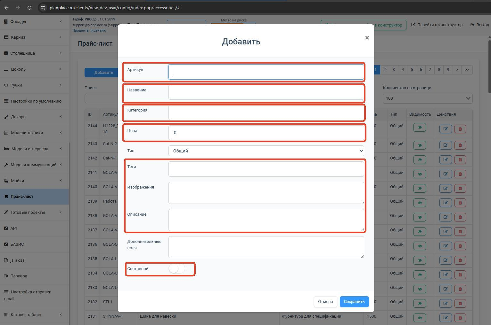
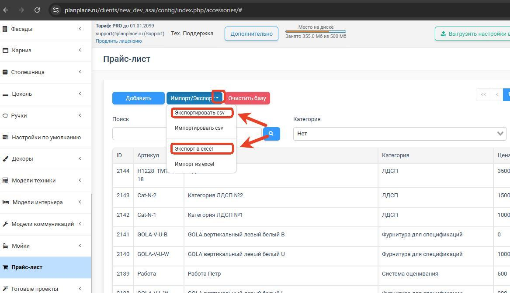
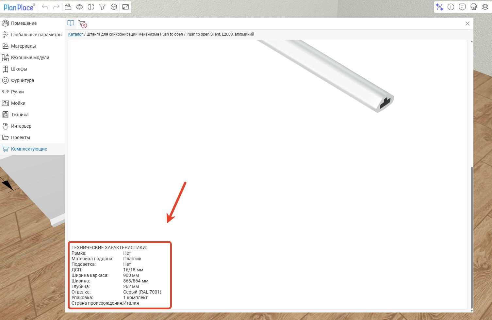
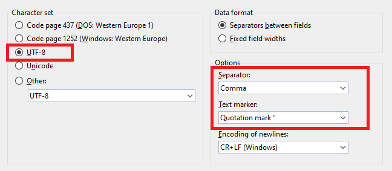
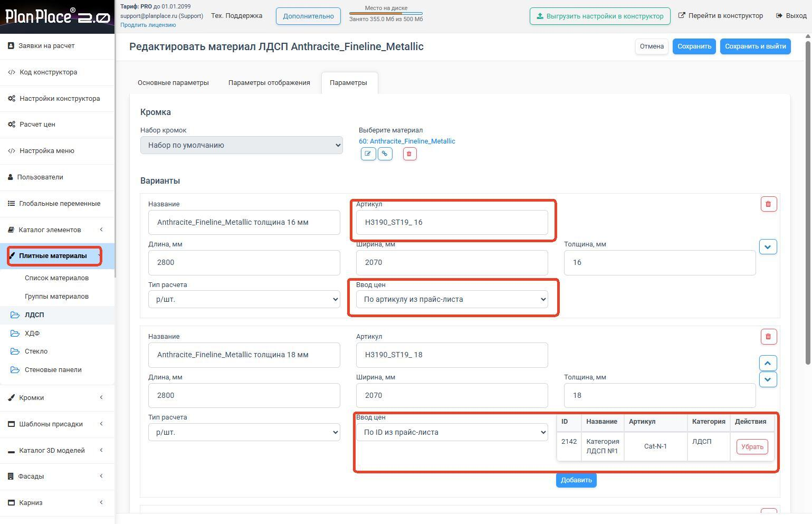
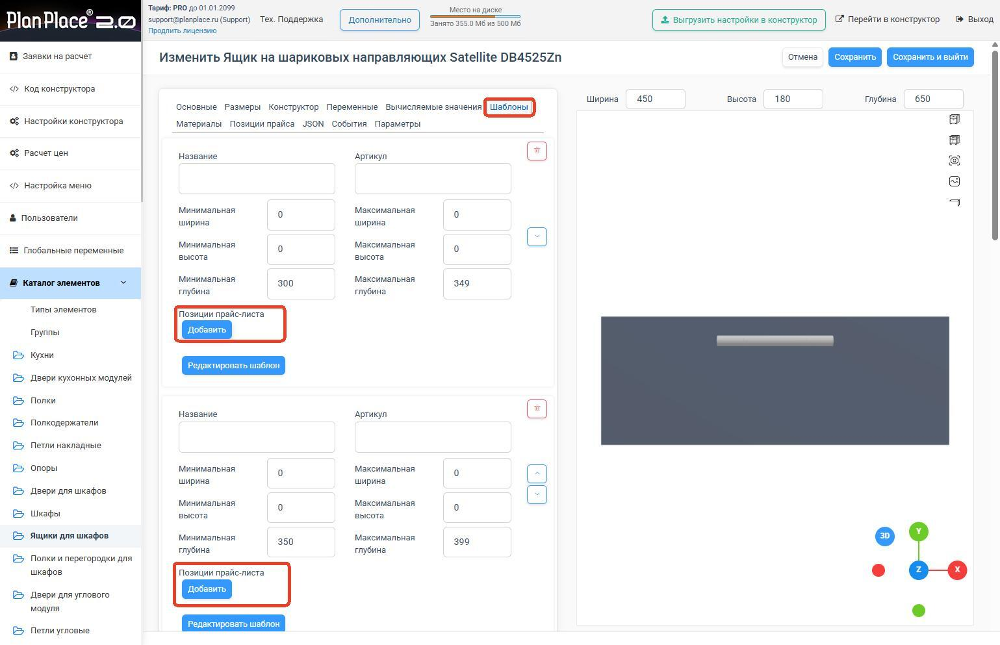
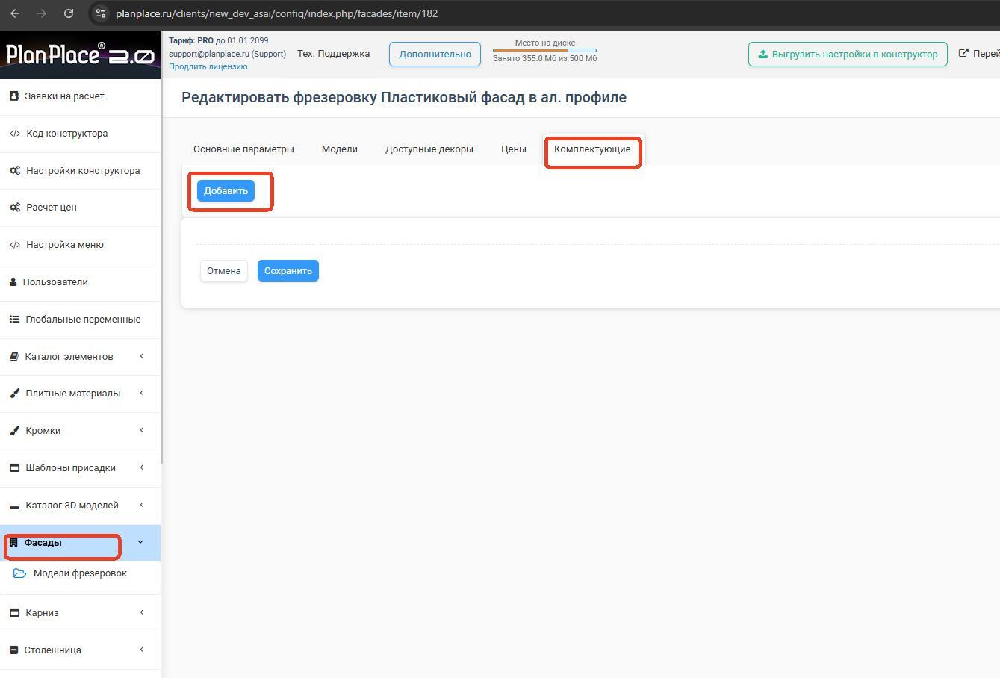
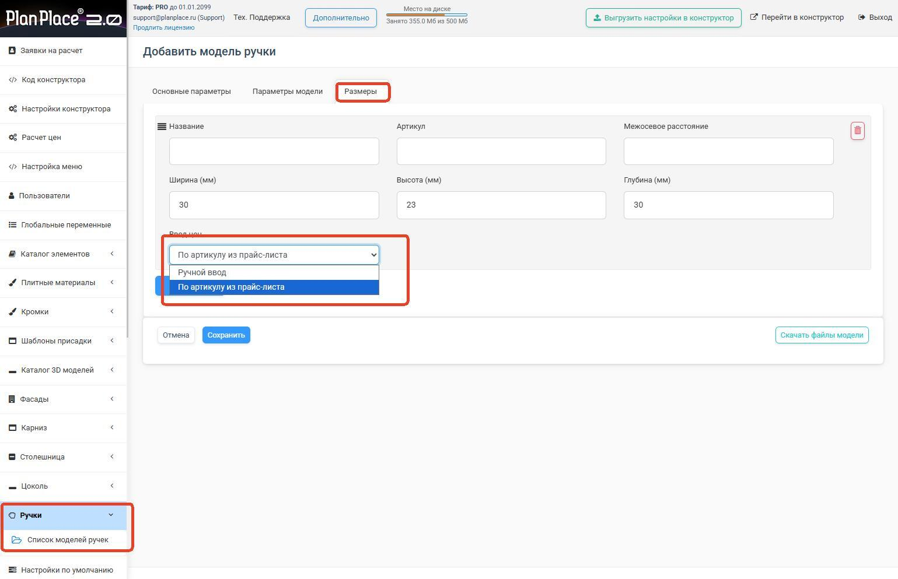

Прайс-лист — это единая таблица учёта всех изделий, плитных материалов, кромок, комплектующих, фурнитуры и крепежа. На его основе система по заданным правилам считает стоимость каждой секции и изделия. Главная идея: позицию можно сколько угодно раз добавлять в разные секции, а цену менять **в одном месте** — в прайс-листе. В этой статье разберём, как его вести и привязывать к изделиям.

## Что умеет прайс-лист

1. Вести единый учёт изделий, материалов, кромок, комплектующих и крепежа.
2. Рассчитывать стоимость для каждой секции/изделия по правилам системы.
3. Добавлять одну и ту же позицию в любые секции, а цену менять только в прайс-листе.
4. Интегрироваться через [API с 1С](/Tilda-PlanPlace/sinhronizaciya-po-api/), сайтом или другой системой.

В конструкторе уже есть предустановленные позиции. Свою базу формируют двумя путями: загрузкой файла **CSV/XLSX** или вручную кнопкой **«Добавить»** (как карточки товаров в интернет-магазине).

**Где находится:** меню слева → **«Прайс-лист»**. Есть фильтрация по категориям, поиск по названию и артикулу, выбор числа позиций на странице.

### Как добавить позицию вручную

1. Откройте меню слева → **«Прайс-лист»** и нажмите **«Добавить»**.
2. Заполните поля: **Артикул** (уникальный код), **Название**, **Категория** (новую можно создать, просто вписав её название), **Цена**, при необходимости **Изображения** (прямые URL через запятую), **Описание**, **Теги** и **Видимость** (`1` — показывать, `0` — скрыть).
3. Нажмите **«Сохранить»**, затем **«Выгрузить настройки в конструктор»**.

<Carousel>




</Carousel>

### Импорт и экспорт CSV/XLSX

Для массовой работы прайс удобнее вести через файл. Скачайте образец, заполните его и загрузите обратно:

<Download href="https://planplace.ru/site/help/menuap-komplekt_furny/komplektuyushchie-i-furnitura.xlsx" label="Скачать пример в формате Excel" />

1. **Экспорт.** Выгрузите текущий прайс-лист в файл — у позиций уже будут проставлены ID.
2. **Редактирование.** Откройте файл в Excel (или другом редакторе таблиц) и внесите изменения.
3. **Импорт.** Загрузите файл обратно и дождитесь завершения. Большие файлы (тысячи строк) грузятся долго — **не перезагружайте и не закрывайте** страницу, пока в правом верхнем углу не появится сообщение об успехе.
4. Обновите страницу, нажмите **«Сохранить»** и **«Выгрузить настройки в конструктор»**.

<Carousel>








</Carousel>

## Три способа задать цену

Каким способом считается **количество**, описано в статье [«Доступные типы расчётов»](/Tilda-PlanPlace/dostupnye-tipy-raschetov/). А **цену** задают одним из трёх способов:

1. **Ручной ввод цены** — прямо в карточке материала или позиции. Для небольшого ассортимента.
2. **Цена за категорию** — одна позиция прайса на целую группу материалов (см. сценарий ниже).
3. **Привязка по артикулу из прайс-листа** — цена берётся из прайса по артикулу. Рекомендуется для среднего и крупного ассортимента: обновили цену в прайсе — она применилась везде.

## Колонки файла (CSV/XLSX): точная расшифровка

При массовой работе прайс-лист удобнее вести через экспорт/импорт. Значения колонок:

- **id** — при первом создании файла оставляйте **пустым**: система присвоит ID сама. При последующих правках экспортируйте файл из конструктора — ID уже проставлены, и их **нельзя менять**. Для новых позиций оставляйте id пустым.
- **Артикул** — уникальный код, желательно совпадающий с вашей учётной базой. **Артикулы не должны повторяться** — дубли могут привести к потере данных при импорте.
- **Название** — наименование, которое видно при выборе в конструкторе.
- **Категория** — название категории каталога. Если её нет, она создаётся автоматически. **Внимание:** любое расхождение в символах или регистре создаст новую категорию.
- **Цена** — стоимость, к которой затем может добавиться [коэффициент наценки](/Tilda-PlanPlace/pravila-rascheta-cen-nacenki/).
- **Изображения** — прямые URL картинок (загруженных на хостинг). Несколько ссылок — через запятую.
- **Описание** — текст или таблица в HTML-разметке (пример ниже).
- **Теги** — дополнительный фильтр для поиска (в реальной выгрузке, например, `Actro 5D`).
- **По умолчанию** — устаревший признак, можно не заполнять.
- **Отображать в конструкторе?** (видимость) — `1` товар доступен, `0` скрыт.

### Логика обновления при импорте

- если есть **ID** — обновляется запись по ID;
- если ID нет, но **артикул найден** — обновляется найденная запись;
- если нет ни ID, ни артикула — создаётся **новая** запись с новым ID.

Если нужно импортировать товары с одинаковыми артикулами, используйте **CSV** с включённой опцией **«Не проверять артикул»**.

> **Настройки CSV:** кодировка **UTF-8**, разделитель — **запятая**, маркер текста — **кавычки**.

### Пример HTML-описания

В поле «Описание» можно вставить таблицу характеристик:

```html
<h4>ТЕХНИЧЕСКИЕ ХАРАКТЕРИСТИКИ:</h4>
<table>
<tbody>
<tr><td>Материал поддона:</td><td>Пластик</td></tr>
<tr><td>ДСП:</td><td>16/18 мм</td></tr>
<tr><td>Ширина каркаса:</td><td>900 мм</td></tr>
<tr><td>Глубина:</td><td>262 мм</td></tr>
<tr><td>Страна происхождения:</td><td>Италия</td></tr>
</tbody>
</table>
```

> **После импорта** обновите страницу, внизу нажмите **«Сохранить»** и **«Выгрузить настройки в конструктор»**. Импорт файла на несколько тысяч строк может идти долго — **не перезагружайте и не закрывайте** страницу, пока в правом верхнем углу не появится сообщение об успешной загрузке.

### Пример реальных строк

Так выглядят реальные позиции прайс-листа (фурнитура Hettich):

| id | Артикул | Название | Категория | Цена | Теги |
|---|---|---|---|---|---|
| 73 | 9257059 | Направляющая Actro 5D, полного выдвижения, с демпфером Silent System, L (40 кг), EB23, NL250, левая | Скрытые направляющие ящиков | 2638.81 | Actro 5D |
| 74 | 9257060 | …то же, NL250, **правая** | Скрытые направляющие ящиков | 2638.81 | Actro 5D |
| 170 | 9264122 | Направляющая Quadro 22, частичного выдвижения, Push to open, 22 кг, NL350, левая | Скрытые направляющие ящиков | 1165.58 | Quadro |

> **Запятые внутри названий.** Названия фурнитуры почти всегда содержат запятые. В CSV такие ячейки **обязательно берутся в кавычки** (`"…, левая"`), иначе строка «рассыплется» по колонкам. Excel это делает автоматически при сохранении в CSV; при ручном редактировании следите за кавычками.

Такие позиции (например, направляющие разной длины NL250/NL350/NL450) потом удобно привязывать к [шаблонам](/Tilda-PlanPlace/shablony-moduley/) ящика по диапазону глубины — система сама подставит нужную длину направляющей и её цену.

## Составные позиции

Если одна позиция (например, «петля в сборе») состоит из нескольких (чашка, ответная планка, механизм push-to-open, винты), поставьте признак **«Составной»** и укажите через запятую **ID** прайс-позиций, входящих в комплект. Тогда при назначении цены в элементе вы выбираете одну составную позицию, а не набираете все составляющие вручную. В спецификации при этом будет видна подробная информация по каждому элементу.

## Формульные названия и артикулы комплектующих

Название и артикул комплектующей могут быть **вычисляемыми** — с подстановкой реальных размеров элемента прямо в текст. Это удобно, когда одна позиция используется на разных размерах, а в спецификации нужно видеть конкретные габариты (например, «Направляющая 450» вместо просто «Направляющая»).

В названии или артикуле можно использовать обозначения размеров:

- `s:x`, `s:y`, `s:z` — ширина, высота, глубина **родительского** элемента (того, к которому привязана комплектующая);
- `sr:x`, `sr:y`, `sr:z` — размеры **корневого** модуля (root).

Если система находит в названии/артикуле такое обозначение, она подставит вместо него вычисленное числовое значение. Так, направляющая, привязанная к ящику, автоматически получит в названии свою длину, а в спецификацию попадёт уже с конкретным размером.

> **Совет.** Используйте формульные названия там, где размер комплектующей зависит от размера модуля (направляющие, газлифты, доводчики) — тогда не нужно заводить отдельную позицию под каждый типоразмер.

## Куда привязывать позиции прайса

Привязка выполняется внутри настроек элементов — точек много, и вы сами решаете, где и как. Позицию можно привязать через **автоматический поиск по артикулу** или через **прямое указание конкретной позиции**. Основные точки привязки:

- **плитный материал** — по артикулу или к конкретной позиции (так же для [кромок](/Tilda-PlanPlace/kromochnye-lenty/) и столешниц);
- **изделие целиком** — через «Позиция прайс-листа», если у него нет вариантов размеров;
- **шаблоны изделия** — разные позиции для разных диапазонов размеров (например, направляющие по глубине ящика; см. [«Шаблоны модулей»](/Tilda-PlanPlace/shablony-moduley/));
- **конкретные размеры** — если изделие поставляется только в фиксированных размерах;
- **элемент в дереве конструктора**;
- **модель фрезеровки** — применится ко всем её вариантам и размерам;
- **присадка** — для учёта количества конфирматов, саморезов ([«Присадки»](/Tilda-PlanPlace/prisadki/));
- **ручки**;
- **3D-модель** — чтобы она участвовала в ценообразовании. Цену 3D-модели можно привязать не только по артикулу, но и **по ID позиции прайс-листа** — выбрав нужную строку прямо из списка.

> **Про категории прайс-листа.** Категории прайса — **плоские** (без вложенной иерархии). Вручную созданную категорию, в которой нет ни одной позиции, можно **удалить** прямо в интерфейсе.

В любой из этих точек привязка делается одинаково: откройте настройки элемента, найдите поле привязки, выберите **«По артикулу»** (автоматический подбор) либо вручную конкретную позицию, подтвердите выбор и сохраните. Ниже — как выглядят основные точки привязки в интерфейсе.

<Carousel>













</Carousel>

## Сценарий «цена за категорию»

Частая задача — задать общую цену на несколько декоров ЛДСП, не прописывая стоимость каждому:

1. Создайте в прайс-листе **позицию для целой категории** (например, «ЛДСП 16 мм базовая»).
2. Привяжите эту позицию к нужным декорам ЛДСП или столешницам (одну позицию можно привязать к нескольким материалам).
3. Проверьте расчёт стоимости в конструкторе.
4. При необходимости настройте [коэффициент наценки](/Tilda-PlanPlace/pravila-rascheta-cen-nacenki/) на эту категорию.

После всех изменений — **«Сохранить»** и **«Выгрузить настройки в конструктор»**.

## Важно про наценки и двойной учёт

- Если артикул встречается у материала/фурнитуры/изделия и для него выбран способ цены **«По артикулу из комплектующих»**, стоимость берётся из прайса с этим артикулом. На сцене она показывается **уже с наценками** из раздела [«Расчёт цен»](/Tilda-PlanPlace/pravila-rascheta-cen-nacenki/).
- **Не считайте дважды.** Если изделие из плит уже считается по материалам, не добавляйте ему ещё и фиксированную цену готового изделия. Выбирайте одно (см. [«Основы конфигуратора»](/Tilda-PlanPlace/osnovy-konfiguratora/)).

## Коротко

Прайс-лист — единая таблица цен; меняете цену в одном месте, а позиция используется где угодно. Ведётся вручную или импортом CSV/XLSX (id пустой для новых, артикулы уникальные, UTF-8/запятая/кавычки для CSV). Составные позиции собираются по ID через признак «Составной». Название и артикул комплектующей могут быть формульными (`s:x`/`sr:x` и т. п.) — система подставит реальные размеры. Привязывать позиции можно к материалам, изделиям, шаблонам, размерам, фрезеровкам, присадкам, ручкам и 3D-моделям — по артикулу или напрямую. Для «цены за категорию» создайте одну позицию и привяжите её к нескольким декорам.

