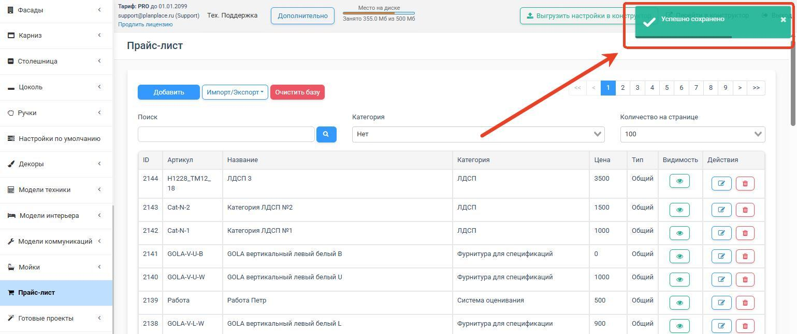

import Carousel from '../../components/Carousel.astro';
import img1 from '../../assets/price-list/01.jpg';
import img2 from '../../assets/price-list/02.jpg';
import img7 from '../../assets/price-list/07.jpg';
import img8 from '../../assets/price-list/08.jpg';
import img9 from '../../assets/price-list/09.jpg';
import img10 from '../../assets/price-list/10.jpg';
import img11 from '../../assets/price-list/11.jpg';
import img12 from '../../assets/price-list/12.jpg';
import img13 from '../../assets/price-list/13.jpg';
import img14 from '../../assets/price-list/14.jpg';
import img15 from '../../assets/price-list/15.jpg';
import img16 from '../../assets/price-list/16.jpg';
import img17 from '../../assets/price-list/17.jpg';

## Создание каталога

Прайс-лист позволяет вести единый реестр всех товаров, плитных материалов, кромочных лент,
комплектующих и фурнитуры. На основе правил расчёта система определяет стоимость для
конкретных секций или позиций, учитывая их особенности.

Позиции прайс-листа можно использовать в разных секциях многократно, обновляя цену в одном
месте. Система поддерживает интеграцию по API с 1С, сайтами или другими системами учёта
себестоимости и складских остатков.

В конструкторе есть предустановленные позиции. Для построения собственной базы можно
создать файлы в формате CSV или XLSX либо добавлять позиции вручную кнопкой «Добавить».

<Carousel images={[{src: img1, alt: "Создание каталога"}, {src: img2, alt: "Создание каталога"}]} />

## Массовые операции через импорт/экспорт CSV или XLSX

Для массового изменения прайс-листа удобнее всего экспортировать и повторно импортировать
данные в формате CSV или XLSX. Доступен пример Excel-шаблона для скачивания.

<Carousel images={[{src: img7, alt: "Массовые операции через импорт/экспорт csv или xlsx"}, {src: img8, alt: "Массовые операции через импорт/экспорт csv или xlsx"}]} />

### Поля файла

- **id** — оставьте пустым для новых позиций; система присвоит номера автоматически при
  импорте.
- **Артикул** — уникальный код, совпадающий с вашей базой; должен быть уникальным для
  каждой позиции.
- **Название** — название товара, отображаемое при выборе.
- **Категория** — категория позиции; новые категории создаются вводом значения.
- **Цена** — базовая стоимость с опциональными коэффициентами наценки из правил расчёта.
- **Изображения** — прямые URL на размещённые изображения; несколько изображений через
  запятую.
- **Описание** — дополнительная информация с поддержкой HTML-разметки для таблиц.
- **Теги** — дополнительные фильтры поиска.
- **Видимость** — «1» для доступных позиций, «0» для скрытых.

Требования к CSV: кодировка UTF-8, разделитель — запятая, текстовый разделитель — кавычки.

## Добавление позиций прайс-листа к изделиям

В планировщике есть несколько точек привязки товаров и услуг к конкретным позициям. Привязка
происходит в настройках отдельных элементов различными способами:

- привязка материала по артикулу или конкретной позиции прайс-листа;
- привязка по шаблону с параметрами диапазона размеров;
- привязка к конкретным размерам для позиций, доступных только в определённых габаритах;
- привязка к отдельным элементам дерева;
- привязка моделей фрезеровки, влияющая на все варианты и размеры;
- привязка фурнитуры с учётом количества;
- привязка выбора ручек;
- привязка 3D-моделей для участия в ценообразовании.

После всех изменений нажмите **«Сохранить»** и убедитесь, что настройки выгружены в
конструктор.

<Carousel images={[{src: img9, alt: "Добавление позиций прайс-листа к изделиям"}, {src: img10, alt: "Добавление позиций прайс-листа к изделиям"}, {src: img11, alt: "Добавление позиций прайс-листа к изделиям"}, {src: img12, alt: "Добавление позиций прайс-листа к изделиям"}, {src: img13, alt: "Добавление позиций прайс-листа к изделиям"}, {src: img14, alt: "Добавление позиций прайс-листа к изделиям"}, {src: img15, alt: "Добавление позиций прайс-листа к изделиям"}, {src: img16, alt: "Добавление позиций прайс-листа к изделиям"}, {src: img17, alt: "Добавление позиций прайс-листа к изделиям"}]} />

