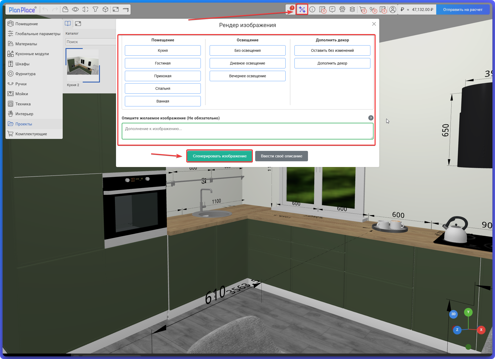
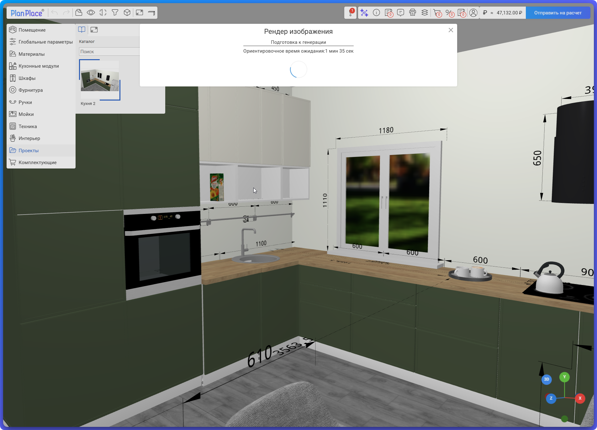
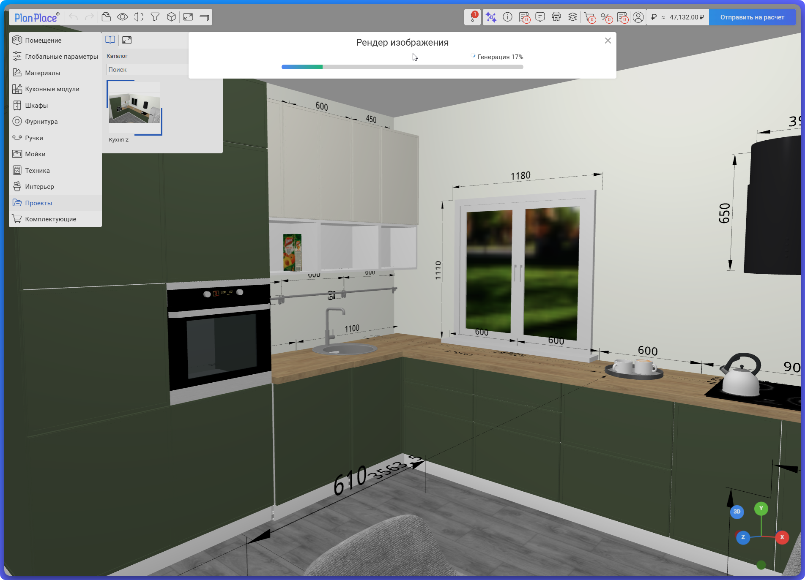
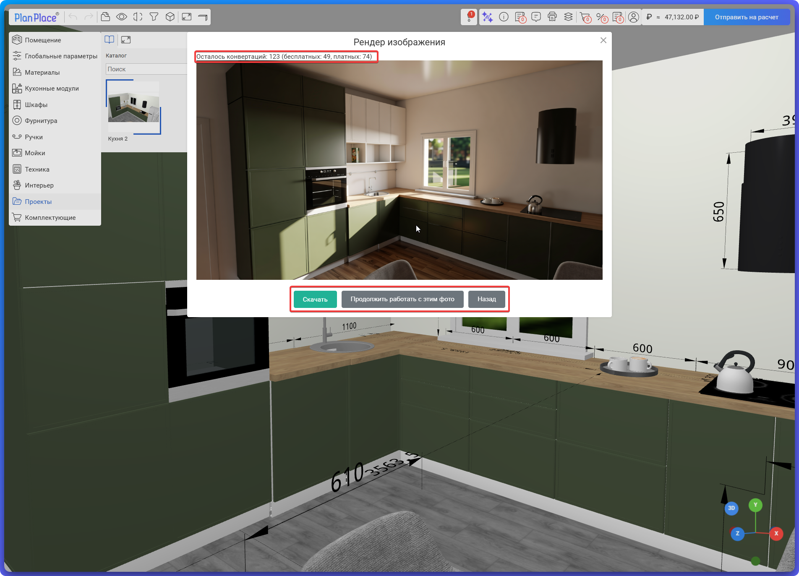
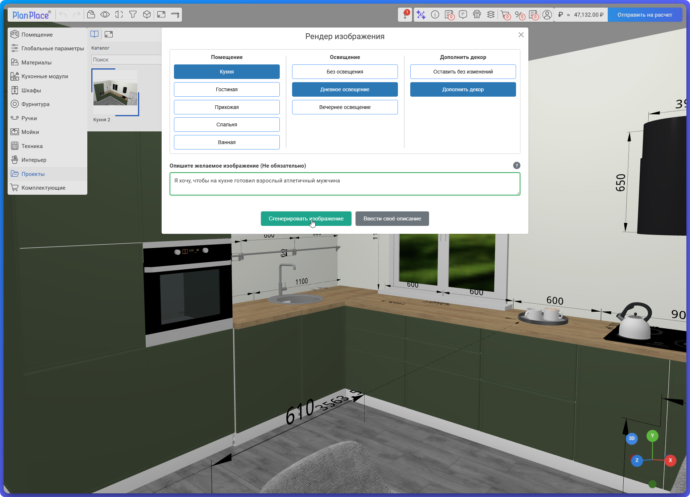
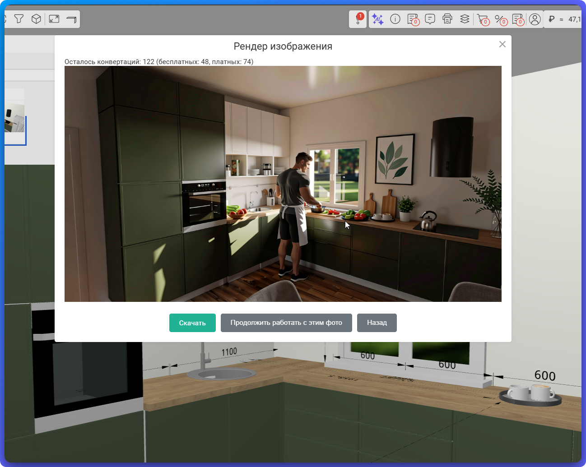

Рендеринг превращает обычный вид проекта со сцены в **фотореалистичное изображение** — почти как фотография готового интерьера. Это сильный инструмент продаж: красивая картинка помогает клиенту влюбиться в проект и быстрее принять решение. В этой статье разберём, как работает визуализация в PlanPlace.

## Что это такое

Сцена в планировщике показывает мебель достаточно реалистично, но всё же «по-рабочему». Рендеринг с помощью искусственного интеллекта добавляет фотореализм: естественное освещение, тени, отражения, фактуры — изображение выглядит как профессиональная визуализация интерьера.

## Как подключается

Функция визуализации подключается как **отдельная услуга**. В [личном кабинете](/Tilda-PlanPlace/lichnyy-kabinet/) отображается:

- **статус подключения** услуги;
- возможность её **приобрести**.

Визуализация работает по пакетной модели: вы приобретаете пакет рендеров и расходуете их по мере генерации изображений.

## Как пользоваться

Запуск рендера — это кнопка **«Рендер изображения»** (значок ✦) в верхней панели [сцены](/Tilda-PlanPlace/interfeys-sceny/). Общий порядок:

1. Соберите и расположите проект так, как хотите его показать.
2. Выберите ракурс (камеру) — рендер строится ровно по текущему виду на экране.
3. Нажмите кнопку рендера — откроется окно **«Рендер изображения»**.
4. (По желанию) выберите тип помещения, освещение, декор и/или опишите пожелания текстом.
5. Нажмите **«Сгенерировать изображение»** и дождитесь результата.

### Окно «Рендер изображения»

В окне есть три блока кнопок — **«Помещение»**, **«Освещение»**, **«Дополнить декор»** — и поле **«Опишите желаемое изображение»**.

> **Всё это необязательно.** Можно ничего не выбирать и не вводить текст, а сразу нажать **«Сгенерировать изображение»**. Тогда система просто сделает фотореалистичную версию **того, что сейчас на экране, в том же ракурсе** — без добавлений, достроек и изменений сцены.

### Самый простой запуск — без выбора и без текста

<Carousel>

</Carousel>

### Запуск с выбором параметров и описанием

Если нажимать кнопки и/или ввести текст, система **подберёт сцену, окружение, освещение и декор под выбранные варианты**. Например:

- достроит **неполную кухню**, если часть гарнитура не расставлена;
- в **спальне** поставит кровать, если её ещё нет;
- применит выбранный сценарий освещения (дневное, вечернее) и добавит декор.

А в поле описания можно задать пожелания текстом (например, добавить в интерьер человека за готовкой) — система учтёт это при генерации.

<Carousel>

</Carousel>

### Ожидание и очередь

После запуска рендер **встаёт в очередь на обработку**, и генерация занимает некоторое время (окно показывает ориентировочное время и прогресс в процентах).

- Окно ожидания можно **скрыть и продолжить работу** в планировщике — рендер продолжит считаться в фоне.
- Если снова нажать кнопку рендера, откроется либо **текущий прогресс**, либо **результат прошлого запуска**, если вы его ещё не смотрели.
- **Одновременно несколько рендеров запустить нельзя** — сначала дождитесь завершения текущего.

### Что делать с готовым изображением

Над готовым изображением сразу виден **остаток счётчика** доступных рендеров (сколько осталось всего, из них бесплатных и платных). Под изображением — три действия:

- **«Скачать»** — сохранить картинку на компьютер;
- **«Продолжить работать с этим фото»** — внести дополнительные изменения, описав их текстовым запросом (промптом), и сгенерировать новый вариант на основе текущего;
- **«Назад»** — вернуться к параметрам и создать новый рендер с нуля.

## Коммерческая механика

Рендеринг можно настроить под удобный сценарий продаж. Например:

- сделать кнопку рендера **доступной без авторизации**, чтобы клиент мог получить визуализацию сразу;
- предоставлять рендер **по запросу после отправки на расчёт** — как дополнительный стимул и сервис.

Конкретная механика (когда и кому доступен рендер) настраивается под вашу воронку продаж.

## Зачем это нужно бизнесу

- **Выше конверсия.** Клиент, увидевший красивую визуализацию своего будущего гарнитура, охотнее соглашается на заказ.
- **Меньше недопониманий.** Фотореалистичная картинка точнее передаёт, как мебель будет выглядеть в реальности.
- **Профессиональный имидж.** Качественные визуализации повышают доверие к вашей компании.

## Как выбрать удачный ракурс

Рендер строится по текущему виду на сцене, поэтому многое решает **ракурс**. Несколько простых правил помогут получить красивый кадр:

1. **Держите камеру на уровне глаз** — примерно 1,2–1,5 м от пола. Слишком высокий или низкий ракурс искажает пропорции.
2. **Не заваливайте вертикали.** Стены, углы и дверные проёмы должны идти строго вертикально, параллельно краям кадра.
3. **Возьмите умеренно широкий угол.** Он передаёт объём комнаты, но не ставьте важные предметы у самого края — их «растянет».
4. **Поставьте главный объект по правилу третей.** Мысленно разделите кадр на три части по горизонтали и вертикали и разместите акцент (красивый шкаф, остров, окно) на пересечении линий, а не строго по центру.
5. **Используйте ведущие линии.** Пусть линии столешницы, стен или пола уводят взгляд вглубь комнаты — к смысловому центру.
6. **Уравновесьте кадр.** Крупному объекту с одной стороны (гарнитур, шкаф) дайте что-то лёгкое с другой (растение, торшер, стул).
7. **Добавьте глубину планами.** Пусть на переднем плане будет край стола или стула, в середине — основная мебель, дальше — окно или стена. Так кадр не «плоский».
8. **Не режьте объекты случайно.** Важные предметы должны попадать в кадр целиком; обрезайте только осознанно, ради акцента на детали.
9. **Уберите лишнее.** Чем меньше визуального хаоса, тем сильнее считывается главный объект.

> **Совет.** Сначала настройте хороший ракурс на сцене, а уже потом запускайте рендер — переснять кадр дешевле, чем тратить рендер на неудачный вид.

## Связь с подготовкой материалов

Качество рендера во многом зависит от того, как настроены [декоры и текстуры](/Tilda-PlanPlace/dekory-i-tekstury/): бесшовные оптимизированные текстуры, правильные параметры шероховатости, металличности и [карты нормалей](/Tilda-PlanPlace/dekory-i-tekstury/) дают на рендере гораздо более убедительный результат. Поэтому вложение в качественные материалы напрямую улучшает визуализацию.

## Коротко

Рендеринг — это фотореалистичная визуализация проекта средствами ИИ, мощный инструмент продаж. Запускается кнопкой рендера на сцене; в окне можно ничего не выбирать (тогда получится фотореалистичная версия текущего ракурса) или задать помещение, освещение, декор и текст — тогда система подстроит сцену под них (достроит кухню, поставит кровать и т. п.). Рендер идёт в очереди, окно можно скрыть и работать дальше; одновременно запускать несколько нельзя. Готовое изображение можно скачать, доработать промптом («Продолжить работать с этим фото») или начать заново, а сверху виден остаток счётчика. Подключается пакетами рендеров, статус виден в личном кабинете; качество сильно зависит от грамотно подготовленных текстур.

