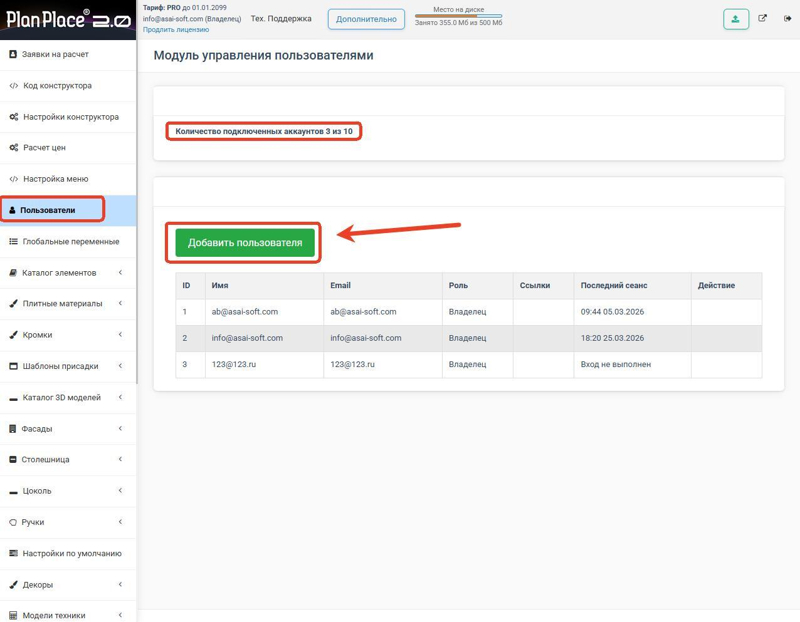
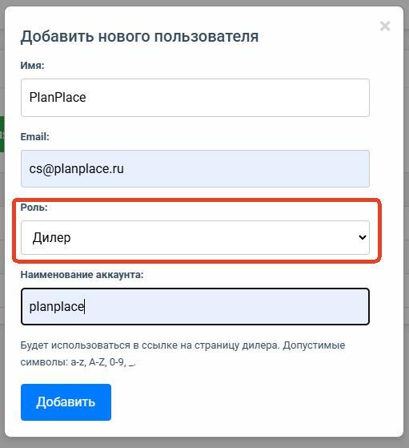
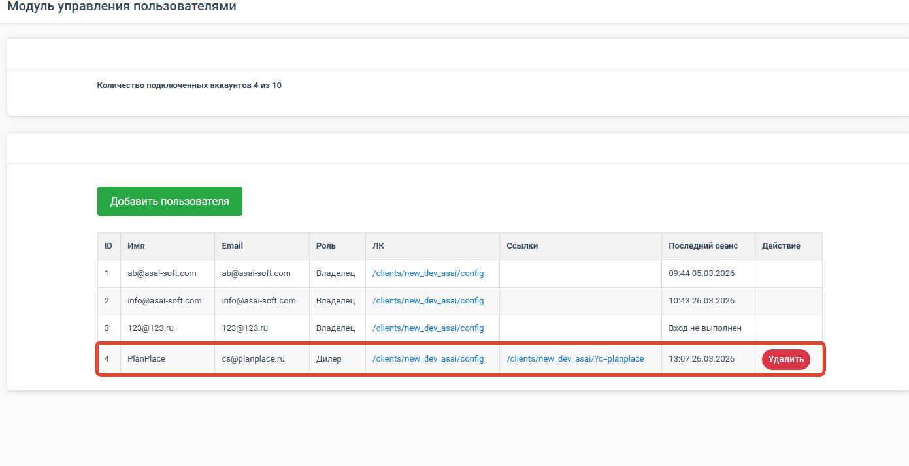
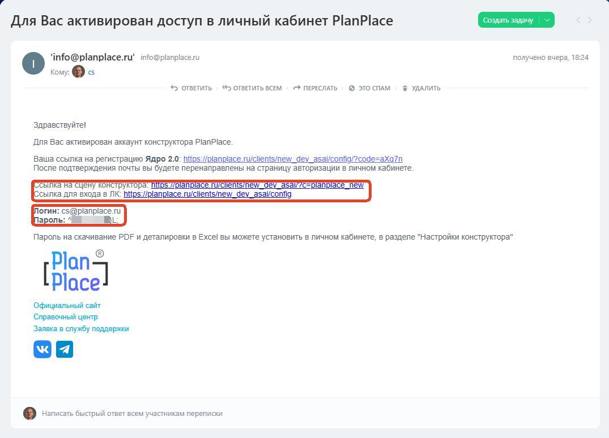
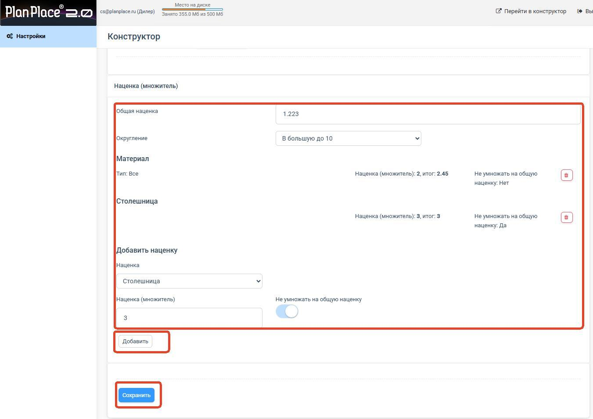
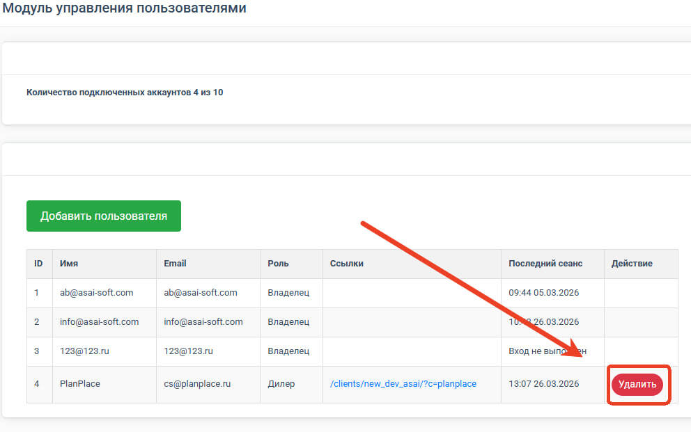

PlanPlace позволяет давать доступ к системе сотрудникам и партнёрам с разными правами. В этой статье разберём, как устроены учётные записи, чем дилер отличается от менеджера и как настроить дилеру собственный «брендированный» планировщик.

## Роли и их права

Напомним коротко (подробно — в статье [«Обзор системы и роли»](/Tilda-PlanPlace/obzor-sistemy-i-roli/)):

- **Владелец** — полный доступ, его нельзя удалить.
- **Администратор** — полный доступ, кроме удаления владельца. Настраивает каталог, цены, пользователей.
- **Менеджер** — обрабатывает заявки, скачивает файлы для производства, применяет скидки. Не видит каталог и цены.
- **Дилер** — партнёр с собственной ссылкой на планировщик и своими наценками.

## Чем дилер отличается от обычного пользователя

Менеджер и администратор — это **ваши сотрудники**, работающие с вашей базой. Дилер — это **отдельный партнёр**, который продаёт вашу мебель под своими условиями. Поэтому у дилера есть особенности:

- **персональная ссылка** на планировщик — отдельная от вашей основной;
- собственные **логотип, почта и телефон**, которые видит его клиент;
- собственная **наценка** — дилер может продавать дороже, оставляя разницу себе;
- **нет доступа** к каталогу, настройкам и вашим базовым ценам.

Проще говоря, дилер получает готовый рабочий конструктор с вашей мебелью, но со своим оформлением и своей ценовой политикой. Ваши закупочные цены и устройство каталога он не видит.

## Как создать дилера

Создание дилера выполняется в разделе управления пользователями кабинета. Общий порядок:

1. В разделе **«Пользователи»** нажмите зелёную кнопку **«Добавить пользователя»**.
2. Заполните поля: **Имя** (название дилера или магазина), **Email** (на него придут логин и пароль), **Роль** — **«Дилер»**, **Наименование аккаунта** (уникальный псевдоним: только латиница, цифры и подчёркивание). Нажмите **«Добавить»**.
3. Настройте оформление планировщика дилера в его основных параметрах: **логотип** (рекомендуется 180×180 px), **контактную почту**, **телефон** и адрес.
4. Установите дилеру **наценку** — на сколько его цены будут выше базовых (см. ниже).
5. Скопируйте и передайте дилеру его **персональную ссылку** на планировщик.

> **Сколько осталось мест.** Вверху страницы показан счётчик аккаунтов, например «3 из 10» — лимит зависит от тарифа.

После этого дилеру автоматически уходит письмо «Для Вас активирован доступ в личный кабинет PlanPlace» с логином, паролём и ссылками. Он входит в свой кабинет, видит только свою ссылку и свои заявки и продаёт мебель под своим брендом.

> **Заявки дилера.** В [заявке на расчёт](/Tilda-PlanPlace/zayavki-na-raschet/) теперь фиксируются **роль** отправителя и **дилер**, через ссылку которого пришёл проект. Дилер видит в своём кабинете заказы **своих клиентов**, а вы — от какого дилера поступила заявка.

<Carousel>

</Carousel>

## Наценки дилера

Наценка дилера работает поверх ваших базовых цен. Например, если базовая цена шкафа — 10 000 ₽, а наценка дилера — 1,2, то его клиент увидит цену 12 000 ₽. Механика наценок в целом описана в статье [«Правила расчёта цен (наценки)»](/Tilda-PlanPlace/pravila-rascheta-cen-nacenki/) — у дилера это работает по тем же принципам, но управляется на уровне его учётной записи.

Наценки задаются в личном кабинете дилера:

1. Прокрутите вниз до блока **«Наценка (множитель)»**.
2. Задайте **Общую наценку** (множитель: `1` — без наценки, `2` — +100 %).
3. Выберите способ **округления** цены.
4. При необходимости добавьте наценки по категориям: **«Добавить наценку»** → выберите категорию (например, «Столешница», «Материал»), введите множитель, при желании включите **«Не умножать на общую наценку»** и нажмите **«Добавить»**.
5. Нажмите **«Сохранить»**.

<Carousel>

</Carousel>

Способы округления (раздел [«Расчёт цен»](/Tilda-PlanPlace/pravila-rascheta-cen-nacenki/)): **Нет**; **Математическое** (1,126 → 1,13); **В большую сторону** (1,124 → 1,13); **В большую до 10** (1612 → 1620); **Фиксировано 2 знака** (1,1 → 1,10).

## Сколько дилеров можно подключить

Количество пользователей и дилеров зависит от тарифа. На простых тарифах дилеров может не быть вовсе, на бизнес-тарифах их количество больше. Дополнительные учётные записи при необходимости докупаются как платная услуга.

## Управление и безопасность

**Удаление дилера.** Найдите дилера в списке пользователей, нажмите иконку корзины рядом с его именем и подтвердите. После удаления учётная запись отключается, её настройки сбрасываются, а персональная ссылка дилера на конструктор начинает открывать сцену основного аккаунта.

- Пароли пользователей можно менять, а сами учётные записи — создавать и удалять.
- Каждый дилер изолирован: его проекты и заявки не пересекаются с вашими и с другими дилерами. У дилера теперь **своя база настроек** (собственный подкаталог), поэтому его наценки и оформление хранятся отдельно.
- **Деактивация дилера.** Дилера можно временно отключить прямо из кабинета владельца, не удаляя учётную запись, — доступ приостанавливается, а настройки сохраняются.
- **Передача каталога между дилерами.** Подкаталог одного дилера можно передать другому — удобно при смене партнёра или реорганизации.
- Базы данных и каталоги защищены от копирования между аккаунтами — перенос возможен только через поддержку PlanPlace и с согласия владельца. Это защищает вашу интеллектуальную собственность.

**Работа с заявками дилеров.** В списке [заявок на расчёт](/Tilda-PlanPlace/zayavki-na-raschet/) владельцу видны **имена дилеров** — можно фильтровать заявки по конкретному дилеру и видеть, через чью ссылку пришёл каждый заказ.

## Коротко

Дилер — это партнёр с собственным брендированным планировщиком, своими контактами и наценкой, но без доступа к вашему каталогу и ценам. Создаёте учётную запись, настраиваете оформление и наценку, передаёте персональную ссылку — и партнёр начинает продавать вашу мебель под своим именем.

