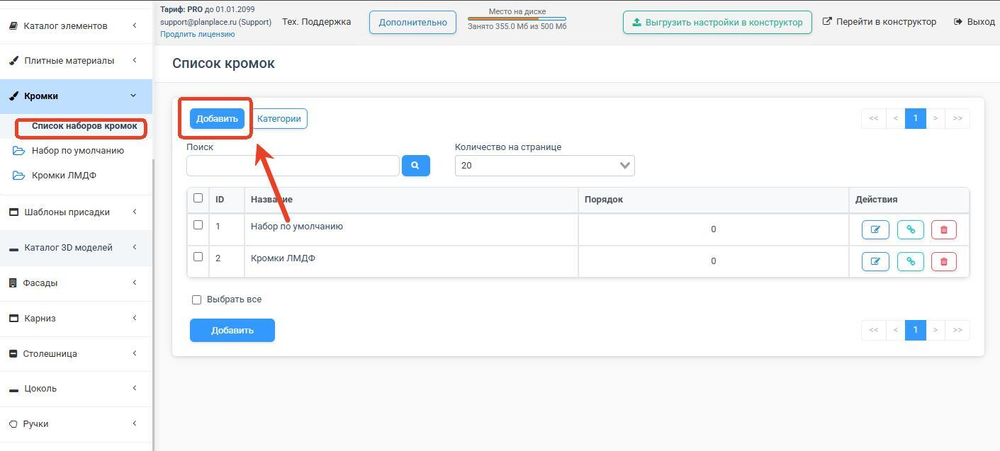
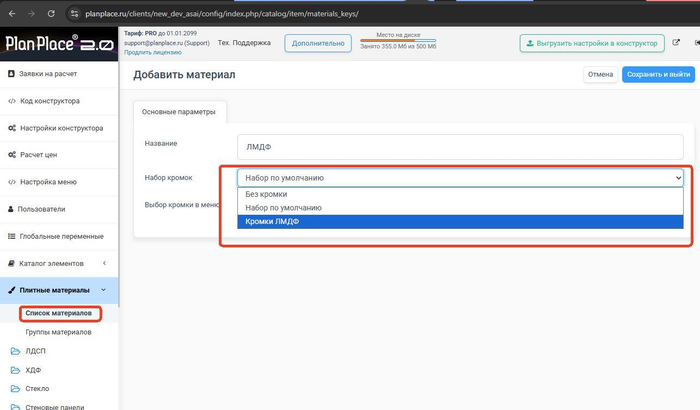
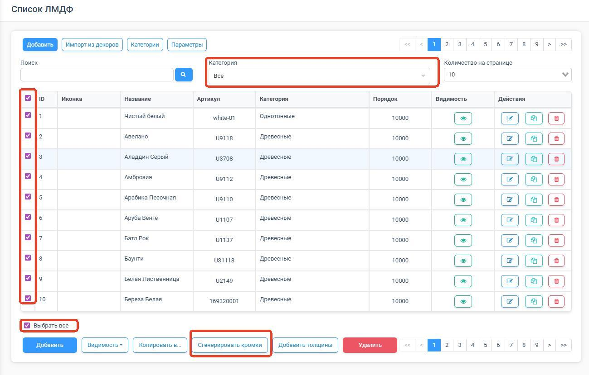
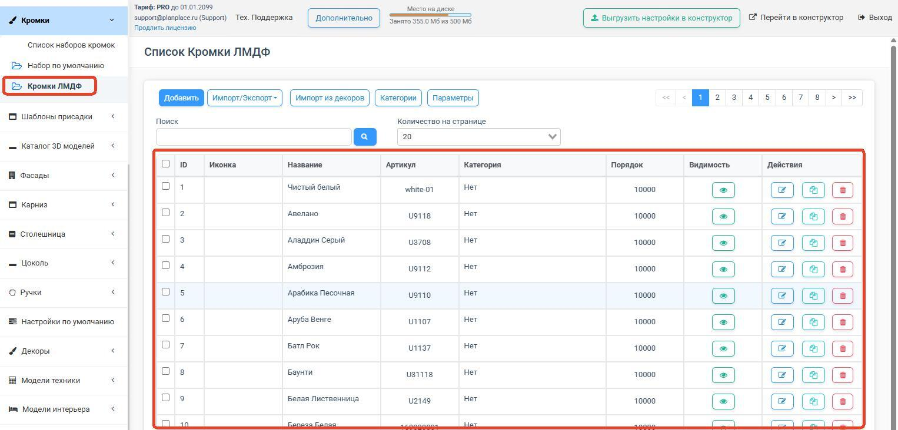
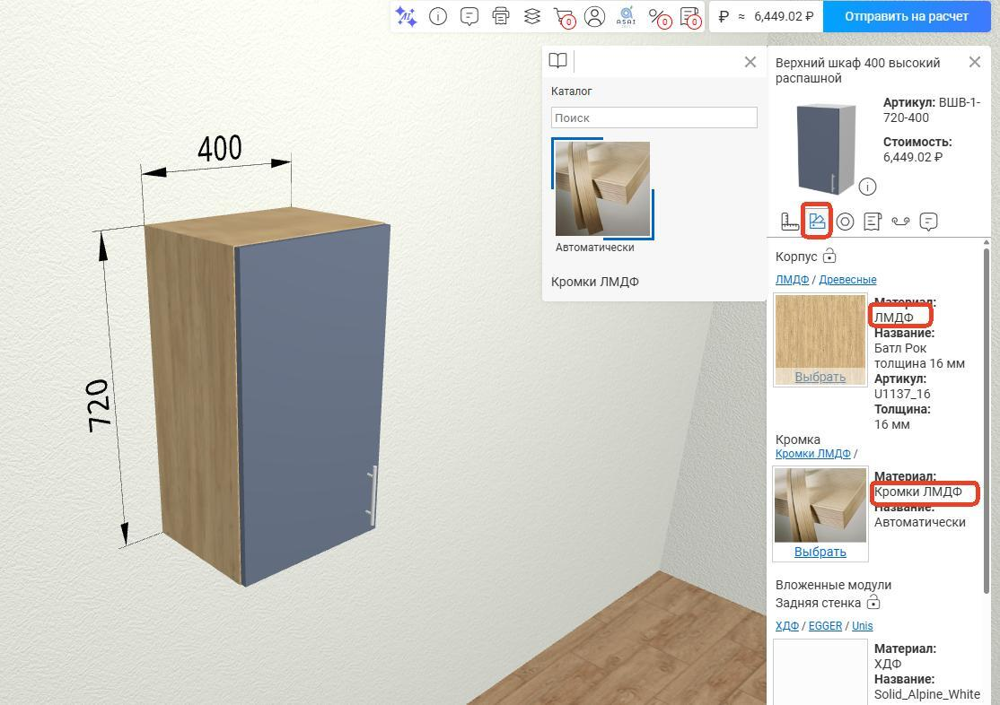

## Создание нового набора кромок

Откройте раздел **«Список кромок»** и создайте новый набор. Название набора лучше давать
понятное, по типу материала. Например:

- Кромки ЛДСП
- Кромки ЛМДФ
- Кромки HDF

Это упростит дальнейшую настройку и поддержку.

В открывшейся форме в поле **«Название»** введите название нового набора кромок, например
«Кромки ЛМДФ». После ввода названия нажмите кнопку **«Сохранить и выйти»**. После
сохранения набор появится в общем списке и его можно будет использовать при настройке
материалов.

### Назначьте набор нужным плитным материалам

Перейдите в список плитных материалов и откройте нужный материал. В карточке материала:

- выберите созданный набор кромок;
- убедитесь, что материал не помечен как **«без кромки»**;
- при необходимости включите параметр **«Выбирать кромку в меню»**.

Этот флаг влияет на поведение в конструкторе: кромку можно будет выводить для выбора
пользователем.

## Автоматическое создание кромок на основе плитных материалов

Функция автоматического создания кромок нужна, чтобы не заводить кромки вручную для
каждого плитного материала. Достаточно один раз назначить материалу набор кромок, выбрать
все или отдельные плитные материалы и автоматически создать для них кромки по всем
используемым толщинам.

**Что делает система при генерации:**

- создаёт кромки на основе выбранных плитных материалов;
- формирует артикулы кромок автоматически;
- подставляет декор от плитного материала;
- задаёт тип расчёта стоимости для кромки как **рубль за погонный метр**;
- использует созданные кромки в дальнейшем в конструкторе и спецификациях.

### Когда использовать

- у вас уже добавлены плитные материалы;
- для них нужно быстро создать соответствующие кромки;
- один и тот же декор должен иметь свои кромки для разных толщин плит;
- вы хотите, чтобы кромки корректно подставлялись в конструкторе и в расчёте.

### Что нужно подготовить заранее

1. **Плитные материалы уже созданы.** Материал должен быть заведён в разделе плитных
   материалов и иметь нужные толщины, а также привязанный набор кромок.
2. **У материала назначен набор кромок.** Для генерации нельзя использовать материалы со
   значением «без кромки».
3. **Заранее продуманы наборы кромок по типам материалов.**

### Как работает автоматическое создание кромок

Система анализирует выбранные плитные материалы и смотрит, какие толщины у них
используются. Для каждой найденной толщины вы задаёте:

- ширину кромки;
- список доступных толщин кромки через пробел (десятичную дробь можно задать через точку
  или запятую — система воспринимает оба символа одинаково).

**Например:**

- для плиты 16 мм можно указать ширину кромки 18 мм;
- для плиты 18 мм — 20 мм;
- а в списке доступных толщин кромки указать, например: `0.4 1 2`.

Ширина кромки обычно делается чуть больше толщины плиты, чтобы потом убрать свесы при
обработке.

### Шаг 1. Выберите материалы

В списке плитных материалов выберите один материал, несколько, все материалы в текущем
фильтре или категории либо вообще все материалы в списке. Если включён фильтр, массовое
действие применяется только к материалам из фильтра.

### Шаг 2. Запустите генерацию кромок

После выбора материалов откройте массовое действие **«Генерация кромок»**. Система покажет
все толщины, которые встречаются в выбранных материалах. Для каждой толщины заполните
**ширину кромки** и **доступные толщины кромки**.

Толщины указываются **через пробел**. Примеры: `0.4 1`, `0,4 1`, `0.4 1 2`. Точка или
запятая в десятичной дроби допустимы — главное разделять значения пробелом.

### Шаг 3. Нажмите «Создать»

После подтверждения система создаст кромки для выбранных плитных материалов. Что создаётся
автоматически:

- наименование кромки по наименованию плитного материала;
- артикул по наименованию плитного материала с добавлением ширины и толщины;
- декор;
- связь с плитным материалом;
- тип расчёта стоимости — **рубль за погонный метр**.

### Что происходит с уже существующими кромками

Если у выбранного плитного материала ещё нет привязанной кромки, система создаст новые
кромки и привяжет их к материалу. Если кромка уже была привязана, система не перезаписывает
весь набор целиком, но перезаписывает кромку для текущего материала. Массовая генерация
работает адресно по выбранным материалам.

### Как это влияет на работу в конструкторе

После настройки плитного материала с кромкой и добавления его в группу материалов он
начинает корректно работать в конструкторе: информация выгружается в БАЗИС-Мебельщик,
оптимизаторы ASAI SOFT, учитывается в расчёте стоимости. В конфигураторе кромка на детали
подбирается по толщине кромки и по толщине материала.

**Не удаляйте отдельные кромки или наборы кромок, если они используются в проектах.** Если
какой-то тип больше не актуален, лучше просто скрыть его отображение.
