Короткие ответы на практические вопросы о PlanPlace. Если по теме есть подробная статья, используйте ссылку в ответе. Если решения нет, отправьте обращение через [форму поддержки](/Tilda-PlanPlace/support_form/).

## Доступ и браузер

### Как восстановить пароль?

На странице входа нажмите **«Восстановить пароль»**. Новый пароль будет отправлен на электронную почту, связанную с учётной записью.

Если письмо не пришло, проверьте папки «Спам» и «Рассылки», а затем повторите восстановление.

### Как обновить страницу без старых данных из кэша?

Одновременно нажмите **Ctrl + F5**. Браузер заново загрузит страницу и её ресурсы, не используя сохранённую копию.

Это полезно после обновления конструктора или если интерфейс отображается не так, как ожидается.

### Что делать, если не открывается 3D-сцена или появляется ошибка WebGL?

1. Включите аппаратное ускорение в браузере.
2. Перезапустите браузер.
3. Если проблема осталась, обновите драйвер видеокарты.
4. Проверьте поддержку WebGL 2.0 на странице [get.webgl.org/webgl2](https://get.webgl.org/webgl2/).

В Google Chrome откройте `chrome://settings/system` и включите аппаратное ускорение.

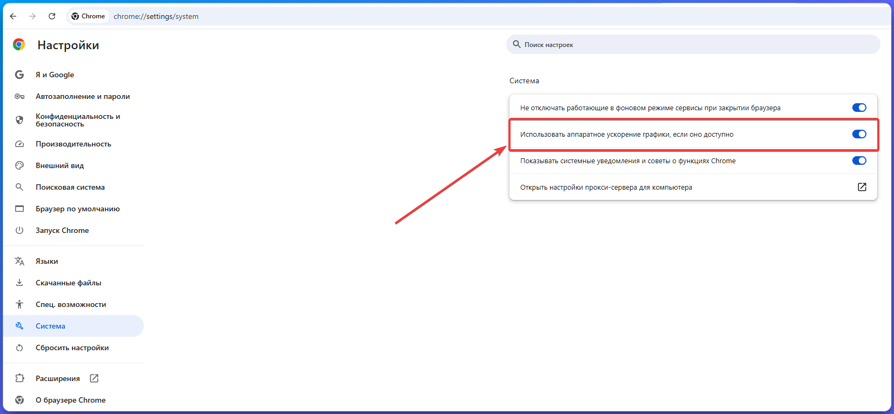

В Яндекс Браузере откройте `browser://settings/system?search=аппарат` и проверьте соответствующую настройку.

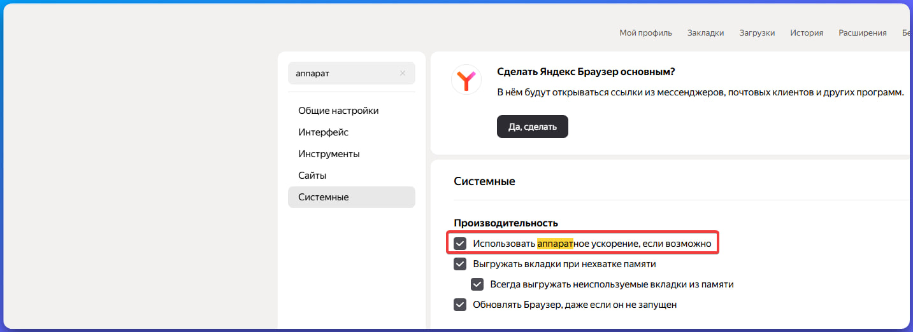

### Как ускорить тяжёлую сцену с большим количеством вырезов и пазов?

Временно отключите отображение вырезов и пазов непосредственно на сцене. Это снижает нагрузку при работе с проектом. Сами вырезы и пазы не удаляются: они остаются видны в режиме контуров и учитываются при выгрузке в «Базис».

## Работа в конструкторе

### Как отменить или повторить последнее действие?

Используйте кнопки **отмены** и **повтора** последнего действия на сцене. Если кнопки не появились после обновления платформы, сначала выполните жёсткое обновление страницы сочетанием **Ctrl + F5**.

### Как разрешить пользователям вводить собственные размеры модуля?

В настройках конструктора включите параметр **«Позволить пользователям вводить свои размеры модуля»**.

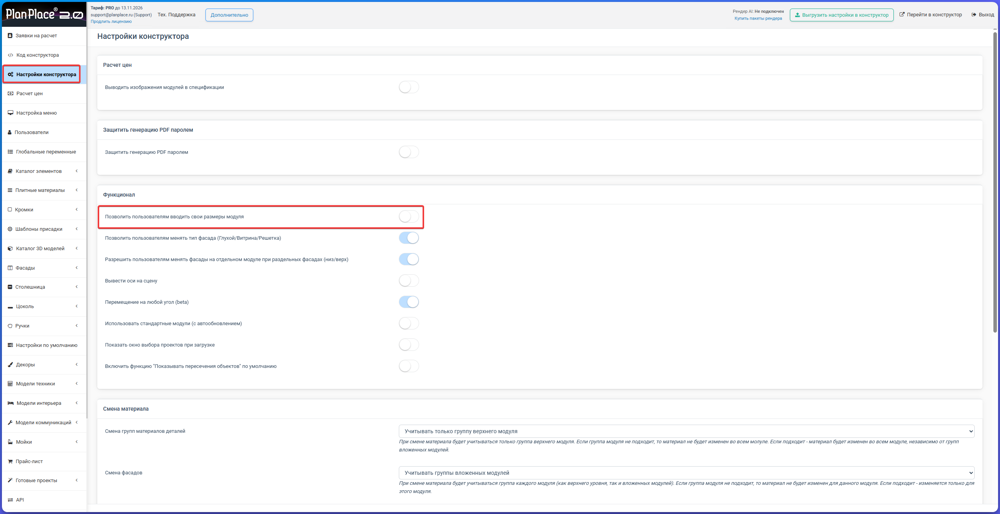

После включения на сцене станут доступны поля для ручного ввода размеров.

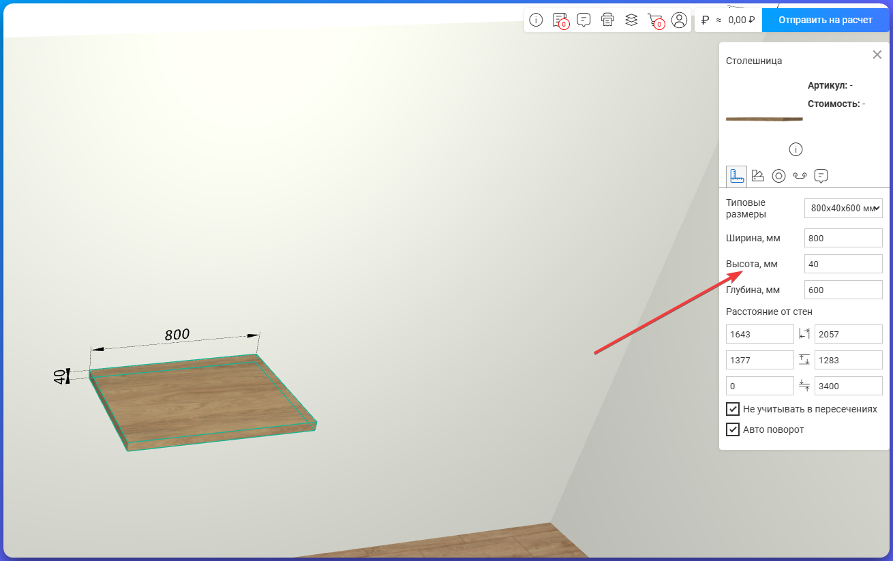

### Какие переменные можно использовать в размерах?

В формулах размеров можно использовать **глобальные переменные**. Нужная переменная должна существовать до того, как вы выберете её в формуле. Подробно — в статье [«Параметры, формулы и позиционирование»](/Tilda-PlanPlace/parametry-formuly-pozicionirovanie/).

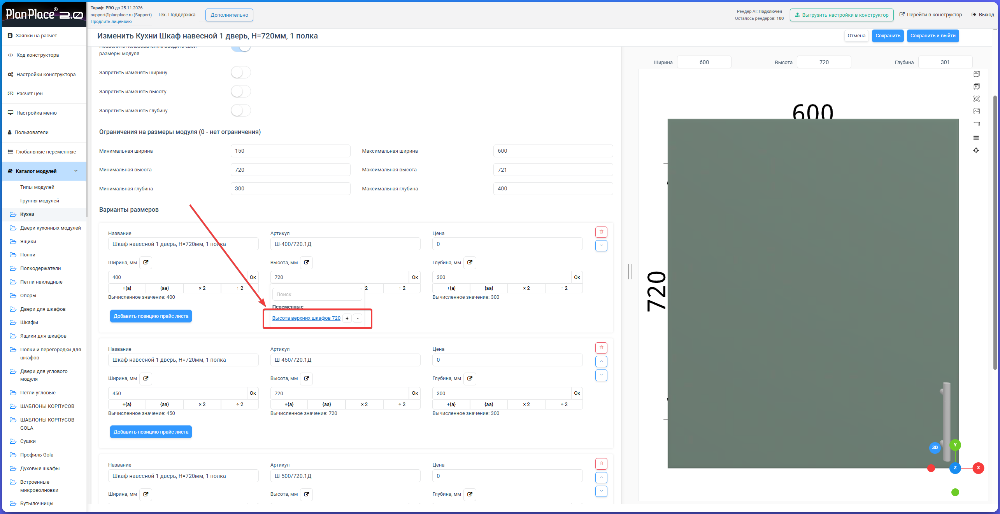

### Как добавить новый цвет профиля Gola?

Профиль Gola является элементом типа **«Профиль Gola»** состоящим из 3D моделей в определённом цвете. При выборе цвета и ручки на сцене один профиль заменяется другим.

Чтобы создать новый вариант, скопируйте существующий профиль в этом разделе, откройте все 3D модели, которые в него включены, скопируйте их, измените его цвет и название, вертись в новых элеменет GOLA и последовательно замените все 3D модели на те, что вы только что скопировали, затем сохраните и опубликуйте на сцене. 

### Можно ли менять направление текстуры отдельно для каждой детали?

Да. Направление текстуры материала можно задавать для каждой конкретной детали изделия при настройке модуля. За это отвечает параметр "Поворот текстуры"

### Что означает «Подрезка кромки»?

Подрезка кромки — часть логики прифуговки при передаче в «Базис». Она уменьшает размер детали на толщину кромки с каждой выбранной стороны.

## Каталоги и материалы

### От чего зависит список категорий материалов на сцене?

Список формируется по цепочке:

`элемент → назначенная группа материалов → доступный плитный материал → категории материала`.

Если для элемента модуля должна быть доступна только одна категория, откройте настройку его материала, отключите общий переключатель доступности на закладке Материалы и выберите нужную категорию вручную.

### Почему в меню модуля показывается материал, который визуально не используется?

Проверьте сам модуль и все вложенные элементы. Если ключ материала добавлен хотя бы в один вложенный элемент, материал может выводиться в меню, даже когда визуально нигде не используется.

Чтобы скрыть его, удалите ненужную привязку материала из вложенных модулей.

### Можно ли создавать подкатегории прайс-листа и управлять их порядком?

Да. В прайс-листе поддерживаются подкатегории.

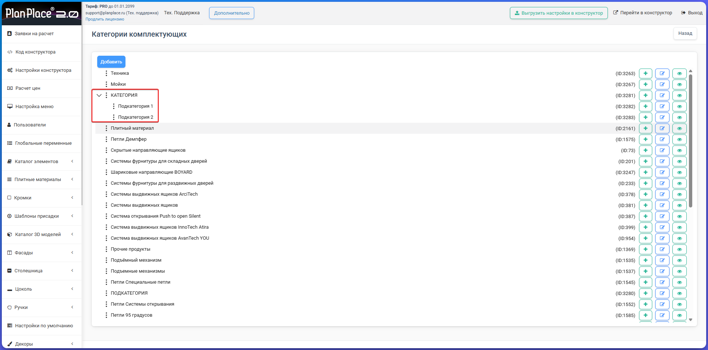

На сцене позиции отображаются с учётом структуры категорий и подкатегорий.

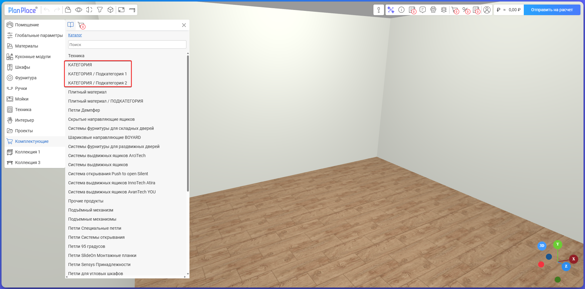

Порядок позиций внутри категории настраивается отдельно. Порядок самих категорий соответствует их порядку в разделе категорий прайс-листа и меняется перетаскиванием.

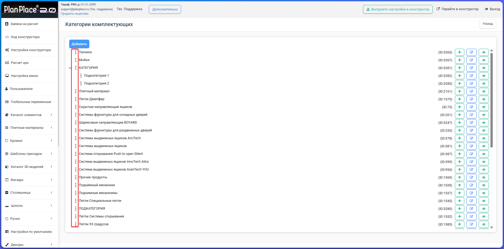

## Расчёт и спецификация

### Как работает автоподбор вариантов при расчёте спецификации?

Настройка **«Автоподбор вариантов при расчёте спецификации»** подбирает реальный набор листов или отрезков под фактический размер детали:

- при точном совпадении выбирается соответствующий вариант без остатка;
- если точного совпадения нет, выбирается комбинация с минимальным отходом;
- при одинаковом отходе выбирается комбинация с меньшим количеством листов или отрезков.

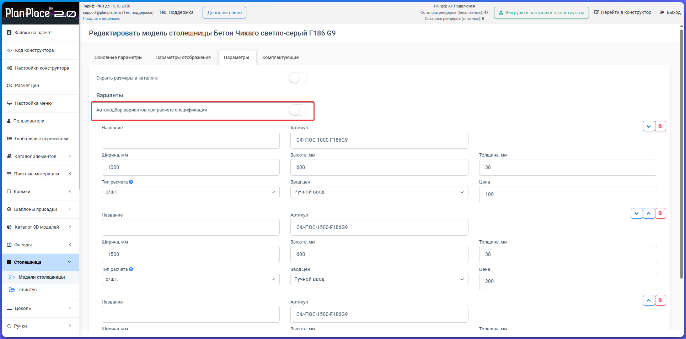

Например, для детали 2200 × 600 мм при вариантах шириной 1000, 1500, 2000, 2500 и 3000 мм система выберет лист 2500 × 600 мм как ближайший подходящий вариант с минимальным отходом.

### Как задаётся размер хлыста и рассчитывается погонажный материал?

Размер хлыста указывается **в миллиметрах**. Например, значение `580` означает 580 мм, а `5,8` — только 5,8 мм.

При типе расчёта **«р/хлыст (п. м.)»** цена привязана к целому хлысту, но количество не округляется до целого: система рассчитывает долю стандартной длины, необходимую для проекта.

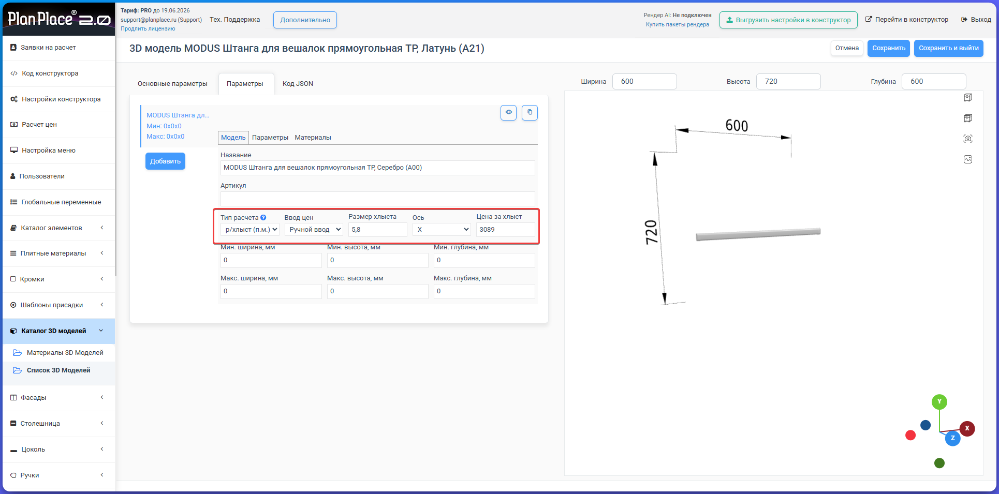

Подробнее: [Доступные типы расчётов](/Tilda-PlanPlace/dostupnye-tipy-raschetov/).

### Откуда берутся артикул и название итогового модуля в спецификации?

В раздел **«Модуль»** попадают только итоговые модули. Их артикулы и названия подтягиваются из вариантов размеров.

### Как вывести вложенные элементы в спецификацию?

Для вложенных модулей позиции прайс-листа привязываются непосредственно внутри дерева модуля. Через эти позиции можно настроить вывод в спецификацию в зависимости от размера и цвета, используя переменные.

Например, для вариантов ящика разных цветов можно создать отдельные позиции прайс-листа с соответствующими артикулами и переключать варианты через переменную.

## Производство и интеграции

### В какие производственные системы можно выгрузить проект?

Поддерживается выгрузка файлов проектов в **«БАЗИС-Мебельщик»**, **АСАИ.Нестинг** и **АСАИ.Раскрой**. Условия подключения и стоимость размещены в разделе [услуг PlanPlace](https://planplace.online/ru/uslugi#!/tab/1714482641-2).

Для выгрузки со сцены пользователь должен быть авторизован.

## Обращение в поддержку

### Что приложить к заявке, чтобы её быстрее обработали?

Создавайте отдельную заявку для каждого нового вопроса. Приложите:

- ссылку на элемент или раздел, в котором возник вопрос;
- файл проекта, если ошибка или вопрос воспроизводится в конкретном проекте;
- краткие шаги, после которых возникает проблема;
- скриншот или запись экрана, если поведение сложно описать словами.

Так специалисту не придётся отдельно запрашивать исходные данные, а разные вопросы не смешаются в одной переписке.

---

## Расширенные типовые сценарии

### Проекты и публикация

### Как сохранить изменения и опубликовать настройки в сцене?

Проект сохраните кнопкой **«Сохранить»**, затем выполните **«Выгрузить настройки в конструктор»** и обновите сцену. Это нужно, чтобы изменения из редактора настроек попали в рабочий конструктор.

### Как сделать резервную копию перед массовыми изменениями?

Перед удалением, импортом или массовым редактированием создайте ручную резервную копию базы. Восстановление выполняется из доступной копии; перед восстановлением убедитесь, что выбрана нужная дата. Не полагайтесь на резервную копию как на замену обычному сохранению проекта.

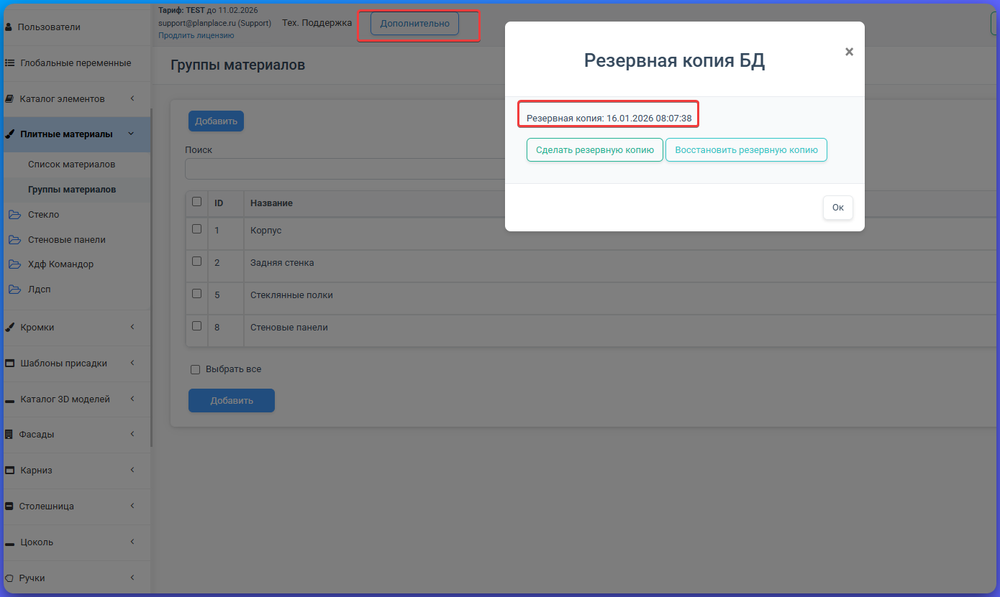

### Доступ и браузер

### Что проверить, если браузер не даёт загрузить файл?

В настройках браузера проверьте разрешения сайта: загрузку файлов, всплывающие окна и JavaScript. Убедитесь, что сайт не находится в списке заблокированных. После изменения разрешений обновите страницу и повторите загрузку.

### Что делать, если после обновления остался старый проект или неправильное состояние?

Если обычное обновление не помогло, откройте инструменты разработчика браузера: **F12 → Application → Local Storage**, выберите хранилище PlanPlace и очистите его, затем обновите страницу. Перед этим сохраните проект и убедитесь, что понимаете последствия: очистка может удалить локально сохранённое состояние восстановления и несохранённые изменения.

### Какие характеристики компьютера и браузера нужны для комфортной работы?

Используйте актуальную версию Chrome, Edge, Firefox или Safari и включённое аппаратное ускорение. Для комфортной работы ориентируйтесь на 8–16 ГБ оперативной памяти и видеокарту с 4 ГБ видеопамяти или больше; минимальные требования проверяйте в актуальном разделе [«Проверить систему и браузер»](/Tilda-PlanPlace/proverit-sistemu-i-brauzer/).

### Как подготовить браузер, если PlanPlace работает медленно?

Начните с актуального Chrome или другого поддерживаемого браузера. Закройте лишние вкладки, временно отключите тяжёлые расширения, проверьте аппаратное ускорение и повторите проверку на другом компьютере. Если проблема сохраняется, приложите к обращению браузер, ОС и пример проекта.

### Проекты и публикация

### Есть ли отдельная клавиша для сохранения проекта?

Надёжный способ — использовать кнопку **«Сохранить»** в интерфейсе. Если сохранение зависло, выполните **Ctrl + F5**, дождитесь восстановления автосохранённого состояния и снова нажмите **«Сохранить»**.

### Что такое файл DBX и как его открыть?

DBX — это архив с данными проекта. Для просмотра содержимого в файловом менеджере можно сделать копию файла и заменить расширение копии на `.zip`, затем открыть архив. Не редактируйте содержимое вручную, если не понимаете структуру данных.

### Как добавить проект в библиотеку готовых проектов?

Соберите проект, настройте камеру и сохраните файл проекта на компьютер. В личном кабинете откройте раздел **«Готовые проекты»**, создайте или выберите категорию, укажите название, загрузите проект и изображение-превью через файловый менеджер, затем сохраните изменения. Для имён файлов используйте латиницу без пробелов.

### Где редактировать категории и уже добавленные готовые проекты?

Редактирование выполняется в личном кабинете в разделе **«Готовые проекты»**. Там можно изменить название, категорию и другие параметры опубликованного проекта.

### Версии и совместная работа

### Что проверить после переноса проекта с версии 1.0 на 2.0?

После автоматического переноса проверьте вход и интерфейс, модули, материалы и размеры, наполнения, цены и спецификацию, экспорт и 3D-сцену. Переноситcя основа базы, но листовые материалы, кромки и цены могут потребовать повторной настройки. Проекты версии 1.0 не следует открывать в конструкторе версии 2.0 напрямую: используйте штатный перенос и контрольный проект.

### Можно ли работать с одной базой с нескольких устройств?

Да, но не редактируйте один и тот же элемент одновременно на разных устройствах. При параллельных изменениях возможны конфликты и потеря части правок; после завершения работы сохраните изменения и обновите проект на другом устройстве.

### Каталог, модули и секции

### Как временно убрать каталог или категорию с меню, не удаляя данные?

Если нужно только скрыть каталог, уберите его из меню. Не удаляйте элементы каталога: удаление может повлиять на связанные модули, материалы и цены.

### Как скопировать модуль другого типа через JSON?

Автоматическое копирование между типами может быть недоступно из-за зависимостей. Для опытных пользователей: создайте новый модуль нужного типа, откройте вкладку JSON, вставьте структуру исходного модуля, нажмите **Apply**, сохраните и обновите страницу. Перед операцией сделайте резервную копию и проверьте материалы, переменные, вложенные элементы и цены.

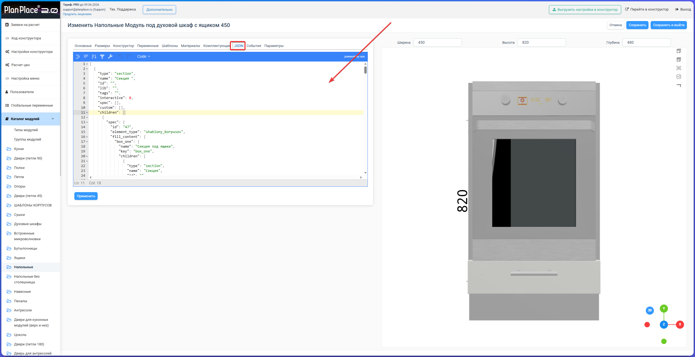

### Как скопировать дерево модуля или его переменные?

В редакторе можно скопировать нужную секцию или дерево модуля, а для полного переноса использовать JSON. После вставки проверьте зависимости: переменные, материалы, размеры, вложенные элементы и позиции прайс-листа. Сохраните результат и проверьте модуль на тестовой сцене.

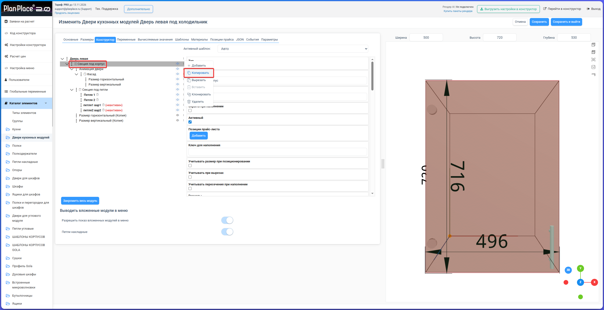

### Можно ли изменить тип уже созданного элемента?

Нет, тип существующего элемента не меняется. Создайте новый элемент нужного типа и заново настройте его свойства и связи.

### Как сделать, чтобы элемент сохранял пропорциональное положение при растяжении модуля?

Не задавайте положение только фиксированным числом в миллиметрах. Используйте процент или формулу, зависящую от размера модуля, чтобы положение пересчитывалось при растяжении.

### Как сделать одинаковые секции разной высоты?

Используйте равные секции и формулы вместо набора жёстко заданных чисел. Если набор размеров ограничен, создайте шаблоны по высоте и привяжите к ним нужные варианты.

### Как настроить нахлёст задней стенки?

В шаблоне нижнего модуля задайте переменную **«Тип задней стенки = внахлёст»**. Проверьте результат на тестовом размере и в спецификации.

### Как включать и выключать фасад на сцене?

Создайте или используйте переменную состояния и привяжите к ней условие отображения фасада. Переключение значения переменной должно менять наличие фасада на сцене; проверьте оба состояния и итоговую спецификацию.

### Как переключать варианты фурнитуры или крепежа?

Добавьте оба варианта в модуль и задайте для них противоположные условия по одной переменной. На сцене переключайте значение переменной и проверьте, что отображается только нужный вариант.

### Как настроить элемент наполнения по ширине и глубине?

Включите для элемента параметры **«Элемент наполнения»**, **«Подстраивать по ширине»** и **«Подстраивать по глубине»**. После этого проверьте границы наполнения на нескольких размерах секции.

### Как задать шаг установки полок или других элементов наполнения?

Используйте раздел **«Автогенерация элементов»** у секции. Выберите режим **«Автоконфигурация по шагу (рассчитать количество)»**, включите ось Y и задайте шаг, например 32 мм. Система сама рассчитает, сколько элементов помещается в секцию. Подробная настройка описана в статье [«Секции и наполняемые секции»](/Tilda-PlanPlace/sekcii-i-napolnyaemye-sekcii/#автогенерация-элементов).

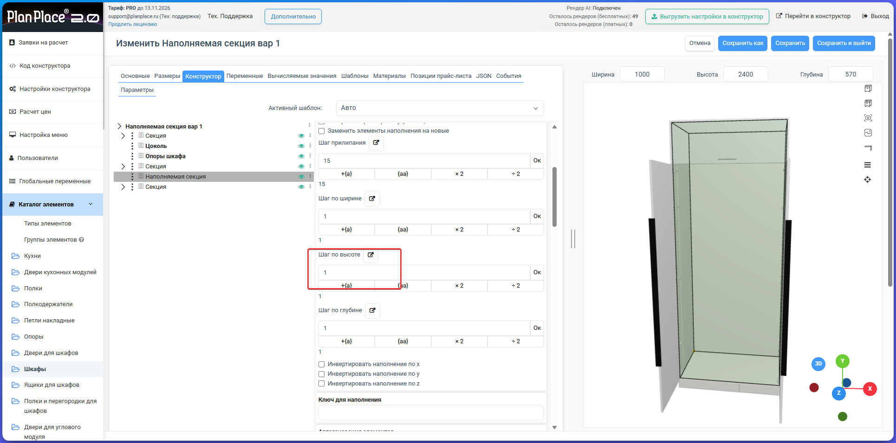

### Как сделать вложенный элемент удобным для выбора мышью?

Добавьте к нужному вложенному элементу **«Цель для мыши»**. Это помогает выбирать его на сцене, когда элементы перекрываются. После добавления проверьте, не влияет ли цель на позиционирование и расчёт размеров.

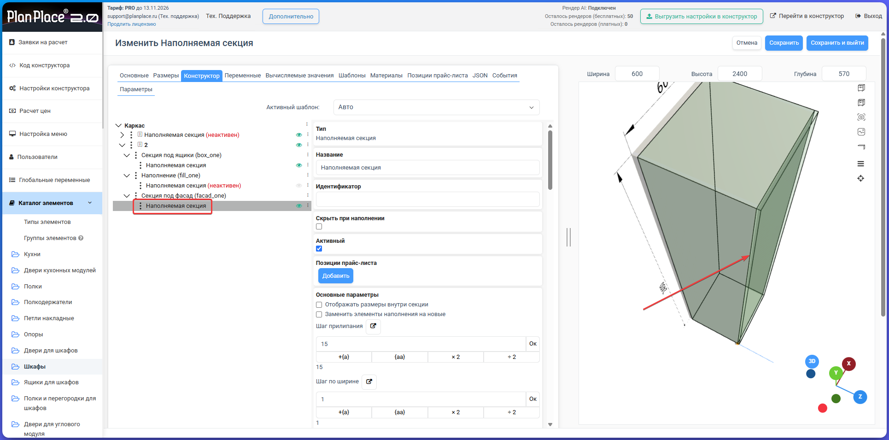

### Почему дверь или ящик не видны в некоторых размерах?

Проверьте, создан ли шаблон для соответствующей высоты или ширины. Если для размера нет подходящего шаблона, элемент может не появиться или остаться без наполнения. Добавьте нужный шаблон и проверьте диапазоны размеров.

### Фасады, ручки и 3D-модели

### Как назначить артикул по конкретной ширине фасада?

Создайте варианты шаблонов по нужным размерам и привяжите к ним позиции прайс-листа с соответствующими артикулами и ценами. Если точного варианта нет, система может перейти к расчёту по площади — проверьте это явно на тестовых размерах.

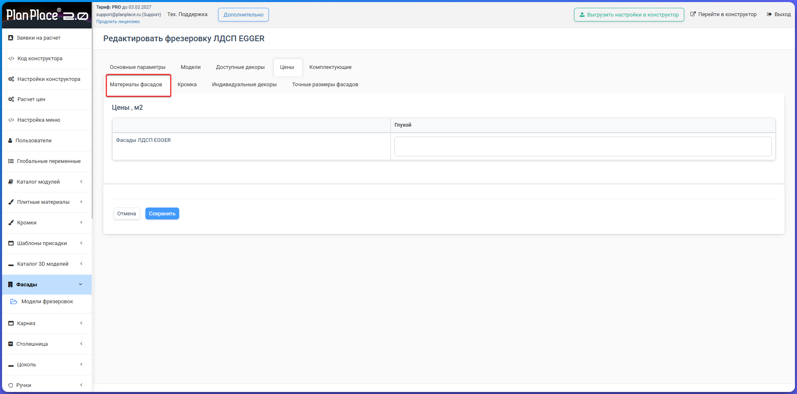

### Как открыть все двери или одну дверь на сцене?

Кнопка на сцене переключает режим открывания или закрывания всех дверей. Чтобы изменить одну дверь, используйте клик средней кнопкой мыши по нужной двери.

### Как добавить готовую 3D-модель мойки или другого элемента?

Скачайте подготовленную 3D-модель, добавьте её в 3D-каталог, назначьте материал и вставьте модель в нужный модуль. Перед публикацией проверьте масштаб, ориентацию, точку привязки и отображение в сцене.

### В каком формате готовить 3D-модели ручек и других элементов?

Для ручек и аналогичных элементов поддержка готовит модели в формате FBX. Перед загрузкой проверьте единицы, ориентацию осей, масштаб и точку привязки.

### Как подготовить 3D-модель перед загрузкой?

В редакторе модели выровняйте оси, примените масштаб **1** и установите точку привязки в центре геометрии. Для свободной 3D-модели нового движка специальные ключи в названиях мешей не нужны: адаптация, растягивание и материалы каждого меша настраиваются визуально уже в PlanPlace. Затем добавьте модель в тестовый модуль и проверьте её на нескольких размерах. Подробнее — в статье [«3D-модели в 2.0: новый движок»](/Tilda-PlanPlace/3d-modeli-dvizhok-2-0/).

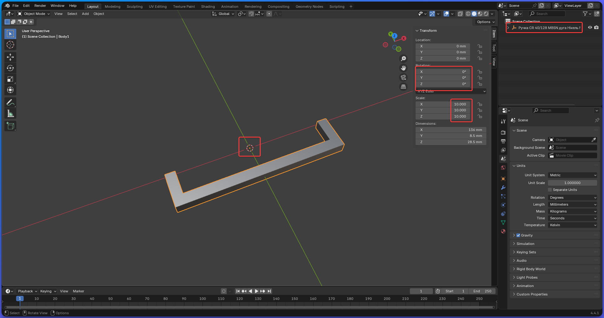

### Почему цвет материала не применяется к 3D-модели?

В исходной сцене модели удалите камеры, источники света и лишние материалы, сбросьте масштаб, проверьте ключи, ориентацию и точку привязки. Цвет и материал назначьте уже в PlanPlace после подготовки модели. Тестируйте на простом материале без дополнительных текстур.

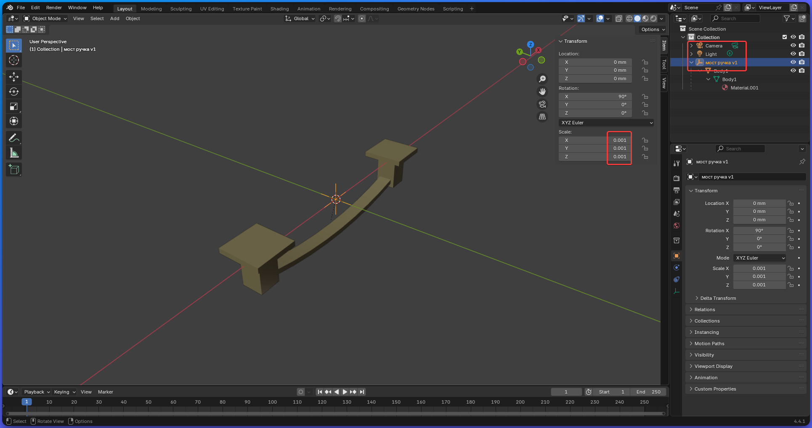

### Почему замена фасада не работает для обычной детали?

Зоны замены фасада работают только для сущности типа **«Фасад»**. Деталь с похожим названием не участвует в замене нижнего, верхнего или антресольного фасада. Проверьте тип элемента в дереве модуля.

### Как настроить цвет стеклянного фасада?

Добавьте группу материала стеклянного фасада в материалы по умолчанию и назначьте ей нужные варианты. После этого проверьте материал на фасаде в сцене и в опубликованном конструкторе.

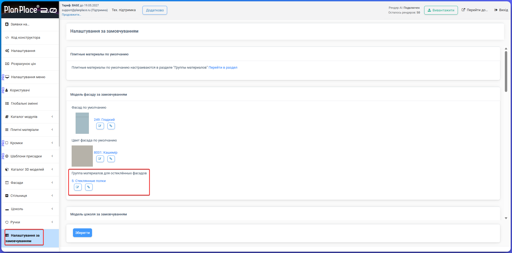

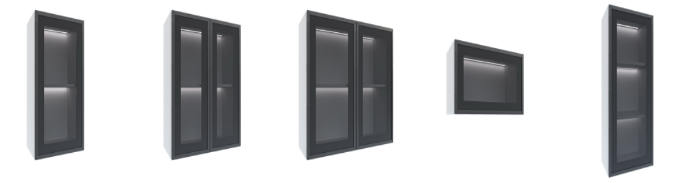

### Каталоги и материалы

### Почему категория материалов исчезает из меню?

Категория может исчезнуть, если все её элементы скрыты или недоступны. Проверьте видимость элементов, привязку категории к материалам и назначение группы материалов модулю.

### Как изменить направление текстуры, если рисунок расположен неправильно?

Предпросмотр материала следует ориентации исходного изображения. Для вертикального отображения задайте поворот текстуры в настройках материала. После изменения проверьте несколько деталей: предпросмотр может показывать текстуру в условном размере, а не в фактическом размере детали.

### Как безопасно заменить материал, который уже используется?

Не удаляйте материал, пока он связан с модулями. Создайте новый материал, импортируйте нужные позиции, назначьте его группе материалов, затем отвяжите старый материал и только после проверки удаляйте его. Перед массовой заменой сделайте резервную копию.

### Почему материал есть в базе, но не виден и не попадает в цену?

Проверьте видимость материала, его доступность для нужной группы и наличие позиции в прайс-листе. Наличие записи в каталоге само по себе не означает, что материал разрешён для выбора и участвует в цене.

### Прайс-лист, цены и Excel

### Что означает пустой ID позиции при импорте Excel?

Пустой ID означает новую позицию. Заполненный существующий ID означает обновление этой позиции. Перед импортом сохраните исходный файл и не меняйте ID у уже существующих строк без необходимости.

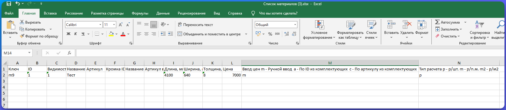

### Как устроены варианты и видимость позиций в Excel?

У каждой позиции и каждого варианта должен быть свой ID. Значение `1` в поле видимости показывает позицию, `0` скрывает её. Повторяющиеся строки можно использовать для вариантов, если у них корректно заполнены ID, условия и связанные поля.

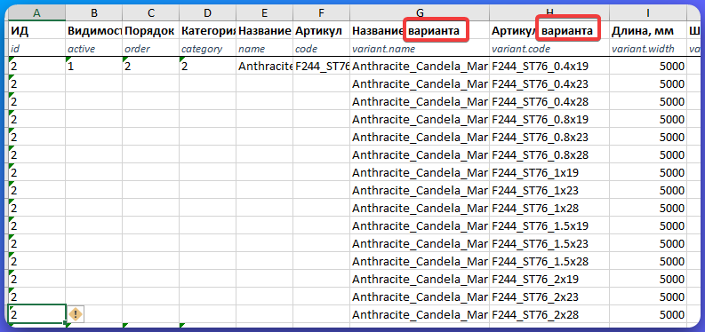

### Какой формат Excel использовать для импорта прайс-листа?

Используйте тот же набор столбцов и структуру, который выдаёт экспорт PlanPlace. Не дублируйте ID: одинаковые ID могут привести к перезаписи данных. Сначала импортируйте копию с небольшим количеством строк и проверьте результат.

### Почему десятичное число в Excel импортируется неправильно?

Проверьте разделитель дробной части и формат ячейки. Для русской локали замените точки на запятые и задайте числовой формат, затем сохраните файл и повторите импорт на тестовой копии.

### Как массово изменить цены только в одной категории?

В Excel отфильтруйте нужную категорию, измените цены в отобранных строках и импортируйте файл. До импорта проверьте ID, видимость и случайно затронутые строки; сначала сделайте резервную копию.

### Как выбрать ручную цену или цену по артикулу?

В настройках размера выберите один из режимов: **ручной ввод** с полем цены или **по SKU** — тогда цена берётся из прайс-листа по совпадающему артикулу. Проверьте, что SKU уникален и существует в нужном прайс-листе.

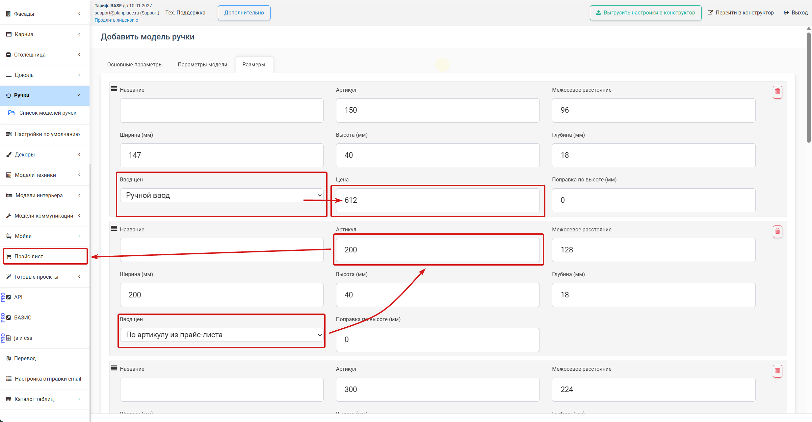

### Как переименовать категорию прайс-листа?

Откройте список категорий прайс-листа, выберите нужную категорию и используйте действие редактирования. После переименования проверьте отображение категории на сцене и в спецификации.

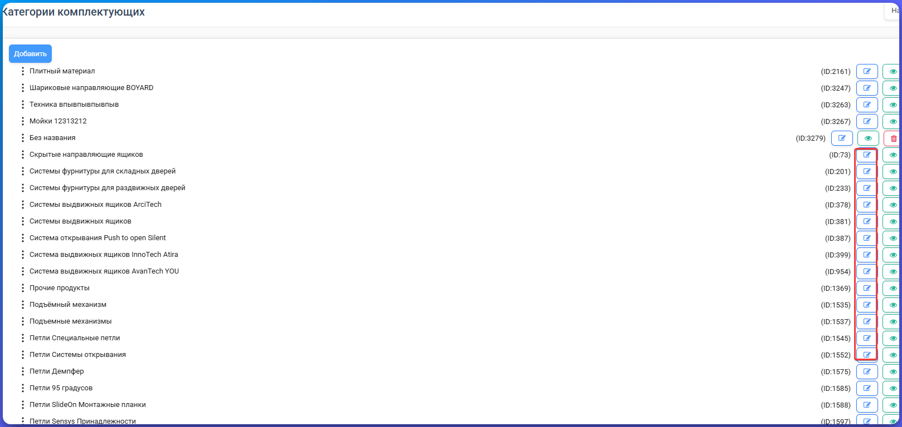

### Как работает наценка для дилера?

Наценка дилера рассчитывается с учётом основной наценки аккаунта: дилерская наценка умножается на базовую наценку. Проверьте итоговую цену на тестовой позиции и зафиксируйте значения обеих наценок.

### Спецификация и расчёты

### Почему разные варианты одной позиции считают по-разному?

Проверьте тип расчёта у всех вариантов. Если варианты должны считаться одинаково, у них должен быть один и тот же тип расчёта; различия в типе расчёта приводят к различиям в количестве и цене.

### Как вывести деталь в выгрузку вырезов?

У нужной детали включите параметр **«Учитывать при вырезах»**. Деталь может быть скрыта визуально, но при включённом параметре учитываться при выгрузке. Проверьте результат на тестовом проекте.

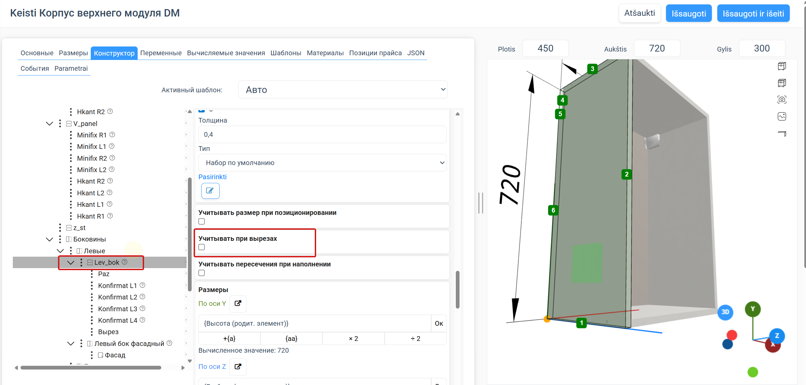

### Как выбрать расчёт по штукам, а не по площади?

В настройках позиции выберите тип расчёта **«в штуках»**, если цена и количество должны зависеть от числа изделий. Не оставляйте расчёт по площади для позиции, которая должна считаться поштучно.

## Общие вопросы о системе

### Можно ли пользоваться PlanPlace без собственного сайта?

Да. Планировщик работает по индивидуальной ссылке и открывается в браузере как отдельный сайт. Собственный сайт для начала работы не обязателен. Позже эту же ссылку можно разместить на сайте, отправлять клиентам или использовать в салоне.

### Как убрать пароль на PDF-спецификацию?

В личном кабинете откройте **«Настройки конструктора»** и отключите параметр **«Защитить генерацию PDF паролем»**. Сохраните изменения и нажмите **«Выгрузить настройки в конструктор»**. Подробнее — в статье [«Настройки конструктора»](/Tilda-PlanPlace/nastroyki-konstruktora/).

### Можно ли подключить Яндекс Метрику или другой счётчик?

Да. Счётчик подключается через раздел пользовательского JavaScript. Порядок настройки и ограничения тарифа описаны в статье [«Метрика и счётчики аналитики»](/Tilda-PlanPlace/metrika/).

### Можно ли изменить язык и названия пунктов интерфейса?

Да. Надписи меняются через таблицу переводов в личном кабинете. Состав и порядок меню сцены отдельно регулируются в разделе [«Настройка меню планировщика»](/Tilda-PlanPlace/nastroyka-menyu-planirovschika/).

### Может ли PlanPlace выполнить настройку системы под ключ?

Да. Специалисты могут помочь с созданием модулей, материалами, ценами, производственной выгрузкой и интеграциями через публичное API. Для оценки задачи отправьте требования через [форму поддержки](/Tilda-PlanPlace/support_form/) и приложите примеры исходных данных.

