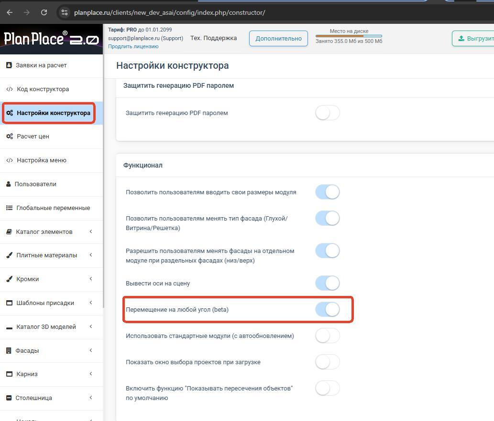
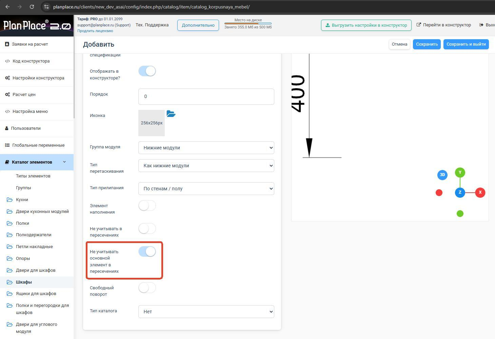
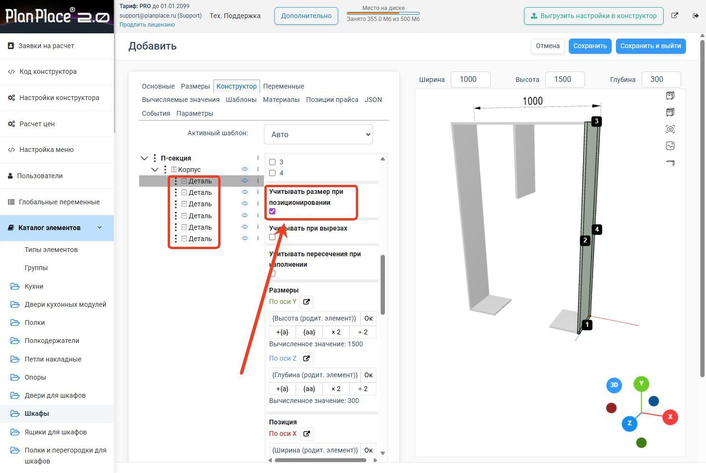
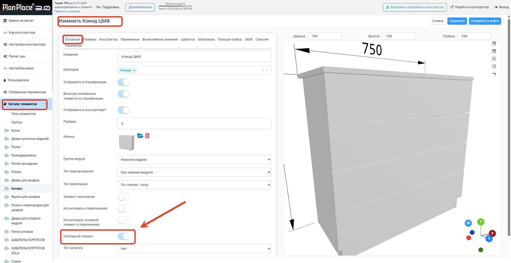

Чтобы мебель на сцене стояла правильно и красиво, важны две вещи: как объекты **вращаются** и как они **реагируют на пересечения** друг с другом. В этой статье разберём оба механизма — и глобальные настройки, и вращение отдельных элементов в конфигураторе.

## Глобальные настройки (в кабинете)

В [настройках конструктора](/Tilda-PlanPlace/nastroyki-konstruktora/) есть два связанных переключателя:

- **Вращение на любой угол (360°)** — разрешает поворачивать модули на произвольный угол, а не только на 90°. Важно для мягкой мебели, островных кухонь и нестандартных расстановок.
- **Сложные пересечения моделей** — разрешают объектам накладываться друг на друга с точной настройкой.

Рекомендуется также **вывести оси на сцену** и включить **отображение статуса пересечений**, чтобы было видно, какие объекты конфликтуют.

> После изменения этих настроек сделайте [жёсткую перезагрузку](/Tilda-PlanPlace/lichnyy-kabinet/) и выгрузите настройки в планировщик.

<Carousel>

</Carousel>

## Вращение элементов в конфигураторе

Внутри конфигуратора вращение детали или объекта задаётся по осям X, Y, Z, и применяется **последовательно** — сначала по одной оси, потом по следующей.

Способы задать вращение:

- **Визуальный регулятор** — крутите элемент мышкой. При зажатом `Shift` поворот фиксируется шагами по **90°** — удобно для точных прямых углов.
- **Формулой** — угол можно вычислить, в том числе через тригонометрию (например, `АРКТАНГЕНС(...)` для наклонных элементов). Это позволяет делать адаптивные конструкции с изменяемыми углами.

> **Будьте аккуратны с многократными поворотами.** Поскольку повороты по осям применяются по очереди, результат зависит от их порядка. Если элемент «улетел» не туда, проверяйте углы по одной оси за раз. Особенно это важно при позиционировании [присадок](/Tilda-PlanPlace/prisadki/) — неверный поворот направит сверло не в ту сторону.

## Что такое пересечения и зачем ими управлять

Когда два объёма (например, шкаф и техника, или полка и петля) занимают одно и то же место в пространстве, это **пересечение**. PlanPlace умеет такие ситуации отслеживать и по-разному на них реагировать.

Управление пересечениями нужно для двух задач:

1. **Запретить нежелательные наложения** — чтобы наполнение не залезало на фурнитуру, а модули не «проваливались» друг в друга.
2. **Разрешить намеренные наложения** — например, встроить технику в нишу или совместить декоративные элементы.

## Настройка пересечений у элемента

На вкладке [«Основные»](/Tilda-PlanPlace/osnovy-konfiguratora/) и в свойствах деталей есть параметры поведения при пересечениях. Например, у [детали](/Tilda-PlanPlace/detali/) можно включить признак «учитывать в вырезах», чтобы [вырез](/Tilda-PlanPlace/pazy-i-vyrezy/) её прорезал. У наполнения — защиту от пересечений с фурнитурой.

Технически система работает с «габаритными коробками» объектов (по-английски OBB — oriented bounding box). Каждый объект имеет такую коробку, и система сравнивает их, чтобы понять, пересекаются ли объекты. Вам не нужно вникать в математику — достаточно понимать, что именно эти настройки отвечают за «магнитное» и «непроницаемое» поведение объектов.

<Carousel>

</Carousel>

## Типичные проблемы и решения

- **Модуль проваливается в столешницу.** Включите у столешницы «учитывать при позиционировании» (см. [«Столешницы»](/Tilda-PlanPlace/stoleshnicy-plintusy-cokoli/)).
- **Наполнение налезает на петли.** Включите защиту от пересечений у наполняемой секции.
- **Техника не встаёт в нишу.** Разрешите сложные пересечения в настройках конструктора.
- **Объект вращается не так, как ожидалось.** Проверяйте повороты по осям по очереди; используйте `Shift` для шага 90°.

## Коротко

Вращение задаётся глобально (360° на сцене) и локально (по осям в конфигураторе, с шагом 90° по `Shift` или формулой). Пересечения управляют тем, могут ли объёмы накладываться: где-то это запрещают (наполнение не лезет на фурнитуру), где-то разрешают (техника в нишу). Включите отображение осей и статуса пересечений, чтобы видеть конфликты, и будьте внимательны с порядком поворотов.

