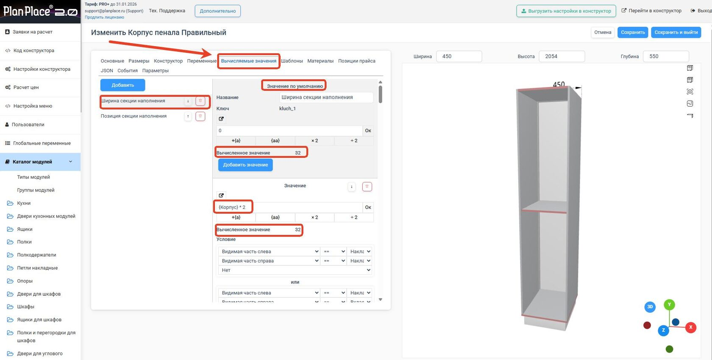
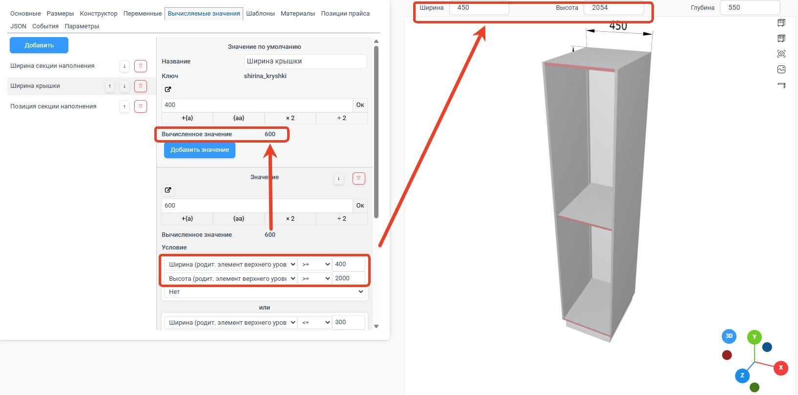
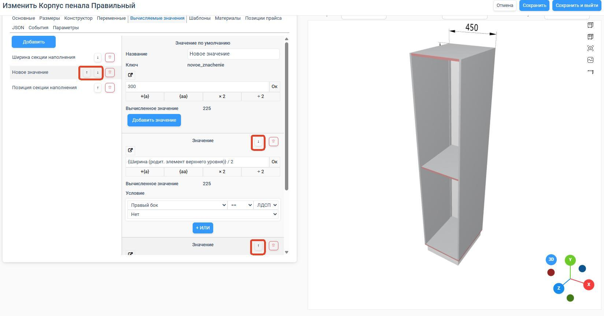

## Принцип работы вычисляемых значений и их зависимостей

**Вычисляемые значения** представляют собой переменные, которые динамически изменяют свои
показатели в зависимости от других переменных, глобальных параметров или условий применения
формул. Они автоматически пересчитываются при изменении исходных данных.

Ключевые характеристики:

- Вычисляемые значения могут ссылаться на глобальные переменные, параметры материалов и
  другие вычисляемые значения.
- Зависимости между ними реализованы по принципу последовательного вычисления снизу вверх.
- Каждое значение включает значение по умолчанию, которое может быть переменной или
  конкретным числом.
- Система отображает текущее значение для каждого параметра на основе переменных модуля.

## Условия и порядок вычисления значений

- Условия проверяются сверху вниз, и первое удовлетворённое условие определяет итоговое
  значение.
- Порядок условий можно изменить, влияя на приоритет вычисления.
- При отсутствии выполняемых условий применяется значение по умолчанию.
- Система позволяет создавать сложные комбинации с использованием операторов.

## Добавление нового вычисляемого значения

1. Создайте новое значение и задайте название; ключ генерируется автоматически.
2. Отрегулируйте позицию в списке.
3. Установите значение по умолчанию и условия применения.
4. Примените созданное значение на вкладке «Конструктор».

## Использование вычисляемых значений

Вычисляемые значения функционируют как обычные переменные и параметры. Важное примечание:
эти значения **не видны и не доступны пользователю сцены** — они предназначены исключительно
для администраторских настроек.

Особенности применения:

- Отсутствующие переменные получают значение 0.
- Вычисляемые значения ограничены уровнем модуля, где определены.
- Глубина, ширина и высота ссылаются на параметры верхнего родительского элемента.

## Примеры использования

Вычисляемые значения упрощают работу со сложными адаптивными модулями. Вместо создания
нескольких вариантов детали один элемент может быть один, но его размеры динамически
пересчитываются в зависимости от параметров конструкции.
