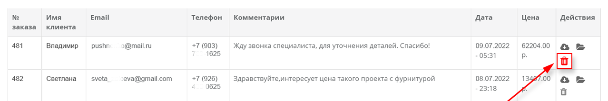

Когда клиент собрал проект в планировщике и нажал «Отправить на расчёт», его заявка попадает в специальный раздел кабинета. Это ваша воронка продаж: здесь видны все обращения, проекты клиентов и их стоимость. В этой статье разберём, как с ними работать.

## Как клиент отправляет заявку

На сцене у пользователя есть кнопка **«Отправить на расчёт»**. Нажав её, клиент заполняет короткую форму (имя, контакты, комментарий) и отправляет проект вам. После этого заявка появляется в кабинете, а копия приходит на [почту для заявок](/Tilda-PlanPlace/kod-konstruktora-i-osnovnye-parametry/).

Что именно показывает клиенту форма и какие письма отправляются, настраивается в статье [«Форма заявки и шаблоны писем»](/Tilda-PlanPlace/forma-zayavki-i-shablony-pisem/).

## Таблица заявок

Все заявки собраны в одну таблицу. По каждой заявке видны:

- **номер** заявки;
- **имя клиента**;
- **почта**;
- **телефон**;
- **комментарий** клиента;
- **дата создания**;
- **цена заказа** — итоговая стоимость собранного проекта.

Это позволяет быстро оценить поток обращений и приоритизировать работу менеджеров.

## Действия с заявкой

Напротив каждой заявки есть набор действий:

- **Скачать файл проекта** — сохраняет проект клиента себе (для дальнейшей работы или передачи в производство).
- **Открыть проект в конструкторе** — открывает проект на сцене, чтобы вы могли его доработать, проверить или пересчитать.
- **Скопировать ссылку без редактирования** — даёт клиенту ссылку на просмотр проекта **без возможности менять** конструкцию. Удобно для согласования: клиент видит проект, но случайно ничего не сломает.
- **Удалить заявку** — убирает обращение из списка.

> **Совет.** Прежде чем удалять заявку, убедитесь, что проект клиента сохранён или уже передан в работу. Восстановить удалённую заявку штатными средствами нельзя.

## Кто может работать с заявками

С заявками работают владелец, администратор и **менеджер**. Менеджеру не обязательно давать доступ к каталогу и ценам — он может только обрабатывать обращения, скачивать файлы для производства и применять скидки. Это удобно, когда продажами и настройкой занимаются разные люди. Подробнее о ролях — в статье [«Обзор системы и роли»](/Tilda-PlanPlace/obzor-sistemy-i-roli/).

## Коротко

Раздел «Заявки на расчёт» — это место, где собираются все проекты от клиентов с их контактами и стоимостью. Отсюда вы открываете проект для доработки, скачиваете файл для производства или отправляете клиенту ссылку на согласование. Связанные настройки — форма заявки и письма — описаны в [следующей статье](/Tilda-PlanPlace/forma-zayavki-i-shablony-pisem/).

