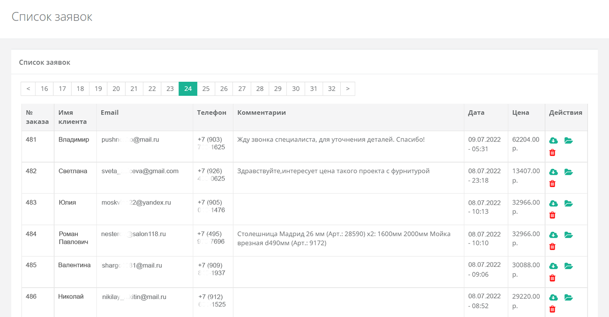
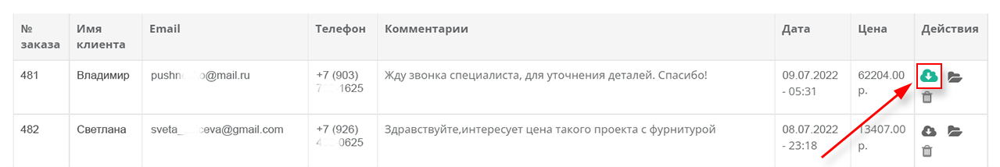
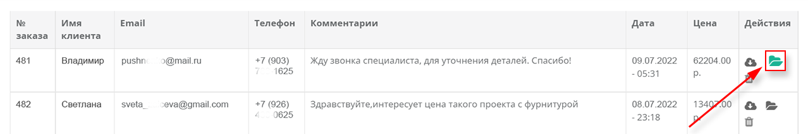

import Carousel from '../../components/Carousel.astro';

## Обзор

Все заявки, отправленные из конструктора, попадают в специальный раздел административной
панели «Заявки на расчёт» с контактными данными отправителя.

Заявки также отправляются на адреса, указанные в поле «E-mail для заявок». Стандартная
форма обратной связи включает обязательные поля «Имя», «Email» и «Телефон», а также
необязательное поле «Комментарий» — эти контакты отображаются в списке заявок.

Форму обратной связи при необходимости можно настроить через настройки писем.

## Действия

- **Скачать файл** — сохраняет файл проекта в формате `.dbs` на компьютер для дальнейшей
  работы над проектом или для пополнения базы готовых проектов.
- **Открыть проект** — позволяет быстро просмотреть проект перед связью с клиентом.
  Обратите внимание: название файла и URL-ссылка на проект содержат контактные данные из
  формы заявки, поэтому будьте осторожны при передаче третьим лицам.
- **Удалить** — удаляет запись и освобождает место на сервере.

